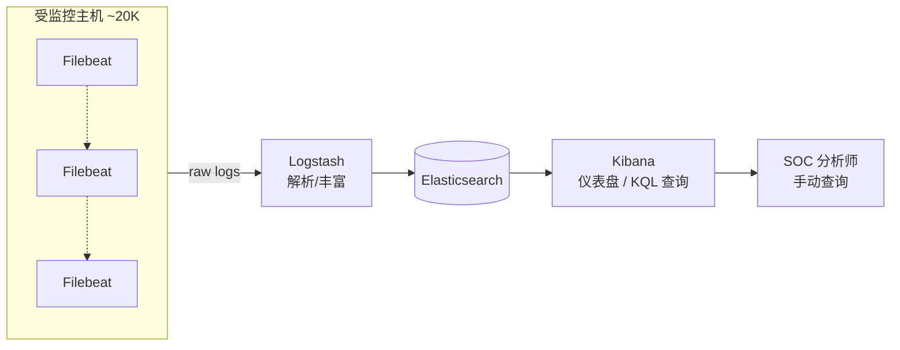
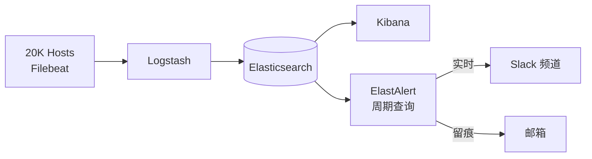
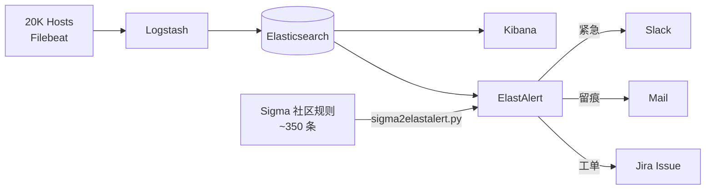
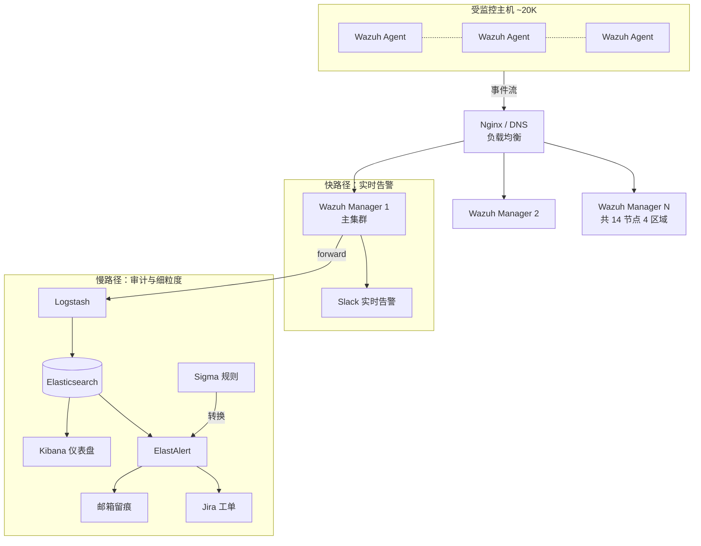
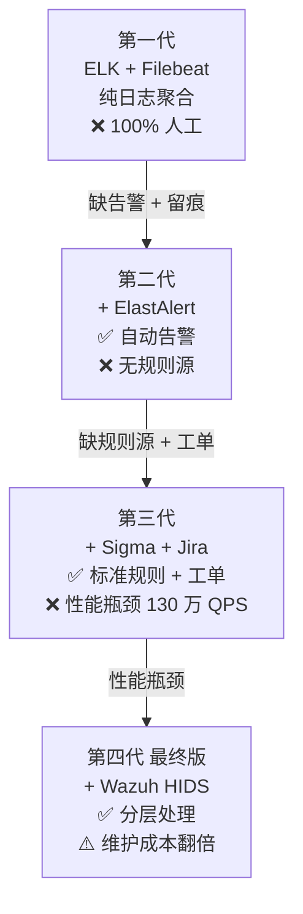
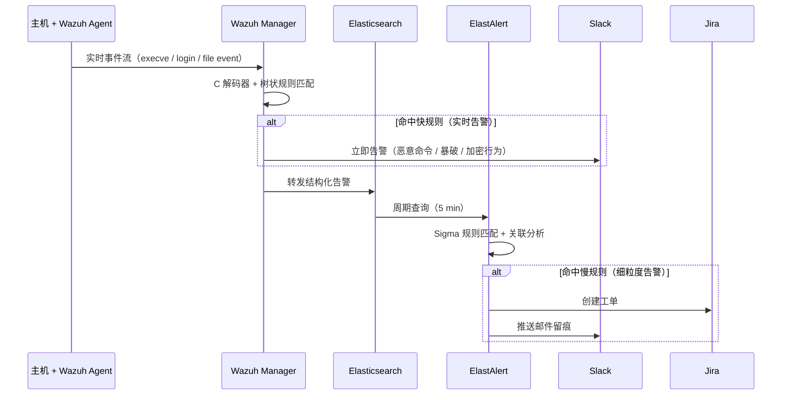

# 构建开源 SIEM：ELK + Wazuh HIDS + ElastAlert 组合架构 — 翻译与总结

> 原文链接：[Building an open-source SIEM: combining ELK, Wazuh HIDS and Elastalert for optimal performance](https://infosecwriteups.com/building-a-siem-combining-elk-wazuh-hids-and-elastalert-for-optimal-performance-f1706c2b73c6)
> 作者：Security Shenanigans（InfoSec Write-ups）
> 发布日期：2020-08-25
> 翻译与总结时间：2026 年 6 月 12 日

---

## 一、文章摘要

本文是一位安全工程师**构建开源 SIEM（Security Information and Event Management，安全信息与事件管理）系统**的实战经验复盘，核心聚焦在 **20K+ 主机规模、零商业 License 预算** 下，如何通过开源组件迭代演化出一套兼顾「实时告警」与「细粒度审计」的安全监控平台。

文章不是一份"如何搭建 ELK"的纯教程，而是一份**架构选型决策指南**，分四次架构迭代揭示了纯 ELK 方案的性能瓶颈（约 130 万次/秒规则匹配），并给出最终的双层方案：**Wazuh 负责快规则（HIDS 实时检测）+ ElastAlert/Sigma 负责慢规则（细粒度查询）**。

文章按递进式叙事展开：

1. **架构决策前的关键问题**（规模、预算、粒度、响应时间等）
2. **第一代架构**：ELK + Filebeat（纯日志聚合，缺告警）
3. **第二代架构**：加入 ElastAlert（自动告警 + Slack/邮件留痕）
4. **第三代架构**：引入 Sigma 规则与 Jira（标准规则 + 工单追踪）
5. **性能瓶颈分析**：650 条规则 × 20K 主机 = 130 万次/秒
6. **第四代架构（最终版）**：Wazuh HIDS 分担 80% 规则处理负载
7. **生产部署与运营经验**（多 Manager 高可用、流量均衡、跨区域、红队验证）

---

## 二、核心问题：构建 SIEM 前必须回答的 7 个问题

作者在动手前要求 SOC 团队回答以下问题，这构成了所有架构决策的输入：

| 问题 | 决策影响 |
|------|---------|
| 监控规模是 100 / 1000 / 10000 台主机？ | 决定 ingestor、ES 集群规模 |
| 是否有商业工具预算？ | Splunk / 开源的二选一 |
| 基础设施异构程度？ | Agent 兼容性、规则集多样性 |
| 只要安全告警，还是需要持久化审计日志？ | 存储规模与成本 |
| 需要什么粒度？ | 规则编写复杂度 |
| 需要多快的响应（实时？秒级？分钟级？） | 决定是否能用纯查询型方案 |
| 团队有时间持续优化，还是要 ASAP 上线？ | 自研 vs 商业 vs 托管 |

> **作者原话**："**没有完美的 SIEM，只有最匹配你需求的 SIEM**（there isn't a perfect SIEM, but rather one that perfectly matches your needs）"

> ⚠️ 一个被忽视的现实：**开源 ≠ 免费**。省下的 License 钱，要花在能"动手把开源调出商业级体验"的工程师团队上。

---

## 三、架构演进：四次迭代

### 3.1 第一代：纯 ELK + Filebeat（仅日志聚合）



**致命缺陷**：

1. **100% 人工**：威胁检测完全靠分析师手动查询
2. **无自动留痕**：发现的事件不会自动记录、跟踪

### 3.2 第二代：加入 ElastAlert 自动告警

引入 [Yelp/elastalert](https://github.com/Yelp/elastalert) — 一个 Python 编写的框架，**周期性查询 ES + 触发告警**。

通知通道有两个：

- **Slack**：紧急告警的实时推送
- **邮箱收件箱**：留下完整记录用于审计



### 3.3 第三代：Sigma 规则 + Jira 工单

**问题**：ElastAlert 查询哪些事件？规则从哪来？

**答案**：[Neo23x0/sigma](https://github.com/Neo23x0/sigma) — **日志检测领域的"Snort/YARA"**，提供标准化规则格式，可转换为 Kibana KQL、Splunk、Arcsight、Qualys、ElastAlert 等多种后端。

> Sigma is for log files what Snort is for network traffic and YARA is for files.

利用社区脚本 `sigma2elastalert.py`（David Routin 编写）即可批量转换规则。

同时集成 [Jira](https://qbox.io/blog/jira-alerting-elasticsearch-elastalert-tutorial)，自动创建 Issue 跟踪事件闭环。



> 💡 此时的方案接近 [HELK 平台](https://github.com/Cyb3rWard0g/HELK) 的简化版（HELK 还集成了 Apache Spark / Hadoop / GraphFrames / Jupyter Notebooks，支持分布式处理与机器学习）。

### 3.4 性能瓶颈：130 万次/秒的"纸面数学"

第三代的致命问题是**性能**。作者用一段简单估算揭示了 ElasticSearch 查询型方案的极限：

| 项 | 数值 |
|----|------|
| 受监控主机数 | 20,000 |
| 每台主机日志频率（execve 审计） | 1 条 / 10 秒 |
| Sigma 社区规则 | ~350 |
| 自定义恶意命令规则 | ~200 |
| 平台特定规则 | ~100 |
| **总规则数** | **650** |
| **总匹配次数（每秒）** | **650 × 20000 / 10 = 130 万** |

即便有缓存优化，这个量级也**远超基础设施预算**。要降低负载只能拉长查询周期 — 但代价是**告警延迟**。**实时告警**目标无法达成。

### 3.5 第四代（最终版）：引入 Wazuh HIDS 分流

[Wazuh](https://wazuh.com/) 是开源的**主机入侵检测系统（HIDS）**，作者用它**承担 80% 的快速规则匹配负载**。

**Wazuh 架构特点**：

- **Wazuh Agent**：部署在每台主机，可替代 Filebeat 充当日志转发器
- **Wazuh Manager**：接收 Agent 事件，**只把告警转发到 SIEM**（而不是全量日志）
- **C 语言编写的解码器**：解析速度极快
- **树状规则结构**：层级匹配，效率高

**Wazuh 规则示例**（SSH 暴力破解检测）：

```xml
<!-- Rule 1：识别 SSHD 消息基类（不告警，仅做分组） -->
<rule id="1" level="0" noalert="1">
  <decoded_as>sshd</decoded_as>
  <description>SSHD messages grouped.</description>
</rule>

<!-- Rule 2：失败登录（依赖 Rule 1） -->
<rule id="2" level="5">
  <if_sid>1</if_sid>
  <match>illegal user|invalid user</match>
  <description>sshd: Attempt to login using a non-existent user</description>
</rule>

<!-- Rule 3：120 秒内同 IP 触发 8 次 Rule 2 → 暴力破解告警 -->
<rule id="3" level="10" frequency="8" timeframe="120" ignore="60">
  <if_matched_sid>2</if_matched_sid>
  <description>sshd: brute force trying to get access to the system.</description>
  <same_source_ip />
</rule>
```

**Wazuh 规则机制的两个固有问题**：

1. **维护性差**：规则间隐式依赖容易"打架"，规划不当易写出"意大利面式"规则
2. **关联粒度有限**：支持 regex 匹配，但跨规则关联不如 ES 查询灵活

**关键设计决策 — 分层处理**：

| 层 | 工具 | 适用规则 | 延迟要求 |
|----|------|---------|---------|
| 快层 | Wazuh | 简单字符串匹配（恶意命令、未授权登录、勒索软件加密行为） | 实时（秒级） |
| 慢层 | ElastAlert + Sigma | 复杂关联规则（特定恶意软件家族行为画像） | 分钟级（如 5 分钟） |

### 3.6 最终架构图



> 📌 该架构虽然达成了所有目标，但**维护成本翻倍** — 需要同时维护 Wazuh 规则集（快/简单）和 ElastAlert/Sigma 规则集（慢/复杂）。

---

## 四、生产部署经验（"血泪教训"清单）

文章末尾给出了 7 条来自 20K 节点真实生产环境的运维经验，含金量极高：

### 4.1 设计时假设一切都会故障

作者最终部署了 **14 个 Wazuh Manager，跨 4 个环境**：

| 环境 | 用途 |
|------|------|
| Native Windows AD | Windows 域环境 |
| Native Unix | 物理/虚拟 Unix |
| Native Cloud | 私有云 |
| AWS Cloud | 公有云 |

其中 **10 个用于业务流量、4 个作为各区域 fail-over**。

### 4.2 流量均衡

可用 **Nginx 反向代理或 DNS 轮询**做 Agent 连接分发。

> ⚠️ **关键陷阱**：如果不做均衡，一次需要重启 Agent 的配置变更，可能让所有 Agent 同时重连同一个 Manager — **形成 DDoS 自爆**。

### 4.3 网络拓扑设计

- 不要让 US 区的 Manager 接收 EU 区 Agent 的连接（VPN 跨海延迟 + AWS 跨可用区流量费用）
- Manager 部署应**就近 Agent**

### 4.4 监控 Agent 自身状态

- 监控 Wazuh Agent 服务的启停事件
- 限制单实例日志生成速率，防止**日志洪水攻击**（DoS via log spamming）

### 4.5 红队验证 + Mitre ATT&CK

定期红队演练验证告警有效性，工具链推荐：

- [MITRE ATT&CK](https://attack.mitre.org/) — 单元测试映射
- [Red Canary Atomic Tests](https://github.com/redcanaryco/atomic-red-team) — 自动化红队脚本

### 4.6 规则保鲜

Sigma 与 Wazuh 规则集**社区更新频繁**，需要建立同步机制。

### 4.7 规则集自治

不要只依赖社区规则：

- 社区规则有 bug，需要本地 fork 修补
- 业务特定威胁需要自研规则
- 推荐参考 Teymur Kheirhabarov 的两个演讲（凭据窃取、横向移动检测）

---

## 五、技术选型与替代方案对比

> 这一节是译者补充的独立分析，原文未涉及。

### 5.1 与 Splunk / Elastic Security 的取舍

| 维度 | 本文方案（ELK+Wazuh+ElastAlert） | Splunk ES | Elastic Security（商业版） |
|------|--------------------------------|-----------|---------------------------|
| License 成本 | **零** | 高（按 GB 计费） | 中等 |
| 实施难度 | 高（需要专家团队） | 低 | 中 |
| 实时性 | 秒级（Wazuh）+ 分钟级（EA） | 秒级 | 秒级 |
| 规则生态 | Sigma + Wazuh + 自研 | Splunk SPL（封闭） | KQL + EQL |
| 扩展性 | 强（全开源） | 强（黑盒） | 强 |
| 运维成本 | **高**（需自研团队） | 低（厂商支持） | 中 |

### 5.2 Wazuh 替代品

- **OSSEC**：Wazuh 的"前身"，更轻量但功能少
- **Falco**（CNCF）：基于 eBPF 的容器/Kubernetes 安全检测，更适合云原生场景
- **Tetragon**（Cilium）：基于 eBPF 的策略执行 + 可观测性，能直接 kill 恶意进程
- **Tracee**（Aqua）：基于 eBPF 的运行时安全检测

> 💡 **本文写于 2020 年**，当时 eBPF 生态尚未成熟。在 2026 年的今天，对**云原生 / Kubernetes 场景**，eBPF 系（Falco/Tetragon/Tracee）已经在性能、覆盖度、可观测性上**显著优于** Wazuh 这类 userspace HIDS。但对**传统主机/混合云**场景，Wazuh 仍是稳定可靠选择。

### 5.3 ElastAlert 现状

⚠️ 原文使用的 **ElastAlert v1（Yelp）已停止维护**，新部署应使用：

- **ElastAlert 2**：社区 fork 维护版本（[jertel/elastalert2](https://github.com/jertel/elastalert2)）
- **Elastic Watcher**：Elastic 商业版自带告警引擎
- **Kibana Alerting**：Kibana 7.11+ 内置告警

---

## 六、核心架构图（Mermaid）

### 6.1 架构演进总览



### 6.2 双层规则处理流程



---

## 七、独立技术评价

### 7.1 文章价值

✅ **从架构决策视角讲透了开源 SIEM 的取舍**，比单纯的部署教程更有价值
✅ **130 万 QPS 的纸面数学**是经典案例，提醒所有人：性能问题要先做"信封背面计算"
✅ **生产部署的 7 条经验**是高价值的"血泪教训"
✅ **Sigma 规则的引入**是把开源安全规则标准化的关键里程碑

### 7.2 局限与时代背景

⚠️ **写于 2020 年**，部分方案已过时：

1. **ElastAlert v1 停止维护**，需迁移至 ElastAlert 2
2. **HELK 项目活跃度下降**
3. **eBPF 生态崛起** — Falco / Tetragon / Tracee 在云原生场景全面超越 Wazuh
4. **Wazuh 4.x** 已大幅改进，原文基于 3.x，配置和能力差异较大

### 7.3 适用场景判断

**仍然适合本方案的场景**：

- 传统数据中心（物理机 / 虚拟机为主）
- 混合云 + 多操作系统（Windows AD + Linux）
- 已有 ELK 投资，希望复用
- 团队有 SOC 工程师能力

**不适合的场景**：

- 纯 Kubernetes / 云原生 → 推荐 Falco + Loki / Sigma → eBPF 路线
- 团队规模小（<3 人）→ 推荐 SaaS 方案（Wazuh Cloud / SentinelOne / CrowdStrike）
- 需要 EDR 级别的端点响应能力 → 商业方案（开源补不了端点 kill / 隔离）

### 7.4 关键启示

> "**You either pay for talented employees, or you pay for closed source + support. There's no going around it.**"
>
> 要么花钱请有能力玩转开源的工程师，要么买带支持的商业产品。**没有第三条路**。

这句话适用于所有"用开源替代商业"的决策场景 — eBPF 安全栈、可观测性平台、CI/CD 流水线，都遵循这一规律。

---

## 八、参考链接

| # | 资源 | 用途 |
|---|------|------|
| 1 | [ELK Stack](https://www.elastic.co/elastic-stack/) | 日志聚合 + 检索 |
| 2 | [Wazuh](https://wazuh.com/) | 开源 HIDS |
| 3 | [Yelp/elastalert](https://github.com/Yelp/elastalert) | 已停维护 v1 |
| 4 | [jertel/elastalert2](https://github.com/jertel/elastalert2) | 社区维护 v2 |
| 5 | [Neo23x0/sigma](https://github.com/Neo23x0/sigma) | 通用日志规则 DSL |
| 6 | [Cyb3rWard0g/HELK](https://github.com/Cyb3rWard0g/HELK) | 完整威胁狩猎平台 |
| 7 | [MITRE ATT&CK](https://attack.mitre.org/) | 攻击矩阵 |
| 8 | [redcanaryco/atomic-red-team](https://github.com/redcanaryco/atomic-red-team) | 自动化红队测试 |
| 9 | [Splunk ES](https://www.splunk.com/) | 商业 SIEM 对比基线 |
| 10 | [qbox.io: Jira + ElastAlert 集成](https://qbox.io/blog/jira-alerting-elasticsearch-elastalert-tutorial) | 工单集成教程 |

---

## 九、一句话总结

**开源 SIEM 不是"免费 SIEM"** — 它是把"License 成本"换成"工程师能力"，把"商业产品支持"换成"团队对开源生态的掌控力"。这篇文章用四次架构迭代和 130 万 QPS 的纸面数学，告诉我们：**架构没有银弹，只有匹配你团队能力和业务规模的最佳折中**。

