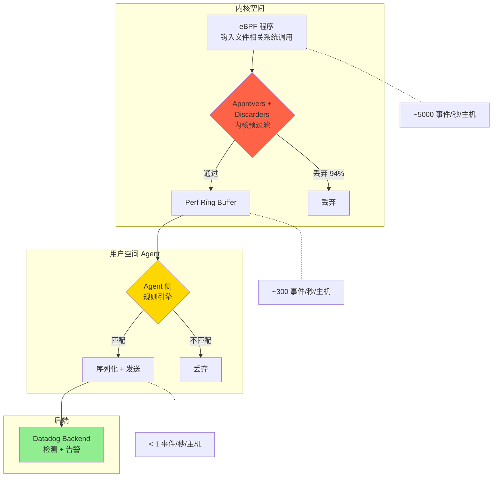
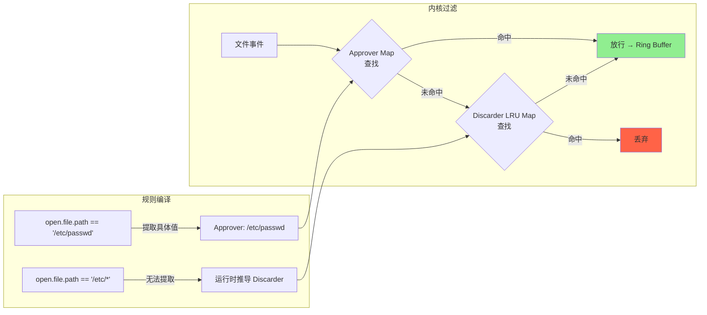
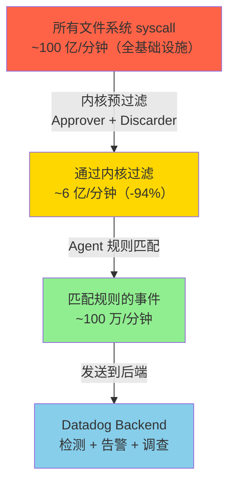

# Datadog：使用 eBPF 扩展实时文件监控——如何每分钟过滤数十亿内核事件

> 原文链接：[Scaling real-time file monitoring with eBPF: How we filtered billions of kernel events per minute](https://www.datadoghq.com/blog/engineering/workload-protection-ebpf-fim/)
> 作者：Yoann Ghigoff, Jonathan Ribas, Sylvain Afchain, Sylvain Baubeau, Guillaume Fournier
> 原文发布时间：2025 年 11 月 18 日
> 翻译与分析时间：2026 年 3 月 26 日

---

## 一、文章摘要

这篇文章来自 Datadog 工程团队，讲述了他们在构建基于 eBPF 的文件完整性监控（FIM）系统时面临的核心工程挑战：**如何在每分钟超过 100 亿个文件相关事件的规模下，实现实时检测而不丢失事件、不影响宿主机性能**。核心解决方案是一套**两阶段过滤架构**——通过 Approvers（批准器）和 Discarders（丢弃器）在内核中预过滤掉 94% 的事件，再由 Agent 侧规则引擎做深度匹配，最终只有极少量事件发送到后端。

---

## 二、核心内容翻译与分析

### 2.1 为什么选择 eBPF 而非传统方案

Datadog 团队首先排除了传统 FIM 方案：

| 方案 | 问题 |
|------|------|
| **周期性文件扫描** | 攻击者可在扫描间隔内篡改并还原文件，完全逃避检测；即使检测到变化，也只知道"文件变了"，不知道谁改的、怎么改的 |
| **inotify** | 缺少系统级上下文，无法将文件事件与进程和容器关联 |
| **auditd** | 在高负载下性能开销大，可扩展性差 |

eBPF 的优势：

- 从内核直接观察实时文件活动，不影响稳定性和安全性
- 不仅知道文件被修改，还知道**哪个进程触发了变更、运行在哪个容器中**
- 提供安全调查所需的有意义上下文

### 2.2 规模问题：100 亿事件/分钟

Datadog 基础设施在一个普通的周五下午产生的数据量：

| 指标 | 数值 |
|------|------|
| 文件相关事件总量 | **> 100 亿次/分钟** |
| 单个事件序列化后大小 | **~5 KB**（包含进程、容器元数据） |
| 如果全量上传带宽 | **数 TB/秒** |
| 其中大部分事件 | 不匹配任何检测规则，最终会被丢弃 |

**直接上传全量数据不可行**——不仅后端无法承受，Agent 侧的序列化和传输也会导致 CPU/内存飙升，反而增加丢事件的风险。

### 2.3 三层过滤架构

Datadog 设计了一套从内核到后端的三层递进过滤体系：



**数据流衰减比例**：

| 层级 | 事件速率 | 说明 |
|------|---------|------|
| eBPF 程序捕获 | ~5,000 事件/秒/主机 | 所有安全相关的 syscall |
| 经内核预过滤后 | ~300 事件/秒/主机 | 丢弃 94% |
| 经 Agent 规则匹配后 | < 1 事件/秒/主机 | 只有真正匹配规则的事件上报 |
| 全基础设施最终上报 | ~100 万事件/分钟 | 从 100 亿降至 100 万 |

### 2.4 核心创新：Approvers 与 Discarders

这是文章最有价值的部分——**在 eBPF 受限环境中实现高效的内核态事件过滤**。

#### Approvers（批准器）——静态白名单过滤

**编译时生成**。通过分析检测规则的条件，提取出具体的匹配值，作为内核态的快速过滤器。

示例规则：

```
open.file.path == "/etc/passwd" && open.flags & O_CREAT > 0
```

从中提取 `/etc/passwd` 作为 Approver，写入 eBPF Map。内核中的 eBPF 程序只需要做一次 Map 查找即可判断事件是否值得传递到用户空间。

**特点**：
- 编译时确定，开销极低
- 基于 eBPF Map 的 O(1) 查找
- 适用于规则中包含具体值的场景

#### Discarders（丢弃器）——动态黑名单过滤

**运行时生成**。当规则中包含通配符等无法提取具体值的模式时，Approver 无法工作。此时 Discarder 作为补充。

示例规则：

```
open.file.path == "/etc/*"
```

无法从 `*` 通配符中提取具体文件名作为 Approver。但规则引擎可以确定：任何 `/tmp` 下的文件访问**永远不会**匹配此规则，因此 `/tmp` 成为 Discarder。

**特点**：
- 运行时动态生成
- 存储在 **LRU eBPF Map** 中（自动淘汰最久未使用的条目，控制内存）
- 随着规则集演化，需要非平凡的算法来判断什么可以安全丢弃

#### 两者的协同关系

| 维度 | Approver | Discarder |
|------|----------|-----------|
| 生成时机 | 编译时（静态） | 运行时（动态） |
| 过滤逻辑 | 白名单：只放行匹配值 | 黑名单：丢弃确认不匹配的值 |
| 存储方式 | eBPF Map | LRU eBPF Map |
| 适用场景 | 规则包含具体值 | 规则包含通配符/无法提取具体值 |
| 内存控制 | 与规则数成正比 | LRU 自动淘汰 |

### 2.5 超越检测：上下文富化

Datadog 强调 FIM 不仅是检测文件变更，更重要的是提供**安全调查所需的完整上下文**：

- 哪个进程触发了变更
- 运行在哪个容器中
- 系统上同时还发生了什么
- 即使是短生命周期进程和临时容器也能捕获

这些上下文信息是将原始事件转化为**可操作安全洞察**的关键。

---

## 三、技术要点深度分析

### 3.1 两阶段评估模型的工程权衡

Datadog 的两阶段模型是一个经典的**精度-性能权衡**：

| 阶段 | 位置 | 能力 | 限制 |
|------|------|------|------|
| 第一阶段 | 内核（eBPF） | 快速决策，低开销 | eBPF 计算限制，尤其在老内核上 |
| 第二阶段 | 用户空间（Agent） | 完整评估、关联、上下文富化 | 受限于处理吞吐 |

**为什么不把所有逻辑放到内核？**
- eBPF 为保证内核稳定性，有严格的计算限制
- 复杂的规则匹配（通配符、正则、多条件组合）在 eBPF 中难以实现
- 老版本内核的 eBPF 能力更受限

**为什么不全放到用户空间？**
- 5000 事件/秒的速率会压垮 Agent
- Ring Buffer 溢出导致丢事件 = 安全盲区

### 3.2 LRU eBPF Map 的巧妙使用

Discarder 使用 **LRU（Least Recently Used）eBPF Map** 是一个工程亮点：

- **自动淘汰**：当 Map 满时，最久未被查询的条目自动被移除
- **内存可控**：固定大小的 Map，不会随着运行时间无限增长
- **自适应**：频繁访问的路径（即使是应该被丢弃的）会保持在 Map 中，而冷门路径会被淘汰
- **无需手动清理**：避免了用户空间定期清理 Map 的复杂性

### 3.3 Ring Buffer 溢出问题

文章提到的一个关键问题：

> "The stream of events flowing through the ring buffer could outpace the Agent's ability to process them, leading to dropped events."

这是所有基于 eBPF 的监控系统的共同挑战。Datadog 的解决方案是**在写入 Ring Buffer 之前就过滤掉 94%**，从根本上减少进入 Ring Buffer 的数据量。

其他方案的对比：

| 方案 | Ring Buffer 溢出策略 |
|------|---------------------|
| Datadog | 内核预过滤 94%，从源头减少数据量 |
| Sysdig/Falco | per-CPU Ring Buffer 提高吞吐 |
| Tetragon | 内核态策略匹配 + 内联执行（Inline Enforcement） |
| 本系列 PHP 文章 | 单一 Ring Buffer，仅适用于低事件量场景 |

---

## 四、与本系列其他 FIM 方案的全面对比

| 维度 | Datadog | Sysdig | Tetragon | Wazuh | Elastic |
|------|---------|--------|----------|-------|---------|
| **eBPF 使用** | ✅ 核心 | ✅ 核心 | ✅ 核心 | ⚠️ 可选（Who-data） | ⚠️ 可选（新内核） |
| **内核态过滤** | ✅ Approver + Discarder | ⚠️ 有限 | ✅ Selector 机制 | ❌ | ❌ |
| **过滤效率** | **94%** 事件在内核丢弃 | 未公开 | 高（但未公开数据） | N/A | N/A |
| **规则引擎位置** | 内核 + Agent 两阶段 | Agent | 内核（TracingPolicy） | Agent | Agent |
| **内联执行** | ❌ 仅检测 | ❌ 仅检测 | ✅ Override 阻断 | ❌ | ❌ |
| **容器感知** | ✅ | ✅ | ✅ | ⚠️ 有限 | ⚠️ 有限 |
| **规模数据** | 100 亿事件/分 → 100 万/分 | 未公开 | 未公开 | N/A | N/A |
| **文件哈希** | 未提及 | ❌ | ❌ | ✅ MD5/SHA1/SHA256 | ✅ |
| **内容 Diff** | 未提及 | ❌ | ❌ | ✅ | ❌ |
| **老内核支持** | 需要较新内核 | 需要较新内核 | 需要较新内核 | ✅ auditd 兜底 | ✅ KProbe+tk-btf |

### 关键差异化

1. **Datadog 是唯一公开了生产环境规模数据的方案**——100 亿事件/分钟的数字让"规模"从抽象概念变成了具体工程挑战
2. **Approver/Discarder 机制是最精细的内核态预过滤方案**——Tetragon 的 Selector 类似但偏向策略匹配，Datadog 的方案更偏向规则编译优化
3. **两阶段评估是务实的工程选择**——承认 eBPF 的计算限制，在内核做"快速粗筛"，在用户空间做"精确匹配"

---

## 五、核心技术概念总结

### 5.1 Approver/Discarder 机制



### 5.2 数据流衰减



---

## 六、实用启示

### 6.1 对自研 eBPF FIM 的启发

如果你正在构建自己的 eBPF FIM 系统，Datadog 的经验提供了几个关键教训：

1. **永远不要假设全量数据可以传到用户空间**——Linux 中几乎一切都是文件，文件相关 syscall 的量级远超你的预期
2. **内核态过滤是必须的**——不是优化，而是基本要求
3. **静态 + 动态过滤互补**——Approver 处理确定性匹配，Discarder 处理运行时推导
4. **LRU Map 是内核态缓存的好选择**——自动淘汰 + 固定内存 + 无需维护
5. **两阶段评估是务实选择**——不要试图在 eBPF 中实现完整的规则引擎

### 6.2 与 Tetragon 方案的互补

| 场景 | 推荐方案 |
|------|---------|
| 大规模基础设施的 FIM 检测 | Datadog 式 Approver/Discarder + 两阶段过滤 |
| 需要内联阻断（零信任） | Tetragon 式 Override + LSM 钩子 |
| 需要文件哈希/内容对比 | Wazuh（传统 FIM 能力更强） |
| 老旧内核兼容 | Elastic tk-btf + KProbe |

---

## 七、总结

这篇文章是目前公开的**最具工程深度的 eBPF FIM 生产实践报告**。它的核心价值在于：

1. **首次公开了真实的生产环境规模数据**——100 亿事件/分钟，5KB/事件，94% 内核过滤率
2. **Approver/Discarder 双机制**是一个优雅的工程解决方案——静态编译 + 动态运行时互补，LRU Map 控制内存
3. **承认 eBPF 的局限**——不试图在内核中做所有事情，而是在内核做"快速粗筛"，在用户空间做"精确匹配"
4. **将 FIM 从"文件变了"升级为"谁在哪个容器中用哪个进程改了什么文件"**——这才是现代安全团队需要的信息

这篇文章应该与 Tetragon 的 FIM 文章对照阅读——Tetragon 侧重于检测机制和内联执行的深度，Datadog 侧重于大规模落地的工程挑战。两者互补，共同构成了 eBPF FIM 的完整知识图谱。
