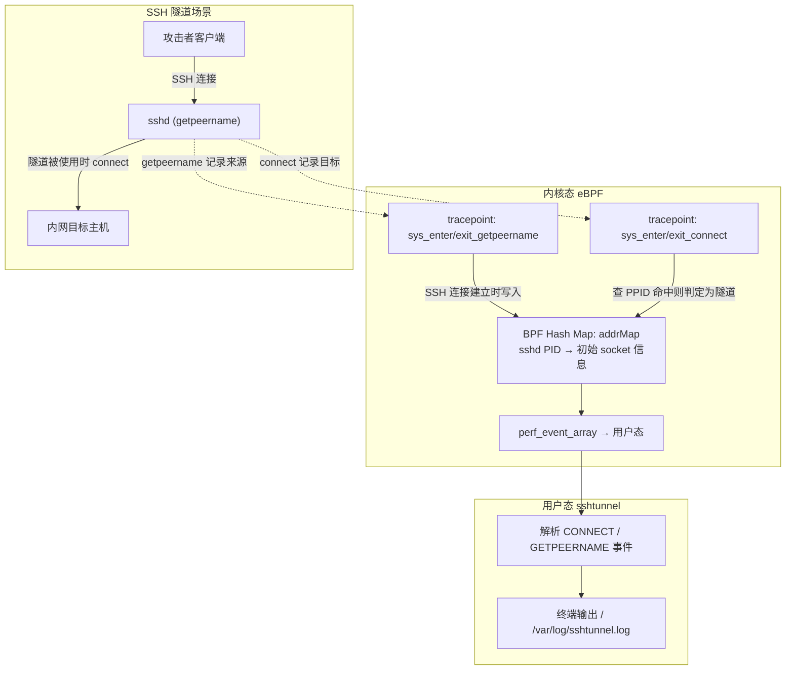
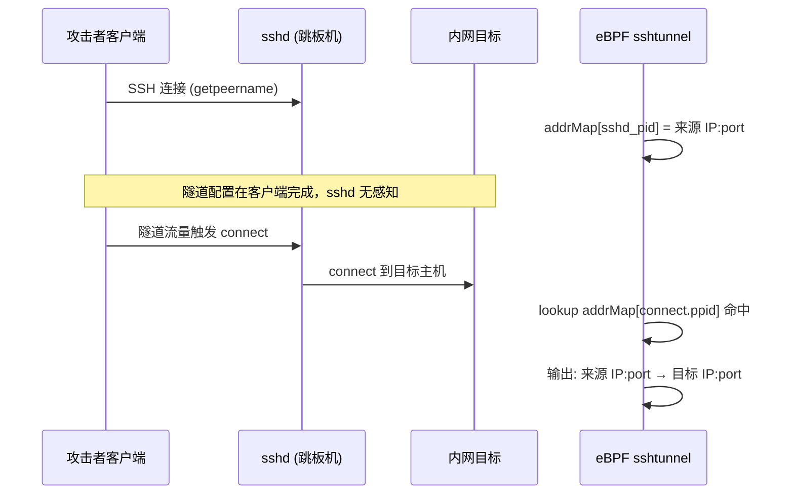

# 使用 eBPF 检测 SSH 隧道 — 翻译与总结

> 原文链接：[Detecting SSH Tunnel Using eBPF](https://medium.com/etracing/detecting-ssh-tunnel-using-ebpf-29e73b21133e)  
> 作者：Daniel Beomjin An（eTracing）  
> 开源项目：[qjawls2003/eBPF-Detect-SSH-Tunnels](https://github.com/qjawls2003/eBPF-Detect-SSH-Tunnels)  
> 姊妹篇：[Tracing SSH User Activities Using eBPF](https://medium.com/etracing/tracing-ssh-user-activities-using-ebpf-c83f8f5a4a8e)  
> 翻译与总结时间：2026 年 6 月 11 日

---

## 一、文章摘要

本文介绍了一个基于 eBPF 的 **sshtunnel** 代理，用于在 Linux 主机上**实时检测 SSH 端口转发（隧道）**活动。与姊妹篇 sshtrace（追踪 SSH 用户命令归因）不同，本文聚焦的是 **sshd 作为隧道中继**时的行为特征。

核心思路：攻击者通过 SSH 的 `-L`（本地转发）、`-R`（远程转发）、`-D`（动态转发）建立隧道后，**sshd 会复用同一进程树中的 socket**，在隧道实际被使用时调用 `connect` 系统调用直连目标主机。通过 hook `getpeername` 与 `connect`，可在内核态将「初始 SSH 连接」与「隧道出站连接」关联，输出原始来源 IP:port 与隧道目标 IP:port。

---

## 二、背景与威胁模型

### 2.1 攻击者使用 SSH 隧道的主要目的

| 目的 | 说明 |
|------|------|
| **绕过网络限制** | 穿透防火墙、安全策略、IPS/IDS，访问内网或隔离子网 |
| **混淆连接来源** | 使调查人员初期难以判断真实攻击来源 |
| **代理链（Proxychains）** | 将受害主机作为跳板，串联自有工具链 |

SSH 隧道是常见的**绕过网络限制**和**制造烟幕（obfuscation）**手段。借助 `-L`、`-R`、`-D` 三种转发模式，恶意应用场景几乎无穷无尽。

### 2.2 本地转发绕过防火墙的典型场景

```
[恶意设备] --SSH--> [路由器/跳板机] --隧道转发--> [内网目标]
```

恶意设备先通过 SSH 连接到路由器；随后复用同一 socket 将流量转发到内网设备。若防火墙配置不当，会认为连接来自路由器本身，从而**误放行**来自恶意设备的流量。

### 2.3 检测难点

检测 SSH 转发有多种方式，例如分析进出主机的数据包，但这往往需要较多时间进行关联分析。**是否存在更简便的方法，直接定位这些隐蔽隧道的来源与目的地？**

---

## 三、技术方案

### 3.1 为什么选择 eBPF

eBPF 是开源技术，在网络、安全与可观测性领域兼具灵活性与高效性。通过挂载到内核空间，eBPF 能以低开销、高准确度观察事件，且用户态篡改风险较低。Cilium、Falco、Tetragon 等大型项目均基于此构建。

### 3.2 strace 分析 sshd 行为

作者通过 `strace` 逐步分析 `sshd` 进程，并与 SSH 转发命令对照，得出以下结论：

| 步骤 | 行为 |
|------|------|
| 1 | `sshd` 接受客户端连接；在 spawn shell 之前会调用 **`getpeername`** |
| 2 | 转发参数（如 `-L`）在**客户端**执行，`sshd` 本身**不知道**是否配置了转发 |
| 3 | 仅当隧道**实际被使用**时，`sshd` 才会行动——调用 **`connect`** 系统调用直连目标主机 |
| 4 | 该行为在 `ps` 中不可见，但可通过 `netstat` 或 `ss` 观察到 |

### 3.3 关键模式（Pattern）

当 `sshd` 为 SSH 隧道执行 `connect` 时，**执行 `connect` 的进程与建立初始 SSH 连接的是同一 `sshd` 进程树**——具体而言，执行 `connect` 的子进程，其 **PPID（父进程 ID）** 正是当初调用 `getpeername` 记录 socket 信息的那个 `sshd` 进程。

> 注意：不能直接用 `connect` 调用者的 PID 查 map，因为 `getpeername` 由克隆 bash shell 之前的 `sshd` 父进程调用，而 `connect` 由子进程发起，故需用 **PPID** 做桥接。

### 3.4 整体架构



### 3.5 检测算法（三步）

1. **记录初始 SSH 连接**：每当有 SSH 连接到达本机，将 socket 信息（来源 IP:port）以 `sshd` PID 为 key 写入 BPF map。
2. **检测隧道出站连接**：每当有 `connect` 系统调用，检查其 **PPID** 是否在 map 中。若命中，说明正在复用已有 SSH socket 建立新连接，即隧道活动。
3. **输出关联信息**：返回初始 SSH 连接的 socket 信息（来源 IP:port）与新连接的 socket 信息（目标 IP:port）。

### 3.6 用户态核心逻辑（sshtunnel.c）

```c
if (m->type_id == CONNECT) {
    pid_t pid = m->pid;
    struct ipData remoteData;

    // 用 connect 调用者的 PPID 在 map 中查找
    addrErr = bpf_map_lookup_elem(addrMap, &m->ppid, &remoteData);
    if (addrErr != 0) {
        log_trace("Couldn't find a corresponding sockaddr_in for the %d sshd process", pid);
        return; // 不是隧道
    } else {
        log_trace("Found a corresponding sockaddr_in for the sshd process");
    }
    if (sockData.port == 0) { // 内部 connect，忽略
        return;
    }
} else if (m->type_id == GETPEERNAME) {
    if (addrMap) {
        // 将 sshd 进程及其 socket 数据写入 map
        bpf_map_update_elem(addrMap, &m->pid, &sockData, BPF_ANY);
    }
}
```

---

## 四、实验环境复现

### 4.1 网络拓扑

作者搭建了两个隔离的局域网（LAN），演示 SSH 隧道如何让一个隔离子网通过「路由器」访问另一个隔离子网。

### 4.2 复现命令

```bash
# 1. 建立 SSH 主连接，将 socket 保存到文件
ssh -MS /tmp/T1 \
    -o StrictHostKeyChecking=no \
    -o UserKnownHostsFile=/dev/null \
    harambe@10.10.5.1 -p 22

# 2. 复用已保存的 socket，创建本地转发 localhost:2222 → 172.60.1.2:22
ssh -S /tmp/T1 sock -O forward -L 2222:172.60.1.2:22

# 3. 通过 localhost:2222 连接目标（实际流量经隧道到达 172.60.1.2:22）
ssh -o StrictHostKeyChecking=no \
    -o UserKnownHostsFile=/dev/null \
    kali@localhost -p 2222
```

效果：`localhost` 可直接连接目标主机，**绕过中间跳板机**的防火墙限制。

### 4.3 检测时序



---

## 五、附加功能

除服务端（sshd）隧道检测外，作者还实现了**客户端侧**的简单检测：监控 SSH 命令行参数，识别用户是否正在尝试建立转发（如 `-L`、`-R`、`-D` 参数）。该功能严格基于命令参数解析，与服务端 `connect` 检测互为补充。

---

## 六、开源项目信息

| 项目 | 说明 |
|------|------|
| **仓库** | [qjawls2003/eBPF-Detect-SSH-Tunnels](https://github.com/qjawls2003/eBPF-Detect-SSH-Tunnels) |
| **语言** | C（libbpf） |
| **日志** | `/var/log/sshtunnel.log`（JSON 格式，非 JSON 对象） |

### 6.1 使用方式

```bash
git clone https://github.com/qjawls2003/eBPF-Detect-SSH-Tunnels
cd eBPF-Detect-SSH-Tunnels
sudo ./sshtunnel -p    # 打印所有日志
sudo ./sshtunnel -v    # 详细事件
sudo ./sshtunnel -w    # 详细警告
```

### 6.2 编译依赖

```bash
sudo apt-get install bpftool clang libbpf-dev gcc-multilib llvm
make
```

---

## 七、技术评价

### 7.1 优点

| 维度 | 评价 |
|------|------|
| **检测思路简洁** | 利用 sshd 进程树内 `getpeername` → `connect` 的天然关联，无需深度包检测 |
| **内核态实时性** | 事件在 syscall 发生时即被捕获，不依赖事后 `ps`/`ss` 关联 |
| **低开销** | tracepoint hook，比 kprobe 更稳定，性能影响可控 |
| **输出明确** | 直接给出「隧道来源 → 隧道目标」，便于 SOC 告警与取证 |
| **与 sshtrace 互补** | sshtrace 解决命令归因，sshtunnel 解决隧道检测，同一作者体系 |

### 7.2 局限与注意事项

| 局限 | 说明 |
|------|------|
| **仅覆盖 sshd 侧隧道** | 检测逻辑绑定 `sshd` 的 `connect` 行为；纯客户端 `-D` 动态代理若未触发服务端 connect，覆盖范围需评估 |
| **IPv6 / 非标准端口** | 原文以 IPv4 场景为主，生产环境需验证 IPv6 与自定义端口 |
| **ControlMaster 场景** | 实验使用 `-M`/`-S` socket 复用，需确认所有转发模式（含无 ControlMaster 的 `-L`）均触发相同 syscall 模式 |
| **误报过滤** | `sockData.port == 0` 的内部 connect 需忽略，其他合法 sshd 出站 connect 是否误报需实测 |
| **项目活跃度** | GitHub 最后更新约 2023 年 9 月，需自行评估内核版本兼容性 |
| **客户端参数检测较弱** | 仅解析命令行参数，易被脚本封装或别名绕过 |

### 7.3 与姊妹篇 sshtrace 的关系

| 维度 | sshtrace | sshtunnel |
|------|----------|-----------|
| **目标** | 将 execve 命令归因到原始 SSH 客户端 | 检测 SSH 端口转发隧道 |
| **核心 syscall** | getpeername / getsockname / execve | getpeername / connect |
| **Map 桥接 key** | PID + 本地端口 | PPID |
| **日志文件** | `/var/log/sshtrace.log` | `/var/log/sshtunnel.log` |

两篇共同构成「SSH 安全可观测性」的完整拼图：**谁**在操作（sshtrace）+ **是否在打隧道**（sshtunnel）。

---

## 八、结论

eBPF 显著简化了 Linux 主机安全观测的方式。借助内核级事件捕获，安全工程师可以构建高效工具，应对 SSH 隧道这类传统上需要大量手工包分析或日志关联的取证难题。本文提出的「getpeername 记录 + connect 时 PPID 查表」方案思路清晰、实现轻量，适合作为 HIDS/SOC 平台的 SSH 隧道检测模块参考。

---

## 九、参考资料

- [原文：Detecting SSH Tunnel Using eBPF](https://medium.com/etracing/detecting-ssh-tunnel-using-ebpf-29e73b21133e)
- [GitHub：eBPF-Detect-SSH-Tunnels](https://github.com/qjawls2003/eBPF-Detect-SSH-Tunnels)
- [姊妹篇：Tracing SSH User Activities Using eBPF](https://medium.com/etracing/tracing-ssh-user-activities-using-ebpf-c83f8f5a4a8e)
- [姊妹篇翻译（本项目）](./tracing-ssh-user-activities-ebpf-翻译与总结-20260611.md)
