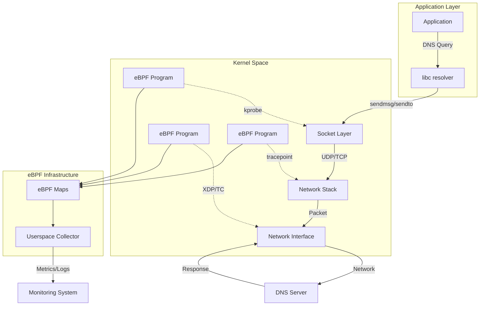
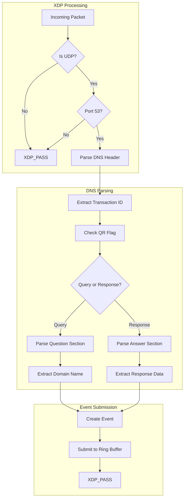
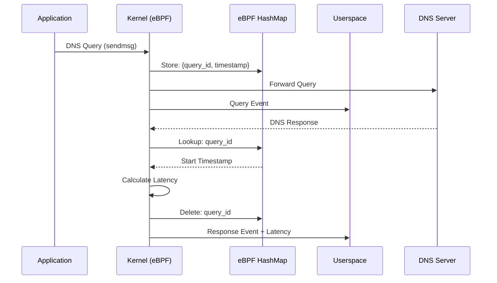
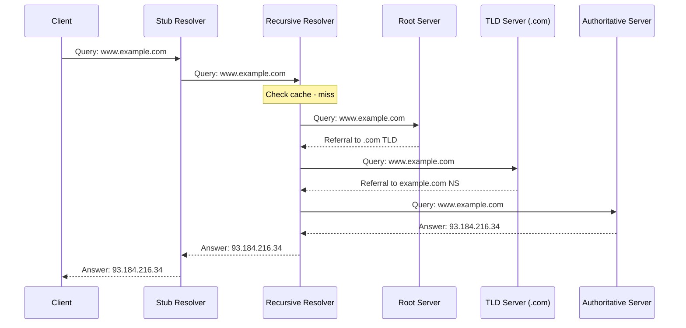
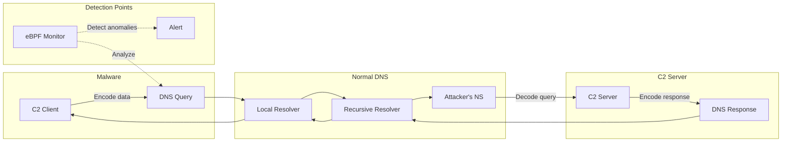
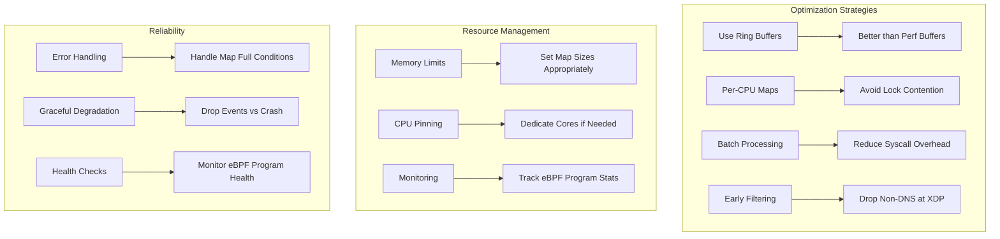

# 使用 eBPF 监控 DNS 查询 — 翻译与总结

> 原文链接：[How to Monitor DNS Queries with eBPF](https://oneuptime.com/blog/post/2026-01-07-ebpf-dns-monitoring/view)  
> 作者：Nawaz Dhandala（OneUptime）  
> 发布日期：2026-01-07  
> 翻译与总结时间：2026 年 6 月 11 日

---

## 一、文章摘要

本文是一篇**面向实践的 eBPF DNS 监控教程**，系统介绍了如何用 eBPF 在内核态观察 DNS 查询与响应，覆盖从基础采集到安全检测的完整链路。相比 tcpdump/Wireshark 等抓包方案，eBPF 的优势在于：**低开销、实时可见、可编程过滤**，且能同时覆盖外部 DNS 流量与本地 resolver 行为。

文章按难度递进，依次讲解：

1. **基础监控**：kprobe 挂载 `udp_sendmsg`，过滤 53 端口出站流量  
2. **报文解析**：XDP 程序解析 DNS 头部、Question/Answer 段  
3. **延迟追踪**：TC + Hash Map 关联 query/response，计算 RTT  
4. **解析链追踪**：uprobe `getaddrinfo` 跟踪应用层解析路径  
5. **安全场景**：DNS 隧道检测、威胁情报集成  
6. **生产部署**：性能优化、配置模板、Prometheus 指标导出  

⚠️ **重要说明**：文中代码多为**教学示例**，部分用户态脚本（如 latency monitor、chain tracer）的主循环是模拟占位，并非完整可运行项目。实际落地需自行补全编译、挂载、权限与容器/K8s 适配。

---

## 二、为什么用 eBPF 做 DNS 监控

DNS 是互联网连通性的基础，监控 DNS 对排障、安全分析和性能优化都至关重要。传统方案的问题：

| 传统方案 | 局限 |
|----------|------|
| tcpdump / Wireshark | 需拷贝报文到用户态，开销大；可能遗漏本地 resolver 内部行为 |
| 应用层日志 | 覆盖不全，难以关联进程与网络五元组 |
| DNS 服务器日志 | 只能看到到达 resolver 的请求，看不到客户端侧细节 |

eBPF 的核心优势：

- **低开销**：程序运行在内核，避免全量包拷贝  
- **实时性**：查询/响应发生时即时采集  
- **覆盖面广**：可同时观察 socket 层、网络栈、XDP/TC 多个挂载点  
- **可编程过滤**：按需定义采集字段与告警规则  

### 2.1 eBPF 与 DNS 流量集成架构



**挂载点选择逻辑**：

| 挂载点 | 适用场景 | 特点 |
|--------|----------|------|
| kprobe（`udp_sendmsg`） | 出站 DNS 查询 | 能关联 PID/comm，但看不到完整报文 |
| XDP | 高性能报文解析 | 最早拦截点，适合统计与安全检测 |
| TC | 双向流量、延迟关联 | 可同时处理 query/response |
| uprobe（`getaddrinfo`） | 应用层解析链 | 可见 hostname，但需处理不同 libc |

---

## 三、环境准备

**最低要求**：

- Linux 内核 ≥ 4.14（推荐 5.x 以获得完整特性）  
- BCC 或 libbpf  
- root 权限加载 eBPF 程序  
- 对应内核版本的开发头文件  

Ubuntu/Debian 安装示例：

```bash
sudo apt-get update
sudo apt-get install -y bpfcc-tools linux-headers-$(uname -r) \
    python3-bpfcc libbpf-dev clang llvm

sudo bpftool feature probe
uname -r
```

RHEL/CentOS：

```bash
sudo yum install -y bcc-tools bcc-devel kernel-devel clang llvm
sudo modprobe kheaders
```

---

## 四、DNS 报文结构（解析基础）

DNS 消息由 Header + Question + Answer + Authority + Additional 组成。Header 固定 12 字节：

```c
struct dns_header {
    __u16 transaction_id;  // 事务 ID，用于匹配 query/response
    __u16 flags;           // QR, Opcode, AA, TC, RD, RA, RCODE 等
    __u16 questions;
    __u16 answers;
    __u16 authority;
    __u16 additional;
};

#define DNS_QR_MASK     0x8000  // 0=query, 1=response
#define DNS_RCODE_MASK  0x000F  // 0=NOERROR, 3=NXDOMAIN
```

域名在报文中采用 **label 格式**：`[长度][标签字符]...[0x00]`。例如 `www.google.com` 编码为 `03www06google03com00`。解析时需注意 **compression pointer**（高 2 位为 `11`），完整实现需跟随指针。

---

## 五、基础 DNS 查询监控（kprobe）

### 5.1 思路

在 `kprobe/udp_sendmsg` 上拦截出站 UDP，读取 socket 目的端口，过滤 `dport == 53`，将 PID、comm、源/目的 IP 端口等信息写入 **ring buffer** 送到用户态。

### 5.2 核心数据结构

```c
struct dns_event {
    __u32 pid, tid;
    __u64 timestamp;
    __u32 saddr, daddr;
    __u16 sport, dport;
    __u16 query_id, query_type;
    char comm[16];
    char dns_name[MAX_DNS_NAME_LEN];
};
```

### 5.3 用户态

BCC Python 脚本 attach kprobe，通过 perf buffer（BCC）或 ring buffer（libbpf）接收事件并打印。

**局限**：此基础版本只读 socket 元数据，**未从 `msghdr` 解析 DNS 报文内容**（域名、query type 等字段在示例中未填充）。

---

## 六、XDP 深度报文解析

### 6.1 处理流程



### 6.2 关键逻辑

- 解析 Ethernet → IP → UDP → DNS Header  
- 提取 QR、AA、TC、RCODE 等标志位  
- 解析 Question 段获取域名、query type/class  
- 维护 per-CPU 统计 map：总包数、query/response 数、解析错误、NXDOMAIN 等  
- 策略为 `XDP_PASS`（只观察不丢弃）  

**支持的 DNS 类型常量**：A(1)、AAAA(28)、CNAME(5)、MX(15)、TXT(16)、NS(2)、SOA(6)、PTR(12) 等。

---

## 七、DNS 查询延迟追踪

### 7.1 关联机制

用 Hash Map 以 `{query_id, client_ip, client_port}` 为 key，在出站 query 时记录 `start_ts`；入站 response 时查表计算 `latency_ns = now - start_ts`，并更新延迟直方图。



### 7.2 延迟分桶

| 桶索引 | 范围 |
|--------|------|
| 0 | < 1ms |
| 1 | 1–5ms |
| 2 | 5–10ms |
| 3 | 10–50ms |
| 4 | 50–100ms |
| 5 | 100–500ms |
| 6 | > 500ms |

挂载点为 **TC**（`track_dns_query` / `track_dns_response`），分别处理目的端口 53 的 query 和源端口 53 的 response。

用户态 Python 脚本支持慢查询告警（默认阈值 100ms）和 P50/P95/P99 统计。

---

## 八、DNS 解析链追踪

### 8.1 典型解析链



### 8.2 实现方式

通过 **uprobe/uretprobe** 挂载 `libc:getaddrinfo`：

- **entry**：读取 hostname 参数，创建 `chain_state`（chain_id、start_ts、pid）  
- **return**：根据返回值发出 `QUERY_COMPLETE` 或 `QUERY_FAILED` 事件  

事件类型枚举包括：`QUERY_START`、`CACHE_HIT`、`CACHE_MISS`、`UPSTREAM_QUERY`、`UPSTREAM_RESPONSE`、`REFERRAL`、`QUERY_COMPLETE`、`QUERY_FAILED`。

⚠️ 示例中 chain tracer **仅实现了 getaddrinfo 入口/返回**，并未真正 hook 递归 resolver 的上游 query/response，因此 `CACHE_HIT`、`UPSTREAM_QUERY` 等事件类型在用户态有定义但内核侧未完整实现。

---

## 九、安全监控场景

### 9.1 DNS 隧道检测

DNS 隧道将数据编码在 DNS 查询/响应中，常用于 C2 或数据外泄。



### 9.2 异常检测规则（内核态）

| 检测项 | 阈值/条件 | 严重级别 |
|--------|-----------|----------|
| 超长 label | > 30 字符 | medium |
| 深层子域 | > 5 层 | medium |
| 高熵域名 | entropy score > 60 | medium |
| TXT 查询 | query_type == 16 | low |
| NULL 查询 | query_type == 10 | high |
| 高频查询 | 间隔 < 10ms | 累计计分 |
| 综合评分 | total_score ≥ 50 | high |

熵计算采用简化启发式：字符类型切换次数 + 数字占比，而非标准 Shannon 熵。

### 9.3 威胁情报集成（用户态）

Python `ThreatIntelligence` 类示例集成：

- 已知恶意域名 blocklist  
- 可疑 TLD（`.tk`、`.ml`、`.ga` 等免费域名）  
- DGA 模式匹配  
- 生产环境可对接 OpenDNS、VirusTotal、AlienVault OTX、Abuse.ch 等  

---

## 十、生产部署考量

### 10.1 性能优化



### 10.2 配置要点（YAML 示例摘要）

| 类别 | 关键参数 |
|------|----------|
| 性能 | ring_buffer 1MB、pending_queries 65536、batch_size 100 |
| 安全 | entropy_threshold 60、max_subdomain_depth 5、rate_limit 100 qps |
| 告警 | syslog / webhook / file 多目的地 |
| 监控 | Prometheus 9090，导出 queries_total、latency_seconds、security_alerts_total |

### 10.3 Prometheus 指标

- `dns_queries_total{query_type, rcode, server}`  
- `dns_query_latency_seconds{query_type, server}`  
- `dns_security_alerts_total{event_type, severity}`  
- `dns_active_queries`  
- `dns_cache_hit_ratio`  

---

## 十一、技术评价

### 11.1 优点

- **结构完整**：从入门到安全/生产的知识覆盖面广，适合作为 eBPF DNS 监控的学习路线图  
- **多挂载点对比**：kprobe / XDP / TC / uprobe 各有示例，帮助理解 trade-off  
- **安全视角实用**：DNS 隧道检测规则与威胁情报集成思路对 SOC 有参考价值  
- **生产清单**：map  sizing、graceful degradation、Prometheus 集成等考虑较全面  

### 11.2 局限与注意点

| 方面 | 说明 |
|------|------|
| **教学代码非完整产品** | 多个 Python 用户态脚本主循环为 `sleep` 占位，需自行对接 ring buffer |
| **kprobe 基础示例不完整** | 未从 msghdr 解析 DNS payload，域名/type 字段为空 |
| **仅 IPv4 UDP** | XDP/TC 示例过滤 `ETH_P_IP` + UDP，未覆盖 IPv6、DNS over TCP/TLS (DoT/DoH) |
| **compression pointer** | 域名解析遇到压缩指针即停止，生产环境需完整实现 |
| **transaction ID 冲突** | 仅用 query_id + client 信息做 key，高并发下可能误关联 |
| **getaddrinfo 覆盖有限** | 现代应用可能用 `gethostbyname`、`res_query`、直连 DoH，uprobe 覆盖不全 |
| **容器/K8s** | 未讨论 netns、cgroup、sidecar 场景下的挂载与权限 |
| **与现有方案对比缺失** | 未提及 CoreDNS plugin、Cilium Hubble DNS、Pixie、Tracee 等成熟方案 |

### 11.3 与开源方案对比（补充）

| 方案 | 特点 | 适用场景 |
|------|------|----------|
| **Cilium/Hubble** | 基于 eBPF 的 L7 DNS 可见性，K8s 原生 | 集群内服务 DNS 观测 |
| **Pixie** | 自动协议解析，含 DNS | 云原生可观测性 |
| **Tracee** | 安全导向，含 network DNS 事件 | 威胁检测与取证 |
| **Falco** | 规则引擎 + DNS 相关 syscall | 运行时安全告警 |
| **本文方案** | 教学向、可高度定制 | 学习 eBPF DNS 或构建专用探针 |

---

## 十二、结论

eBPF 为 DNS 监控提供了一种**低开销、内核态、可编程**的替代路径。本文的价值在于：

1. 展示了从 socket 元数据采集到 XDP 报文解析的完整技术栈  
2. 给出了 query/response 延迟关联的标准模式（Hash Map + ring buffer）  
3. 提供了 DNS 隧道等安全检测的启发式规则框架  
4. 列出了生产部署的配置与可观测性集成要点  

若要在生产环境落地，建议：

- 优先评估 **Cilium Hubble / Pixie / Tracee** 等成熟方案是否满足需求  
- 若自研，以 **libbpf + CO-RE** 替代 BCC 内嵌 C 字符串，提升可移植性  
- 补全 **IPv6、DoT/DoH、容器 netns** 支持  
- 将安全检测与用户态 ML/威胁情报 feed 结合，降低误报  

---

## 参考链接

- 原文：[How to Monitor DNS Queries with eBPF](https://oneuptime.com/blog/post/2026-01-07-ebpf-dns-monitoring/view)
- OneUptime：[https://oneuptime.com](https://oneuptime.com)
- 相关阅读：Cilium Hubble DNS Visibility、Pixie Protocol Tracing、Tracee Network Events
