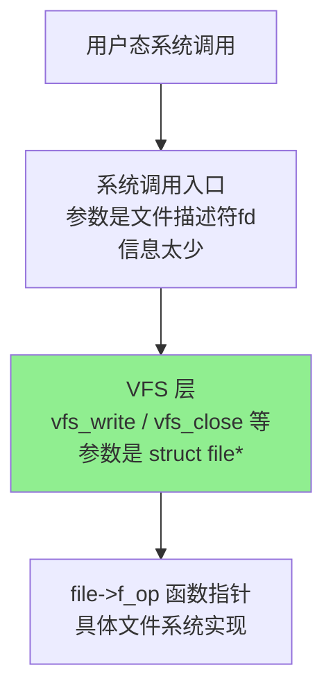
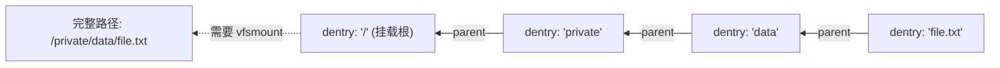
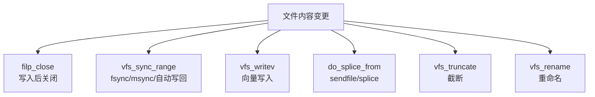

# eBPF 文件系统监控实战：踩坑与思考

> 原文链接：[eBPF File System Monitoring](https://joelschumacher.de/posts/ebpf-file-system-monitoring)
> 作者：Joel Schumacher
> 原文发布时间：2025 年 1 月 27 日
> 翻译与分析时间：2026 年 3 月 26 日

---

## 一、文章摘要

这是一篇非常接地气的实战文章，作者记录了自己在工作中使用 eBPF 实现文件系统监控的完整过程。场景是一个托管数千容器的系统，需要亚秒级检测文件内容变更。文章详细讲述了从监控 API 选型、内核函数追踪点选择、路径解析、eBPF 验证器挑战到内核 ABI 不稳定性等一系列实战问题，非常真实地展现了 eBPF 文件监控开发中的"艺术性"和"脆弱性"。

---

## 二、核心内容翻译与分析

### 2.1 需求场景

- 托管数千容器、数千客户的系统
- 文件通过 SSH/SFTP 或其他任意方式修改
- 需要**亚秒级**检测延迟（每日扫描不够快）
- 需要独立于具体文件系统工作
- 关注的不是所有文件操作，而是**导致文件内容实际变更**的操作——单纯的 `write` 不算，`write` 后跟 `flush` 或 `close` 才算

### 2.2 现有监控 API 对比

| API | 优势 | 劣势 |
|-----|------|------|
| **inotify** | 无需特权，易用 | 必须逐个监控每个文件/目录，**无法递归**；大量文件时扩展性极差 |
| **fanotify** | 可监控整个挂载点 | 需要 `CAP_SYS_ADMIN`；数千容器各有自己的挂载命名空间，扩展性存疑 |
| **eBPF** | 内核级预过滤减少事件量；系统调用级延迟；仅需 `CAP_BPF` + `CAP_PERFMON`；无监视列表状态；可轻松附加额外信息（挂载命名空间、PID 等） | 实现复杂，详见后文 |

eBPF 的核心优势：
1. **内核级预过滤**——减少需要传输到用户态的事件量
2. **系统调用级延迟**——在系统调用发出或返回时立即标记数据
3. **无监视列表状态**——不像 inotify 需要为每个文件注册 watch
4. **层次更少**——不经过 vfs → fsnotify → fanotify → userspace 的多层链路

### 2.3 需要追踪的文件修改方式

作者梳理了所有可能导致文件内容变更的操作：

| 操作方式 | C API | 说明 |
|----------|-------|------|
| 写入后关闭 | `fwrite` + `fclose` | 最常见方式 |
| 写入后 fsync | `fwrite` + `fflush` | 显式刷盘 |
| 写入后内核自动写回 | — | dirty page 自动回写 |
| 向量写入 | `writev` | 分散/聚集 I/O |
| 内存映射修改后 msync | `mmap` + `msync` | 内存映射文件 |
| 内存映射修改后 close | `mmap` + `close` | 内存映射文件 |
| 内存映射后内核自动写回 | `mmap` | dirty page 自动回写 |
| sendfile | `sendfile` | 零拷贝文件传输 |
| splice | `splice` | 管道与文件间数据移动 |
| 截断 | `truncate` | 改变文件大小 |
| 重命名 | `rename` | 原子替换文件 |

### 2.4 内核函数追踪点选择

作者在 Linux 内核调用链中寻找合适的钩子位置：



**关键发现**：
- 系统调用层参数只有 fd（整数），信息太少且无法在 eBPF 中调用任意内核函数获取更多信息
- VFS 层函数参数是 `struct file*`，信息丰富——这是理想的钩子位置
- 但 `vfs_close` 被**内联**了！无法钩入。需要找调用链中下一个非内联函数
- `close` 的刷盘不由 VFS 处理，而是由具体文件系统自己处理

最终确定需要追踪的 6 个内核函数：

| 函数 | 对应操作 |
|------|----------|
| `filp_close` | 关闭文件（`vfs_close` 被内联后的替代） |
| `vfs_sync_range` | fsync / msync / 自动写回 |
| `vfs_writev` | 向量写入（与 `vfs_write` 不同！） |
| `do_splice_from` | sendfile / splice |
| `vfs_truncate` | 文件截断 |
| `vfs_rename` | 文件重命名 |

> 作者感叹："我本以为会更少一些。"

### 2.5 棘手的问题：路径解析

**问题**：钩子函数接收的是 `struct file*`，但人类需要的是路径字符串。

Linux 内核中路径由两部分组成：
- `struct dentry`：文件系统对象的名称 + 指向父 dentry 的指针
- `struct vfsmount`：挂载点信息

路径构建过程：沿 dentry 链表向上遍历到挂载点根目录，再通过 vfsmount 获取完整路径。



**难点**：`vfs_rename` 函数接收的 `struct renamedata` 只包含 dentry 和 inode，**没有 vfsmount**！无法构建完整路径。

**作者的妥协方案**：只遍历到挂载根目录，将挂载根路径 + 挂载命名空间 ID 作为事件数据传递到用户态，依靠用户态结合上下文信息唯一标识文件。

### 2.6 eBPF 验证器的挑战

#### 值域追踪的局限

验证器追踪每个寄存器的可能值范围，但**不追踪值之间的关系**：

```c
// 看起来安全，但验证器不同意
if (offset + size <= BUF_SIZE) {
    bpf_probe_read_kernel(buf + offset, size, some_kernel_ptr);
}
```

验证器知道 `offset ∈ [0, 4096]`、`size ∈ [0, 4096]`，但无法编码 `offset + size ≤ 4096` 这个约束。它认为两者可能同时为 4096，导致越界。

**解决方案**：将缓冲区加倍（从 4096 → 8192），并使用位掩码宏限制值域：

```c
#define PATH_BUF_SIZE 4096
#define LIMIT_PATH_BUF_SIZE(x) ((x) &= (PATH_BUF_SIZE - 1))

LIMIT_PATH_BUF_SIZE(path_start);
```

#### 32 位 / 64 位寄存器问题

```c
name_len++;  // u32 变量，存在 64 位寄存器 r2 中
if (name_len > path_start) {
    break;
}
```

编译器将 `name_len`（u32）存储在 64 位寄存器 `r2` 中。自增可能使 `r2` 超出 32 位范围。为了进行比较，编译器将值拷贝到 `r1`，左移 32 位再右移 32 位来截断回 32 位。但验证器不知道 `r1` 和 `r2` 的关系，因此**不会更新 `r2` 的值域**，即使 `break` 应该排除超出范围的路径。

> 作者："可以绕过这些问题，但非常恼人。"

### 2.7 真正的难题

#### 问题一：不完整的路径信息

如前所述，某些函数（如 `vfs_rename`）的参数中缺少构建完整路径所需的 `vfsmount` 信息。在 eBPF 中无法调用任意内核函数，因此无法像内核代码那样轻松获取。

#### 问题二：不稳定的内核 ABI

为了从 `struct vfsmount` 获取父挂载点，需要访问包含它的 `struct mount`（通过 `container_of`）。但 `struct mount` 不在公开头文件中：

```c
struct mount {
    struct hlist_head mnt_hash;
    struct mount *mnt_parent;
    struct dentry *mnt_mountpoint;
    struct vfsmount mnt;
    // 更多字段，部分依赖编译标志
};
```

**Linux 保证的是用户态 API 稳定（"WE DO NOT BREAK USERSPACE"），但不保证内核 ABI 稳定。** 这意味着：
- 内核升级可能改变结构体字段的顺序或大小
- 重构可能完全移除你依赖的字段
- eBPF 程序可能在每个新内核版本上崩溃

#### 问题三：`__randomize_layout`

Linux 内核中许多结构体标记了 `__randomize_layout`，编译时成员顺序会被**随机打乱**（防御漏洞利用）。`struct mount` 就有这个标记。

如果内核启用了结构体随机化，**eBPF 程序中的路径遍历将无法正确工作**。

检查方法：
```bash
grep CONFIG_RANDSTRUCT /boot/config-$(uname -r)
# 返回 CONFIG_RANDSTRUCT_NONE=y 表示已禁用
```

幸运的是 Debian 和 Ubuntu 默认禁用了结构体随机化。但其他发行版或有安全要求的环境可能会启用。

**潜在解决方案**：使用 BTF 和 CO-RE（Compile Once - Run Everywhere）来生成带有实际结构体布局的头文件。作者承认应该研究这个方向，但因为目标发行版禁用了随机化，暂未深入。

---

## 三、作者的结论

> eBPF 可以用于高性能文件系统监控，但**可能不稳定且移植性差**。如果你对目标系统有很好的控制，这可能不是大问题。收集所有可能修改文件的系统调用确实很麻烦，而且我不确定我是否都找全了——即使找全了，明天或明年也可能新增新的方式。
>
> eBPF 看起来**高效且灵活，但脆弱**，这是一个困难的权衡。今天这个权衡可能值得，但随着持续的维护负担，这个权衡可能逐渐变得不那么有利。

---

## 四、核心技术要点总结

### 4.1 实战经验清单

| 问题 | 解决方案 / 妥协 |
|------|-----------------|
| `vfs_close` 被内联 | 改用 `filp_close` |
| `writev` 不走 `vfs_write` | 额外追踪 `vfs_writev` |
| sendfile/splice 不经过 VFS 层 | 追踪 `do_splice_from` |
| 路径解析缺少 vfsmount | 只构建到挂载根，附带挂载命名空间 ID |
| 验证器不追踪值间关系 | 缓冲区加倍 + 位掩码限制值域 |
| 32 位变量在 64 位寄存器中 | 需要查看 eBPF 汇编理解编译器行为 |
| `struct mount` 非公开 | 自定义部分结构体定义 |
| `__randomize_layout` | 仅在禁用随机化的发行版上使用；或使用 BTF + CO-RE |

### 4.2 需要追踪的 6 个内核函数



---

## 五、与其他方案的对比视角

这篇文章从**一线开发者**视角补充了前面分析的 Tetragon、Sysdig、Wazuh、Elastic 等方案未充分暴露的实战细节：

| 维度 | 商业/成熟方案（Tetragon/Sysdig） | 本文实战方案 |
|------|----------------------------------|-------------|
| 钩子选择 | 钩入 `security_file_permission` / 系统调用追踪点 | 钩入 VFS 层 6 个函数 |
| 路径解析 | 有专门的 eBPF 代码从 `struct file` 提取路径 | 手动遍历 dentry 链表 |
| TOCTOU | Tetragon 通过钩入 LSM 函数避免 | 未涉及 |
| 验证器 | 框架封装，用户不直接面对 | 需要大量技巧应对 |
| 内核 ABI | 使用 BTF + CO-RE 解决 | 手动定义私有结构体 |
| 维护成本 | 由商业团队/社区持续维护 | 作者担忧长期维护负担 |

**关键洞察**：Tetragon 选择钩入 `security_file_permission` 而非 VFS 层函数是一个**更优的设计决策**——它是一个单一钩子点，覆盖所有文件访问，且处于路径已拷贝到内核态之后（避免 TOCTOU）。本文作者需要追踪 6 个不同函数才能覆盖所有文件修改方式，维护负担明显更大。

---

## 六、个人思考

### 6.1 这篇文章的独特价值

这是本系列中**最真实的实战文章**。商业产品的博客（Sysdig、Tetragon、Elastic）往往展示成功的架构和优雅的设计，而这篇文章毫不掩饰地记录了实际开发中的每一个痛点：

1. **内联函数问题**——`vfs_close` 被内联导致无法钩入，这在官方文档中几乎不会提到
2. **路径解析的复杂性**——从 `struct file*` 到完整路径需要遍历 dentry 链 + vfsmount 链，且某些函数根本不提供足够信息
3. **验证器的非直觉行为**——不追踪值间关系、32/64 位寄存器混淆等问题，需要查看 eBPF 汇编才能理解
4. **`__randomize_layout` 的存在**——这是一个在安全加固内核上可能完全阻塞 eBPF FIM 方案的问题

### 6.2 "高效、灵活、但脆弱"

作者的总结非常精准。eBPF FIM 的核心矛盾是：

- **高效**：内核级过滤，亚秒级延迟
- **灵活**：可以追踪任意内核函数，附加任意上下文信息
- **脆弱**：依赖非稳定内核 ABI，可能被内联函数、结构体随机化等因素破坏

这也解释了为什么成熟产品（Tetragon、Sysdig）投入大量工程来处理这些问题（BTF/CO-RE、上游内核贡献、持续的内核版本适配），而个人或小团队的 eBPF 项目可能面临不可持续的维护负担。

### 6.3 对 FIM 方案选型的启示

如果你正在考虑**自研 eBPF FIM**，这篇文章是必读材料——它会让你充分了解需要面对的工程挑战。如果评估后认为维护成本不可接受，选择成熟的开源方案（Tetragon、Wazuh）或商业方案（Sysdig）可能是更务实的选择。
