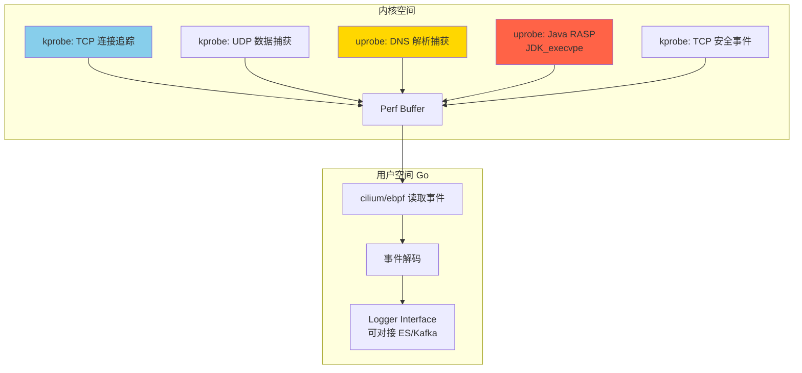
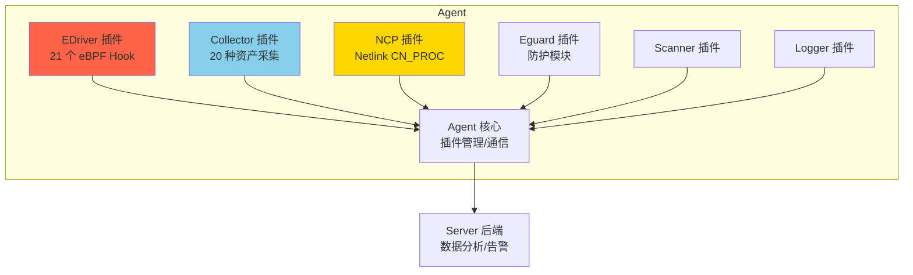
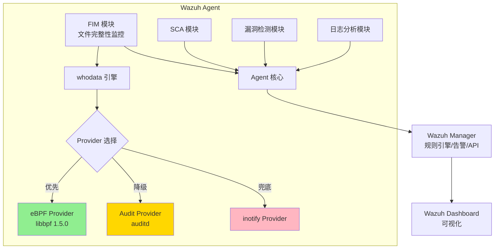
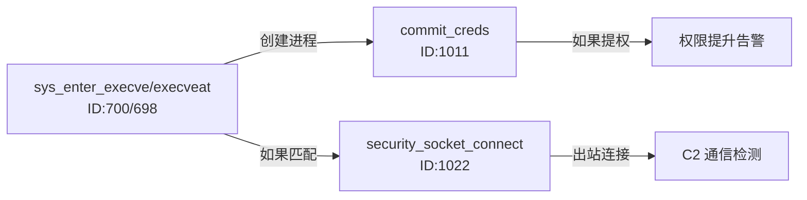
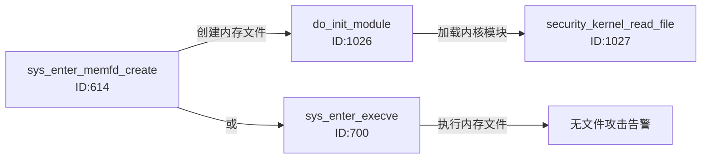
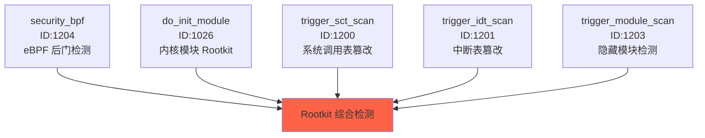
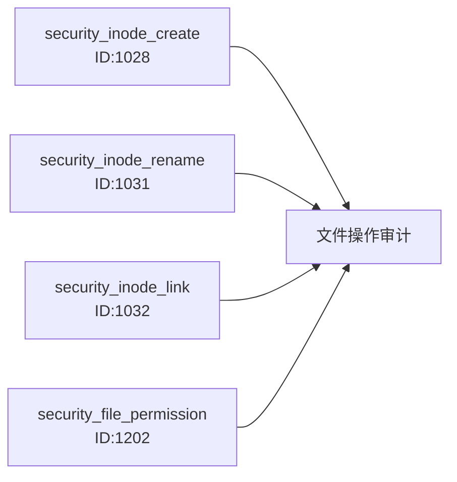
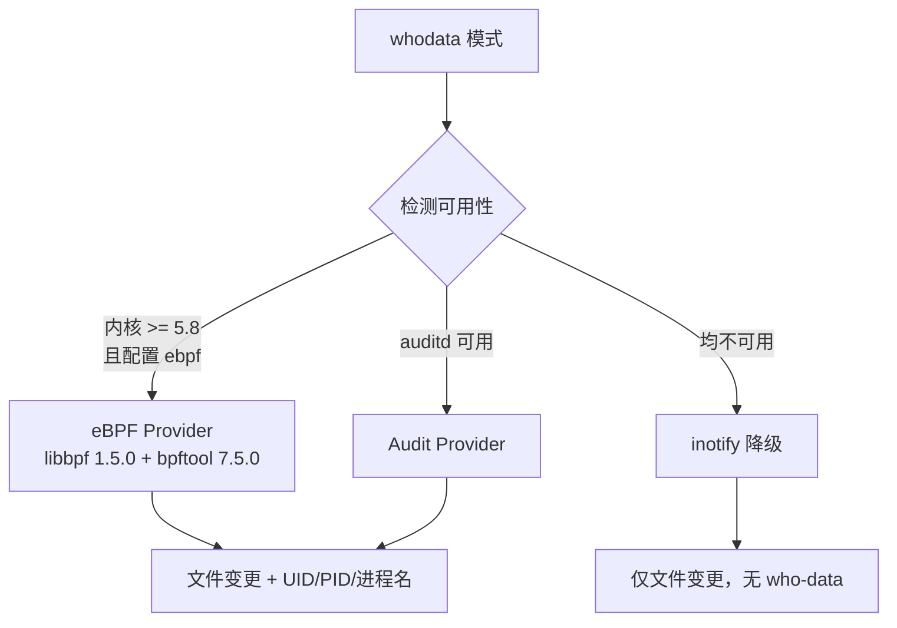
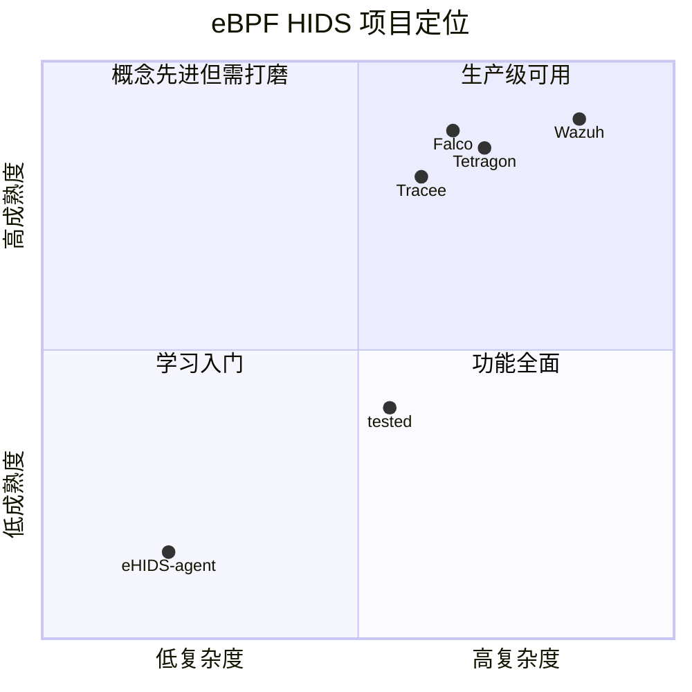

# 三个典型 eBPF HIDS 项目深度对比分析

> 分析项目：
> - [eHIDS-agent](https://github.com/gojue/ehids-agent)（美团安全 CFC4N 个人项目）
> - [tested](https://github.com/tested/tested)（tested 个人项目，404 星链计划）
> - [Wazuh](https://github.com/wazuh/wazuh)（开源 XDR/SIEM 平台）
>
> 分析时间：2026 年 3 月 26 日
> 分析方法：基于项目 README、目录结构、依赖清单和已有技术分析文档

---

## 一、项目定位与成熟度对比

| 维度 | eHIDS-agent | tested | Wazuh |
|------|-------------|-------|-------|
| **定位** | eBPF HIDS Demo | eBPF HIDS 原型系统 | 企业级开源安全平台（XDR/SIEM） |
| **Stars** | 458 | 305 | 15,000 |
| **Commits** | 38 | 523 | 45,927 |
| **成熟度** | PoC/Demo | 原型/早期可用 | 生产级 |
| **维护状态** | ⚠️ 已停止（作者建议用 Tetragon/Tracee/Falco） | 开发中 | 活跃维护 |
| **作者背景** | 美团安全工程师个人贡献 | 个人开发者，参考 Tracee + Elkeid | Wazuh Inc.（商业公司 + 社区） |
| **许可证** | AGPL-3.0 | Apache-2.0 | GPLv2 |

---

## 二、架构对比

### 2.1 eHIDS-agent 架构



**核心设计**：
- **语言**：内核态 C + 用户态 Go
- **eBPF 库**：cilium/ebpf（纯 Go 实现，无 CGo 依赖）
- **框架抽象**：开发者只需实现三个文件——内核态 C 文件、用户态 Go 文件、事件结构体
- **数据传输**：Perf Buffer
- **输出**：Logger 接口抽象，可自定义上报到 ES/Kafka

**目录结构**：

| 目录 | 作用 |
|------|------|
| `kern/` | eBPF 内核态 C 程序 |
| `user/` | 用户态 Go 事件处理 |
| `builder/` | 编译构建工具 |
| `examples/` | Java RASP 测试用例 |
| `bin/` | 编译产物 |

### 2.2 tested 架构



**核心设计**：
- **语言**：内核态 C（64.7%）+ 用户态 Rust（23.8%）+ Go（10.9%）
- **架构参考**：Agent 部分基于 Elkeid 1.7 重构，eBPF 部分借鉴 Tracee + Elkeid
- **插件化设计**：6 个独立插件，各司其职
- **双引擎兼容**：eBPF（高版本内核）+ Netlink CN_PROC（低版本内核兼容）
- **eBPF 库**：libbpf（原生 C 库）

**插件体系**：

| 插件 | 语言 | 作用 |
|------|------|------|
| **EDriver** | C + Rust | eBPF 内核驱动，21 个 Hook 点 |
| **Collector** | Go/Rust | 资产信息周期采集（进程/crontab/用户/容器等 20 种） |
| **Eguard** | Rust | 防护模块 |
| **NCP** | Go | Netlink CN_PROC 事件采集（低版本内核兼容） |
| **Scanner** | - | 扫描模块 |
| **Logger** | - | 日志模块 |

### 2.3 Wazuh 架构（eBPF 相关部分）



**核心设计**：
- **语言**：C++（39.7%）+ C（38.5%）+ Python（17.8%）
- **eBPF 角色**：FIM whodata 的 Provider 之一（非核心架构）
- **eBPF 库**：libbpf 1.5.0 + bpftool 7.5.0
- **三级降级**：eBPF → Audit → inotify
- **最低内核**：5.8（eBPF Provider）
- **核心差异**：Wazuh 是完整的安全平台，eBPF 仅用于增强 FIM 模块的 who-data 能力

---

## 三、eBPF Hook 点全景对比

### 3.1 eHIDS-agent Hook 清单

| Hook 类型 | 挂钩点 | 捕获数据 | 用途 |
|----------|--------|---------|------|
| kprobe | `tcp_v4_connect` | 源/目的 IP、端口、PID | TCP 连接追踪（出站） |
| kprobe | `tcp_v4_connect`（安全版） | 连接时间、UID、地址族 | TCP 安全事件 |
| kprobe | `udp_sendmsg` | UDP 包元数据 | UDP 数据捕获 |
| uprobe | `getaddrinfo`（libc） | DNS 查询域名 | DNS 信息捕获 |
| uprobe | `JDK_execvpe`（libjava.so） | 命令名、PID、fork 模式 | Java RASP 命令执行检测 |

**共 5 个 Hook 点**，覆盖网络 + DNS + Java RASP 三个场景。

### 3.2 tested EDriver Hook 全景

| 分类 | Hook 类型 | 挂钩点 | ID | 用途 |
|------|----------|--------|-----|------|
| **进程执行** | tracepoint | `sys_enter_execve` | 700 | 进程创建监控 |
| | tracepoint | `sys_enter_execveat` | 698 | 进程创建监控（execveat 变体） |
| | tracepoint | `sys_enter_prctl` | 1020 | 进程名修改检测（PR_SET_NAME） |
| | tracepoint | `sys_enter_ptrace` | 1021 | 进程注入检测（PEEK/POKE） |
| **内存** | tracepoint | `sys_enter_memfd_create` | 614 | 无文件攻击检测（内存文件创建） |
| **网络** | kprobe | `security_socket_connect` | 1022 | 出站连接监控 |
| | kprobe | `security_socket_bind` | 1024 | 端口绑定监控 |
| | k(ret)probe | `udp_recvmsg` | 1025 | DNS 数据捕获（53/5353） |
| **权限** | kprobe | `commit_creds` | 1011 | 权限提升检测 |
| **内核模块** | kprobe | `do_init_module` | 1026 | 内核模块加载监控 |
| | kprobe | `security_kernel_read_file` | 1027 | 内核文件读取监控 |
| **文件系统** | kprobe | `security_inode_create` | 1028 | 文件创建监控 |
| | kprobe | `security_inode_rename` | 1031 | 文件重命名监控 |
| | kprobe | `security_inode_link` | 1032 | 硬链接创建监控 |
| | kprobe | `security_file_permission` | 1202 | 文件权限检查监控 |
| **挂载** | kprobe | `security_sb_mount` | 1029 | 挂载操作监控 |
| **用户态辅助** | kprobe | `call_usermodehelper` | 1030 | 内核调用用户态程序监控 |
| **完整性扫描** | uprobe | `trigger_sct_scan` | 1200 | 系统调用表完整性扫描 |
| | uprobe | `trigger_idt_scan` | 1201 | 中断描述符表完整性扫描 |
| | uprobe | `trigger_module_scan` | 1203 | 内核模块完整性扫描 |
| **eBPF 自身** | kprobe | `security_bpf` | 1204 | eBPF 加载监控（检测 eBPF 后门） |

**共 21 个 Hook 点**，覆盖进程、网络、文件、权限、内核模块、完整性扫描等六大安全维度。

### 3.3 Wazuh eBPF Hook（FIM whodata）

| Hook 类型 | 挂钩点 | 捕获数据 | 用途 |
|----------|--------|---------|------|
| kprobe/tracepoint | 文件 syscall 相关 | 文件路径、变更类型、UID/PID | FIM 文件变更检测 |

Wazuh 的 eBPF 仅用于 FIM whodata，Hook 点数量相对有限，但配合其完整的安全平台（日志分析、漏洞检测、合规审计等）构成全面的安全能力。

### 3.4 Hook 策略对比

```mermaid
graph LR
    subgraph eHIDS "eHIDS-agent (5 Hooks)"
        E1[kprobe: TCP/UDP]
        E2[uprobe: DNS/Java RASP]
    end

    subgraph tested "tested (21 Hooks)"
        H1[tracepoint: 进程执行/内存]
        H2[kprobe/LSM: 网络/文件/权限/模块]
        H3[uprobe: 完整性扫描]
        H4[kprobe: eBPF 自身监控]
    end

    subgraph Wazuh "Wazuh eBPF (FIM)"
        W1[FIM whodata Hook]
    end

    style tested fill:#FFD700
```

---

## 四、Hook 间关系与技术手法分析

### 4.1 tested 的 Hook 关系深度分析

tested 的 21 个 Hook 之间存在多个有意义的关联关系：

#### 关系一：进程执行链



`execve` 捕获进程创建 → `commit_creds` 检测是否发生权限提升 → `security_socket_connect` 检测新进程是否发起可疑外连。

#### 关系二：无文件攻击检测链



`memfd_create` 检测内存文件创建 → `do_init_module` 检测是否被加载为内核模块 → 构成无文件攻击检测链。

#### 关系三：Rootkit 检测矩阵



这是 tested **独有的亮点**——通过 uprobe 触发的完整性扫描（SCT/IDT/Module），结合 `security_bpf` 的 eBPF 加载监控，构成了完整的 Rootkit 检测矩阵。这直接呼应了我们之前分析的 [eBPF 后门检测框架](https://windshock.github.io/en/post/2025-04-29-ebpf-backdoor-detection-framework/) 中的核心需求。

#### 关系四：文件操作审计链



四个 LSM 钩子协同覆盖文件创建、重命名、硬链接、权限检查——这与 Tetragon 的 FIM 方案使用相同的 `security_*` 系列钩子。

### 4.2 eHIDS-agent 的 Hook 技术手法

#### Java RASP 的 Uprobe 实现

```
uprobe 挂载 libjava.so 的 JDK_execvpe 函数
└── 偏移地址 offset = 0x19C30（JDK 1.8.0_292 特定）
└── 捕获 Java 应用通过 Runtime.exec() 执行系统命令的行为
```

**技术要点**：
- 直接 hook JDK 的 native 函数而非系统调用，可以绕过 Java 层的各种代理和包装
- **偏移量依赖 JDK 版本**——不同 JDK 版本需要重新定位，这是 uprobe 的固有局限
- 与 Pixie 系列 Part 3 中 hook `SSL_write`/`SSL_read` 的思路一致——在共享库层面挂钩

#### DNS Uprobe 捕获

```
uprobe 挂载 libc 的 getaddrinfo 函数
└── 在 DNS 解析发生前捕获查询域名
└── 避免在内核中解析 DNS 协议的复杂性
```

### 4.3 Wazuh 的 eBPF 技术选择

**Provider 模式的精妙设计**：



Wazuh 使用 **libbpf 1.5.0**（原生 C 库）而非 Go/Rust 封装，与其 C/C++ 代码库保持一致。bpftool 7.5.0 用于 BTF 支持。

---

## 五、数据流与 Map 使用策略对比

| 维度 | eHIDS-agent | tested | Wazuh |
|------|-------------|-------|-------|
| **数据传输** | Perf Buffer | Ring Buffer（推测，基于 libbpf） | Ring Buffer（内核 >= 5.8） |
| **eBPF 库** | cilium/ebpf（Go） | libbpf（C）+ Rust 封装 | libbpf 1.5.0（C） |
| **Map 复杂度** | 低（基本 Hash Map） | 中-高（多种 Map 类型） | 低-中（FIM 专用） |
| **内核态过滤** | 无 | 有（通过 Selector 过滤） | 有限 |
| **事件富化** | 用户空间简单解码 | 用户空间 + 内核态部分富化 | 用户空间（libsinsp 类似） |
| **输出方式** | Logger 接口（可自定义） | gRPC → Server 后端 | Wazuh Manager → Dashboard |

---

## 六、安全覆盖面 ATT&CK 映射

| ATT&CK 战术 | 技术 | eHIDS | tested | Wazuh |
|-------------|------|-------|-------|-------|
| **执行** | 命令行执行 | ❌ | ✅ execve/execveat | ✅ 日志分析 |
| | Java 命令执行 | ✅ RASP | ❌ | ❌ |
| **持久化** | Crontab | ❌ | ✅ Collector | ✅ FIM |
| | 内核模块 | ❌ | ✅ do_init_module | ⚠️ 有限 |
| | SSH 密钥 | ❌ | ✅ Collector | ✅ FIM |
| **权限提升** | 凭据操纵 | ❌ | ✅ commit_creds | ⚠️ 日志 |
| | 进程注入 | ❌ | ✅ ptrace | ⚠️ 日志 |
| **防御逃避** | 无文件执行 | ❌ | ✅ memfd_create | ❌ |
| | Rootkit | ❌ | ✅ SCT/IDT/Module 扫描 | ✅ rootcheck |
| | 进程名伪装 | ❌ | ✅ prctl PR_SET_NAME | ❌ |
| **网络** | C2 通信 | ✅ TCP/UDP | ✅ socket_connect | ⚠️ 网络日志 |
| | DNS 隧道 | ✅ DNS uprobe | ✅ udp_recvmsg(53) | ⚠️ 日志 |
| **文件** | 文件完整性 | ❌ | ✅ inode_create/rename/link | ✅ FIM（核心能力） |
| | 文件哈希 | ❌ | ❌ | ✅ MD5/SHA1/SHA256 |
| **eBPF 自身** | eBPF 后门 | ❌ | ✅ security_bpf | ❌ |

---

## 七、工程质量与可扩展性对比

| 维度 | eHIDS-agent | tested | Wazuh |
|------|-------------|-------|-------|
| **代码量** | ~千行级 | ~万行级 | ~百万行级 |
| **模块化** | 简单框架抽象（3 文件开发） | 完整插件化架构（6 插件） | 企业级模块化（Agent/Manager/Dashboard） |
| **测试** | 无 | 有限 | 完善（单元测试 + 集成测试） |
| **文档** | README | README + 部分文档 | 完整官方文档 |
| **容器/K8s 支持** | 无 | 有限（容器采集） | ✅ 完整（Docker/K8s 集成） |
| **多平台** | Linux only | Linux only | Linux + Windows + macOS |
| **扩展新 Hook** | 简单（框架抽象好） | 中等（需改 Rust + C） | 复杂（需改 C++ + C） |
| **部署方式** | 二进制 | 二进制 | Agent + Manager + Dashboard |

---

## 八、综合评估与推荐

### 8.1 三项目定位矩阵



### 8.2 适用场景推荐

| 场景 | 推荐项目 | 原因 |
|------|---------|------|
| **学习 eBPF HIDS 开发** | eHIDS-agent | 代码量少、框架抽象清晰、3 文件即可扩展，入门门槛最低 |
| **学习生产级 eBPF Hook 设计** | tested | 21 个 Hook 覆盖六大安全维度，Hook 间关系设计值得研究 |
| **企业生产环境部署** | Wazuh | 唯一的生产级成熟方案，完整的 XDR/SIEM 能力，多平台支持 |
| **深入理解 Rootkit 检测** | tested | 独有的 SCT/IDT/Module 完整性扫描 + security_bpf 监控 |
| **学习 Go + cilium/ebpf** | eHIDS-agent | 纯 Go 实现，cilium/ebpf 库使用范例 |
| **学习 Rust + libbpf** | tested | Rust 用户态 + libbpf C 内核态的混合架构 |
| **学习 C/C++ + libbpf** | Wazuh | 原生 libbpf 集成到 C++ 项目的工程实践 |

### 8.3 各项目的独特亮点

**eHIDS-agent 亮点**：
1. **框架抽象优秀**——开发者只需 3 个文件（内核 C、用户 Go、事件结构体），框架自动加载执行
2. **Java RASP via Uprobe**——在 JDK native 层直接 hook，比 Java Agent 更底层
3. **配套系列源码分析文章**——作者分析了 Cilium、Datadog、Tracee 等项目源码，极具学习价值

**tested 亮点**：
1. **Rootkit 检测矩阵**——SCT/IDT/Module 完整性扫描 + `security_bpf` 监控，这是其他项目少见的
2. **`security_bpf` Hook**——直接监控 eBPF 程序加载，与后门检测文章中 Tracee 的策略一致
3. **双引擎兼容**——eBPF + Netlink CN_PROC，覆盖新旧内核
4. **完整的采集体系**——EDriver（eBPF 实时）+ Collector（周期采集）+ NCP（进程事件），构成纵深采集

**Wazuh 亮点**：
1. **企业级完整性**——不仅是 HIDS，而是完整的 XDR/SIEM 平台
2. **三级降级策略**——eBPF → Audit → inotify，确保在任何环境下都能工作
3. **文件哈希与内容 Diff**——MD5/SHA1/SHA256 哈希对比 + 内容变更差异，这是纯 eBPF 方案不具备的
4. **合规覆盖**——PCI-DSS、GDPR、HIPAA 等合规标准的开箱即用支持

---

## 九、使用 Cursor 深入分析的建议

如果你要用 Cursor 进一步深入分析这三个项目，建议的优先级和策略：

### 推荐顺序

1. **先分析 eHIDS-agent**（1-2 小时）
   - 代码量小，适合快速理解 eBPF HIDS 的基本模式
   - 重点关注 `kern/` 和 `user/` 目录的对应关系
   - 使用阶段一 + 阶段二的提示词

2. **再分析 tested EDriver 插件**（3-5 小时）
   - 重点分析 `plugins/edriver/` 目录下的 21 个 Hook
   - 使用阶段二 + 阶段五 + 阶段六的提示词
   - 特别关注 Rootkit 检测相关的 uprobe 实现

3. **最后分析 Wazuh FIM eBPF 部分**（2-3 小时）
   - 重点分析 `src/` 目录下与 syscheck/eBPF 相关的代码
   - 使用阶段二 + 补充提示词 C（FIM 专用）的提示词
   - 特别关注三级降级的实现逻辑

### Clone 命令

```bash
git clone https://github.com/gojue/ehids-agent.git
git clone https://github.com/tested/tested.git
git clone --depth 1 https://github.com/wazuh/wazuh.git  # depth 1 因为仓库很大
```

---

## 十、总结

三个项目代表了 eBPF HIDS 的三个发展阶段：

| 阶段 | 代表项目 | 特征 |
|------|---------|------|
| **PoC/Demo** | eHIDS-agent | 验证 eBPF 在 HIDS 中的可行性，框架抽象优秀但功能有限 |
| **原型系统** | tested | 功能较完整（21 Hook + 20 种采集 + Rootkit 检测），但缺少生产级打磨 |
| **企业平台** | Wazuh | eBPF 作为增强组件融入成熟的安全平台，优雅降级确保兼容性 |

对于想要**学习 eBPF HIDS 实现**的开发者，建议路径：eHIDS-agent（入门）→ tested（进阶）→ Tetragon/Tracee 源码（生产级参考）。

对于想要**在生产环境部署**的安全团队，Wazuh 是最稳妥的选择，Tetragon 和 Falco 是云原生环境的首选。
