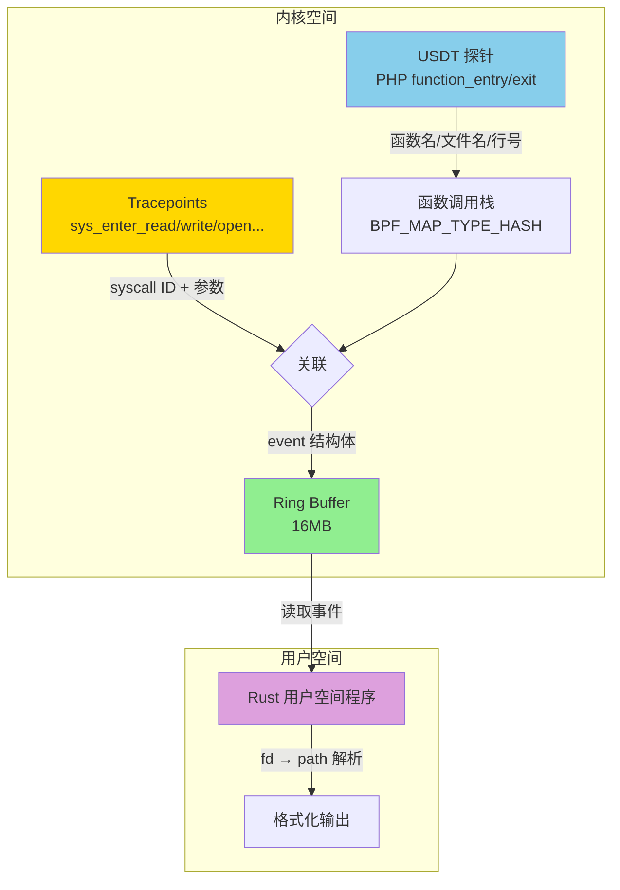
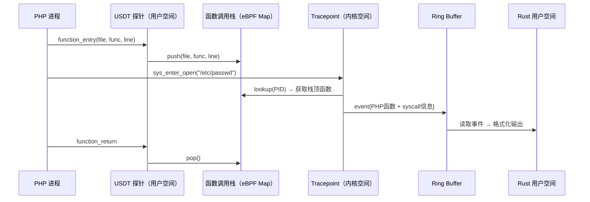

# 基于 eBPF 的 Linux 文件系统系统调用运行时监控

> 原文链接：[eBPF-Based Linux Filesystem Syscall Runtime Monitoring](https://medium.com/@psy_maestro/ebpf-based-linux-filesystem-syscall-runtime-monitoring-8e5a49ff82d9)
> 作者：psy_maestro
> 原文发布时间：2025 年 7 月 28 日
> 翻译与分析时间：2026 年 3 月 26 日
> 项目源码：[https://github.com/alperbiceral/filesyscall_catch](https://github.com/alperbiceral/filesyscall_catch)

---

## 一、文章摘要

本文介绍了一个基于 eBPF 的运行时文件系统系统调用监控项目。作者的场景是：作为 SaaS 公司的安全工程师，需要监控 PHP 应用在服务器上是否执行了文件操作，并精确定位到**哪个 PHP 函数、哪个文件、哪一行**触发了哪个文件系统系统调用。项目综合使用了 **USDT 探针**（追踪 PHP 函数调用栈）和 **Tracepoints**（捕获文件系统 syscall），通过 **Ring Buffer** 将关联后的数据传递到用户空间。

---

## 二、核心内容翻译与分析

### 2.1 项目目标

假设你是 SaaS 公司的安全工程师，需要确认你的 PHP 应用在服务器上是否执行了文件操作。目标是：

- 捕获所有文件系统相关的系统调用（read、write、open 等）
- 关联到具体的 **PHP 函数名、文件名、行号**
- 实时输出监控结果

### 2.2 探针类型对比

作者首先介绍了四种 eBPF 探针类型：

| 探针类型 | 位置 | 说明 |
|---------|------|------|
| **USDT**（Userspace Statically Defined Tracing） | 用户空间 | 嵌入在应用源码中的预定义探测点，无需修改源码或重启应用即可挂钩 |
| **Uprobes** | 用户空间 | 可挂钩到用户空间应用的**任意函数或指令地址**，无需预定义 |
| **Tracepoints** | 内核空间 | 内核中内置的探测钩子，用于监控系统调用、调度器活动、网络事件等 |
| **Kprobes** | 内核空间 | 可挂钩到**几乎任何内核函数**，无需预定义，比 Tracepoints 更灵活 |

### 2.3 探针选择策略

#### 用户空间：为什么选择 USDT 而不是 Uprobe？

| 维度 | Uprobe | USDT |
|------|--------|------|
| 需要了解内部结构 | ✅ 必须跟踪 Zend 引擎的结构体定义 | ❌ 无需 |
| 跨版本兼容性 | ❌ 结构体字段和偏移量随 PHP 版本变化 | ✅ 探测点在源码中预定义，接口稳定 |
| 获取函数名/文件名/行号 | 复杂，需要手动解析结构体 | 简单，USDT 直接提供 |

PHP 内置了 DTrace/USDT 探测点（参见 [PHP DTrace 文档](https://www.php.net/manual/en/features.dtrace.dtrace.php)），可以直接获取函数入口/出口、文件名、行号等信息。

#### 内核空间：为什么选择 Tracepoints 而不是 Kprobes？

- Tracepoints 更简单，提供的信息对于本项目足够
- 文件系统 syscall 可以在 `/sys/kernel/tracing/events/syscalls` 目录下找到
- 挂钩 `sys_enter_*` 以获取 syscall 参数；如需返回值则挂钩 `sys_exit_*`

### 2.4 核心架构设计



### 2.5 关键数据结构

#### 函数调用栈（per-PID）

```c
typedef struct {
    char filename[MAX_FILENAME];
    char function_name[MAX_FUNCTION_NAME];
    int line_no;
} Function_entry;

typedef struct {
    Function_entry call_stack[MAX_FUNCTION_COUNT];
    int count;
} Map;

// HashMap< ProcessID, Map[ call_stack[ filename, function_name, line_no ], count ] >
struct {
    __uint(type, BPF_MAP_TYPE_HASH);
    __type(key, pid_t);
    __type(value, Map);
    __uint(max_entries, MAX_PROCESS_NUM);
} usdt_map SEC(".maps");
```

设计要点：

| 要点 | 说明 |
|------|------|
| **per-PID 隔离** | 每个 PHP 进程有独立的函数调用栈，互不干扰 |
| **LIFO 栈语义** | 函数入口 push、出口 pop，栈顶即为当前执行函数 |
| **溢出保护** | 栈满时替换最后一个条目（LIFO 行为），避免越界 |
| **边界检查** | 所有数组访问前都有 `count >= 0 && count < MAX_FUNCTION_COUNT` 检查，满足 eBPF 验证器要求 |

#### Ring Buffer 事件结构

```c
struct {
    __uint(type, BPF_MAP_TYPE_RINGBUF);
    __uint(max_entries, 1 << 24);  // 16MB
} events SEC(".maps");

struct event_function_info {
    u32 pid;
    char function_name[MAX_FUNCTION_NAME];
    char filename[MAX_FILENAME];
    int line_no;
    int syscall_id;
    char arg0[MAX_ARG_SIZE];  // syscall 参数
    char arg1[MAX_ARG_SIZE];  // syscall 参数
};
```

### 2.6 核心工作流程

#### 步骤 1：USDT 探针维护函数调用栈

当 PHP 函数被调用时，USDT 探针触发，将函数名、文件名、行号 push 到对应 PID 的调用栈中：

```c
Map *map = bpf_map_lookup_elem(&usdt_map, &process_id);
if (map) {
    if (map->count >= 0 && map->count < MAX_FUNCTION_COUNT) {
        Function_entry *entry = &map->call_stack[map->count];
        copy_string(entry->function_name, func_name, MAX_FUNCTION_NAME);
        copy_string(entry->filename, file_name, MAX_FILENAME);
        entry->line_no = line_number;
        map->count++;
    }
    // 栈满时替换最后一个条目...
}
```

函数退出时对应 pop 操作（`count--`）。

#### 步骤 2：Tracepoint 捕获 syscall 并关联调用栈

当文件系统 syscall 被触发时，Tracepoint 探针：
1. 获取当前 PID
2. 从 `usdt_map` 中查找该 PID 的调用栈
3. 取栈顶元素（当前正在执行的 PHP 函数）
4. 将 syscall 信息 + PHP 函数信息打包为 event，写入 Ring Buffer

```c
int last_index = map->count - 1;
if (last_index >= 0 && last_index < MAX_FUNCTION_COUNT) {
    Function_entry *last_func = &map->call_stack[last_index];
    copy_string(event->function_name, last_func->function_name, MAX_FUNCTION_NAME);
    copy_string(event->filename, last_func->filename, MAX_FILENAME);
    event->line_no = last_func->line_no;
}
```

#### 步骤 3：用户空间读取 Ring Buffer 并输出

用户空间程序（Rust 实现）从 Ring Buffer 读取事件，解析 C 字符串，根据 `syscall_id` 格式化输出：

```rust
match event.syscall_id {
    0 => {  // read
        let target = resolve_fd_to_path(event.pid, &arg0);
        writeln!(writer, "READ: PID {} in {}() [{}:{}] - Target File: {}",
                 event.pid, function_name, filename, event.line_no, target).ok();
    },
    1 => {  // write
        let target = resolve_fd_to_path(event.pid, &arg0);
        writeln!(writer, "WRITE: PID {} in {}() [{}:{}] - Target File: {}",
                 event.pid, function_name, filename, event.line_no, target).ok();
    },
    // ...
}
```

其中 `resolve_fd_to_path` 通过 `/proc/<pid>/fd/<fd>` 将文件描述符解析为实际文件路径。

---

## 三、技术要点深度分析

### 3.1 USDT + Tracepoint 双探针联动

这是本项目最有价值的设计——**跨内核/用户空间的事件关联**：



关键洞察：USDT 探针和 Tracepoint 共享同一个 eBPF Map（`usdt_map`），以 PID 为 key 进行关联。这让我们能够回答一个非常有价值的问题——"**是哪一行 PHP 代码触发了这个系统调用？**"

### 3.2 与传统 FIM 方案的区别

| 维度 | 本项目 | 传统 FIM（Sysdig/Tetragon/Wazuh） |
|------|--------|----------------------------------|
| **监控目标** | 特定应用（PHP）的文件操作 | 特定文件/目录的变更 |
| **探针层次** | USDT（用户空间）+ Tracepoint（内核） | Kprobe/LSM（纯内核） |
| **信息粒度** | **精确到源码行号** | 进程级（PID/进程名/容器） |
| **场景定位** | 应用行为审计 / 安全分析 | 文件完整性监控 / 合规 |
| **语言绑定** | 依赖应用的 USDT 探测点（PHP） | 语言无关 |

### 3.3 设计优缺点

**优点**：

1. **源码级追踪** — 不仅知道"哪个进程做了什么"，还知道"源码中哪一行触发了操作"，对安全审计极其有价值
2. **零侵入** — 无需修改 PHP 应用代码或安装 PHP 扩展
3. **低开销** — Ring Buffer 是高效的内核→用户空间数据传输机制
4. **实时性** — 事件驱动，非轮询

**局限**：

1. **语言绑定** — 依赖 PHP 内置的 USDT 探测点；其他语言需要自己的 USDT 支持（Python、Ruby、Node.js 等也有内置 USDT，但 Go、Rust 等编译型语言通常没有）
2. **需要 DTrace 编译支持** — PHP 必须使用 `--enable-dtrace` 编译才有 USDT 探测点
3. **调用栈深度限制** — `MAX_FUNCTION_COUNT` 限制了可追踪的调用深度
4. **fd → path 解析在用户空间** — `resolve_fd_to_path` 通过读取 `/proc/<pid>/fd/<fd>` 实现，存在竞态条件（进程可能在查询前关闭 fd）
5. **`vmlinux.h` 依赖** — 作者提到需要内核特定的 `vmlinux.h`，意味着跨内核移植需要额外配置

### 3.4 Ring Buffer vs per-CPU Ring Buffer

作者使用了 `BPF_MAP_TYPE_RINGBUF`（而非 `BPF_MAP_TYPE_PERF_EVENT_ARRAY`），这是更现代的选择：

| 维度 | Ring Buffer | perf_event_array |
|------|------------|-----------------|
| 内存效率 | 所有 CPU 共享一个缓冲区 | 每个 CPU 一个独立缓冲区 |
| 事件排序 | 天然保序（FIFO） | 跨 CPU 事件无序 |
| 内核版本要求 | 5.8+ | 4.3+ |
| 适用场景 | 事件量适中，需要全局排序 | 高吞吐，可容忍乱序 |

对于 PHP 文件操作监控这类事件量不高的场景，Ring Buffer 是更合适的选择。

---

## 四、与本系列其他文章的关联

| 维度 | 本文 | Sysdig/Falco | Tetragon | Joel Schumacher | fs-watcher |
|------|------|-------------|----------|----------------|------------|
| **核心场景** | PHP 应用文件操作审计 | 容器运行时安全 | 文件完整性监控 | 文件系统变更检测 | 目录所有者变更监控 |
| **探针类型** | USDT + Tracepoint | raw tracepoint | LSM 钩子 / Kprobe | Kprobe（VFS） | Kprobe（VFS） |
| **用户空间关联** | ✅ 精确到源码行 | 进程/容器级 | 进程/Pod 级 | 无 | 无 |
| **数据传输** | Ring Buffer | per-CPU Ring Buffer | Ring Buffer | perf buffer | Ring Buffer |
| **用户空间语言** | Rust | C/C++ | Go | Go | Go |

**本文的独特贡献**：在整个系列中，这是**唯一一篇实现了用户空间（应用层）与内核空间事件关联**的方案。其他方案都止步于进程/容器级别的粒度，而本文通过 USDT + Tracepoint 双探针联动，实现了源码行级别的追踪。这种思路对于**应用安全审计、供应链攻击检测、恶意代码行为分析**等场景极具参考价值。

---

## 五、实用启示

### 5.1 USDT 探测点在主流语言中的支持

| 语言 | USDT 支持 | 说明 |
|------|----------|------|
| PHP | ✅ 内置 | `--enable-dtrace` 编译选项 |
| Python | ✅ 内置 | CPython 3.6+ 默认启用 `sys.monitoring` + USDT |
| Ruby | ✅ 内置 | CRuby 内置 DTrace 探测点 |
| Node.js | ✅ 内置 | `--enable-dtrace` 编译选项 |
| Java | ⚠️ 需配置 | 通过 JVMTI agent 或 `-XX:+ExtendedDTraceProbes` |
| Go | ❌ 无原生 | 需要手动添加 USDT（如 `go-usdt` 库） |
| Rust | ❌ 无原生 | 需要手动添加 USDT（如 `probe-rs`） |

### 5.2 可扩展方向

1. **多语言支持** — 利用各语言的 USDT 探测点，可将本方案扩展到 Python、Ruby、Node.js 应用
2. **策略引擎** — 在用户空间添加规则引擎，对特定函数+特定文件路径的组合进行告警
3. **容器感知** — 在事件中添加容器 ID / Pod 信息，适配 Kubernetes 环境
4. **与 FIM 结合** — 将本方案的应用层追踪与 Tetragon/Falco 的文件完整性监控结合，实现"谁（应用代码哪一行）→ 改了什么文件 → 是否违规"的完整审计链

---

## 六、总结

这篇文章展示了一种**从安全审计角度出发**的 eBPF 文件监控方案，其核心创新点在于 **USDT + Tracepoint 双探针联动**，实现了跨用户空间/内核空间的事件关联，将文件操作追踪精确到源码行级别。虽然受限于语言绑定（需要 USDT 支持），但这种思路为应用层安全审计提供了一个全新的维度。项目代码开源在 [GitHub](https://github.com/alperbiceral/filesyscall_catch)，用户空间部分使用 Rust 实现，值得参考。
