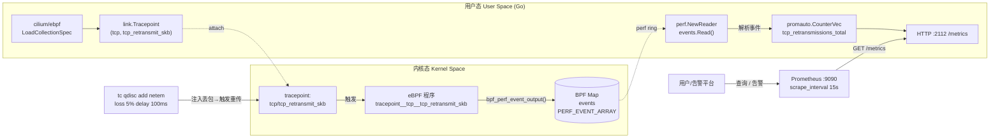
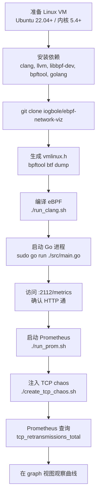

# eBPF 入门：使用 eBPF + Go + Prometheus 监控 TCP 重传 — 翻译与总结

> 原文链接：[Getting Started with eBPF: Monitoring TCP Retransmissions Using eBPF, Go and Prometheus](https://israelo.io/blog/ebpf-net-viz/)
> 作者：Israel Ogbole
> 发布日期：2023-10-12
> 项目代码：[iogbole/ebpf-network-viz](https://github.com/iogbole/ebpf-network-viz)
> 翻译与总结时间：2026 年 6 月 12 日

---

## 一、文章定位与摘要

这是一篇**面向 eBPF 初学者的实战入门文章**，作者以"监控 TCP 重传（TCP Retransmission）"作为切入点，串联起 eBPF 内核态程序、Go 用户态加载器与 Prometheus 指标采集的完整链路。文章篇幅虽不长，却几乎覆盖了一个最小可工作的 eBPF 网络观测项目的全部要素：

- **内核态**：基于 `tracepoint/tcp/tcp_retransmit_skb` 抓取重传事件
- **数据通路**：通过 `BPF_MAP_TYPE_PERF_EVENT_ARRAY`（perf event buffer）跨态传递
- **用户态**：使用 `github.com/cilium/ebpf` 加载预编译 `.o` 字节码、attach tracepoint、读取 perf buffer
- **可观测**：用 `prometheus/client_golang` 暴露 `tcp_retransmissions_total` 计数器
- **测试链路**：用 `tc qdisc … netem loss 5% delay 100ms` 注入故障复现

作者的视角是"产品经理动手玩内核"，因此文章不追求 eBPF 体系的全景，而是把"为什么要做"、"做出来长什么样"、"怎么跑起来"这条路打通，特别适合作为 eBPF 第一个网络可观测项目的参考模板。

> 项目地址：<https://github.com/iogbole/ebpf-network-viz>（约 26 stars，单 tracepoint + Go + Prometheus 的最小骨架）

---

## 二、为什么关注 TCP 重传（Why this matters）

TCP 重传是协议的常规自愈机制，本身不是问题；但**异常频繁的重传**是网络病灶的强信号：

| 影响维度 | 具体表现 |
|----------|----------|
| 延迟（Latency） | 包要重新发，等待 RTO/SACK 反馈，端到端延迟显著上升 |
| CPU 开销 | 收发两端都要处理重传逻辑，软中断与 socket buffer 操作开销变高 |
| 带宽利用率 | 重传包占据本可用于新数据的链路容量 |
| 用户体验 | 上层应用感受到"忽快忽慢"的卡顿，难以从应用日志定位 |

作者本人曾经在线上排查一个 APM Agent 间歇性连接故障，最后是用 Wireshark 抓包才发现是防火墙策略导致的大量 TCP 重传——而如果当时手里有一套基于 eBPF 的全局重传指标，可以**直接从内核拿到 src/dst IP+port+PID**，无须现场抓包、也不会遗漏。

文章给出复现"故障流量"的一行命令（**注意：会立刻拖垮你的网络，作者警告过曾经把自己从 EC2 的 SSH 中踢出**）：

```bash
sudo tc qdisc add dev eth0 root netem loss 10% delay 100ms
```

> 这条命令是后面整篇文章的"自测开关"。理解 `tc/netem` 的 loss/delay 注入对吃透这类网络 eBPF 项目非常关键。

---

## 三、为什么选 eBPF（Why eBPF）

作者强调三个特性，是网络可观测场景选择 eBPF 而不是用户态抓包/Agent 注入的核心理由：

1. **安全性**：程序运行在沙箱中，过 verifier 校验，不会让内核 crash
2. **性能**：在内核态收集，避免全量拷贝到用户态，适合高频网络事件
3. **灵活性**：可在 kprobe / uprobe / tracepoint / XDP / TC / LSM 等多种挂载点编程

本文聚焦于 **tracepoint**——内核中由开发者预先埋好的稳定事件点。相比 kprobe，tracepoint 是 ABI 稳定的，跨内核版本兼容性最好，是初学者的首选挂载点。这里用的是 `tcp_retransmit_skb`，定义见：

```bash
cat /sys/kernel/debug/tracing/events/tcp/tcp_retransmit_skb/format
```

这是探索任意 tracepoint 数据结构的标准方法——读 `format` 文件直接得到字段名、类型、偏移。这一点也是新手最容易卡住的地方，作者专门用一节"Finding Data Structures for Other Tracepoints"提示如何从 `/sys/kernel/debug/tracing/events/` 找到字段定义。

---

## 四、整体架构

### 4.1 端到端数据流



### 4.2 关键组件清单

| 组件 | 角色 | 关键依赖 |
|------|------|----------|
| `retrans.c` | 内核态 eBPF 程序 | `vmlinux.h` + libbpf 头 |
| `retrans.o` | 编译后的 BPF 字节码 | clang -target bpf |
| `main.go` | 用户态加载器与指标导出 | cilium/ebpf, prometheus/client_golang |
| `prometheus.yml` | Prometheus scrape 配置 | `127.0.0.1:2112` |
| `ebpf-vm.yaml` | macOS 上的 Lima 开发环境 | nerdctl 容器运行时 |
| `create_tcp_chaos.sh` | 注入丢包+延迟的测试脚本 | tc / netem / curl |

---

## 五、内核态 eBPF C 代码剖析

### 5.1 BPF CO-RE 与 vmlinux.h

文章首先解释了 BPF **CO-RE（Compile Once, Run Everywhere）** 的价值：

- 编译期尽量解析能确定的内容，无法确定的内核结构成员偏移留作 **relocation 占位**
- 加载到内核时由 libbpf 用目标内核的 BTF 信息回填
- 一份 `.o` 跨多内核版本运行，无需为每个内核重新编译

`vmlinux.h` 是用 `bpftool` 把内核 BTF 导出的 C 头：

```bash
bpftool btf dump file /sys/kernel/btf/vmlinux format c > vmlinux.h
```

包含的头文件：

```c
#include "vmlinux.h"
#include <bpf/bpf_helpers.h>
#include <bpf/bpf_endian.h>
#include <bpf/bpf_tracing.h>
```

### 5.2 事件结构与 tracepoint 上下文

事件结构 `event` 是要送给用户态的 payload；`tcp_retransmit_skb_ctx` 是 tracepoint 的入参布局，必须**严格匹配** `format` 文件中的字段顺序与对齐（`_pad0` 是 tracepoint 通用头占位）：

```c
struct event {
    __u64 timestamp;
    __u32 pid;
    __u16 sport, dport;
    __u8  saddr[4], daddr[4];
    __u8  saddr_v6[16], daddr_v6[16];
    __u16 family;
    int   state;
};

struct tcp_retransmit_skb_ctx {
    __u64 _pad0;
    void *skbaddr;
    void *skaddr;
    int   state;
    __u16 sport;
    __u16 dport;
    __u16 family;
    __u8  saddr[4];
    __u8  daddr[4];
    __u8  saddr_v6[16];
    __u8  daddr_v6[16];
};
```

> 这种"硬编码 ctx 布局"的方式是上一代写法。新版 libbpf + CO-RE 可以直接用 `vmlinux.h` 中生成的 `struct trace_event_raw_tcp_event_sk` 等类型，由 verifier 配合做字段定位。但作者用 `format` + 手写 ctx，初学者更直观。

### 5.3 BPF Map：PERF_EVENT_ARRAY

```c
struct {
    __uint(type, BPF_MAP_TYPE_PERF_EVENT_ARRAY);
    __uint(key_size, sizeof(__u32));
    __uint(value_size, sizeof(__u32));
} events SEC(".maps");
```

这是 perf event array，每个 CPU 一个 ring，用户态用 `perf.NewReader` 顺序消费。它和更新的 `BPF_MAP_TYPE_RINGBUF` 的区别：

| 特性 | PERF_EVENT_ARRAY | RINGBUF（5.8+） |
|------|------------------|------------------|
| 拓扑 | per-CPU 多 ring | 全局共享 ring，按写入序保序 |
| API | `bpf_perf_event_output` | `bpf_ringbuf_output` / `_reserve` |
| 适用 | 老内核兼容 | 新内核优选，事件顺序更友好 |

文章作者也明确提到 **"BPF ring buffer is a more modern alternative to Perf Event buffers, suitable for newer Kernel version"**——本文为兼容性选择 perf array，生产新项目可以直接上 ringbuf。

### 5.4 tracepoint 处理函数（来自仓库 `src/ebpf/retrans.c`）

```c
SEC("tracepoint/tcp/tcp_retransmit_skb")
int tracepoint__tcp__tcp_retransmit_skb(struct tcp_retransmit_skb_ctx *ctx)
{
    __u32 key = 0; // CPU 0
    struct event event = {};

    event.timestamp = bpf_ktime_get_ns();
    event.pid       = bpf_get_current_pid_tgid() >> 32;
    event.sport     = ctx->sport;
    event.dport     = ctx->dport;
    event.family    = ctx->family;
    event.state     = ctx->state;

    if (event.family == AF_INET) {
        bpf_probe_read(event.saddr, sizeof(event.saddr), ctx->saddr);
        bpf_probe_read(event.daddr, sizeof(event.daddr), ctx->daddr);
    } else if (event.family == AF_INET6) {
        bpf_probe_read(event.saddr_v6, sizeof(event.saddr_v6), ctx->saddr_v6);
        bpf_probe_read(event.daddr_v6, sizeof(event.daddr_v6), ctx->daddr_v6);
    }

    bpf_perf_event_output(ctx, &events, key, &event, sizeof(event));
    return 0;
}

char LICENSE[] SEC("license") = "GPL";
```

几个值得专门留意的点：

1. **时间戳在内核取（`bpf_ktime_get_ns`）**：作者特意注释强调"比在用户态打时间更准确"，因为事件入队到用户态读出有不确定的排队延迟
2. **PID 取高 32 位**：`bpf_get_current_pid_tgid() >> 32` 拿的是 **TGID（线程组 ID，即用户态意义上的 PID）**；如果想拿线程 ID 则取低 32 位
3. **`key = 0` 写死 CPU 0**：⚠️ 这是文中**潜在的 bug 风险**——`PERF_EVENT_ARRAY` 通常按 `bpf_get_smp_processor_id()` 写当前 CPU 的 ring，硬编码 `key=0` 在多核机上可能把所有 CPU 的事件都塞到 CPU0 的 ring（取决于实现/版本，但**最佳实践应该用 `BPF_F_CURRENT_CPU` 作为 flags**）。下面附上更稳妥的写法对照
4. **LICENSE 必须是 GPL** 才能调用 GPL helper（`bpf_probe_read` 等）

更稳妥的事件输出写法（生产建议）：

```c
bpf_perf_event_output(ctx, &events, BPF_F_CURRENT_CPU, &event, sizeof(event));
```

### 5.5 编译命令

```bash
clang -O2 -g -target bpf \
      -c ./ebpf/retrans.c \
      -o ./ebpf/retrans.o \
      -I/usr/include \
      -I/usr/src/linux-headers-$(uname -r)/include \
      -D __BPF_TRACING__
```

要点：

- `-target bpf`：clang 后端切到 BPF
- `-g`：保留 BTF 调试信息（CO-RE 需要）
- `-O2`：BPF verifier 偏好优化后的指令序列

---

## 六、用户态 Go 程序剖析

### 6.1 事件结构（与 C 一一对应）

```go
type tcpRetransmitEvent struct {
    Timestamp uint64
    PID       uint32
    Sport     uint16
    Dport     uint16
    Saddr     [4]byte
    Daddr     [4]byte
    SaddrV6   [16]byte
    DaddrV6   [16]byte
    Family    uint16
    State     int32
}
```

> ⚠️ **对齐与字节序坑点**：Go 端用 `binary.LittleEndian` 解码，必须和 BPF 程序所在主机 endianness 一致；同时 Go struct 没显式 `pack`，依赖字段顺序与 C 端 `__attribute__((packed))` 或自然对齐保持一致。本文中没有任何对齐 attribute，能跑通是因为字段排列恰好与 C 端一致，但**这种"依赖布局巧合"的写法在跨平台/跨架构时极易翻车**，生产建议在 C 端显式 `__attribute__((packed))` 并在 Go 端用 `// +build` 或 `bpf2go` 工具自动生成结构体。

### 6.2 Prometheus 指标定义

```go
var tcpRetransmissions = promauto.NewCounterVec(prometheus.CounterOpts{
    Name: "tcp_retransmissions_total",
    Help: "Total number of TCP retransmissions",
}, []string{"ip_version", "src_ip", "src_port", "dst_ip", "dst_port"})
```

⚠️ **基数（cardinality）告警**：`src_ip`、`src_port`、`dst_ip`、`dst_port` 全部作为 label，**笛卡尔积可能爆炸**。在线上长连接很多的环境，这会让 Prometheus 内存与查询时间快速恶化。生产建议：

- 把 `src_port` 这类**临时端口**改为聚合维度（如 `0` 或不打），只保留 `dst_port`
- 或者用 **service mesh / kube-pod 维度**替换原始 IP，借助元数据丰富化
- 极端场景下用 **VictoriaMetrics / Mimir** 替换原生 Prometheus，或者把"五元组维度"日志化（用 Loki/Elastic）而非指标化

### 6.3 主流程

```go
spec, err := ebpf.LoadCollectionSpec(objFileName)
coll, err := ebpf.NewCollectionWithOptions(spec, ebpf.CollectionOptions{
    Programs: ebpf.ProgramOptions{
        LogLevel: 1,
        LogSize:  65535,
    },
})
prog := coll.Programs["tracepoint__tcp__tcp_retransmit_skb"]
tp,   err := link.Tracepoint("tcp", "tcp_retransmit_skb", prog, nil)
defer tp.Close()

events, err := perf.NewReader(coll.Maps["events"], os.Getpagesize())
defer events.Close()

http.Handle("/metrics", promhttp.Handler())
go http.ListenAndServe(":2112", nil)

for {
    record, err := events.Read()
    event := tcpRetransmitEvent{}
    binary.Read(bytes.NewReader(record.RawSample), binary.LittleEndian, &event)
    // ... 转换 IP，更新 Counter，序列化 JSON 打印
}
```

几个工程化要点：

1. **`LogLevel: 1` + `LogSize: 65535`**：开启 verifier 详细日志，调 eBPF 程序时这是排错神器
2. **`os.Getpagesize()` 作为 perf 缓冲区大小**：通常 4KB，作为入门示例够用；生产建议用 `64 * os.Getpagesize()` 之类的更大值，否则高频事件下会丢
3. **`perf.IsUnknownEvent(err)` 容错**：CPU 上 perf record 偶尔会有 `LOST` 事件，应 `continue` 而不是 panic
4. **没有处理 perf `Lost` 计数**：当事件丢失时，`Record.LostSamples` 会有值，生产代码应该把它**暴露为 Prometheus 指标**用于丢失率告警

### 6.4 IPv4/IPv6 区分

```go
if event.Family == 2 { // AF_INET
    ipVersion = 4
    srcIP = fmt.Sprintf("%d.%d.%d.%d", event.Saddr[0], ...)
} else if event.Family == 10 { // AF_INET6
    ipVersion = 6
    srcIP = fmt.Sprintf("%x%x:%x%x:...", event.SaddrV6[0], ...)
}
```

> ⚠️ 这里 v6 的格式化写法**不是规范的 IPv6 表示**（没有正确处理双冒号压缩、字节序与 16 位分组）。生产建议直接用 `net.IP(event.SaddrV6[:]).String()`：
>
> ```go
> srcIP = net.IP(event.SaddrV6[:]).String()
> ```

---

## 七、Prometheus 集成与故障注入

### 7.1 Prometheus 配置

```yaml
global:
  scrape_interval: 15s

scrape_configs:
  - job_name: 'TCPRetrans'
    static_configs:
      - targets: ['127.0.0.1:2112']
```

文章用一个 shell 脚本动态把 `eth0` 的真实 IP 替换进去，然后用 `nerdctl run` 启动 Prometheus 容器（Lima 环境自带 `nerdctl`，是 Docker 的兼容 CLI）：

```bash
IP_ADDRESS=$(ip -4 addr show eth0 | grep -oP '(?<=inet\s)\d+(\.\d+){3}')
sed -i "s/[0-9]\+\.[0-9]\+\.[0-9]\+\.[0-9]\+:2112/${IP_ADDRESS}:2112/g" "$CONFIG_FILE"
nerdctl run --rm -p 9090:9090 -v "$PWD/prom_config:/etc/prometheus" prom/prometheus
```

### 7.2 注入故障：`create_tcp_chaos.sh`

```bash
sudo tc qdisc add dev eth0 root netem loss 5% delay 100ms

for ((i = 1; i <= 20; i++)); do
  for site in "${websites[@]}"; do
    curl -sS "$site" > /dev/null
    sleep 1
    wget -O- "$site" > /dev/null
  done
done

sudo tc qdisc del dev eth0 root
```

机理：

1. `tc qdisc … netem loss 5% delay 100ms`：在 eth0 出口注入 5% 丢包 + 100ms 延迟
2. 循环跑 `curl/wget` 真实 HTTPS 请求，触发足够的 TCP 流量
3. 丢包导致 TCP 段无 ACK，超时后内核走 `tcp_retransmit_skb` → 触发我们的 tracepoint → 写 perf buffer → Go 进程读出来 → Prometheus 计数器 +1
4. 测试结束后 `tc qdisc del` 清理 qdisc

### 7.3 验证与告警阈值

作者最后建议：

> A retransmission rate of **2% or greater** generally indicates network issues that warrant attention.

这是网络运维的经验阈值（也常见于 Datadog/New Relic 等 APM 的默认告警值）。可以基于 PromQL 配置告警，例如：

```promql
rate(tcp_retransmissions_total[5m])
  / on(instance) ignoring(ip_version, src_ip, src_port, dst_ip, dst_port)
    group_left rate(node_netstat_Tcp_OutSegs[5m])
  > 0.02
```

> ⚠️ 实际查询要根据 `tcp_retransmissions_total` 标签设计来写，文章并没有给出 PromQL 示例；这里只是按惯例给一个可参考的模板。

---

## 八、独立技术评价

### 8.1 文章的优点

1. **完整闭环**：从挂载点选择 → C 代码 → Go 加载 → Prometheus → 故障注入，是个能跑通的最小 demo，对入门极友好
2. **挂载点选择得当**：`tcp_retransmit_skb` 是 ABI 稳定的 tracepoint，跨内核兼容好；新手不必折腾 kprobe 的内核版本兼容
3. **现实场景驱动**：作者从自己排查 APM Agent 网络故障的真实经历切入，"为什么需要这个能力"讲得清楚
4. **CO-RE 普及**：用 `vmlinux.h` 而不是手动包含一堆内核头，体现了**现代** libbpf-based eBPF 工程的写法
5. **macOS 开发体验**：用 Lima + nerdctl 给出 Mac 本地开发方案，降低 macOS 用户尝试 eBPF 的门槛

### 8.2 需要谨慎对待的细节（生产化前必修补）

| 问题 | 现状 | 建议 |
|------|------|------|
| `bpf_perf_event_output` 的 key 硬编码为 0 | `__u32 key = 0;` | 改为 `BPF_F_CURRENT_CPU` |
| Go 端结构体未显式打包/对齐 | 依赖字段顺序巧合 | 用 `bpf2go` 自动生成 Go 结构体 |
| IPv6 字符串格式不规范 | 自己拼 `%x%x:%x%x:…` | `net.IP(buf[:]).String()` |
| Prometheus label 基数风险 | 五元组全部入 label | 至少聚合 `src_port`，或用元数据丰富化 |
| perf buffer 太小（一个 page） | `os.Getpagesize()` | 高频场景至少 `64 * page_size` |
| 没有处理 `Lost` 事件 | 直接 panic | 暴露 `tcp_retrans_lost_events_total` 指标 |
| PERF_EVENT_ARRAY 老内核兼容选型 | 新项目可直接 ringbuf | Kernel 5.8+ 推荐 `BPF_MAP_TYPE_RINGBUF` |
| 没有 graceful shutdown | `defer` 一旦 panic 不会触发完整清理 | 用 `signal.NotifyContext` + `errgroup` |

### 8.3 与同类开源方案对比

如果只是为了"在生产采集 TCP 重传指标"，已经有更成熟的选项可以直接复用，而不是从这个 demo 起步：

| 方案 | 覆盖能力 | 适合场景 | 与本文方案差异 |
|------|----------|----------|------------------|
| **bcc/bpftrace tcpretrans** | tcp_retransmit_skb + tcp_send_loss_probe（含 TLP） | 临时排障、`tcpretrans -l` 一行命令 | bcc 编译期依赖内核头，部署较重；本文是 CO-RE 单文件 |
| **Cilium Hubble** | L3/L4/L7 流可观测、含 retransmit 等 | K8s 网络可观测平台 | Hubble 是完整数据面，不仅仅是重传 |
| **DeepFlow / Pixie** | 内置 eBPF Auto-Instrumentation + APM | 全栈 APM/可观测 | 本文是单一指标 demo，DeepFlow/Pixie 是完整观测平台 |
| **node_exporter `netstat` collector** | 全局 `Tcp_RetransSegs` 等聚合数 | 集群级粗粒度监控 | 没有五元组维度，无法定位"哪条流"在重传 |
| **Tetragon** | 安全语义 + 进程上下文 + 网络事件 | 安全/可观测一体 | 偏安全策略，重传指标不是它的强项 |

**推荐使用顺序**（个人建议）：

1. **排障一次性**：直接 `bpftrace -e 'tracepoint:tcp:tcp_retransmit_skb { printf("%d %s -> %s\n", pid, ...); }'` 即可
2. **持续监控（节点级粗粒度）**：node_exporter + `node_netstat_Tcp_RetransSegs`
3. **持续监控（带五元组/进程维度）**：本文方案的"加强版"——基于 `cilium/ebpf` + bpf2go + ringbuf + 元数据 enrich + 受控 cardinality
4. **K8s 生产环境**：上 Cilium Hubble 或 DeepFlow，不要自研轮子

### 8.4 适合谁读这篇文章

- ✅ 刚入门 eBPF，想要"用 Go 跑通一个真实样例"的同学
- ✅ Go 后端工程师，希望了解 `cilium/ebpf` 的最小用法
- ✅ 想理解 `tracepoint` 工作机制、`format` 文件作用、CO-RE 工作流的人
- ❌ **不适合**：想直接用于生产 TCP 重传监控的人——请用上面 8.3 节推荐的成熟方案
- ❌ **不适合**：想深入理解 verifier、JIT、map LRU/LPM 等高级话题的人——本文只用了最基础的 perf array

---

## 九、动手实践快速复现指南

如果你想在自己的 Linux VM 上跑通，简化版步骤：



关键检查点：

1. `sudo bpftool prog show` 能看到 `tracepoint__tcp__tcp_retransmit_skb` 已挂载
2. `cat /sys/kernel/debug/tracing/events/tcp/tcp_retransmit_skb/enable` 应为 1
3. `curl http://127.0.0.1:2112/metrics | grep tcp_retransmissions`
4. 注入 chaos 后 Prometheus 中 `rate(tcp_retransmissions_total[1m]) > 0`

---

## 十、参考资料

- 原文：<https://israelo.io/blog/ebpf-net-viz/>
- 项目代码：<https://github.com/iogbole/ebpf-network-viz>
- 推荐进一步阅读：
  - 《Learning eBPF》by Liz Rice（作者本文的主要参考书）
  - cilium/ebpf：<https://github.com/cilium/ebpf>
  - bcc/tools/tcpretrans：<https://github.com/iovisor/bcc/blob/master/tools/tcpretrans.py>
  - eBPF.io：<https://ebpf.io/what-is-ebpf/>
  - tcp_retransmit_skb tracepoint：内核源码 `include/trace/events/tcp.h`

---

> 本文为忠于原文的中文翻译与技术深化总结，结合 GitHub 仓库的实际代码补充了若干"原文未明说但实测会踩坑"的细节，并在技术评价部分给出独立观点。如需以此项目为基础做生产化改造，请优先采纳「§8.2 必修补清单」与「§8.3 同类方案对比」中的建议。
