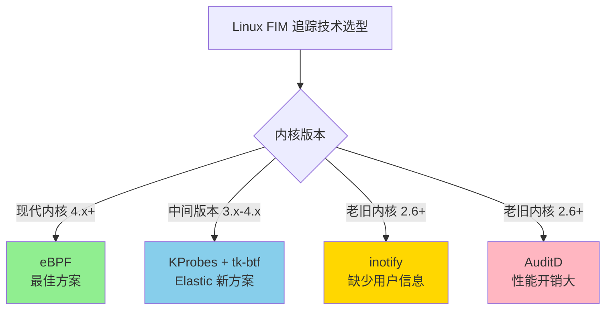
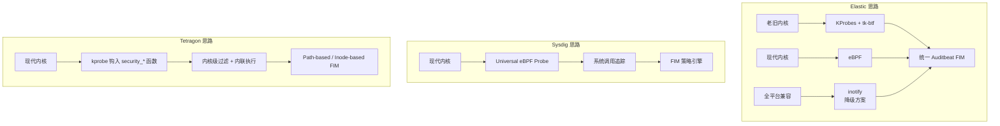
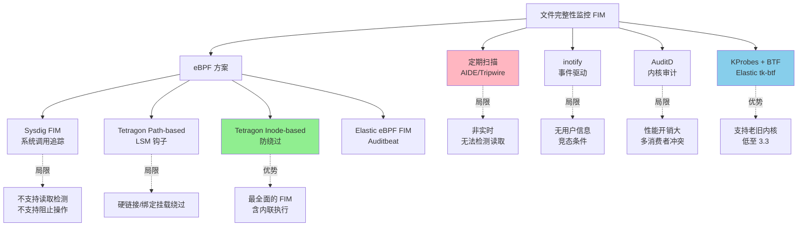

# Linux 追踪技术：文件完整性监控用例 —— 翻译与分析

> 原文链接：[Tracing Linux: A file integrity monitoring use case](https://www.elastic.co/blog/tracing-linux-file-integrity-monitoring-use-case)
> 作者：Panos Koutsovasilis
> 原文发布时间：2024 年 7 月 1 日
> 翻译与分析时间：2026 年 3 月 26 日

---

## 一、文章摘要

本文来自 Elastic 官方博客，探讨了如何在不同版本的 Linux 内核上实现文件完整性监控（FIM）。文章的核心创新在于开发了 **tk-btf** 库——一个基于 Go 语言的库，利用 BTF（BPF Type Format）元数据为**老旧内核上的 KProbes** 提供可移植性支持。最终 Elastic 在 Auditbeat 8.14 中推出了两套新的 FIM 方案：面向现代内核的 eBPF 方案和面向老旧内核的 tk-btf（KProbes）方案，与原有的 inotify 方案共同覆盖全谱系 Linux 环境。

---

## 二、核心内容翻译与分析

### 2.1 背景：Linux FIM 的必要性

保护关键任务 Linux 机器对任何企业都至关重要。复杂的网络攻击往往从低价值目标机器开始，横向移动到充满敏感信息的高价值服务器。然而，许多组织面临的挑战是其基础设施中包含**不支持现代追踪技术的老旧 Linux 内核**。

FIM 的核心价值：在文件发生变更（创建、修改或删除）时生成事件。这对于检测未授权变更至关重要——这些变更可能意味着安全漏洞、恶意软件感染或内部威胁。

**更进一步的需求**：不仅要知道"什么文件变了"，还要知道"谁改的"（用户归因），这才能提供可操作的安全洞察。

### 2.2 Linux 追踪技术全景

文章对当前 Linux FIM 可用的追踪技术进行了全面评估：

| 技术 | 适用内核版本 | 优势 | 劣势 |
|------|-------------|------|------|
| **eBPF** | 现代内核（4.x+） | 实时内核事件追踪，信息详尽 | 老旧内核不支持或功能受限 |
| **inotify** | 2.6.13+ | 广泛支持 | **不提供进程/用户信息** |
| **audit（AuditD）** | 2.6+ | 完整的审计能力 | **性能开销显著**；信息通过 socket 传输需编码/解码；多消费者规则冲突 |
| **fanotify** | 5.1+ | 功能丰富 | 仅限新内核，不适用于老旧环境 |
| **KProbes** | 广泛支持 | 性能可接受，追踪能力接近 eBPF | **缺乏稳定 API**；需要了解内核数据结构的大小和字段偏移；随内核更新容易崩溃 |



### 2.3 KProbes 的可移植性挑战

KProbes 本身存在严重的**可移植性问题**：

- 参数必须通过**架构相关的寄存器**（而非名称）引用
- 访问结构体字段需要使用**字节偏移量**
- 位字段提取需要手动构建约定

一个典型的 KProbes tracingfs 配置字符串：

```
ino=+64(+48(+24(+8(%x2)))):u64 mask_create=%x1:b1@8/32
```

这种格式**极难阅读和维护**，且随内核版本变化字段偏移可能改变。

### 2.4 BTF：跨内核可移植性的关键

**BTF（BPF Type Format）** 是一种元数据格式，封装了基于 DWARF 的调试符号信息，包括数据类型、大小、函数等，以 blob 形式存储。

BTF 最初是为 eBPF 设计的——现代 Linux 内核内嵌 BTF blob，使 eBPF 程序可以在不同内核版本间无缝运行。但关键洞察是：**BTF 元数据可以独立于 eBPF 被用户态程序解析和使用**。

| 项目 | 说明 |
|------|------|
| **ebpf (Go 库)** | 允许 Go 程序访问 BTF blob 并利用其中编码的信息 |
| **bpftool** | 可以从带调试符号的内核中提取 BTF 元数据 blob |
| **btfhub-archive** | 开源仓库，为各发行版已知内核版本生产和维护 BTF blob |

通过实验，Elastic 团队成功将这一方案追溯到了 **Linux 内核 3.3** 版本。

### 2.5 tk-btf：核心创新

**tk-btf** 是 Elastic 开发的 Go 语言库，核心思想是将 BTF 的可移植性方法应用于 KProbes：


**使用示例**（Go 代码）：

```go
tkbtf.NewSymbol("fsnotify").AddProbes(
  tkbtf.NewKProbe().AddFetchArgs(
    tkbtf.NewFetchArg("ino", "u64").FuncParamWithCustomType(
      "data", tkbtf.WrapPointer, "path", "dentry", "d_inode", "i_ino"),
    tkbtf.NewFetchArg("mask_create", tkbtf.BitFieldTypeMask(
      uint32(unix.IN_CREATE))).FuncParamWithName("mask"),
  ),
)
```

对比手动构建的 KProbe 字符串：

```
ino=+64(+48(+24(+8(%x2)))):u64 mask_create=%x1:b1@8/32
```

tk-btf 的优势一目了然：
- 用**参数名称**代替寄存器引用
- 用**结构体字段路径**代替字节偏移
- 用**类型化 API** 代替手动位操作

### 2.6 BTF 文件的体积优化

**问题**：btfhub-archive 仓库中的 BTF 文件解压后约 **54GB**——将如此庞大的数据随程序一起分发不切实际。

**解决方案**：tk-btf 增强了 BTF 文件剥离功能：
1. 丢弃不需要的 BTF 文件
2. 从保留的文件中剥离未使用的信息
3. 只保留定义的 KProbes 所必需的数据

**成果**：覆盖所有需要的 KProbe FIM 方案的全部信息仅需 **24KB**——从 54GB 到 24KB，压缩比超过 200 万倍。

### 2.7 Auditbeat 8.14 的三套 FIM 方案

最终成果集成到了 Auditbeat 8.14 中：

| 方案 | 底层技术 | 适用内核 | 用户信息 | 状态 |
|------|----------|----------|----------|------|
| **inotify** | inotify | 2.6.13+ | ❌ 不提供 | GA（默认） |
| **eBPF** | eBPF | 现代内核 | ✅ 提供 | Beta |
| **kprobes (tk-btf)** | KProbes + BTF | 老旧内核（低至 3.3） | ✅ 提供 | Beta |

当新方案达到 GA 状态后，"auto" 选项会根据目标 Linux 系统**自动选择最合适的方案**。

---

## 三、技术架构对比

### 3.1 与本系列其他 FIM 方案的对比

| 维度 | Elastic (tk-btf) | Sysdig FIM | Tetragon FIM |
|------|-------------------|------------|-------------|
| **底层技术** | KProbes + BTF / eBPF / inotify（三选一） | eBPF 系统调用追踪 | kprobe 钩入 `security_*` |
| **老旧内核支持** | ✅ 低至内核 3.3 | ❌ 需要 4.14+ | ❌ 需要现代内核 |
| **用户/进程信息** | ✅（eBPF 和 tk-btf 方案） | ✅ | ✅ |
| **读取检测** | 取决于具体实现 | ❌ | ✅ |
| **内联执行（阻止操作）** | ❌ | ❌ | ✅ |
| **Inode-based 防绕过** | ❌ | ❌ | ✅（企业版） |
| **TOCTOU 防护** | 未提及 | 未提及 | ✅ |
| **K8s/容器感知** | 有限 | ✅ | ✅ |
| **自动方案选择** | ✅ | ❌ | ❌ |
| **合规标准** | 通用安全审计 | PCI DSS, HIPAA | NIST, PCI-DSS, HIPAA, CIS, SOC |

### 3.2 技术路线对比



---

## 四、核心技术要点总结

### 4.1 Elastic 的独特贡献

1. **tk-btf 库**：将 BTF 的可移植性思想从 eBPF 扩展到 KProbes，使老旧内核也能获得富含进程/用户信息的 FIM
2. **BTF 文件极致压缩**：54GB → 24KB，使方案在实际部署中可行
3. **渐进式方案选择**：根据内核能力自动选择最佳追踪方案，兼顾安全性和兼容性

### 4.2 关键技术洞察

| 洞察 | 说明 |
|------|------|
| BTF 独立于 eBPF | BTF 元数据可被任何用户态程序解析使用，不仅限于 eBPF |
| KProbes 的稳定性可以通过 BTF 解决 | 运行时动态获取结构体偏移，避免硬编码 |
| 完美方案不存在 | 每种追踪技术都有适用场景，分层组合才是正道 |
| inotify 缺少用户信息是根本性限制 | 这也是 Tetragon 论文中批评 inotify 的同一个问题 |

---

## 五、个人思考

### 5.1 Elastic 方案的价值

Elastic 的贡献主要在**向下兼容性**——大量企业生产环境仍运行着老旧内核（RHEL 7 使用内核 3.10、CentOS 7 等），这些环境无法使用 eBPF。tk-btf 填补了这个空白，让这些环境也能获得带有用户归因的 FIM 能力。

### 5.2 与 Tetragon/Sysdig 的定位差异

三个方案的定位完全不同：

- **Tetragon**：追求**最强安全能力**（内联执行、TOCTOU 防护、Inode-based），适合安全优先的云原生环境
- **Sysdig FIM**：追求**易用性和集成性**（GUI 配置、通知渠道集成），适合已有 Sysdig 生态的环境
- **Elastic tk-btf**：追求**最大兼容性**（支持到内核 3.3），适合异构 Linux 环境的统一 FIM 需求

### 5.3 技术启示

1. **BTF 是 Linux 追踪生态的关键基础设施**——不仅服务于 eBPF，还可以赋能 KProbes 等更古老的追踪技术
2. **"渐进增强"策略值得学习**——根据运行环境的能力自动选择最佳方案，比要求用户升级内核更实际
3. **54GB → 24KB 的压缩**展示了当你精确知道自己需要什么信息时，可以实现多么极端的优化
4. **Linux FIM 领域正在快速演进**——从定期扫描到 inotify 到 eBPF 到 Inode-based，每一代方案都在解决前一代的根本性限制

---

## 六、全系列 FIM 方案总览

结合本系列所有已分析的文章，FIM 技术方案全景如下：


