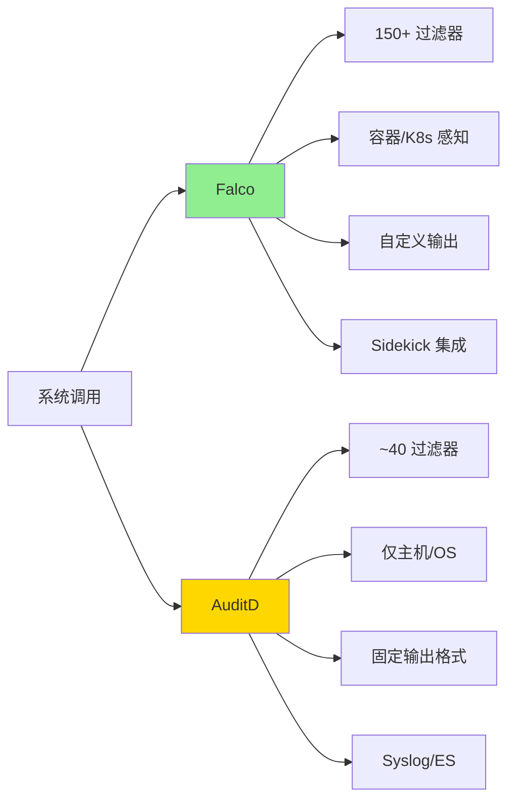

# 从 HIDS 角度对比 Falco 与 AuditD

> 原文链接：[Falco vs. AuditD from the HIDS perspective](https://www.sysdig.com/blog/falco-vs-auditd-hids)
> 作者：Kaizhe Huang
> 原文发布时间：2021 年 1 月 19 日
> 翻译与总结时间：2026 年 3 月 26 日

---

## 一、文章摘要

本文从**主机入侵检测系统（HIDS）**的角度，全面对比了 Falco 和 AuditD 两款工具在安装、检测规则、规则粒度、事件详细度、资源消耗和事件转发等方面的差异。两者都依赖系统调用进行入侵检测，但在规则创建方式、输出格式和云原生支持方面存在巨大差异。

---

## 二、核心内容翻译与总结

### 2.1 工具简介

| 工具 | 定位 | 数据来源 |
|------|------|----------|
| **AuditD** | Linux 审计系统的用户态组件，负责将审计记录写入磁盘 | 系统调用 + 文件访问 |
| **Falco** | CNCF 开源项目，容器和 Kubernetes 的运行时威胁检测 | 系统调用（通过 eBPF 或内核模块） |

**关键差异**：AuditD 缺乏容器运行时信息的丰富能力，因此对比范围限定在 HIDS。

### 2.2 总体对比表

| 维度 | Falco | AuditD |
|------|-------|--------|
| **安装** | 简单，使用 eBPF 或内核模块 | 简单，原生内置 |
| **容量管理** | 系统调用洪泛时丢弃事件 | 审计事件洪泛时丢弃事件 |
| **过滤粒度** | **150+ 过滤器** | ~40 过滤器 |
| **上下文** | 主机/OS、**容器和 Kubernetes** | 仅主机/OS |
| **事件详细度** | 好，无需解码，支持自定义输出 | 好，部分需要解码，不支持自定义输出 |
| **资源消耗** | 适中 | 适中 |
| **事件转发** | Sidekick 支持主流事件总线 | Rsyslog、Elasticsearch |

### 2.3 检测规则对比

#### Falco 规则（YAML 格式）

Falco 规则由三部分组成：
- **Rule（规则）**：定义告警触发条件和输出格式
- **Macro（宏）**：可复用的条件代码片段
- **List（列表）**：可包含在规则、宏或其他列表中的项目集合

示例——检测 Nmap 启动：
```yaml
- rule: Nmap Launched
  desc: Detect Nmap is launched
  condition: spawned_process and proc.name = nmap and container.id = host
  output: Nmap launched (user=%user.name parent=%proc.pname cmdline=%proc.cmdline)
  priority: WARNING
```

#### AuditD 规则

AuditD 规则分为**文件级规则**和**系统调用级规则**：

文件级规则示例：
```bash
auditctl -w /etc/ -p aw -k write_below_etc
```

系统调用级规则示例：
```bash
auditctl -a always,exit -F arch=b64 -S socket -F success=1 -F a0=2 -k socket_activity
```

### 2.4 规则粒度对比

#### 检测敏感文件访问——两者都能做到

Falco 和 AuditD 都能检测对 `/etc/shadow` 的读取。

#### 检测到恶意 IP 的网络连接——Falco 能做到，AuditD 不能

Falco 可以通过 `fd.sip` 过滤器精确匹配特定 IP：
```yaml
condition: outbound and fd.sip in (c2_server_ip_list)
```

AuditD 只能记录所有网络相关的系统调用事件，**无法在规则层面过滤特定 IP 地址**，需要借助 `ausearch` 工具后处理。

#### 云原生上下文——Falco 的优势

Falco 的 `container` 过滤器可以区分事件发生在主机还是容器中：
```yaml
condition: spawned_process and container and proc.name in (k8s_client_binaries)
```

AuditD 没有任何容器感知能力。

### 2.5 事件详细度对比

| 特性 | Falco | AuditD |
|------|-------|--------|
| 输出格式 | 用户可自定义输出字段 | 固定格式，不可自定义 |
| 每个规则触发的事件数 | 一条规则只产生**一条事件** | 一条规则产生**多条事件**（SYSCALL/CWD/PATH/PROCTITLE） |
| 编码问题 | 无需解码 | PROCTITLE 等字段需要通过 `ausearch` 解码 |
| 符号链接处理 | 仅显示符号链接名 | 同时显示符号链接名和实际文件名 |
| 对象信息 | 基础信息 | 更丰富（inode、GID、capabilities） |

### 2.6 资源消耗对比

在极端压力测试（无限循环执行 `touch /etc/hello`）下：

| 工具 | CPU 使用率（8 核节点）|
|------|---------------------|
| AuditD | ~15% |
| Falco | ~9% |

两者都没有丢弃事件。注意这不是全面基准测试。

### 2.7 事件转发对比

**Falco** 的事件转发方式：
- 程序输出（如 curl 发送到 Slack）
- HTTP 端点
- gRPC 服务器
- **Falco Sidekick**：支持 ElasticSearch、Kafka、GCP PubSub、InfluxDB、NATS 等主流事件总线

**AuditD** 的事件转发方式：
- 远程 Syslog（`audisp-remote` 插件）
- Elasticsearch（通过 Filebeat 的 AuditD 模块）

---

## 三、核心要点总结



1. **两者的共同基础**：都依赖系统调用进行入侵检测，都是生产就绪的工具
2. **Falco 的核心优势**：规则粒度更细（150+ vs ~40 过滤器）、容器/K8s 感知、自定义输出、丰富的事件转发生态
3. **AuditD 的独特优势**：原生内置无需安装、更丰富的对象级元数据（inode/capabilities）、UID/GID/SELinux 过滤器
4. **选型建议**：云原生环境优先选择 Falco；传统主机安全审计场景 AuditD 仍有价值

---

## 四、个人思考

1. **Falco 与 AuditD 不是完全竞争关系**——在传统主机场景下 AuditD 的原生性和零依赖优势明显，但在容器化场景下 Falco 几乎是唯一选择
2. **系统调用作为"统一真相来源"** 的理念非常重要——不管应用是什么语言编写的，系统调用都是它与内核交互的唯一方式
3. **Falco Sidekick 的事件转发生态**是实际生产中非常重要的考量，安全事件需要能够快速流转到 SIEM、告警系统等
4. 文章揭示了一个实用的故障排查/安全分析分层策略：先用 Falco 做广域检测，再用 AuditD 的详细记录做取证分析
