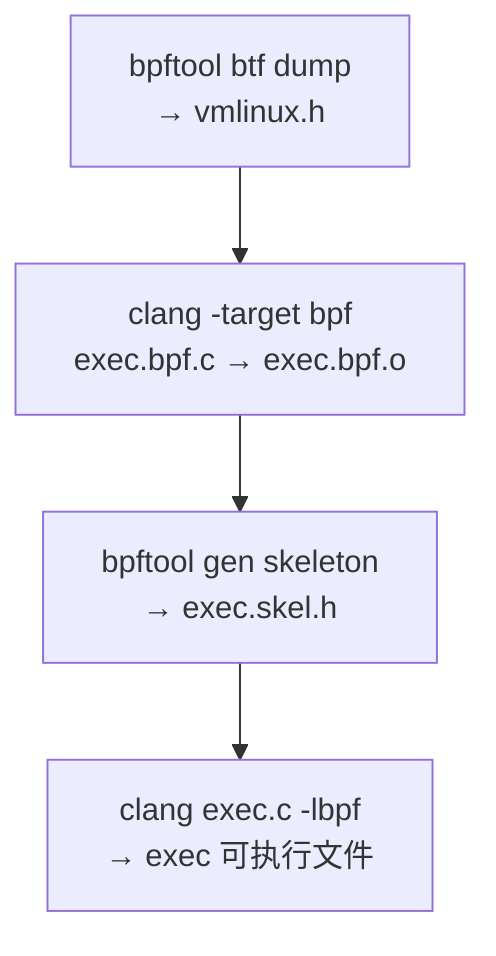
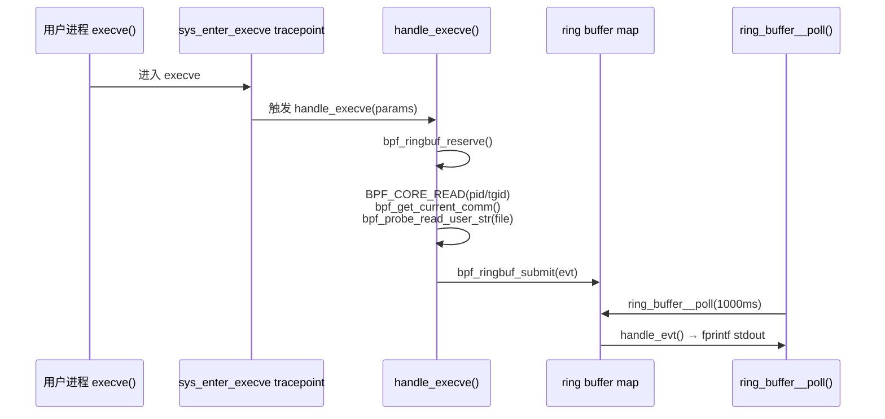

# libbpf 入门 — 用 eBPF 与 CO-RE 追踪 execve 系统调用 — 翻译与总结

> 原文链接：[Getting Started with libbpf - Tracking execve Syscalls with eBPF and CO-RE](https://cylab.be/blog/406/getting-started-with-libbpf-tracking-execve-syscalls-with-ebpf-and-co-re)  
> 作者：Zacharia Mansouri（cylab.be，比利时皇家军事学院 Cyber Defence Lab）  
> 发布日期：2025 年 4 月 9 日  
> 翻译与总结时间：2026 年 6 月 11 日

---

## 一、文章摘要

本文是一篇 **libbpf + CO-RE** 入门教程，手把手教你构建一个最小可用的 eBPF 程序，挂载到 `execve` 系统调用的 tracepoint 上，实时观察 Linux 系统上的进程启动事件。

文章分三个阶段递进：

1. **最小版本**：内核态 `bpf_printk` 打印日志，用户态 skeleton 加载/附着/保活  
2. **CO-RE 可移植构建**：静态链接 `libbpf.a`，使二进制在不同内核版本间更易移植  
3. **Ring Buffer 结构化输出**：通过 ring buffer 将 PID、TGID、comm、filename 等结构化事件从内核传到用户态

全程无需编写内核模块，依赖 Clang/LLVM、bpftool、libbpf 和 BTF（`/sys/kernel/btf/vmlinux`）。

---

## 二、eBPF 背景（原文引言）

eBPF（extended Berkeley Packet Filter）允许在用户态编写程序并加载到内核中运行，从而在不修改内核源码的前提下，对系统调用、网络包、性能指标等进行追踪与监控。

典型工作流：

- 用户态通过 `bpf()` 等系统调用将 eBPF 程序加载进内核  
- 程序挂载到 tracepoint、kprobe、uprobe 等 hook 点  
- 内核态 eBPF VM（基于 LLVM）执行程序，采集数据或触发动作  

本文选择 **`sys_enter_execve` tracepoint**：每当有新进程通过 `execve` 启动时触发，适用于审计与安全监控场景。

```mermaid
graph LR
    subgraph 用户态
        LOADER["exec.c<br/>libbpf skeleton"]
        RB_POLL["ring_buffer__poll()"]
    end

    subgraph 内核态
        TP["tracepoint:<br/>sys_enter_execve"]
        BPF["exec.bpf.c<br/>handle_execve()"]
        MAP["BPF_MAP_TYPE_RINGBUF"]
        TP --> BPF
        BPF --> MAP
    end

    LOADER -->|bpf() 加载/附着| BPF
    MAP -->|结构化事件| RB_POLL
    RB_POLL -->|stdout| OUT["[TGID PID Comm File]"]
```

---

## 三、依赖环境

### 3.1 基本要求

libbpf 官方要求 **Clang/LLVM 10+**。以下发行版默认满足：

- Fedora 32+
- Ubuntu 20.04+
- Arch Linux
- Debian 11（LLVM 11）
- Alpine 3.13+

### 3.2 Ubuntu 示例安装

```bash
sudo apt update
sudo apt install make
sudo apt install linux-tools-common linux-tools-generic linux-tools-$(uname -r)
sudo apt install clang llvm
sudo apt install libbpf-dev
sudo apt install libelf-dev build-essential
```

---

## 四、最小 eBPF 程序（bpf_printk 版）

### 4.1 内核态 `exec.bpf.c`

```c
#include "vmlinux.h"
#include <bpf/bpf_helpers.h>

SEC("tracepoint/syscalls/sys_enter_execve")
int handle_execve(void *ctx) {
  bpf_printk("Exec called!\n");
  return 0;
}

char LICENSE[] SEC("license") = "GPL";
```

要点：

- 挂载点：`tracepoint/syscalls/sys_enter_execve`  
- `bpf_printk` 输出写入 `/sys/kernel/debug/tracing/trace_pipe`  
- **GPL license 段为强制要求**，否则无法编译加载  

### 4.2 用户态 `exec.c`

```c
#include "exec.skel.h"

int main(void) {
  struct exec *skel = exec__open();
  exec__load(skel);
  exec__attach(skel);

  for (;;) {}
  return 0;
}
```

skeleton 生成的三个核心 API：

| 函数 | 作用 |
|------|------|
| `exec__open` | 解析 eBPF 对象文件（程序、maps、全局变量） |
| `exec__load` | 实例化 maps、解析重定位、加载并验证 eBPF 程序 |
| `exec__attach` | 将程序附着到 tracepoint 等 hook 点 |

无限循环用于保持进程存活，避免程序加载后立即退出。

---

## 五、构建流程

### 5.1 整体构建链路



### 5.2 各步骤命令

**1. 生成 `vmlinux.h`（BTF → C 类型定义）**

```bash
bpftool btf dump file /sys/kernel/btf/vmlinux format c > vmlinux.h
```

**2. 编译 eBPF 程序**

```bash
clang -g -O2 -target bpf -c exec.bpf.c -o exec.bpf.o
```

**3. 生成 skeleton 头文件**

```bash
bpftool gen skeleton exec.bpf.o name exec > exec.skel.h
rm exec.bpf.o
```

`name exec` 决定 skeleton API 前缀：`exec__open` / `exec__load` / `exec__attach`。

**4. 编译用户态 loader**

```bash
clang exec.c -lbpf -o exec
```

### 5.3 Makefile 示例

```makefile
exec: skel
	clang exec.c -lbpf -o exec

vmlinux:
	bpftool btf dump file /sys/kernel/btf/vmlinux format c > vmlinux.h

bpf: vmlinux
	clang -g -O2 -target bpf -c exec.bpf.c -o exec.bpf.o

skel: bpf
	bpftool gen skeleton exec.bpf.o name exec > exec.skel.h
	rm exec.bpf.o

clean:
	- rm -rf *.o *.skel.h vmlinux.h exec
```

### 5.4 常见编译警告

```
libbpf: elf: skipping unrecognized data section(4) .rodata.str1.1
```

无害，可忽略，不影响程序运行。

---

## 六、运行与验证

```bash
sudo ./exec
```

- 需要 **root 权限** 才能加载 eBPF 程序  
- 终端 2：`sudo cat /sys/kernel/debug/tracing/trace_pipe` 查看 `bpf_printk` 输出  
- 终端 3：执行 `ls` 等命令，终端 2 应出现 `Exec called!`  

若缺少 `libbpf-dev`：

```
./exec: error while loading shared libraries: libbpf.so.0: cannot open shared object file
```

---

## 七、CO-RE 可移植构建

CO-RE（Compile Once, Run Everywhere）借助 BTF 与 `BPF_CORE_READ()` 等机制，使 eBPF 程序在不同内核版本上**无需重新编译**即可运行（目标内核需启用 BTF）。

### 7.1 静态链接 libbpf

```bash
git clone https://github.com/libbpf/libbpf
mkdir -p libbpf/build
make -C libbpf/src BUILD_DIR=../build OBJDIR=../build
```

### 7.2 修改 Makefile 的 `exec` 目标

```makefile
exec: skel
	clang -g -O2 -Wall -I . -c exec.c -o exec.o
	clang -Wall -O2 -g exec.o libbpf/build/libbpf.a -lelf -lz -o exec
```

静态链接 `libbpf.a` + `-lelf -lz`，减少运行时对系统 `libbpf.so` 的依赖，提升跨机器部署的可移植性。

### 7.3 跨内核版本测试

```bash
sudo apt search linux-image
sudo apt install linux-image-6.8.0-50-generic linux-headers-6.8.0-50-generic
# 安装后需重启；建议在 VM 中操作
```

---

## 八、Ring Buffer 版（结构化事件）

`bpf_printk` 适合调试，但所有程序共享同一 `trace_pipe`，且只能输出字符串。生产场景应使用 **ring buffer** 在内核与用户态之间高效传递结构化数据。

### 8.1 共享数据结构 `exec.h`

```c
#ifndef __EXEC_H__
#define __EXEC_H__

struct exec_evt {
  pid_t pid;
  pid_t tgid;
  char comm[32];
  char file[32];
};

#endif
```

### 8.2 内核态完整逻辑

关键改动：

1. 定义 `BPF_MAP_TYPE_RINGBUF` map（256 KiB）  
2. 用 `struct exec_params_t` 对齐 tracepoint 参数布局  
3. 通过 `BPF_CORE_READ` 读取 `task_struct` 字段（CO-RE）  
4. 通过 `bpf_probe_read_user_str` 安全读取用户态 filename  

**tracepoint 参数布局**（来自 `/sys/kernel/debug/tracing/events/syscalls/sys_enter_execve/format`）：

| 字段 | offset | size |
|------|--------|------|
| common_type / flags / preempt_count / pid | 0–7 | — |
| `__syscall_nr` | 8 | 4 |
| **`filename`** | **16** | 8 |
| `argv` | 24 | 8 |
| `envp` | 32 | 8 |

因此 `exec_params_t` 用两个 `u64` 占位（128 bit = 16 byte），再跟 `char *file`：

```c
struct exec_params_t {
  u64 __unused_64_bits_0;
  u64 __unused_64_bits_1;
  char *file;
};
```

**事件发送流程：**



核心内核代码片段：

```c
struct {
  __uint(type, BPF_MAP_TYPE_RINGBUF);
  __uint(max_entries, 256 * 1024);
} rb SEC(".maps");

SEC("tracepoint/syscalls/sys_enter_execve")
int handle_execve(struct exec_params_t *params) {
  struct task_struct *task = (struct task_struct*)bpf_get_current_task();
  struct exec_evt *evt;

  evt = bpf_ringbuf_reserve(&rb, sizeof(*evt), 0);
  if (!evt) {
    bpf_printk("Ring Buffer not reserved\n");
    return 1;
  }

  evt->pid = BPF_CORE_READ(task, pid);
  evt->tgid = BPF_CORE_READ(task, tgid);
  bpf_get_current_comm(&evt->comm, sizeof(evt->comm));
  bpf_probe_read_user_str(&evt->file, sizeof(evt->file), params->file);
  bpf_ringbuf_submit(evt, 0);
  return 0;
}
```

### 8.3 用户态完整逻辑

```c
static int handle_evt(void *ctx, void *data, size_t sz) {
  const struct exec_evt *evt = data;
  fprintf(stdout,
    "  [TGID: %-5d] [PID: %-5d] [Comm: %-15s] [File: %-40s]\n",
    evt->tgid, evt->pid, evt->comm, evt->file);
  return 0;
}

int main(void) {
  struct exec *skel = exec__open();
  exec__load(skel);
  exec__attach(skel);

  struct ring_buffer *rb =
    ring_buffer__new(bpf_map__fd(skel->maps.rb), handle_evt, NULL, NULL);

  for (;;) {
    ring_buffer__poll(rb, 1000);
  }
  return 0;
}
```

输出示例格式：

```
[TGID: 12345] [PID: 12345] [Comm: bash           ] [File: /usr/bin/ls                             ]
```

---

## 九、技术评价

### 9.1 优点

| 方面 | 说明 |
|------|------|
| **入门友好** | 从 10 行 bpf_printk 到 ring buffer，递进清晰 |
| **现代工具链** | libbpf skeleton + bpftool，替代老旧的 BCC 单文件脚本风格 |
| **CO-RE 实践** | 演示 `BPF_CORE_READ` 与 tracepoint 参数对齐，是可移植 eBPF 的基础模式 |
| **无内核模块** | 纯用户态 loader + 内核态 BPF，部署简单 |
| **结构化输出** | ring buffer 解耦内核采集与用户态展示，便于接入 SIEM/日志管道 |

### 9.2 局限与注意点

| 方面 | 说明 |
|------|------|
| **仅 enter 侧** | 只 hook `sys_enter_execve`，不捕获 exit 返回值或失败路径 |
| **filename 截断** | `file[32]` 可能截断长路径 |
| **BTF 依赖** | CO-RE 要求目标内核提供 BTF（`/sys/kernel/btf/vmlinux`） |
| **权限要求** | 加载 BPF 通常需 CAP_BPF / root |
| **filename 字段** | 仅记录 pathname，不含 argv/envp；完整命令行需额外读取 `params->argv` |
| **article 代码小问题** | 原文 `struct exec_evt *evt = {0};` 写法不规范，应为 `struct exec_evt *evt;` 或 `= NULL` |

### 9.3 与相关生态的关系

- 同站姊妹文：[A Byte-wise Understanding of eBPF CO-RE](https://cylab.be/blog/) — CO-RE 原理深入  
- 同站姊妹文：portable eBPF development 指南 — 静态链接依赖 + 自动化内核测试  
- 若偏好 Python/BCC 快速原型，原文也指向 BCC 入门文章  

---

## 十、结论

本文展示了用 **libbpf + tracepoint + ring buffer + CO-RE** 构建进程执行监控的最小完整路径：

1. **BTF → vmlinux.h → clang -target bpf → bpftool skeleton → 用户态 loader**  
2. **CO-RE 静态链接 libbpf** 提升跨内核可移植性  
3. **ring buffer** 替代 `bpf_printk`，实现结构化、可扩展的内核→用户态数据通道  

这是编写生产级 eBPF 安全/审计工具（FIM、HIDS、exec 监控）的标准起点。在此基础上可扩展：过滤特定 UID、记录完整 argv、关联 cgroup/容器、写入 perf event 或导出 Prometheus 指标等。

---

## 参考链接

- 原文：[Getting Started with libbpf - Tracking execve Syscalls with eBPF and CO-RE](https://cylab.be/blog/406/getting-started-with-libbpf-tracking-execve-syscalls-with-ebpf-and-co-re)
- [libbpf GitHub](https://github.com/libbpf/libbpf)
- [Simple eBPF CO-RE application (Sartura)](https://www.sartura.hr/blog/simple-ebpf-core-application/)
- [BPF Skeleton (liuhangbin)](https://liuhangbin.netlify.app/post/bpf-skeleton/)
- [bpftool 使用 (thegraynode)](https://thegraynode.io/posts/bpf_bpftool/)
- YouTube：[eBPF 相关演讲](https://www.youtube.com/watch?v=-IGReOYExqo)
