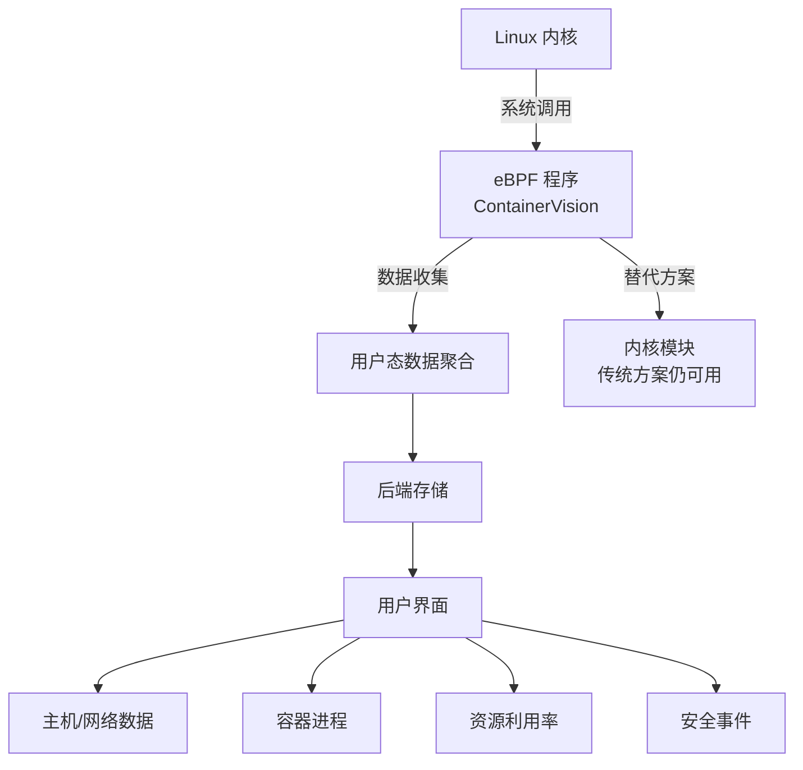

# 使用 eBPF + Sysdig 实现容器可观测性

> 原文链接：[Introducing container observability with eBPF + Sysdig](https://www.sysdig.com/blog/introducing-container-observability-with-ebpf-and-sysdig)
> 作者：Eric Carter
> 原文发布时间：2019 年 2 月 27 日
> 翻译与总结时间：2026 年 3 月 26 日

---

## 一、文章摘要

本文是 Sysdig 官方宣布将 eBPF 追踪能力集成到其监控、安全和取证解决方案的公告文章。文章从商业和产品角度阐述了 Sysdig 采用 eBPF 扩展容器可观测性的动机、eBPF 的历史背景，以及这一技术选型对容器化环境的意义。

---

## 二、核心内容翻译与总结

### 2.1 为什么选择 eBPF 实现可观测性？

Sysdig 采用 eBPF 作为替代性追踪模型的最大动机是**容器优化操作系统**的兴起：

| 容器优化 OS | 厂商 | 特点 |
|-------------|------|------|
| Container-Optimized OS (COS) | Google Cloud Platform | 不可变基础设施，预装容器运行时和 K8s 组件 |
| Project Atomic Host | Red Hat | 最小化足迹，增强运行安全性 |

这些操作系统**完全禁止加载内核模块**，因此传统的 Sysdig 内核模块方案无法部署。

**eBPF 是解决方案**：因为 eBPF 是 Linux 原生的一部分，提供了一个无需内核模块即可从系统调用中提取指标和数据的原生入口点。

### 2.2 eBPF 简史

| 时间 | 里程碑 |
|------|--------|
| 1992 年 | Steve McCanne 和 Van Jacobson 在 Lawrence Berkeley 实验室开发 BPF，用于 Unix 网络包过滤 |
| 2014 年 | eBPF 随 Linux 内核 3.18 版本首次引入 |
| 至今 | eBPF 扩展到远超包过滤的场景：追踪、性能分析、调试、安全等 |

业界评价：
- **Brendan Gregg**（Netflix 高级性能架构师）：eBPF 拥有"超能力"
- **David S. Miller**（活跃 eBPF 贡献者）：2019 年 eBPF 将实现"世界统治"
- **NCC Group 安全顾问**：eBPF 内核追踪 = "解锁 Linux 上帝模式"

### 2.3 Sysdig 如何利用 eBPF

Sysdig 工程化的 eBPF 程序被集成到：

- 开源 **sysdig** 工具
- **Falco**（CNCF 运行时安全项目）
- 商业产品 **Sysdig Monitor** 和 **Sysdig Secure** 的统一 Agent

这些 eBPF 程序是 **ContainerVision**（Sysdig 的追踪方法论）的一部分，利用内核系统调用提供容器洞察：

**重要说明**：传统内核模块方案并未弃用，它仍然是默认的追踪方式。eBPF 是一个扩展选项，使 Sysdig 能覆盖更多的部署场景——"不落下任何一片云"。

### 2.4 用户能获得什么？

无论使用哪种追踪模型（eBPF 或内核模块），Sysdig 都提供对容器和 Kubernetes 基础设施的深度可见性：

- 性能监控
- 安全检测
- 漏洞管理
- 故障排查
- 取证分析

---

## 三、核心要点总结

1. **eBPF 是 Sysdig 应对不可变基础设施挑战的关键技术选型**——容器优化 OS 禁止内核模块，eBPF 作为 Linux 原生能力不受此限
2. **系统调用是数据来源**——与日志同样丰富，但提供实时能力
3. **双轨制追踪策略**——eBPF 和内核模块并存，根据部署环境自动选择
4. **Sysdig 向上游贡献**——不仅使用 eBPF，还改进了 eBPF 本身

---

## 四、个人思考

这篇文章虽然偏商业宣传，但揭示了一个重要的行业趋势：**不可变基础设施正在重塑安全监控工具的技术选型**。当 GKE 的 COS 等容器优化 OS 完全禁止内核模块时，依赖内核模块的安全工具将面临生存危机。eBPF 因其"Linux 原生"的身份，成为了这一转型中的唯一可行路径。
