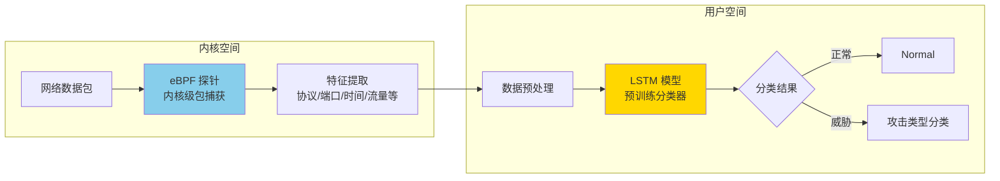

# Karma IDS：基于 eBPF 和 LSTM 的入侵检测系统

> 原文链接：[Karma IDS: An Intrusion Detection System using eBPF and LSTM](https://dev.to/pree2111/karma-ids-497p)
> 作者：Team Marauders（Krutika Gundecha, Bhargavi Sudarsan, Vijayapreethi S R, Destiny Sharma）
> 原文发布时间：2024 年 4 月 20 日
> 项目源码：[GitHub](https://github.com/pree2111/Intrusion-Detection-System-and-Classifier)
> 翻译与分析时间：2026 年 3 月 26 日

---

## 一、文章摘要

Karma IDS 是一个在 GDSC IIIT Kalyani Rebase01 黑客马拉松中开发的项目，将 **eBPF 内核级数据包捕获**与 **LSTM（长短期记忆）神经网络**相结合，构建了一个网络入侵检测与分类系统。eBPF 负责在内核层以低开销方式捕获网络数据包特征，LSTM 模型负责对提取的特征进行威胁分类。

---

## 二、核心内容翻译与分析

### 2.1 项目动机

传统网络入侵检测系统（NIDS）存在的问题：
- 使用用户空间数据包追踪器，**性能开销大**
- 面对日益增长的网络流量，**响应延迟**，容易遗漏威胁
- 检测速度跟不上现代网络攻击的速度

解决思路：**用内核级 eBPF 替代用户空间包捕获，降低开销并提前检测；用 LSTM 深度学习模型替代规则匹配，提升分类准确率。**

### 2.2 技术架构

### 2.3 eBPF 部分

#### 工作原理

eBPF 在 Linux 内核中运行沙箱化程序，以低开销、非侵入的方式在网络栈的特定位置捕获和过滤数据包。

与传统方法的对比：

| 维度 | 传统用户空间捕获 | eBPF 内核级捕获 |
|------|----------------|----------------|
| 性能开销 | 高（数据需从内核拷贝到用户空间） | 低（内核中直接提取） |
| 捕获粒度 | 包级别 | 包级别 + 内核上下文 |
| 对系统资源的影响 | 显著 | 最小 |
| 检测时机 | 数据到达用户空间后 | 数据在内核栈中时 |

#### 技术栈

- **Python**：eBPF 基础代码
- **BCC（BPF Compiler Collection）**：在 Python 中嵌入 C 编写的 BPF 代码
- **C**：BPF 程序本身
- **Bash**：脚本辅助

#### 提取的特征

从数据包中提取的特征包括连接描述特征（协议、端口等）、时间特征（数据包到达时间）、流特征（事务协议等）。

### 2.4 LSTM 部分

#### 模型选择

LSTM（长短期记忆网络）是一种特殊的 RNN（循环神经网络），具备以下优势：
- 能够存储长期记忆
- 建立数据中的长程依赖关系和模式
- 适合处理序列化的网络流量数据

#### 数据集

使用开源的 **UNSW-NB15 数据集**，该数据集包含网络入侵数据：
- 基础特征：连接描述特征
- 时间特征：数据包到达时间
- 流特征：事务协议等
- 经过裁剪，仅保留与模型相关的特征

#### 损失函数优化

| 损失函数 | 准确率 | 问题 |
|---------|--------|------|
| **交叉熵损失（Cross-Entropy）** | 较低（0.x 范围） | 数据集中某些攻击类别样本量极少，导致严重的类别不平衡 |
| **Focal Loss** | 显著提升 | 对低样本类别赋予更高权重，平衡类别分布 |

Focal Loss 的核心思想：对分类困难、样本稀少的类别给予额外关注权重，避免模型被多数类主导。

#### 技术栈

- **Python**：模型构建
- **PyTorch**：神经网络框架
- **NumPy**：数组运算
- **Pandas**：数据集读取和处理
- **Scikit-Learn**：数据集划分和预处理

### 2.5 最终集成

eBPF 捕获的数据包特征经过预处理后，输入到预训练的 LSTM 模型中进行分类，实时判定网络流量是否构成威胁，并输出具体的攻击类型。

### 2.6 遇到的挑战

| 领域 | 挑战 |
|------|------|
| **eBPF** | 低层级编程学习曲线陡峭；探测点选择问题；BPF 沙箱限制导致某些操作不可行；C 程序的位域（bit-field）错误需要变通解决；内核程序极难调试 |
| **集成** | 如何安全地将 eBPF 数据传递给 AI 模型；程序运行时序和运行时长的编排 |
| **LSTM** | 数据集类别严重不平衡；损失函数选择和调优；大量维度错误和运行时错误 |

---

## 三、技术评析

### 3.1 创新点

1. **eBPF + AI 的结合思路**——将内核级高效数据采集与深度学习分类结合，是一个有前景的方向
2. **Focal Loss 解决类别不平衡**——在网络安全数据集中，攻击样本通常远少于正常流量，Focal Loss 是合理的选择

### 3.2 局限性分析

| 局限 | 说明 |
|------|------|
| **黑客马拉松项目** | 更多是概念验证（PoC），距离生产级系统有较大距离 |
| **特征提取有限** | 仅从数据包头部提取基础特征，未涉及深度包检测（DPI）|
| **离线训练 + 在线推理** | 模型使用固定数据集训练，面对新型攻击需要重新训练 |
| **未涉及加密流量** | 现代网络流量大部分为 TLS 加密，仅靠包头特征可能不足（参见 Pixie 系列 Part 3 的 SSL 追踪方案）|
| **BCC 框架** | 使用 BCC 而非更现代的 libbpf/CO-RE，依赖运行时编译，部署复杂度较高 |
| **缺少对抗性评估** | 未评估模型对对抗样本（adversarial examples）的鲁棒性 |

### 3.3 与本系列的关联

| 维度 | Karma IDS | 本系列 FIM 方案 | 本系列 eBPF 后门检测 |
|------|----------|---------------|---------------------|
| **eBPF 用途** | 网络包捕获 | 文件系统 syscall 监控 | 检测恶意 eBPF 加载 |
| **探针类型** | 网络栈钩子 | Kprobe/LSM/Tracepoint | bpf() syscall 监控 |
| **分析方式** | LSTM 深度学习 | 规则引擎匹配 | 规则 + 静态分析 |
| **检测目标** | 网络入侵 | 文件篡改 | eBPF 后门/Rootkit |

**互补关系**：
- FIM 系列关注**文件系统层**的安全监控
- Pixie 系列关注**网络层**的流量追踪
- Karma IDS 尝试将**网络层 eBPF 采集 + AI 分类**结合
- eBPF 后门检测关注**eBPF 自身**被滥用的风险

这四个维度共同构成了 eBPF 安全应用的完整图景。

### 3.4 eBPF + AI/ML 在安全领域的发展方向

Karma IDS 虽然是黑客马拉松级别的项目，但它指向了一个值得关注的趋势：

| 方向 | 说明 | 代表项目/研究 |
|------|------|-------------|
| eBPF 采集 + ML 分类 | 内核高效采集 + 用户空间模型推理 | Karma IDS、学术研究 |
| eBPF 采集 + 规则引擎 | 内核高效采集 + 用户空间规则匹配 | Falco、Datadog FIM |
| eBPF 内核态预过滤 + ML | 内核粗筛 + 用户空间 ML 精筛 | 研究阶段 |
| eBPF 内核态 ML 推理 | 直接在内核中运行 ML 模型 | 实验性研究（受限于 eBPF 计算限制） |

Datadog 的 Approver/Discarder 机制可以看作是"eBPF 内核态预过滤"的工程实践，如果未来将 ML 模型引入 Agent 侧规则评估，就形成了一个完整的 "eBPF + AI" 安全检测管线。

---

## 四、总结

Karma IDS 是一个**概念验证级别的 eBPF + LSTM 入侵检测项目**，其核心价值在于：

1. **展示了 eBPF + AI 在安全检测中的结合可能性**——内核级低开销数据采集 + 深度学习威胁分类
2. **Focal Loss 解决类别不平衡**——对安全数据集中攻击样本稀少的问题给出了实用方案
3. **揭示了实际工程挑战**——eBPF 沙箱限制、内核调试困难、数据管线编排等

作为学习性项目，它为理解"eBPF 在安全领域的应用不仅限于规则匹配"提供了一个有价值的视角。但要走向生产环境，还需要解决加密流量处理、模型在线更新、对抗鲁棒性等关键问题。
