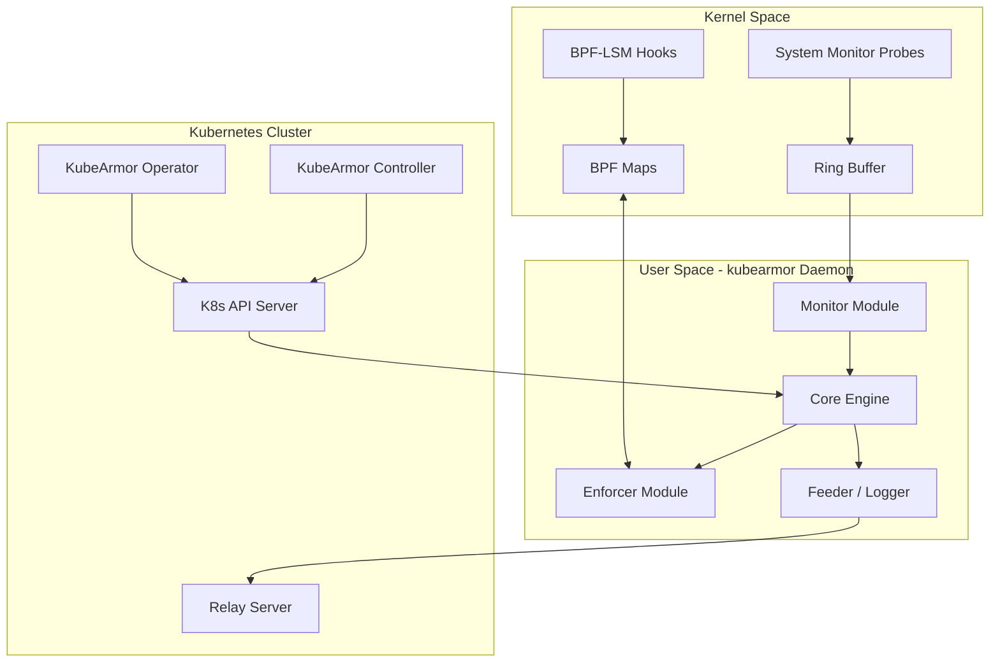
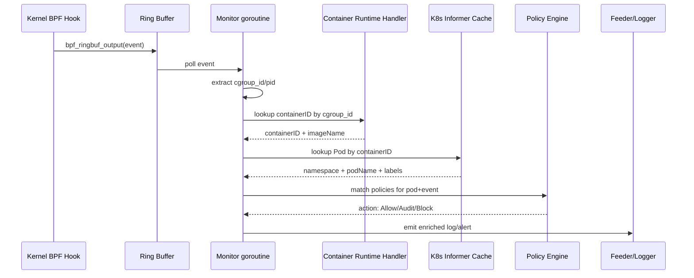

# KubeArmor 全生态源码级分析：提示词模版

> 创建时间：2026 年 5 月 25 日
> 适用场景：使用 Cursor / Claude Code 对 KubeArmor 全生态（daemon + operator + controller + relay + CLI + init）进行源码级深度分析，最终交付一篇万字级中文专业 Markdown 文档
> 项目仓库：<https://github.com/kubearmor/KubeArmor>
> 参考版式：`0x00` / `0x01` 十六进制章节风格 + 强制源码引用 + Mermaid + draw.io 节点清单

---

## 一、使用说明

1. **先 clone 全生态代码**（至少主仓必须本地可读）：

   ```bash
   git clone https://github.com/kubearmor/KubeArmor.git
   # 以下按需 clone（主仓 pkg/ 下可能已包含部分）
   git clone https://github.com/kubearmor/kubearmor-operator.git
   git clone https://github.com/kubearmor/kubearmor-controller.git
   git clone https://github.com/kubearmor/kubearmor-relay-server.git
   git clone https://github.com/kubearmor/kubearmor-client.git
   ```

2. 在 Cursor 中打开主仓根目录，将 **第二节「主提示词」** 整段作为用户提示发送
3. 如需深挖某个子系统，将 **第三节「可选附加模块」** 中对应段落追加到提示词末尾
4. 如需控制篇幅、增加英文摘要或 draw.io 图，将 **第四节「可选参数」** 中对应段落拼接到末尾
5. 使用 `@` 引用本地文件可加速 Cursor 定位，例如 `@KubeArmor/BPF/system_monitor.c`
6. 交叉验证：对模型给出的 Hook 点分析，可用 `grep -r "SEC(" KubeArmor/BPF/` 命令验证

---

## 二、主提示词（可复制）

````markdown
# 角色与目标

你是一名资深技术作者兼系统工程师，同时精通以下领域：
- **eBPF / BPF-LSM / Linux 内核安全模块（AppArmor / SELinux）**
- **Go 语言后端开发（cilium/ebpf 库、gRPC、Kubernetes client-go）**
- **Kubernetes Operator / CRD / DaemonSet / Admission Webhook 开发**
- **容器运行时（containerd / CRI-O / Docker）与 cgroup v1/v2**

请基于本地 clone 的 KubeArmor 全生态源码以及 GitHub 公开仓库，撰写一篇 **专业中文技术深度分析文档**。
读者为具备 Linux 内核、eBPF、Kubernetes 背景的工程师。

# 分析范围（必须在前言中显式复述）

请在 `0x00 前言` 中列出以下仓库及你锁定的分析版本（tag / commit SHA），贯穿全文引用时均使用该版本的永久链接：

| 仓库 | 作用 | 关键目录 |
|------|------|----------|
| `kubearmor/KubeArmor`（主仓） | 内核 C + 用户态 Go daemon + Operator + 部署 yaml | `KubeArmor/BPF/`、`KubeArmor/core/`、`KubeArmor/enforcer/`、`KubeArmor/monitor/`、`KubeArmor/feeder/`、`KubeArmor/log/`、`pkg/KubeArmorOperator/`、`deployments/` |
| `kubearmor/kubearmor-operator` | Operator（若已合并到主仓 `pkg/KubeArmorOperator/` 则分析合并后的代码，并注明判定依据） | `operator/`、`controllers/` |
| `kubearmor/kubearmor-controller` | Admission Webhook + 策略验证 | `controllers/`、`webhooks/` |
| `kubearmor/kubearmor-relay-server` | 事件聚合与转发 gRPC 服务 | `relay-server/`、`server/` |
| `kubearmor/kubearmor-client` | karmor CLI 工具 | `cmd/`、`client/` |
| 主仓内 InitContainer 相关 | BPF 文件系统挂载 / AppArmor profile 预热 / LSM 能力探测 | `KubeArmor/build/`、`KubeArmor/templates/`、`deployments/` 中 initContainers 定义 |

**判定规则**：若 `kubearmor-operator` 独立仓库已废弃或内容与主仓 `pkg/KubeArmorOperator/` 重复，只分析主仓代码，并在正文中标注判定证据。

# 写作结构与版式（必须遵守）

- 主标题：**「KubeArmor 源码深度分析：全生态架构、eBPF Hook、容器富化与 K8s 部署实现」**
- `## 0x00 前言`：分析范围（版本锁定）、阅读门槛、用 **3～8 条「先读结论」**（必须是可验收的事实，不是空话）
- 正文使用 `## 0x01 …`、`## 0x02 …` 十六进制风格小节
- 适当使用 **Markdown 表格**（Hook 类型、Map 类型、CRD 字段、部署组件等）
- **核心流程至少 4 张 Mermaid 图**：整体架构图、部署拓扑图、Hook 数据流图、容器富化时序图
- 文末 `## 0xFF 参考与链接`：所有引用永久链接清单 + draw.io 架构图节点/连线清单

# 技术深度要求（硬性）

## 引用规则（必须同时满足两条）

1. **本地路径引用**：`KubeArmor/BPF/system_monitor.c:L123-L145` 形式
2. **GitHub 永久链接**：`https://github.com/kubearmor/KubeArmor/blob/<commit-sha>/KubeArmor/BPF/system_monitor.c#L123-L145` 形式

- 核心 `struct` / 核心函数 / 核心 BPF 程序段：**原型 + 字段语义 + 生命周期 + 行级注释**
- 禁止「猜测式」分析。未读到的代码须显式标注：**「未在本次分析范围内验证」**

## Mermaid 图规范

- 节点 ID 使用 camelCase，**禁止空格**
- 子图使用 `subgraph id [Label]` 格式
- 图中标注关键函数/文件模块名（不必贴完整 URL）
- 避免使用 `end` 作为节点 ID

# 正文强制章节清单

请严格按以下章节顺序和内容要求撰写。每个章节的子问题是 **必答项**，不可跳过。

---

## 0x00 前言

- 分析版本锁定（每个仓库的 tag 或 commit SHA）
- 本文 **包含** 什么（全生态 6 个仓库）
- 本文 **不包含** 什么（如 KubeArmor 的 GUI / 商业版 AccuKnox）
- 读者前置知识（eBPF 基础、K8s Operator 概念、LSM 框架）
- **3～8 条「先读结论」**（例如："KubeArmor 的核心 enforcer 支持 BPF-LSM / AppArmor / SELinux 三种后端，运行时自动探测并降级"）

---

## 0x01 项目目的与核心能力亮点

回答以下问题（每条结论带源码引用）：

1. KubeArmor 的核心定位是什么？与 Falco / Tetragon / Tracee 的本质区别在哪？
2. 支持哪些核心功能？（进程控制、文件访问控制、网络策略、Capabilities 限制等）
3. 亮点有哪些？请逐条列出并解释：
   - **白名单/黑名单双语义**（Allow / Audit / Block）
   - **LSM 多后端自动探测**（BPF-LSM → AppArmor → SELinux 的降级链）
   - **KubeArmorPolicy CRD 声明式安全策略**
   - **Visibility（可视化/审计）与 Enforcement（执行/阻断）双引擎**
   - **容器/Pod 粒度策略绑定**（通过 label selector）
   - **主机级防护**（KubeArmorHostPolicy）

---

## 0x02 代码实现篇 — Hook 全景

### 0x02.1 Hook 类型清单表

以表格形式列出 **所有** eBPF Hook 点：

| Hook 类型 | 具体挂钩函数/Tracepoint | 所在源文件 | 触发条件 | 捕获数据 | 作用说明 |
|-----------|------------------------|-----------|---------|---------|---------|

Hook 类型覆盖（但不限于）：
- kprobe / kretprobe
- tracepoint / raw_tracepoint
- BPF-LSM（`security_file_open`、`security_bprm_check`、`security_path_*`、`security_socket_*` 等）
- fentry / fexit（如果有）
- cgroup（如果有）

用 `grep -r "SEC(" KubeArmor/BPF/` 交叉验证，不要遗漏。

### 0x02.2 内核态 Hook 间的数据关联

回答以下问题（必须对照 BPF C 源码逐一分析）：

1. 哪些 Hook 是 **配对使用** 的（entry + return）？共同完成什么功能？
2. 哪些 Hook **共享同一个 BPF Map**？Map 名称、类型、Key/Value 定义？
3. 是否存在 **tail call 链**（`BPF_MAP_TYPE_PROG_ARRAY`）？调用关系是什么？
4. 各 Hook 如何获取 **进程上下文**？`bpf_get_current_task()` → `task_struct` → `nsproxy` → `pid_ns` / `mnt_ns` 的提取路径是什么？
5. 各 Hook 如何获取 **cgroup id**？`bpf_get_current_cgroup_id()` 还是从 `task_struct` 的 `cgroups` 字段提取？
6. 内核中是否存在 **事件预过滤**（类似 Datadog 的 Approver/Discarder）？过滤条件通过什么 Map 下发？
7. 用 **Mermaid** 画出 Hook 间的数据流关系图

### 0x02.3 用户态数据关联

回答以下问题（必须对照 Go 源码逐一分析）：

1. 内核事件通过什么机制传递到用户空间？（Ring Buffer / Perf Buffer / Map 轮询？）对应的 Go 消费代码在哪？
2. 用户态的 **事件富化管线**（enrichment pipeline）：
   - 如何从事件中提取 container ID → 映射到 Pod 信息？
   - 进程树（process tree）是如何在用户态维护的？
   - Label 匹配与策略查找的数据结构是什么？
3. 策略匹配引擎：事件到达后如何遍历 KubeArmorPolicy 并决定 Allow / Audit / Block？
4. 事件分流：Telemetry 事件 vs Alert 事件 vs Log 事件的区分逻辑
5. 输出通道：gRPC stream / stdout / relay server / 外部 SIEM 的分发机制

---

## 0x03 原理分析篇

### 0x03.1 容器/Pod 富化主线 — 关键因子详解

**这是本文最核心的一节**，必须逐一对照源码回答：

1. **cgroup v1 vs v2 路径解析**
   - KubeArmor 如何判断宿主机使用的是 cgroup v1 还是 v2？
   - cgroup 路径的解析逻辑在哪个文件？如何从 cgroup 路径中提取 container ID？
   - 给出关键函数签名和行号级引用

2. **Container Runtime 适配层**
   - KubeArmor 支持哪些容器运行时？（containerd / CRI-O / Docker）
   - 每种运行时的适配器代码在哪？（如 `containerdHandler.go`、`dockerHandler.go` 等）
   - 适配器如何监听容器生命周期事件（创建/启动/停止/销毁）？
   - 适配器从运行时获取哪些元数据？（container ID、image name、labels、PID 等）

3. **K8s API Informer/Watch**
   - KubeArmor 使用了哪些 Kubernetes informer？（Pods / Nodes / Namespaces / CRD 等）
   - informer 的初始化代码在哪？使用了 client-go 的 SharedInformerFactory 还是自定义 informer？
   - Pods informer 的 Add/Update/Delete 回调做了什么？
   - Namespaces / Nodes informer 的回调做了什么？
   - informer 的数据如何与容器运行时适配层关联？

4. **关键关联因子**
   - 列出内核事件到 Pod 元数据的完整关联链（表格形式）：
     | 数据层级 | 关键字段 | 来源 | 存储位置 |
     |---------|---------|------|---------|
     | 内核事件 | cgroup_id / pid / ns_id | BPF Helper | BPF Map / Ring Buffer |
     | 容器层 | containerID / containerName / imageName | 容器运行时 API | Go 内存 map |
     | K8s 层 | namespaceName / podName / labels / policyList | K8s API informer | Go 内存 map |
   - 解释为什么 KubeArmor 选择 cgroup id 而不仅仅依赖 PID 做关联？（与 Falco 的区别）
   - `nsKey`（或等价字段）的定义和用途是什么？

5. **端到端 Mermaid 时序图**
   - 从内核 BPF Hook 触发 → Ring Buffer/Perf Buffer → Go 消费 → container ID 查找 → Pod 元数据关联 → 策略匹配 → Action 执行 → Alert/Log 输出的完整时序图

### 0x03.2 部署架构与组件拆分

1. **组件清单**（表格形式）：

   | 组件名 | 部署方式 | 作用 | 对应仓库/目录 | 关键配置 |
   |-------|---------|------|-------------|---------|

2. **DaemonSet — kubearmor daemon**
   - DaemonSet yaml 的关键字段精读（securityContext / volumes / args）
   - 为什么需要 privileged 或 CAP_SYS_ADMIN？具体使用了哪些 capabilities？
   - 挂载了哪些 host 路径？（BPF 文件系统、cgroup 文件系统、容器运行时 socket 等）

3. **Deployment — kubearmor-relay-server**
   - 职责是什么？为什么单独拆出？
   - 与 daemon 的通信协议（gRPC proto 定义在哪？）

4. **Deployment — kubearmor-controller（Admission Webhook）**
   - 拦截哪些资源的创建/修改？（KubeArmorPolicy / Pod？）
   - Webhook 配置（ValidatingWebhookConfiguration / MutatingWebhookConfiguration）
   - TLS 证书管理方式（cert-manager / 自签名 / 内嵌）

5. **Operator 判定（必须给出证据）**
   - 是否使用了 **kubebuilder** / **operator-sdk** / **controller-runtime** 脚手架？
   - 判定方法：检查 `go.mod` 中是否引入 `sigs.k8s.io/controller-runtime`、`PROJECT` 文件是否存在 kubebuilder 标记、目录结构是否符合 kubebuilder scaffold
   - Operator 的 Reconcile 循环做了什么？（创建/更新 DaemonSet、管理 CRD 安装、处理 KubeArmorConfig CR 等）
   - Operator 自身以什么方式部署？（Deployment yaml / Helm / OLM？）

6. **InitContainer 三连问**
   - KubeArmor 的 DaemonSet 是否使用了 initContainer？
   - 每个 initContainer 的 **目的** 是什么？（从以下可能性中判定并给出源码证据）
     - BPF 文件系统挂载（`mount -t bpf bpf /sys/fs/bpf`）
     - AppArmor profile 预加载到宿主机
     - LSM 能力探测（snitch：检测宿主机支持 BPF-LSM / AppArmor / SELinux）
     - 内核头文件准备
   - initContainer 的镜像 Dockerfile 在哪？构建了什么？
   - 对应的 yaml 定义行号级引用

7. **部署拓扑 Mermaid 图**（必须包含 Node 级和 Cluster 级组件的关系）

### 0x03.3 CRD 全景

1. **CRD 清单**（表格形式）：

   | CRD 名称 | API Group | Scope | 关键 Spec 字段 | CR 绑定粒度 | 用途 |
   |---------|-----------|-------|---------------|------------|------|

   至少覆盖：
   - `KubeArmorPolicy`（Namespaced）
   - `KubeArmorClusterPolicy`（Cluster）
   - `KubeArmorHostPolicy`（Cluster）
   - `KubeArmorConfig`（若存在）

2. **策略 CRD 字段详解**
   - `selector`（matchLabels）的作用——如何将策略绑定到特定 Pod/容器？
   - `process` / `file` / `network` / `capabilities` 四大规则块的语义
   - `action`（Allow / Audit / Block）的含义及在 enforcer 层的映射
   - `severity` / `tags` / `message` 的审计用途

3. **CRD 下发到内核的完整链路**
   - 用 Mermaid 画出：apiserver → controller watch → daemon informer → enforcer 翻译为内核策略 → BPF Map / AppArmor profile / SELinux policy 的全流程
   - 每一步的关键函数/文件引用

4. **CR 实例化粒度分析**
   - `KubeArmorPolicy` 绑定到 Pod（通过 label selector），还是 Namespace？还是 Container？给出源码证据
   - `KubeArmorClusterPolicy` 与 `KubeArmorPolicy` 的优先级和覆盖关系
   - `KubeArmorHostPolicy` 绑定到 Node 还是整个集群？

### 0x03.4 模块拆分与运行过程（部署视角）

1. 从 **DaemonSet kubearmor** 启动到 **就绪** 的完整时序：
   - initContainer 阶段
   - main 容器启动
   - eBPF 程序加载与 attach
   - 容器运行时连接
   - K8s informer 启动
   - 策略同步
   - 就绪探针返回

2. 从 **Operator 安装** 到 **全部组件就绪** 的完整时序

3. 给出两张 **Mermaid 时序图**（sequence diagram）覆盖以上流程

---

## 0x04 数据流与生产-消费模型

按照「**源 — 中介 — 汇**」三段式拆解 KubeArmor 的事件流：

### 生产者（内核侧）

- 谁生产事件？哪些 Hook 触发后写入？
- 写入什么数据结构？（C struct 定义 + 字段语义）
- 背压/阻塞点在哪？Ring Buffer 满了怎么办？

### 队列/缓冲（内核 → 用户空间）

- 使用的是 Ring Buffer 还是 Perf Buffer？定义在哪个 BPF 程序文件？
- Map 的大小配置（`max_entries` 或字节数）及设计依据
- 是否有多个独立的 buffer（按事件类型分离）？

### 消费者（用户空间 Go 侧）

- 哪个 goroutine / 函数负责从 buffer 读取？
- 读取后的处理管线：反序列化 → 富化 → 策略匹配 → action → 分发
- 是否有 worker pool 或 channel 缓冲？

### 可靠性语义

- 消费一致性：at-most-once / at-least-once / exactly-once？给出判定依据
- Ring Buffer 溢出时事件是否丢失？如何检测丢失？
- daemon 重启后的策略恢复机制
- 是否存在重试/降级逻辑？

---

## 0x05 安全与对抗

1. **多 Enforcer 互补与降级**
   - BPF-LSM → AppArmor → SELinux 的探测顺序和降级条件
   - 不同 enforcer 的能力差异（哪些策略在 AppArmor 下无法执行？）
   
2. **检测覆盖面**
   - 对照 MITRE ATT&CK 矩阵，KubeArmor 能检测/阻断哪些技术？
   - 已知盲区（如：纯用户态攻击、eBPF 程序加载攻击）

3. **绕过分析**
   - 如果攻击者拥有 root + CAP_SYS_ADMIN，能否卸载 KubeArmor 的 BPF 程序？
   - TOCTOU 风险评估（策略下发到生效之间的窗口期）
   - 短生命周期容器（ephemeral container）的策略覆盖情况

4. **自身防护**
   - daemon 自身的 SecurityContext（是否有 Pod Security Standards / PSP）
   - BPF 程序的 pin 持久化策略

---

## 0x06 性能与可维护性

1. **eBPF 程序开销**
   - 各 Hook 的指令数和栈深度估算
   - 热路径（如 `security_file_open`）的纳秒级延迟估算
   - Map 的内存占用估算

2. **用户空间开销**
   - daemon 的 CPU / 内存 baseline 和峰值（如果文档/benchmark 中有）
   - relay-server 的 gRPC 吞吐量

3. **可维护性评估**
   - 新增 Hook 的开发步骤（从 BPF C → Go → 测试的完整路径）
   - 新增 CRD 字段的开发步骤
   - 内核版本升级的适配成本（CO-RE / BTF 依赖 vs 条件编译）

---

## 0xFF 参考与链接

- 所有正文中引用的 GitHub 永久链接清单（按章节整理）
- KubeArmor 官方文档链接
- 相关 CNCF 提案/设计文档链接（若有）
- draw.io 架构图节点/连线清单（纯文本，可粘贴到 draw.io）

---

# 输出格式要求

- 使用 **GitHub Flavored Markdown**
- 代码块注明语言（`c`、`go`、`yaml`、`bash`）；**长代码只保留关键片段**，用注释标出省略
- 全文 **中文** 为主；标识符、API 名、函数名保持英文原文
- 正文长度目标：约 **10000～15000 汉字**（不含代码块和 mermaid 图）

请开始撰写正文。
````

---

## 三、可选附加模块（按需追加到主提示词末尾）

将下面需要的段落追加到第二节提示词的「请开始撰写正文。」之前；若放在之后，请改为「除上述要求外，还须满足以下附加分析：」

### 附加 A — BPF-LSM 内核代码深读

```text
附加分析：BPF-LSM 内核代码行级拆解

请对以下 BPF C 源文件进行行级分析：
- `KubeArmor/BPF/system_monitor.c`（或当前版本的主 BPF 文件）
- `KubeArmor/BPF/enforcer.bpf.c`（或等价的 LSM enforcer 程序）
- `KubeArmor/BPF/shared.h`（公共结构体与宏定义）

对每个文件：
1. 列出所有 `SEC()` 声明的 BPF 程序及其类型
2. 逐函数分析：入参结构体的成员访问路径（从 `struct pt_regs` 或 LSM hook 参数到目标字段）
3. 分析所有 BPF Helper 函数调用（`bpf_probe_read_kernel`、`bpf_get_current_task`、`bpf_ringbuf_reserve` 等）及其使用原因
4. 分析 eBPF 验证器限制的应对策略（有界循环、栈大小、指针 NULL 检查）
5. CO-RE / BTF 的使用情况（`BPF_CORE_READ` 宏 vs 手动 `bpf_probe_read_kernel`）
```

### 附加 B — Operator 与 InitContainer 走读

```text
附加分析：Operator + InitContainer 实现细节

1. Operator 的 Reconcile 循环完整走读：
   - 监听的 CR 类型（KubeArmorConfig / KubeArmorOperator / 自定义 CR？）
   - Reconcile 中创建/更新/删除了哪些子资源？（DaemonSet、Service、ConfigMap、ClusterRole 等）
   - 错误处理与 requeueAfter 策略
   - 是否有 Finalizer？清理逻辑是什么？
   - 给出 Reconcile 函数的 Mermaid 流程图

2. InitContainer 全面分析：
   - 列出 DaemonSet yaml 中每个 initContainer 的 name、image、command
   - snitch 容器（如果存在）：探测 LSM 能力的具体实现
   - AppArmor profile 加载容器（如果存在）：profile 内容、加载方式（apparmor_parser？）
   - BPF 文件系统挂载容器（如果存在）：挂载命令与条件判断
   - 给出 initContainer → main container 的数据传递方式（volume mount / annotation / 环境变量？）

3. Helm Chart vs Operator 安装对比：
   - 两种安装方式的差异（由谁创建 DaemonSet / CRD？）
   - 哪种是推荐方式？依据是什么？
```

### 附加 C — CRD Schema 演进与 Webhook

```text
附加分析：CRD Schema 演进

1. KubeArmorPolicy CRD 的 API 版本历史：
   - 是否存在 v1alpha1 / v1beta1 / v1 等版本？
   - 版本间字段变化（新增/废弃/重命名）
   - 是否使用了 Conversion Webhook？代码在哪？

2. Admission Webhook 详细分析：
   - ValidatingWebhookConfiguration 的 rules（拦截哪些 apiGroups / resources / operations）
   - Webhook handler 的校验逻辑（哪些策略是不合法的？）
   - 是否有 MutatingWebhookConfiguration？用于什么（如自动注入 annotation）？
   - Webhook TLS 证书轮换机制
```

### 附加 D — 与 Tetragon / Falco 横向对比

```text
附加分析：与 Tetragon / Falco 的横向对比

请以表格形式对比以下维度（每项须有公开文档或源码引用支撑，禁止无依据断言）：

| 对比维度 | KubeArmor | Tetragon | Falco |
|---------|-----------|----------|-------|
| eBPF Hook 类型覆盖 | | | |
| Enforcement 能力 | | | |
| LSM 后端支持 | | | |
| CRD 策略表达力 | | | |
| 容器富化机制 | | | |
| 部署复杂度 | | | |
| 性能开销 | | | |
| 社区活跃度 | | | |
| CNCF 阶段 | | | |
| 与 Cilium 生态集成 | | | |

并分析各自的独特优势和适用场景。
```

### 附加 E — Helm Chart vs Operator 部署对比

```text
附加分析：两种部署方式的对比

1. Helm Chart 安装：
   - Chart 目录结构分析
   - values.yaml 中的关键可配置项
   - Chart 中模板渲染逻辑（_helpers.tpl）
   - Chart 如何处理 CRD 安装（crds/ 目录 vs 模板 vs hook）

2. Operator 安装：
   - Operator 自身如何安装？（直接 apply yaml / Helm / OLM）
   - Operator 安装后自动创建的资源清单
   - KubeArmorConfig CR 的字段与作用

3. 推荐策略：什么场景下用 Helm，什么场景下用 Operator？
```

---

## 四、可选参数（按需追加）

### 4.1 目标篇幅

```text
- 正文长度目标：约 15000 汉字（不含代码块和图表）；前言结论与图表数量需与篇幅匹配，避免空洞扩写。
```

### 4.2 英文摘要

```text
- 在标题下方增加 **Abstract（英文）** 一段（约 150～250 词），概括 KubeArmor 的架构、eBPF Hook 策略、容器富化机制与 K8s 集成方式；关键词 5 个（英文）：KubeArmor, eBPF, BPF-LSM, Kubernetes CRD, Runtime Security。
```

### 4.3 架构图（draw.io）

```text
- 除 Mermaid 外，在「0xFF 参考与链接」中增加 **draw.io 架构图说明**：
  - 用文字列出 draw.io 建议的 3 个图层：模块边界层、数据流层、信任边界层
  - 说明该图与正文哪张 Mermaid 图对应
  - 输出 **可被粘贴到 draw.io 的节点/边清单**（JSON 或纯文本格式，包含：模块名称列表、模块间连接关系、连接上的标注文字）
```

### 4.4 竞品对比

```text
- 增加一节「与 Tetragon / Falco 的对比」：对比维度限定为 **架构、Hook 策略、执行能力、数据路径、CRD 表达力、运维成本**；须有公开文档或源码引用，避免无依据断言。
```

---

## 五、Mermaid 示例骨架

以下骨架供模型参考仿写，嵌入对应正文小节：

### 整体架构图骨架



### 容器富化时序图骨架



---

## 六、自检清单（产出文档发布前）

- [ ] 每个「先读结论」均可在源码或官方文档中核验
- [ ] 核心 struct / 函数均有 **本地路径 + GitHub 永久链接** 双重引用
- [ ] 至少 4 张 Mermaid 图（架构、部署、Hook 数据流、容器富化时序）与正文一致
- [ ] CRD 的 Scope（Namespaced / Cluster）、绑定粒度（Pod / Namespace / Node）经源码验证
- [ ] Enforcer 三后端（BPF-LSM / AppArmor / SELinux）的探测降级链已说明且有代码引用
- [ ] 数据流「生产-消费」模型已拆解：生产者、队列/缓冲、消费者、可靠性语义齐全
- [ ] InitContainer 的存在性和目的已核实，不存在则显式标注「未使用」
- [ ] Operator 脚手架判定（controller-runtime / kubebuilder / operator-sdk）已给出 `go.mod` 级证据
- [ ] draw.io 节点/连线清单已输出（若启用 4.3 参数）

---

## 七、提示词使用技巧

1. **先 clone 再分析** — Cursor 需要本地有完整代码才能文件级分析
2. **用 `@` 引用文件** — 如 `@KubeArmor/BPF/system_monitor.c` 让 Cursor 聚焦
3. **交叉验证 Hook** — `grep -r "SEC(" KubeArmor/BPF/` 确认 Hook 点不遗漏
4. **验证 CRD** — `ls deployments/CRD/` 或 `grep -r "kind: CustomResourceDefinition"` 确认 CRD 清单
5. **验证 Operator 脚手架** — `grep "controller-runtime\|operator-sdk" go.mod` 确认依赖
6. **验证 InitContainer** — `grep -A 20 "initContainers:" deployments/` 确认存在性
7. **保存输出** — 产出文件名格式：`kubearmor-深度技术分析-YYYYMMDD.md`，保存到 `ebpf/` 目录
