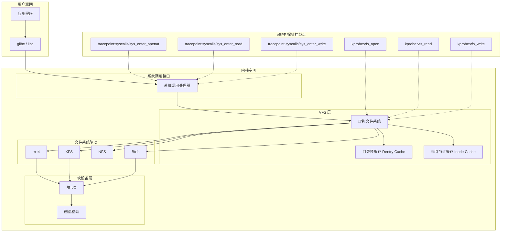
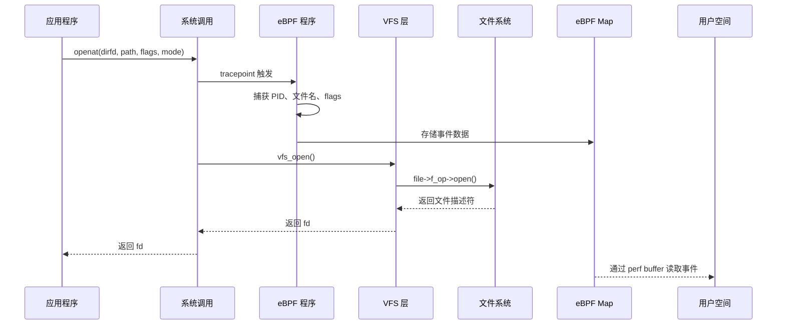
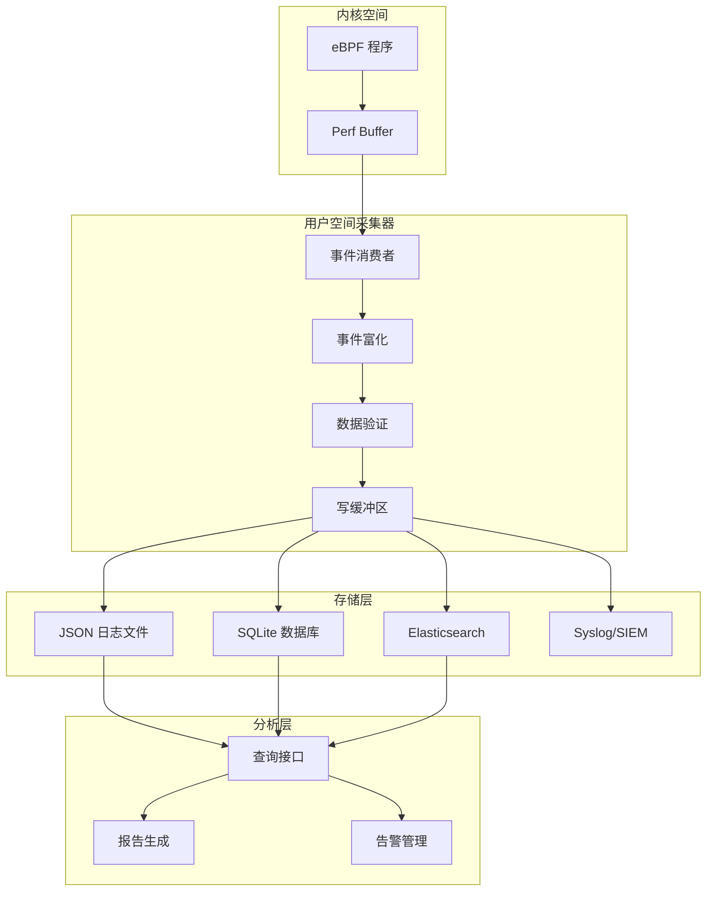

# OneUptime: 如何使用 eBPF 监控文件访问 - 翻译与深度分析

> 原文链接：https://oneuptime.com/blog/post/2026-01-07-ebpf-file-access-monitoring/view
> 作者：Nawaz Dhandala (@nawazdhandala)
> 发布日期：2026-01-07
> 翻译与分析日期：2026-05-08

---

## 一、文章概要

本文是 OneUptime 发布的一篇关于使用 eBPF 实现文件访问监控的综合指南。文章从 Linux VFS（虚拟文件系统）层的原理出发，逐步讲解了如何利用 eBPF 技术实现：

1. **文件打开操作追踪**（File Open Tracing）
2. **文件读写监控**（File Read/Write Monitoring）
3. **目录操作监控**（Directory Operations Monitoring）
4. **敏感文件访问检测**（Sensitive File Access Detection）
5. **合规审计日志生成**（Audit Trail Generation）

文章的核心主张：**eBPF 相比传统方案（auditd、inotify）提供了更低开销、更高可见性的文件监控能力**。

---

## 二、Linux VFS 层架构解析

### 2.1 VFS 架构概述

文章首先介绍了 Linux VFS 层的架构，这是理解 eBPF 文件监控的基础。VFS 为所有文件系统操作提供了统一的接口，因此是挂载 eBPF 探针的理想位置。



### 2.2 三类 eBPF 探针挂载点

| 探针类型 | 挂载位置 | 特点 | 适用场景 |
|---------|---------|------|---------|
| **Tracepoints** | 系统调用入口/出口 | 稳定接口，内核版本间兼容性好 | `sys_enter_openat`、`sys_enter_read`、`sys_enter_write` |
| **Kprobes** | 内核函数 | 动态探针，灵活但随内核版本可能变化 | `vfs_open`、`vfs_read`、`vfs_write` |
| **LSM hooks** | 安全模块钩子 | 安全访问控制决策点 | 安全策略执行 |

### 2.3 分析与评价

**优点：**
- 架构图清晰展示了从用户空间到内核空间的完整调用链
- 明确区分了 Tracepoint 和 Kprobe 两种挂载策略

**不足之处：**
- 未提及 `fentry/fexit`（BPF trampoline），这是 5.5+ 内核上比 kprobe 更高效的挂载方式
- 未提及 LSM BPF（5.7+ 内核），这对安全场景非常重要
- 图中没有展示 `openat2` 系统调用（5.6+ 内核引入），部分现代程序已使用该调用

---

## 三、文件打开操作追踪

### 3.1 核心实现逻辑

文章提供了基于 BCC（Python 绑定）的 `openat` 系统调用追踪器：



### 3.2 关键数据结构

```c
struct file_open_event {
    u32 pid;            // 进程 ID
    u32 tid;            // 线程 ID
    u32 uid;            // 用户 ID
    u32 gid;            // 组 ID
    u64 timestamp;      // 事件时间戳（纳秒）
    int flags;          // 打开标志 (O_RDONLY, O_WRONLY 等)
    char comm[16];      // 进程名
    char filename[256]; // 文件路径
};
```

### 3.3 核心 eBPF 代码分析

挂载点选择为 `TRACEPOINT_PROBE(syscalls, sys_enter_openat)`，关键操作包括：

- `bpf_get_current_pid_tgid()`：获取进程/线程 ID（返回值高 32 位为 PID，低 32 位为 TID）
- `bpf_get_current_uid_gid()`：获取用户/组 ID
- `bpf_ktime_get_ns()`：获取内核时间戳
- `bpf_get_current_comm()`：获取进程名
- `bpf_probe_read_user_str()`：从用户空间读取文件名字符串
- `BPF_PERF_OUTPUT` + `perf_submit`：通过 perf buffer 将事件流式传输到用户空间

### 3.4 分析与评价

**优点：**
- 使用 `TRACEPOINT_PROBE` 而非 kprobe，稳定性更好
- 完整捕获了 PID/TID/UID/GID/进程名/文件名/标志位等关键审计信息
- `decode_flags()` 函数实现了可读的标志位解析

**不足之处：**
- **只追踪了 `openat` 的入口，没有追踪出口**，因此无法获取操作是否成功（返回的 fd 或 errno）
- `filename` 字段限制为 256 字节，对于深层目录的长路径可能被截断
- 没有处理 `openat2` 系统调用（Linux 5.6+）
- 没有实现内核空间过滤（所有事件都会发到用户空间），在高负载系统上可能导致 perf buffer 溢出

---

## 四、文件读写监控

### 4.1 核心设计

文章采用 **entry+exit 双探针配对** 的经典模式：

1. 在 `sys_enter_read/write` 中捕获文件描述符（fd），存入 `BPF_HASH` map
2. 在 `sys_exit_read/write` 中查找对应的 fd，捕获返回值（实际读写字节数），生成完整事件

```c
BPF_HASH(active_reads, u64, u32);   // Key: pid_tgid, Value: fd
BPF_HASH(active_writes, u64, u32);
```

### 4.2 用户空间统计

用户空间维护了 `IOStats` 类，对每个进程进行 I/O 统计汇总：

```python
class IOStats:
    def __init__(self):
        self.read_bytes = 0
        self.write_bytes = 0
        self.read_count = 0
        self.write_count = 0
```

### 4.3 分析与评价

**优点：**
- entry+exit 配对设计完整，能获取实际传输字节数
- 只报告成功的操作（`event.bytes > 0`），减少噪音
- 提供了格式化的字节显示（B/KB/MB）
- Ctrl+C 退出时输出汇总统计

**不足之处：**
- **只有 fd 没有文件名**：read/write 系统调用的参数只包含 fd，没有文件路径信息。要获取文件名需要维护 fd→filename 的映射表（在 openat 事件中建立），文章没有实现这一关键关联
- 没有区分普通文件和 socket/pipe 等特殊文件描述符
- `BPF_HASH` map 在极端情况下（进程被 kill）可能出现 entry 没有对应 exit 的泄漏问题
- 没有追踪 `pread64`/`pwrite64`/`readv`/`writev` 等其他 I/O 系统调用

---

## 五、目录操作监控

### 5.1 追踪的操作类型

| 操作 | 系统调用 | VFS 函数 | 用途 |
|------|---------|---------|------|
| 创建目录 | `mkdirat` | `vfs_mkdir` | 检测新目录创建 |
| 删除目录 | `rmdir` | `vfs_rmdir` | 检测目录删除 |
| 删除文件 | `unlinkat` | `vfs_unlink` | 检测文件删除 |
| 重命名 | `renameat2` | `vfs_rename` | 检测文件/目录重命名 |
| 创建符号链接 | `symlinkat` | `vfs_symlink` | 检测符号链接创建 |

### 5.2 事件数据结构

```c
struct dir_event {
    u32 pid;
    u32 uid;
    u64 timestamp;
    u8 op_type;        // 操作类型 (MKDIR/RMDIR/UNLINK/RENAME/SYMLINK)
    u16 mode;          // 权限模式（仅 mkdir）
    char comm[16];
    char path[256];    // 主路径
    char path2[256];   // 次要路径（用于 rename 和 symlink）
};
```

### 5.3 分析与评价

**优点：**
- 覆盖了主要的目录变更操作类型
- rename 操作同时捕获了源路径和目标路径
- 带有颜色编码的终端输出，可读性好
- mkdir 事件包含权限模式信息

**不足之处：**
- 没有追踪 `link`/`linkat`（硬链接创建），虽然图中列出但代码中未实现
- 没有追踪 `chmod`/`chown`/`chattr` 等权限变更操作
- 没有追踪 `sys_exit_*` 来确认操作是否成功
- 事件结构体较大（约 550 字节），对于高频操作的系统可能影响 perf buffer 性能

---

## 六、敏感文件访问检测

### 6.1 敏感文件分类体系

文章定义了六大类敏感文件：

| 类别 | 示例路径 | 写访问告警级别 | 读访问告警级别 |
|------|---------|-------------|-------------|
| 认证文件 | `/etc/passwd`, `/etc/shadow`, `/etc/sudoers` | CRITICAL | HIGH |
| SSH 密钥 | `/.ssh/id_rsa`, `/.ssh/authorized_keys` | CRITICAL | HIGH |
| 云凭据 | `/.aws/credentials`, `/.kube/config` | HIGH | MEDIUM |
| 加密钱包 | `/.bitcoin/wallet.dat` | HIGH | MEDIUM |
| 应用密钥 | `.env`, `secrets.yaml`, `.htpasswd` | MEDIUM | LOW |
| 数据库配置 | `/etc/mysql/`, `/var/lib/postgresql/` | MEDIUM | LOW |

### 6.2 增强的事件捕获

相比前面的基础版本，敏感文件监控器增加了**父进程信息**的采集：

```c
struct task_struct *task = (struct task_struct *)bpf_get_current_task();
struct task_struct *parent;
bpf_probe_read_kernel(&parent, sizeof(parent), &task->real_parent);
bpf_probe_read_kernel(&event.ppid, sizeof(event.ppid), &parent->pid);
bpf_probe_read_kernel_str(&event.parent_comm, sizeof(event.parent_comm),
                          parent->comm);
```

这是安全分析中非常重要的信息——通过进程链（process lineage）可以判断是正常的系统操作还是可疑行为。

### 6.3 告警级别策略

```python
def get_alert_level(self, category, flags):
    is_write = (flags & 3) in [1, 2]  # O_WRONLY 或 O_RDWR

    if category in ["authentication", "ssh_keys"]:
        return "CRITICAL" if is_write else "HIGH"
    elif category in ["cloud_credentials", "crypto_wallets"]:
        return "HIGH" if is_write else "MEDIUM"
    else:
        return "MEDIUM" if is_write else "LOW"
```

### 6.4 分析与评价

**优点：**
- 敏感文件分类体系较为完善，覆盖了常见的安全关注点
- 区分读/写访问的告警级别是合理的设计
- 采集父进程信息为安全溯源提供了关键上下文
- 支持 syslog 输出，便于 SIEM 集成
- 采用用户空间过滤策略，允许动态更新模式而无需重载 eBPF 程序

**不足之处：**
- **过滤在用户空间进行**：所有 openat 事件都会通过 perf buffer 传到用户空间后才做匹配，这在高 I/O 系统上会造成不必要的开销和潜在的事件丢失
- 路径匹配使用简单的子字符串匹配（`pattern in filename`），可能产生误报，例如 `/home/user/.env.bak` 也会匹配 `.env`
- 没有实现白名单机制（例如排除已知安全的进程如 `sshd` 读取 `/etc/shadow`）
- `BPF_HASH(alerted, u64, u64)` 声明了但代码中未使用（用于去重）
- 缺少进程的完整命令行（`/proc/<pid>/cmdline`），仅有 16 字符的 comm 在实际分析中往往不够

---

## 七、审计日志生成

### 7.1 架构设计



### 7.2 增强的事件数据结构

```c
struct audit_event {
    u64 timestamp;
    u32 pid;
    u32 tid;
    u32 ppid;
    u32 uid;
    u32 gid;
    u32 euid;            // 有效用户 ID
    u32 egid;            // 有效组 ID
    u32 session_id;      // 会话 ID（用户追踪）
    u64 cgroup_id;       // cgroup ID（容器识别）
    int syscall_nr;      // 系统调用号
    int flags;           // 打开标志
    int ret_value;       // 返回值（fd 或错误码）
    char comm[16];
    char filename[256];
    char cwd[256];       // 当前工作目录
};
```

### 7.3 核心功能特性

#### entry+exit 配对采集

使用 `BPF_HASH(inflight_opens, u64, struct audit_event)` 在 openat 入口存储事件，在出口获取返回值后提交完整事件。这解决了前面基础版本只追踪入口的问题。

#### 事件富化

```python
def enrich_event(self, event):
    event_data = {
        "timestamp": timestamp.isoformat(),
        "hostname": self.hostname,
        "pid": event.pid,
        "username": self._get_username(event.uid),
        "groupname": self._get_groupname(event.gid),
        "syscall": self._syscall_name(event.syscall_nr),
        "cgroup_id": event.cgroup_id,
        "session_id": event.session_id,
        # ...
    }
    event_data["event_hash"] = self._compute_event_hash(event_data)
    return event_data
```

富化过程包括：
- UID/GID 到用户名/组名的解析（带缓存）
- 系统调用号到名称的映射
- 事件 hash 计算（用于去重）

#### 多存储后端

- **JSON 日志文件**：按天轮转，适合日志收集系统（如 Fluentd/Filebeat）采集
- **SQLite 数据库**：带索引的本地查询存储，支持合规报告生成
- **支持扩展到 Elasticsearch、Syslog**

#### 后台批量写入

```python
def _write_events(self):
    batch = []
    batch_size = 100
    while self.running:
        event = self.event_queue.get(timeout=1.0)
        batch.append(event)
        if len(batch) >= batch_size:
            self._flush_batch(batch)
            batch = []
```

使用队列+后台线程实现异步批量写入，避免 I/O 操作阻塞事件处理。

#### 日志保留策略

支持可配置的保留天数（默认 90 天），定期清理过期的 JSON 文件和数据库记录。

#### 合规报告生成

```python
def generate_report(self, start_time=None, end_time=None):
    report = {
        "summary": {"total_events": ..., "by_syscall": ...},
        "top_users": [...],
        "top_files": [...],
        "top_commands": [...],
    }
```

### 7.4 分析与评价

**优点：**
- 架构设计较为完善，从采集到存储到分析形成了完整链路
- entry+exit 配对解决了操作结果捕获的问题
- 事件去重、批量写入、日志保留等生产级特性考虑得当
- 支持 cgroup_id 和 session_id，为容器环境和用户会话追踪提供了基础
- 合规报告功能直接对标 SOC2/HIPAA/PCI-DSS 要求

**不足之处：**
- `cwd` 字段在结构体中声明了但 eBPF 代码中未填充
- `euid`/`egid` 字段声明了但未采集（需要从 `task->cred` 中读取）
- SQLite 在高写入场景下可能成为瓶颈，建议使用 WAL 模式
- `_flush_batch` 中每次都创建新的数据库连接（`sqlite3.connect()`），应改为连接池或持久连接
- `BPF_HASH(inflight_opens)` 的 value 是完整的 `audit_event` 结构体（约 560 字节），在高并发场景下会占用大量 BPF map 内存
- 没有处理 perf buffer 丢失事件的情况（应注册 `lost_cb` 回调）

---

## 八、生产环境注意事项

### 8.1 性能优化

文章提到了使用 **LPM Trie**（最长前缀匹配 Trie 树）进行内核空间路径过滤：

```c
BPF_LPM_TRIE(monitored_paths, u64);
```

这是一个重要的优化思路——将过滤逻辑从用户空间移到内核空间，可以大幅减少事件传输量。

### 8.2 高可用设计

文章提供了 `HAFileMonitor` 类的框架，包括：
- 信号处理（SIGTERM/SIGINT 优雅关闭，SIGHUP 重载配置）
- 安全的 eBPF 操作上下文管理器
- 失败恢复机制
- 健康检查接口

### 8.3 容器支持

通过 cgroup_id 到容器名称的映射实现容器级别的文件监控：

```python
def get_container_name(cgroup_id):
    # 检查 Docker
    docker_path = f"/sys/fs/cgroup/memory/docker"
    # 检查 containerd/Kubernetes
    k8s_path = "/sys/fs/cgroup/memory/kubepods"
```

### 8.4 分析与评价

**优点：**
- LPM Trie 内核空间过滤是正确的生产化思路
- 信号处理和优雅关闭是生产必需的
- 容器场景的考虑符合现代云原生环境需求

**不足之处：**
- LPM Trie 代码示例不完整，实际使用中路径匹配的 key 结构设计较复杂
- 容器名称解析代码使用了 cgroup v1 的路径格式（`/sys/fs/cgroup/memory/docker`），现代系统多已使用 cgroup v2（`/sys/fs/cgroup/system.slice/docker-<id>.scope`）
- 没有提及 BPF ring buffer（5.8+ 内核），相比 perf buffer 有更好的性能和更少的数据丢失
- 没有讨论 eBPF 程序的资源限制（map 大小、栈大小、指令数限制）
- 缺少对多线程环境下 perf buffer 的 CPU 亲和性讨论

---

## 九、综合技术评价

### 9.1 文章的价值

| 维度 | 评分 | 说明 |
|------|------|------|
| 完整性 | ⭐⭐⭐⭐ | 覆盖了文件监控的主要场景（打开、读写、目录操作、敏感检测、审计） |
| 实用性 | ⭐⭐⭐⭐ | 代码可直接运行（需 BCC 环境），适合学习和原型验证 |
| 架构设计 | ⭐⭐⭐⭐ | 审计日志的架构设计较为合理 |
| 生产就绪度 | ⭐⭐⭐ | 距离生产部署还有不少差距（见下文） |
| 深度 | ⭐⭐⭐ | 对 eBPF 机制的讲解较为基础，缺少高级话题 |

### 9.2 与同类项目的对比

| 特性 | 本文方案 | Falco | Tetragon | Tracee |
|------|---------|-------|----------|--------|
| 实现语言 | Python (BCC) | C++ (内核模块/eBPF) | Go (cilium/ebpf) | Go (libbpf) |
| 内核空间过滤 | 部分（LPM Trie 示例） | 完整 | 完整（Tracing Policy） | 完整（Signatures） |
| 进程树追踪 | 父进程 PID/名称 | 完整进程树 | 完整进程树 + namespace | 完整进程树 |
| 容器感知 | cgroup_id | 完整（Kubernetes 元数据） | 完整（Pod/Container） | 完整（容器运行时） |
| 实时告警 | 基础（syslog） | 完整（多输出后端） | 完整（JSON/gRPC） | 完整（Webhook/Syslog） |
| CO-RE 支持 | 无（BCC 运行时编译） | 是 | 是 | 是 |
| 生产部署 | 需自行完善 | 生产就绪 | 生产就绪 | 生产就绪 |

### 9.3 距离生产部署的差距

1. **CO-RE 迁移**：BCC 方案需要目标机器安装内核头文件且运行时编译，应迁移到 libbpf/cilium-ebpf 的 CO-RE 方案
2. **Ring Buffer**：应使用 BPF ring buffer 替代 perf buffer（5.8+ 内核）
3. **fd→文件名映射**：读写监控缺少文件名关联，需要维护 fd 到 inode/path 的映射
4. **进程树完整追踪**：仅有父进程信息不够，应追踪完整的进程链
5. **Namespace 感知**：缺少 mount namespace、PID namespace 等信息
6. **错误处理**：perf buffer 溢出、eBPF 程序加载失败等异常场景处理不足
7. **配置热加载**：敏感文件模式变更需要重启，应支持运行时更新
8. **指标暴露**：缺少 Prometheus 指标接口（事件计数、丢失率、处理延迟等）

### 9.4 对我们项目的参考价值

本文提供了一个 **良好的 eBPF 文件监控学习入口和原型参考**，尤其值得借鉴的点：

1. **敏感文件分类体系**：六大类的分类方式可以作为我们 HIDS 项目的参考基线
2. **告警级别策略**：基于类别+访问模式的分级告警逻辑
3. **审计日志架构**：采集→富化→验证→存储→分析的完整链路
4. **entry+exit 配对模式**：在需要获取系统调用返回值时的标准实现方式

但如果要做生产级的 FIM/HIDS 系统，建议直接参考 Tetragon 或 Tracee 的实现，它们在以上所有方面都更加成熟。

---

## 十、核心代码速查表

| 功能 | 脚本名 | 挂载点 | 核心 Map |
|------|--------|--------|---------|
| 文件打开追踪 | `file_open_tracer.py` | `sys_enter_openat` | `BPF_PERF_OUTPUT` |
| 读写监控 | `file_rw_monitor.py` | `sys_enter/exit_read/write` | `BPF_HASH` + `BPF_PERF_OUTPUT` |
| 目录操作监控 | `directory_monitor.py` | `sys_enter_mkdirat/rmdir/unlinkat/renameat2/symlinkat` | `BPF_PERF_OUTPUT` |
| 敏感文件检测 | `sensitive_file_monitor.py` | `sys_enter_openat` | `BPF_HASH` + `BPF_PERF_OUTPUT` |
| 审计日志生成 | `audit_trail_generator.py` | `sys_enter/exit_openat` + `sys_enter_write` | `BPF_HASH` + `BPF_PERF_OUTPUT` |

---

## 十一、关键 BPF Helper 函数速查

| Helper 函数 | 用途 | 返回值 |
|-------------|------|--------|
| `bpf_get_current_pid_tgid()` | 获取 PID 和 TID | `(PID << 32) \| TID` |
| `bpf_get_current_uid_gid()` | 获取 UID 和 GID | `(GID << 32) \| UID` |
| `bpf_ktime_get_ns()` | 获取内核单调时钟时间戳 | 纳秒 |
| `bpf_get_current_comm()` | 获取进程名（最多 16 字符） | 0 成功 |
| `bpf_probe_read_user_str()` | 从用户空间读取字符串 | 读取的字节数 |
| `bpf_probe_read_kernel()` | 从内核空间读取数据 | 0 成功 |
| `bpf_probe_read_kernel_str()` | 从内核空间读取字符串 | 读取的字节数 |
| `bpf_get_current_task()` | 获取当前 task_struct 指针 | 指针 |
| `bpf_get_current_cgroup_id()` | 获取当前 cgroup ID | cgroup ID |
| `bpf_perf_event_output()` / `perf_submit()` | 向 perf buffer 提交事件 | 0 成功 |

---

## 十二、延伸阅读

- [BPF Performance Tools](https://www.brendangregg.com/bpf-performance-tools-book.html) - Brendan Gregg
- [Linux Kernel BPF 文档](https://docs.kernel.org/bpf/)
- [BCC Reference Guide](https://github.com/iovisor/bcc/blob/master/docs/reference_guide.md)
- [libbpf 文档](https://libbpf.readthedocs.io/)
- [eBPF.io](https://ebpf.io/) - eBPF 官方社区
- [Tetragon File Monitoring](https://tetragon.io/) - Cilium 的 eBPF 安全可观测性项目
- [Tracee](https://github.com/aquasecurity/tracee) - Aqua Security 的 eBPF 运行时安全项目
