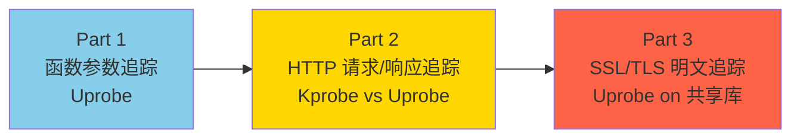
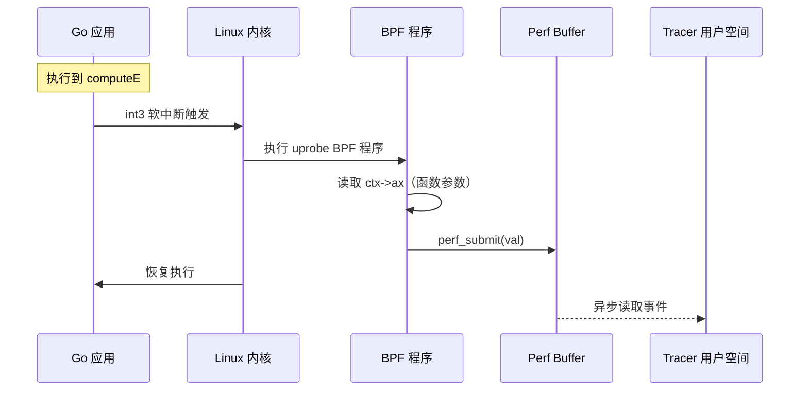
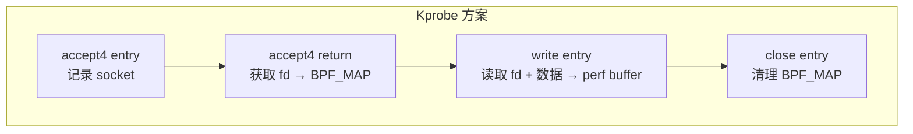
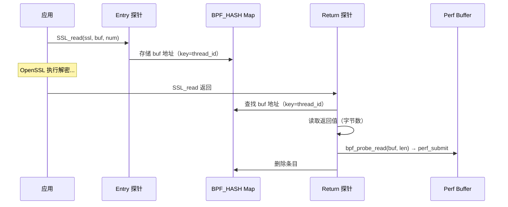
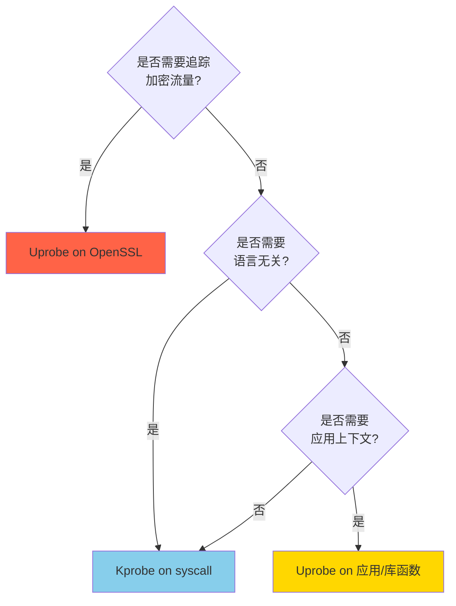

# Pixie Labs：使用 eBPF 调试应用系列（三篇连载）

> 原文链接：
> - Part 1: [Tracing Go function arguments in prod](https://blog.px.dev/ebpf-function-tracing/)（2020.9.10）
> - Part 2: [Tracing full body HTTP request/responses](https://blog.px.dev/ebpf-http-tracing/)（2020.10.28）
> - Part 3: [Tracing SSL/TLS connections](https://blog.px.dev/ebpf-openssl-tracing/)（2021.9.16）
>
> 作者：Zain Asgar（Part 1 & 2）、Omid Azizi（Part 3）
> 翻译与分析时间：2026 年 3 月 26 日

---

## 一、系列概述

这是 Pixie Labs（后被 New Relic 收购）发布的三篇 eBPF 调试系列文章。核心主题是：**如何使用 eBPF 在无需重新编译或重新部署的情况下调试生产环境中的应用程序**。三篇文章层层递进，从函数参数追踪到 HTTP 流量捕获，最终到 TLS 加密流量的明文追踪。



---

## 二、Part 1：追踪 Go 函数参数（Uprobe）

### 2.1 问题场景

在生产环境中调试应用时，传统调试器（Delve、GDB）存在问题：
- 会严重中断程序执行
- 甚至可能修改程序状态，导致生产事故
- 不适合在生产环境使用

**目标**：使用 eBPF uprobe 无侵入地捕获 Go 函数的参数。

### 2.2 核心原理

#### 符号定位

Go 二进制文件使用 ELF 格式存储调试信息，通过 `objdump` 可以定位函数地址：

```bash
$ objdump --syms app | grep computeE
00000000006609a0 g     F .text    000000000000004b    main.computeE
```

反汇编可以看到函数的第一条指令（Go 的参数通过栈传递）：

```asm
00000000006609a0 <main.computeE>:
  6609a0: 48 8b 44 24 08    mov    0x8(%rsp),%rax   ← 参数 iterations
  6609a5: b9 02 00 00 00    mov    $0x2,%ecx
```

#### Uprobe 工作原理

1. Linux 内核在目标函数地址插入 **`int3`（软中断指令）**
2. 程序执行到该地址时触发软中断
3. 内核执行注册的 BPF 程序
4. BPF 程序读取函数参数，写入 perf buffer
5. 用户空间 tracer 程序异步读取 perf buffer



#### BPF 代码

```c
#include <uapi/linux/ptrace.h>

BPF_PERF_OUTPUT(trace);

inline int computeECalled(struct pt_regs *ctx) {
    long val = ctx->ax;  // Go 参数通过栈传递，此处在 ax 寄存器中
    trace.perf_submit(ctx, &val, sizeof(val));
    return 0;
}
```

#### GDB 验证 int3 注入

注入前：

```asm
0x6609a0 <main.computeE>:    mov    0x8(%rsp),%rax
```

注入后：

```asm
0x6609a0 <main.computeE>:    int3        ← 软中断指令
0x6609a1 <main.computeE+1>:  mov    0x8(%rsp),%eax
```

### 2.3 关键要点

- Uprobe 在**二进制级别**工作，适用于所有编译型语言（Go、C++、Rust 等），只需适配各语言的 ABI
- Go 的嵌套指针、接口、channel 等特性增加了通用化难度
- 二进制必须保留符号信息（未被 strip），否则无法定位函数地址

---

## 三、Part 2：追踪 HTTP 请求/响应（Kprobe vs Uprobe）

### 3.1 两种方案对比

作者以一个简单的 Go HTTP 服务器为目标，探索了两种 HTTP 流量捕获方案。

#### 方案一：Kprobe（内核系统调用层）

首先用 `perf trace` 分析 HTTP 请求涉及的系统调用：

```bash
$ sudo perf trace -p <PID>
# 关键系统调用：
# accept4 → 接受连接，获取 fd
# read    → 读取请求数据
# write   → 写入响应数据
# close   → 关闭连接
```

需要 4 个探针：

| 探针 | 位置 | 作用 |
|------|------|------|
| `accept4` entry | 进入时 | 记录 socket 信息 |
| `accept4` return | 返回时 | 获取文件描述符（fd），存入 BPF_MAP |
| `write` entry | 进入时 | 获取 fd 和写入的数据，发送到 perf buffer |
| `close` entry | 进入时 | 清理 BPF_MAP，停止追踪该 fd |



#### 方案二：Uprobe（用户空间库函数）

通过 Delve 设置断点在 `syscall.write`，获取回溯栈，找到关键函数：

```
net/http.(*response).finishRequest  ← 每次 HTTP 请求完成时调用
  → bufio.(*Writer).Flush
    → net/http.checkConnErrorWriter.Write
      → net.(*conn).Write
        → syscall.Write
```

选择 `net/http.(*response).finishRequest` 作为 uprobe 挂钩点，可以在数据序列化之前直接读取结构化的 HTTP 响应对象。

### 3.2 综合对比

| 维度 | Kprobe | Uprobe |
|------|--------|--------|
| **语言无关** | ✅ 完全无关 | ❌ 每种语言/库需要不同实现 |
| **实现复杂度** | 较低，但需要重新解析 HTTP | 较高，需要追踪结构体指针 |
| **TLS 支持** | ❌ 数据已加密 | ✅ 可以在加密前捕获 |
| **符号依赖** | ❌ 无需 | ✅ 需要二进制保留符号 |
| **应用上下文** | 仅有 fd/PID | 可获取调用栈等上下文 |
| **多系统调用问题** | 需要重组分片请求 | 无此问题 |
| **维护成本** | 低（内核 API 稳定） | 高（库版本变化需更新） |

### 3.3 性能基准测试

在 Intel Core i9（14 物理核）上进行压测：

| HTTP 延迟 | 开销影响 |
|----------|---------|
| < 1ms | 有可测量的开销 |
| > 1ms | **基本可忽略**（Kprobe 略优于 Uprobe） |

**结论**：如果 HTTP 处理器做了任何实际工作（约 1ms 计算），引入的开销基本可以忽略不计。

---

## 四、Part 3：追踪 SSL/TLS 加密连接（Uprobe on 共享库）

### 4.1 问题：Kprobe 无法追踪加密流量


- Kprobe 挂在 `send()`/`recv()` 层 → 数据已加密，无法解读
- Wireshark 方案需要共享加密密钥 → 不适合自动化可观测平台

### 4.2 解决方案：在加密前捕获

核心思路极其简单——**在数据被加密之前捕获它**。

挂钩到 OpenSSL 共享库的 `SSL_write` 和 `SSL_read` 函数：

```
应用代码 → SSL_write(明文) → [我们在这里捕获!] → 加密 → send() → 网络
网络 → recv() → 解密 → [我们在这里捕获!] → SSL_read(明文) → 应用代码
```

### 4.3 共享库符号定位

```bash
# 普通符号已被 strip
$ nm /usr/lib/x86_64-linux-gnu/libssl.so.1.1
nm: no symbols

# 动态符号始终存在（否则其他程序无法链接）
$ nm --dynamic /usr/lib/x86_64-linux-gnu/libssl.so.1.1 | grep -e SSL_write -e SSL_read
0000000000038b00 T SSL_read
0000000000038dd0 T SSL_write
0000000000038b70 T SSL_read_ex
0000000000038e40 T SSL_write_ex
```

**关键洞察**：动态符号（`--dynamic`）永远不会被 strip，否则没有程序能链接到该共享库。

### 4.4 Uprobe 挂钩

```python
attach_uprobe(
    "/usr/lib/x86_64-linux-gnu/libssl.so.1.1",
    "SSL_write",
    <BPF code>)
```

挂在**共享库**上的好处：一个探针即可追踪**所有使用该共享库的应用**。

### 4.5 探针设计

需要 4 个探针（entry + return × 2 个函数）：

| 函数 | Entry 探针 | Return 探针 |
|------|-----------|------------|
| `SSL_write(ssl, buf, num)` | 记录 `buf` 地址到 BPF_MAP | 从 BPF_MAP 取出 `buf`，根据返回值确定字节数，复制数据到 perf buffer |
| `SSL_read(ssl, buf, num)` | 记录 `buf` 地址到 BPF_MAP | 从 BPF_MAP 取出 `buf`，根据返回值确定字节数，复制数据到 perf buffer |

**为什么需要 entry + return 两个探针？**

- `SSL_read` 的 entry 时 `buf` 还是空的，数据在 return 时才被填充
- 但 return 探针**无法直接访问函数参数**，需要在 entry 时暂存到 BPF_MAP



### 4.6 关键数据结构

```c
BPF_PERF_OUTPUT(tls_events);

// Key: thread ID, Value: SSL_write/SSL_read 的 buf 指针
BPF_HASH(active_ssl_read_args_map, uint64_t, struct ssl_args_t);
BPF_HASH(active_ssl_write_args_map, uint64_t, struct ssl_args_t);

// per-CPU 临时缓冲区（绕过 512 字节栈限制）
BPF_PERCPU_ARRAY(data_buffer_heap, struct ssl_data_event_t, 1);
```

### 4.7 核心 BPF 代码

```c
// SSL_read entry：暂存 buf 指针
int probe_entry_SSL_read(struct pt_regs* ctx) {
    uint64_t current_pid_tgid = bpf_get_current_pid_tgid();
    uint32_t pid = current_pid_tgid >> 32;
    if (pid != TRACE_PID) return 0;

    const char* buf = (const char*)PT_REGS_PARM2(ctx);
    active_ssl_read_args_map.update(&current_pid_tgid, &buf);
    return 0;
}

// SSL_read return：读取数据并发送到 perf buffer
int probe_ret_SSL_read(struct pt_regs* ctx) {
    uint64_t current_pid_tgid = bpf_get_current_pid_tgid();
    uint32_t pid = current_pid_tgid >> 32;
    if (pid != TRACE_PID) return 0;

    const char** buf = active_ssl_read_args_map.lookup(&current_pid_tgid);
    if (buf != NULL) {
        process_SSL_data(ctx, current_pid_tgid, kSSLRead, *buf);
    }
    active_ssl_read_args_map.delete(&current_pid_tgid);
    return 0;
}

// 通用数据处理：复制明文数据到 perf buffer
static int process_SSL_data(struct pt_regs* ctx, uint64_t id,
                            enum ssl_data_event_type type, const char* buf) {
    int len = (int)PT_REGS_RC(ctx);
    if (len < 0) return 0;

    struct ssl_data_event_t* event = create_ssl_data_event(id);
    if (event == NULL) return 0;

    event->type = type;
    event->data_len = (len < MAX_DATA_SIZE ? (len & (MAX_DATA_SIZE - 1)) : MAX_DATA_SIZE);
    bpf_probe_read(event->data, event->data_len, buf);
    tls_events.perf_submit(ctx, event, sizeof(struct ssl_data_event_t));
    return 0;
}
```

### 4.8 用户空间 Tracer（C++）

```cpp
// 定义 4 个 uprobe
UProbeSpec kSSLWriteEntryProbeSpec{
    .binary_path = "/usr/lib/x86_64-linux-gnu/libssl.so.1.1",
    .symbol = "SSL_write",
    .attach_type = BPF_PROBE_ENTRY,
    .probe_fn = "probe_entry_SSL_write",
};
// ... SSL_write return, SSL_read entry, SSL_read return ...

// 读取 perf buffer
void handle_output(void*, void* data, int) {
    struct ssl_data_event_t r = *static_cast<struct ssl_data_event_t*>(data);
    std::string_view plaintext(r.data, r.data_len);
    std::cout << " type=" << (r.type == kSSLRead ? "read" : "write")
              << " data=" << plaintext << std::endl;
}
```

---

## 五、三篇文章的技术演进总结

### 5.1 探针策略演进

| Part | 探针类型 | 挂钩位置 | 捕获内容 |
|------|---------|---------|---------|
| Part 1 | Uprobe | Go 二进制函数地址 | 函数参数 |
| Part 2 | Kprobe + Uprobe | 内核 syscall / Go net/http 库 | HTTP 请求/响应 |
| Part 3 | Uprobe | OpenSSL 共享库 | TLS 明文数据 |

### 5.2 核心设计模式

整个系列反复使用了几个关键的 eBPF 设计模式：

| 模式 | 说明 | 出现 |
|------|------|------|
| **Entry/Return 探针配对** | Entry 暂存参数到 BPF_MAP，Return 读取参数+返回值 | Part 2、Part 3 |
| **PID 过滤** | 通过 `bpf_get_current_pid_tgid()` 过滤只追踪目标进程 | 全部 |
| **per-CPU 临时缓冲区** | 用 `BPF_PERCPU_ARRAY` 绕过 512 字节栈限制 | Part 3 |
| **Perf Buffer 异步传输** | 内核 BPF 写入 perf buffer，用户空间轮询读取 | 全部 |
| **共享库 Uprobe** | 挂在 `.so` 文件上，一个探针覆盖所有使用该库的进程 | Part 3 |

### 5.3 Kprobe vs Uprobe 最终结论



---

## 六、与本系列 FIM 文章的关联

| 维度 | Pixie 系列 | FIM 系列（Sysdig/Tetragon/Wazuh） |
|------|-----------|----------------------------------|
| **目标** | 应用级调试与可观测 | 文件完整性监控 |
| **探针偏好** | Uprobe 为主（应用上下文丰富） | Kprobe/LSM 为主（内核事件） |
| **数据传输** | Perf Buffer | Ring Buffer / per-CPU Ring Buffer |
| **关键技巧** | Entry/Return 配对暂存参数 | dentry 遍历 / inode 比较 |
| **共同挑战** | 512 字节栈限制、验证器约束 | 512 字节栈限制、验证器约束 |

**互补价值**：

- Pixie 系列侧重**网络层可观测**（HTTP、TLS），展示了 uprobe 在共享库上的强大能力
- FIM 系列侧重**文件系统层监控**，展示了 kprobe/LSM 在 VFS 层的应用
- 两者共享相同的 eBPF 基础设施（Maps、Perf/Ring Buffer、验证器约束），核心设计模式高度一致

**Entry/Return 配对模式**是贯穿所有 eBPF 追踪项目的通用范式——无论是追踪 SSL 明文、PHP 函数调用栈，还是文件系统操作，都需要在函数入口暂存参数，在返回时读取结果。

---

## 七、总结

Pixie Labs 的这三篇系列文章是**eBPF 应用层追踪的经典教程**，其最大价值在于：

1. **渐进式教学**——从单函数追踪到 HTTP 到 TLS，复杂度逐步递增
2. **Kprobe vs Uprobe 的实战对比**——不仅有理论分析，还有性能基准测试
3. **共享库 Uprobe 的巧妙应用**——通过挂钩 `libssl.so` 的 `SSL_write`/`SSL_read`，一个探针即可追踪所有使用 OpenSSL 的应用的明文流量
4. **Entry/Return 配对模式**——这是 eBPF 追踪中最基础也最重要的设计模式，在本系列的 FIM 文章和本文中都反复出现

项目代码开源在 [pixie-io/pixie-demos](https://github.com/pixie-io/pixie-demos)，是学习 eBPF 追踪的优秀起点。
