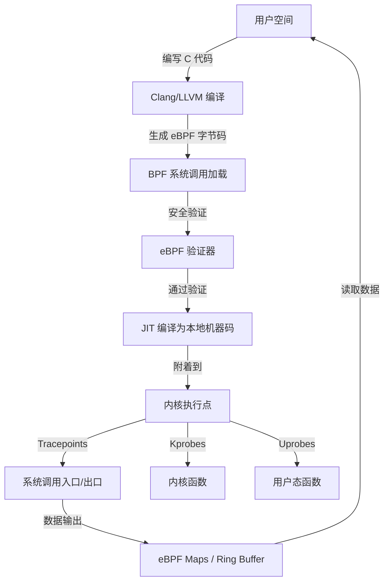
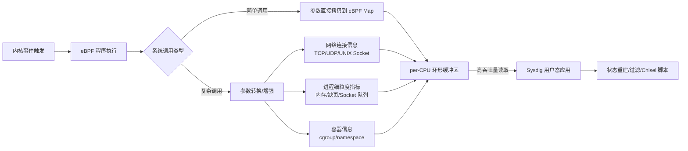

# Sysdig 与 Falco 现已由 eBPF 驱动

> 原文链接：[Sysdig and Falco now powered by eBPF](https://www.sysdig.com/blog/sysdig-and-falco-now-powered-by-ebpf)
> 作者：Gianluca Borello
> 原文发布时间：2019 年 2 月 27 日
> 翻译与总结时间：2026 年 3 月 26 日

---

## 一、文章摘要

本文是 Sysdig 官方发布的 eBPF 系列文章的第一篇，介绍了 Sysdig 将其核心系统调用追踪技术从内核模块（kernel module）迁移到 eBPF 的背景、动机、架构设计以及在 eBPF 生态中的定位。文章从 eBPF 基础知识讲起，详细阐述了 Sysdig 和 Falco 如何利用 eBPF 实现更安全、更兼容的内核级监控与安全审计能力。

---

## 二、核心内容翻译与总结

### 2.1 eBPF 简介

**eBPF（Extended Berkeley Packet Filter）** 是 Linux 内核中一项现代化的强大技术，广泛应用于网络和追踪等领域。其核心能力是允许用户（通常需要特权）向内核注入接近通用用途的代码，这些代码在特定的内核事件（如系统调用、网络包传输等）发生时被执行。

#### eBPF 的设计目标

eBPF 的终极目标是允许用户代码在内核中执行，这听起来与传统的可加载内核模块（Loadable Kernel Module）类似。但关键区别在于：

| 特性 | 内核模块 | eBPF |
|------|---------|------|
| 代码安全性 | 无限制运行，可能导致内核崩溃 | 仅运行经过验证的安全代码，**永远不会导致内核崩溃** |
| 权限级别 | 直接访问所有内核数据结构 | 受限执行环境，有严格的安全验证 |
| 加载方式 | insmod/modprobe | 通过 BPF 系统调用加载 |

#### eBPF 程序的编写

eBPF 本质上是内核中的一个**进程虚拟机**。它提供了：

- 自定义 RISC 风格指令集的虚拟处理器
- 虚拟 CPU 寄存器
- 栈内存区域

开发者不需要从零编写 eBPF 字节码。eBPF 开发者为 LLVM 实现了 eBPF 后端，这意味着可以使用 **Clang 将标准 C 代码子集编译为 eBPF 目标文件**，然后加载到内核中进行验证和使用。

#### eBPF 架构

eBPF 程序可以附着在内核的多个执行点上：

- 静态追踪点（Static Tracepoints）
- 动态内核探针（Kprobes）
- 用户态探针（Uprobes）
- 其他挂钩点

程序执行时会接收来自内核的相关数据作为输入。例如，附着在系统调用追踪点上的程序会接收用户态进程传递给内核的系统调用参数。程序可以：

- **主动改变**系统状态（如网络包过滤场景）
- **被动计算**指标（如追踪场景中的统计数据）

计算结果通过 **eBPF Maps**（通用键值数据结构）在内核态和用户态之间共享。

为了保证性能，eBPF 的 RISC 指令集足够简单，可以通过内核内嵌的 **JIT 编译器**轻松转换为本地机器码，从而避免虚拟机解释执行的性能开销。



---

### 2.2 Sysdig 与 Falco 的 eBPF 之路

#### Sysdig 的追踪历史

开源 Sysdig 是一个高性能系统调用追踪器，具备丰富的用户态支持能力：

- 有状态过滤器
- 容器感知能力
- Lua 脚本支持

Sysdig 始于 2013 年，当时 eBPF 尚未发布。彼时可用的原生追踪技术要么**太慢**（如 ptrace/auditd），要么**功能太受限**（如 perf 使用的 Kprobe 事件追踪器），因此团队选择了通过**外部内核模块**实现系统调用追踪。

Sysdig 内核模块的工作方式：

1. 通过静态追踪点（`raw_syscalls/sys_enter` 和 `raw_syscalls/sys_exit`）拦截系统调用
2. 通过自研的高效 per-CPU 环形缓冲区将数据推送到用户态
3. 在用户态通过状态机附加上下文信息（进程元数据、容器/编排器元数据、文件/连接元数据等）

#### 为什么要迁移到 eBPF？

经过六年的内核模块使用，随着容器化和云原生架构的普及，社区提出了三大关切：

| 关切 | 问题描述 |
|------|---------|
| **稳定性** | 内核模块以内核本身的一部分运行，无任何限制。一个 Bug 可能导致系统故障 |
| **安全性** | 内核模块以特权处理器模式运行，可直接访问所有关键数据结构。安全漏洞可能被恶意利用 |
| **兼容性** | 一些现代容器化 Linux 发行版阻止加载未签名的内核模块，甚至完全禁止加载内核模块（如 GCP 的 COS、Project Atomic Host） |

#### eBPF 迁移实施

Sysdig 的 eBPF 工作始于 **2017 年**，基于 Linux 内核 4.11 版本。迁移过程中遇到了一些挑战，团队向 Linux 上游贡献了多项改进：

- eBPF 程序中原生处理字符串的能力
- 从 eBPF 程序中解引用编译时大小未知的任意内存的能力

最终实现是一个**大规模的 eBPF 程序集合**，重度使用了内核中的 eBPF 追踪支持。

---

### 2.3 Sysdig eBPF 架构

#### 追踪点

Sysdig 的 eBPF 程序附着在以下静态追踪点上：

| 追踪点 | 用途 |
|--------|------|
| 系统调用入口路径 | 捕获系统调用入参 |
| 系统调用出口路径 | 捕获系统调用返回值 |
| 进程上下文切换 | 追踪调度事件 |
| 进程终止 | 追踪进程生命周期 |
| 缺页中断（主要/次要） | 内存追踪 |
| 进程信号投递 | 信号追踪 |

#### 数据处理流程



#### 关键设计决策

与典型的 eBPF 使用模式不同，Sysdig **没有依赖 eBPF Maps 进行数据共享**。所有数据都流经专门优化的 **per-CPU 环形缓冲区**，这使得 Sysdig 能够以最小开销从内核向用户态导出大量数据，在用户态进程内存中重建系统状态。

#### 性能表现

eBPF 方案的追踪开销仅略高于传统内核模块方案，远优于 strace 等其他系统调用追踪器。如果开销仍不可接受，可以通过在内核侧进行更积极的过滤来进一步降低。

#### 使用方式

使用 eBPF 版本的 Sysdig 非常简单，只需在启动容器时指定 `SYSDIG_BPF_PROBE` 环境变量即可：

```bash
docker run -i -t --name sysdig --privileged \
  -v /var/run/docker.sock:/host/var/run/docker.sock \
  -v /dev:/host/dev \
  -v /proc:/host/proc:ro \
  -v /boot:/host/boot:ro \
  -v /lib/modules:/host/lib/modules:ro \
  -v /usr:/host/usr:ro \
  --net=host \
  -e SYSDIG_BPF_PROBE="" \
  sysdig/sysdig
```

要求 Linux 内核版本 **4.14+** 且启用 eBPF 支持。同样的方式也适用于 Falco 以及 Sysdig Monitor 和 Sysdig Secure。

---

### 2.4 eBPF 生态中的定位

文章将 Sysdig 与 eBPF 生态中的两个主要项目进行了对比：

| 工具 | 定位 | 特点 |
|------|------|------|
| **bcc** | eBPF 程序编写框架 | 简化编译、加载和附着 eBPF 程序的复杂度；支持 Python/Lua 编写；提供数十个即用的追踪工具 |
| **bpftrace** | 高级追踪语言 | 基于 bcc 构建；提供类 DTrace 的高级语法；适合通过简洁的命令实现高级追踪 |
| **Sysdig** | 容器感知的高性能系统调用追踪器 | 专注于系统调用接口；增强容器元数据；支持丰富的 trace 文件保存、有状态过滤和 Chisel 脚本 |

典型的故障排查流程：

1. **先用 Sysdig**：通用系统调用追踪，大多数场景下足以定位问题
2. **再用 bpftrace/bcc**：当需要深入调查特定内核子系统或用户态行为时使用

**Falco** 作为 CNCF 项目，是当时 Linux、容器和 Kubernetes 生态中**唯一**由 eBPF 驱动的主要安全和行为活动监控工具。

---

## 三、核心要点总结

1. **eBPF 相比内核模块的核心优势**：安全性保证（验证器确保代码不会导致内核崩溃）、更好的兼容性（支持不允许加载内核模块的环境）
2. **Sysdig 迁移到 eBPF 的三大动机**：稳定性、安全性、兼容性（特别是对容器化和不可变基础设施的支持）
3. **架构上的关键设计**：使用 per-CPU 环形缓冲区而非 eBPF Maps 进行高吞吐数据传输，将繁重的聚合计算放在用户态
4. **性能表现**：eBPF 方案的开销仅略高于内核模块方案，完全可接受
5. **对上游的贡献**：Sysdig 团队向 Linux 内核上游贡献了多项 eBPF 改进，推动了整个 eBPF 生态的发展
6. **使用透明**：用户只需设置一个环境变量即可在内核模块和 eBPF 方案之间切换，上层接口完全不变

---

## 四、个人思考

这篇文章很好地展示了 eBPF 技术在生产级系统监控和安全领域的实际应用。几个值得关注的点：

- **eBPF 验证器的安全保证**是其相比内核模块最核心的差异化优势，这使得 eBPF 特别适合在生产环境中运行第三方追踪代码
- **per-CPU 环形缓冲区的设计选择**体现了 Sysdig 对高吞吐场景的深入理解——典型的 eBPF 程序通过 Maps 传递聚合后的少量数据，而 Sysdig 需要传递完整的事件流
- **对不可变基础设施的兼容性**在当今云原生环境中越来越重要，这也是很多安全工具选择 eBPF 的关键原因
- Sysdig 团队向内核上游贡献改进的做法，体现了良好的开源协作精神，也为后来的 eBPF 开发者铺平了道路
