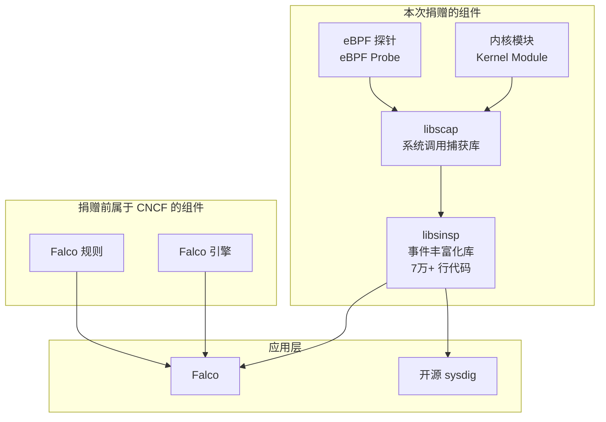

# Sysdig 将 Falco 的内核模块、eBPF 探针和库贡献给 CNCF

> 原文链接：[Sysdig contributes Falco's kernel module, eBPF probe, and libraries to the CNCF](https://www.sysdig.com/blog/sysdig-contributes-falco-kernel-ebpf-cncf)
> 作者：Loris Degioanni（Sysdig 创始人）
> 原文发布时间：2021 年 2 月 24 日
> 翻译与总结时间：2026 年 3 月 26 日

---

## 一、文章摘要

Sysdig 创始人 Loris Degioanni 宣布将 Sysdig 内核模块、eBPF 探针以及核心库（libsinsp 和 libscap）捐赠给 CNCF。这意味着 Falco 技术栈的**所有核心组件**都将成为 CNCF 的一部分，代码迁移到 falcosecurity GitHub 组织下。

---

## 二、核心内容翻译与总结

### 2.1 捐赠了什么？

文章展示了 Falco 和开源 sysdig 底层组件的架构：

捐赠后，Falco 的整个数据收集和处理管道都归属 CNCF 管理。

### 2.2 核心组件说明

| 组件 | 功能 | 技术亮点 |
|------|------|----------|
| **内核模块** | 通过静态追踪点拦截系统调用 | 效率略高于 eBPF |
| **eBPF 探针** | 通过 eBPF 程序拦截系统调用 | 更安全、更现代 |
| **libscap** | 系统调用捕获库 | 完整的捕获文件抽象支持 |
| **libsinsp** | 内核事件丰富化库 | 70K+ 行代码，将原始事件转化为有意义的信息（如文件描述符号 → 文件名/IP 地址） |

### 2.3 为什么之前没有一起捐赠？

历史原因：数据收集模块最初是为 sysdig 开发的，留在了 sysdig 的代码仓库中。Falco 和其他工具将它们视为外部依赖。此次捐赠涉及将这些组件从 sysdig 中分离并独立化，需要一定时间。

### 2.4 这些组件的价值

作者认为这些是"极其强大的构建模块"：

1. **可能是最雄心勃勃和精密的 eBPF 脚本**——在 Linux 内核中安全实现了一个高效的系统调用捕获框架
2. **系统调用捕获库**——完整支持捕获文件抽象
3. **经过实战检验的 70K+ 行内核事件丰富化库**

这些组件是运行时安全、故障排查、事件响应、取证等工具的完美基础。

---

## 三、核心要点总结

1. **里程碑事件**：Falco 技术栈的所有核心组件都归属 CNCF，实现了真正的社区拥有
2. **组件独立化**：libsinsp、libscap、内核模块和 eBPF 探针重新授权并移入独立仓库
3. **开源承诺**：Sysdig 自创立以来始终将核心技术以开源形式发布
4. **生态扩展**：社区可以在这些基础组件之上构建新的运行时安全和可观测性工具

---

## 四、个人思考

这次捐赠对 Falco 生态有深远影响：

1. **消除了社区顾虑**：之前 Falco 的数据收集层仍在 Sysdig 的仓库中，社区可能担心依赖关系和许可证问题。现在完全归属 CNCF，治理更加透明
2. **降低了构建新工具的门槛**：libsinsp + libscap 提供了完整的系统调用捕获和丰富化能力，开发者无需从零开始
3. **体现了 CNCF 生态的成熟度**：从应用层到数据采集层的完整栈都在 CNCF 治理下，表明云原生安全已经成为一个完整的生态
