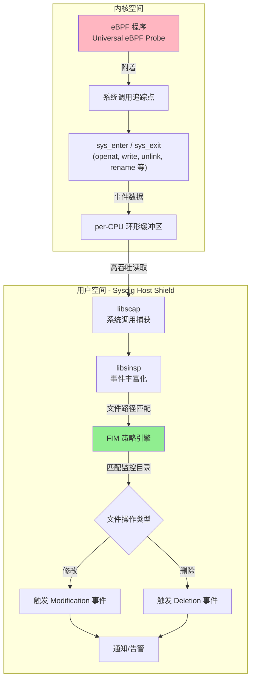
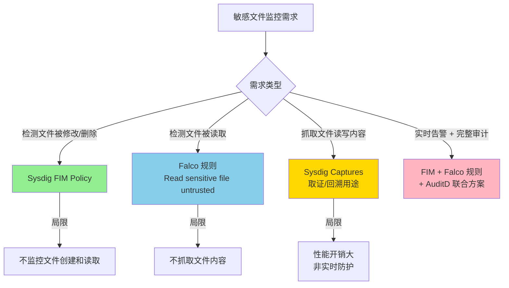
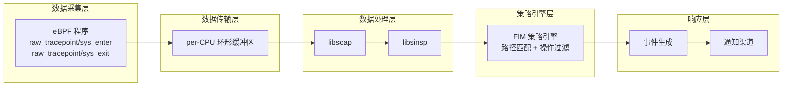

# Sysdig FIM（文件完整性监控）深度分析

> 参考文档：[Sysdig FIM Policy](https://docs.sysdig.com/en/sysdig-secure/fim-policy/)
> 参考文章：本系列全部 6 篇 Sysdig/Falco/eBPF 相关文章
> 分析时间：2026 年 3 月 26 日

---

## 一、FIM 概述

**FIM（File Integrity Monitoring，文件完整性监控）** 是 Sysdig Secure 的一项核心安全能力，用于监控指定目录中的文件变更（修改和删除），是合规审计（如 PCI DSS、HIPAA）和入侵检测的关键功能。

---

## 二、FIM 的实现机制深度分析

### 2.1 底层技术栈

结合本系列所有文章的信息，Sysdig FIM 的实现机制可以梳理如下：



### 2.2 关键实现细节

#### 2.2.1 数据来源：eBPF 系统调用追踪

FIM **强制要求启用 Universal eBPF 探针**（文档明确指出："Universal eBPF probe enabled"）。这意味着：

1. eBPF 程序通过 `raw_tracepoint/sys_enter` 和 `raw_tracepoint/sys_exit` 追踪点拦截所有系统调用
2. 对于文件操作相关的系统调用（如 `openat`、`write`、`unlink`、`rename`、`truncate` 等），eBPF 程序提取：
   - 系统调用参数（特别是文件路径）
   - 进程信息（PID、进程名、命令行）
   - 用户信息（UID）
   - 容器/cgroup 信息

3. 数据通过 **per-CPU 环形缓冲区**（而非 eBPF Maps）高效传递到用户态

正如系列文章第二篇所述，路径名提取涉及：
- 使用 `bpf_probe_read` 安全读取 `pt_regs` 中的系统调用参数
- 使用 `bpf_probe_read_str` 读取路径字符串
- 使用 per-CPU Map 存储 `PATH_MAX`（4096 字节）的路径缓冲区

#### 2.2.2 事件丰富化：libsinsp

libsinsp（70K+ 行代码）负责将原始系统调用事件转化为有意义的文件操作信息：

| 原始数据 | 丰富化后 |
|----------|----------|
| 文件描述符号 (fd) | 文件路径 |
| 系统调用 ID | 操作类型（read/write/unlink） |
| PID | 进程名 + 完整命令行 + 进程树 |
| cgroup ID | 容器 ID + 容器镜像 |
| UID | 用户名 |

#### 2.2.3 FIM 策略引擎

FIM 策略引擎在用户态进行**路径匹配**：

```
文件操作事件 → 提取文件路径 → 与监控目录列表匹配 → 排除已排除目录 → 触发告警
```

**重要**：FIM 是在策略加载时对**已存在的文件**建立监控基线。这意味着它不是简单的 inotify 机制，而是基于系统调用的实时追踪。

### 2.3 与其他 FIM 实现的对比

| 特性 | Sysdig FIM (eBPF) | inotify | AuditD FIM |
|------|-------------------|---------|------------|
| 实现层 | eBPF 系统调用追踪 | VFS 层通知 | 内核审计框架 |
| 容器感知 | **是** | 否 | 否 |
| 符号链接处理 | 需要使用实际路径 | 监控实际路径 | 同时记录符号链接和实际路径 |
| 正则表达式支持 | **是**（Google RE2） | 否 | 否 |
| 性能影响 | 低（eBPF JIT） | 低 | 中等 |
| 监控范围 | 修改 + 删除 | 创建/修改/删除/移动/属性变更 | 完全可定制 |
| 内核版本要求 | 4.14+ | 2.6.13+ | 2.6+ |

---

## 三、FIM 支持的功能详解

### 3.1 监控的文件操作类型

根据官方文档，FIM 策略支持两种检测规则：

| 规则类型 | 说明 | 触发场景 |
|----------|------|----------|
| **Modification（修改）** | 检测文件内容被修改 | 文件被写入新内容时触发。**注意：文件创建时不触发** |
| **Deletion（删除）** | 检测文件被删除 | 文件被 `unlink`/`rm` 等操作删除时触发 |

**重要限制**：
- **不监控文件创建**——Modification 规则明确说明"This doesn't trigger upon file creation"
- **不监控文件属性变更**（权限、所有者等）
- **不监控文件重命名**（至少文档未提及）

### 3.2 作用域配置

| 参数 | 说明 |
|------|------|
| **Scope** | 可选择 Hosts Only / Containers Only / Custom Scope |
| **Monitored Directories** | 逗号分隔的监控目录列表 |
| **Excluded Directories** | 逗号分隔的排除目录列表（必须是监控目录的子目录） |
| **Use Regex** | 启用 Google RE2 正则表达式匹配路径（会显著增加 CPU 使用） |

### 3.3 策略参数

| 参数 | 说明 |
|------|------|
| **Name** | 策略名称，必须唯一 |
| **Severity** | High / Medium / Low / Info |
| **Enabled** | 启用/禁用开关 |
| **Link to Runbook** | 可链接到公司处置流程文档 |
| **Notify** | 选择通知渠道 |

### 3.4 符号链接处理

文档明确指出：对于符号链接，**需要使用实际路径**进行监控配置，而非符号链接路径。这与 AuditD 不同（AuditD 同时记录符号链接和实际文件）。

### 3.5 前提条件

- Sysdig Secure 许可
- **Universal eBPF 探针必须启用**
- Agent 14.3+
- Host Shield 配置中 `features.detections.file_integrity_monitoring=true`

---

## 四、关于敏感文件抓取功能的分析

### 4.1 FIM 本身是否支持敏感文件内容抓取？

**不支持。** 根据文档和技术架构分析：

FIM 的功能定位是**检测文件变更事件**（谁、何时、对哪个文件做了什么操作），而**不是读取或捕获文件内容本身**。

具体来说：

| 能力 | FIM 是否支持 |
|------|-------------|
| 检测文件被修改 | ✅ 是 |
| 检测文件被删除 | ✅ 是 |
| 记录操作者信息（用户、进程、命令行） | ✅ 是（通过 libsinsp 丰富化） |
| 记录容器/K8s 上下文 | ✅ 是 |
| **抓取/读取文件内容** | ❌ **不支持** |
| 检测文件被读取 | ❌ 不支持（FIM 仅监控修改和删除） |
| **检测敏感文件被读取** | ❌ 不支持（但 Falco 规则可以做到） |
| 文件内容哈希比对 | ❌ 未提及 |

### 4.2 Sysdig 生态中能抓取敏感文件访问的功能

虽然 FIM 本身不支持，但 Sysdig/Falco 生态中有其他方式可以实现对敏感文件的监控：

#### 4.2.1 Falco 规则——检测敏感文件读取

Falco 的 "Read sensitive file untrusted" 规则可以检测**敏感文件被读取**的行为：

```yaml
- rule: Read sensitive file untrusted
  condition: >
    sensitive_files and open_read
    and proc_name_exists
    and not user_known_read_sensitive_files_activities
  output: >
    Sensitive file opened for reading by non-trusted program
    (user=%user.name program=%proc.name file=%fd.name
     container_id=%container.id image=%container.image.repository)
  priority: WARNING
```

其中 `sensitive_files` 宏定义了敏感文件列表（如 `/etc/shadow`、`/etc/passwd` 等）。

这个规则能检测到**谁读取了敏感文件**，但**不会抓取文件内容**。

#### 4.2.2 Sysdig Captures——系统调用级数据捕获

Sysdig 的 **Captures** 功能可以录制系统调用级别的完整数据流，包括：
- `read()` / `write()` 系统调用的**数据缓冲区内容**
- 网络连接的**数据包内容**

这意味着理论上 Captures **可以捕获文件读写的实际内容**，但这是一个取证/回溯功能，不是实时防护。

#### 4.2.3 Linux Workload Policy 规则

Sysdig Secure 的 Linux Workload Policy 提供了更广泛的运行时检测规则，可以检测：
- 写入 `/etc/` 以下的文件
- 读取敏感文件
- 修改 shell 配置文件
- 修改系统日志配置

### 4.3 敏感文件监控方案推荐

针对不同需求，推荐的方案如下：



---

## 五、FIM 实现机制总结

### 5.1 技术架构全景



### 5.2 功能与限制总结

| 维度 | 支持情况 |
|------|----------|
| 文件修改检测 | ✅ |
| 文件删除检测 | ✅ |
| 目录级监控 | ✅ |
| 排除特定子目录 | ✅ |
| 正则表达式路径匹配 | ✅（RE2） |
| 主机级作用域 | ✅ |
| 容器级作用域 | ✅ |
| 自定义作用域 | ✅ |
| 严重级别分级 | ✅ |
| Runbook 链接 | ✅ |
| 通知渠道集成 | ✅ |
| 文件创建检测 | ❌ |
| 文件读取检测 | ❌ |
| 文件属性变更检测 | ❌ |
| 文件内容抓取 | ❌ |
| 文件哈希比对 | ❌ |
| 不依赖 eBPF（旧内核兼容） | ❌ |

### 5.3 与传统 FIM 方案的差异

Sysdig FIM 相比传统 FIM 工具（如 OSSEC/Wazuh、Tripwire、AIDE）的核心差异在于：

1. **基于 eBPF 的实时系统调用追踪**，而非定期扫描或 inotify
2. **原生容器/Kubernetes 感知**，可以区分主机事件和容器事件
3. **不做文件哈希比对**——传统 FIM 通常会定期计算文件哈希并对比，Sysdig FIM 纯粹基于系统调用事件
4. **功能范围更窄**——仅修改和删除，传统 FIM 通常覆盖创建、修改、删除、属性变更、权限变更等全部操作

---

## 六、个人思考与建议

1. **Sysdig FIM 的定位是"轻量级实时文件变更检测"**，而非传统意义上的全功能 FIM。如果需要完整的 FIM 能力（包括文件哈希比对、属性监控等），可能需要结合其他工具

2. **eBPF 追踪方式的优势在于实时性和低开销**，但受限于 eBPF 验证器的安全约束，无法在内核态直接读取文件内容。文件内容抓取只能在用户态通过 Captures 功能实现

3. **生产环境推荐方案**：
   - 合规审计：Sysdig FIM + AuditD 联合部署
   - 入侵检测：FIM + Falco 规则组合
   - 取证分析：Sysdig Captures 按需录制

4. **关于敏感文件"抓取"**：如果需求是检测对敏感文件的非授权访问，Falco 的 `Read sensitive file untrusted` 规则是更合适的选择。如果需求是实际获取文件内容（如数据泄露检测），则需要在用户态结合其他机制实现
