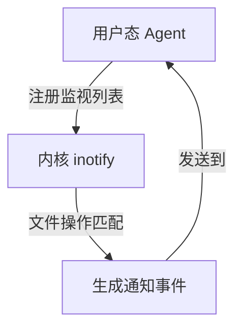
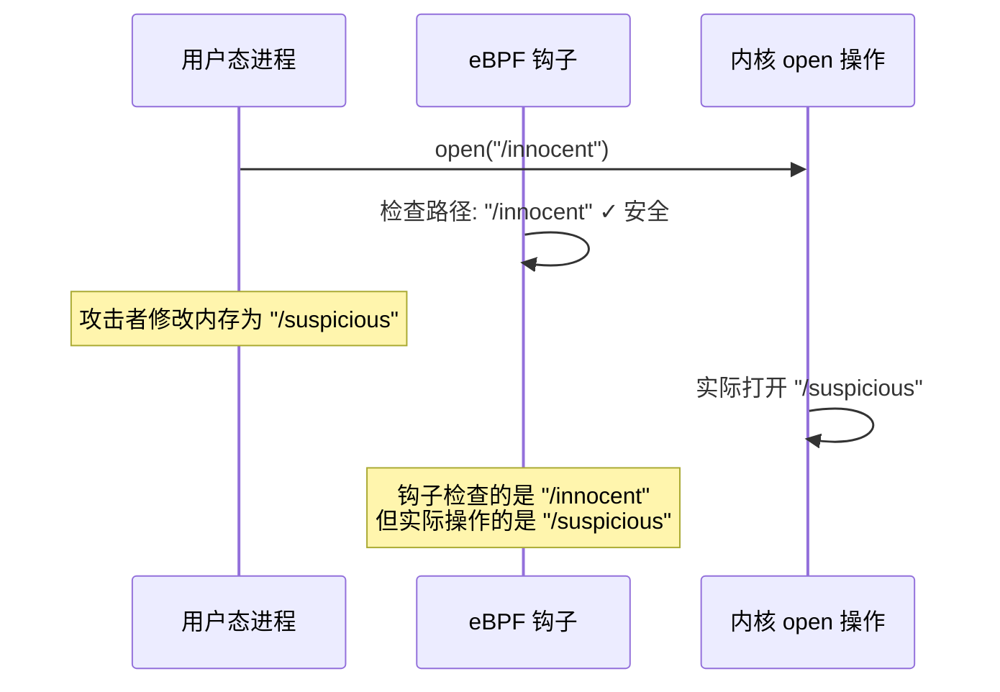
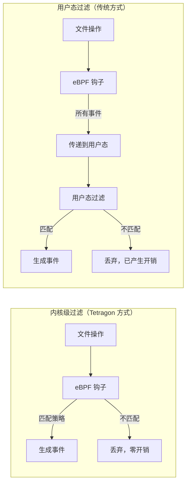
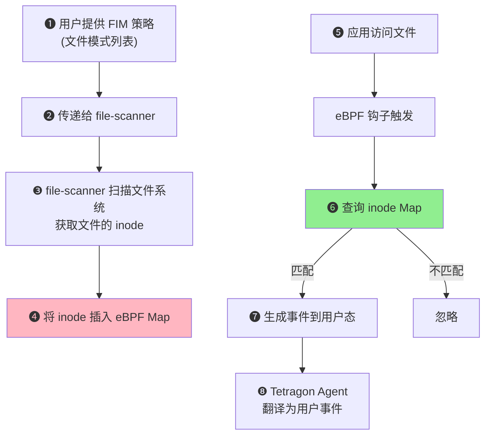
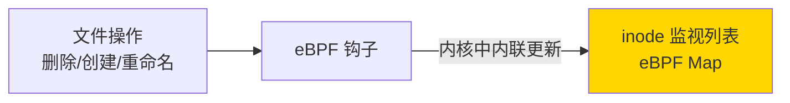
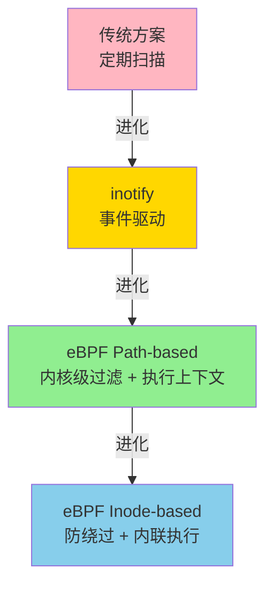

# 使用 eBPF 和 Tetragon 实现文件监控（第一部分）—— 翻译与深度分析

> 原文链接：[File Monitoring with eBPF and Tetragon (Part 1)](https://isovalent.com/blog/post/file-monitoring-with-ebpf-and-tetragon-part-1/)
> 作者：Kornilios Kourtis（高级首席软件工程师）、Anastasios Papagiannis（高级软件工程师）
> 原文发布时间：2024 年 3 月 13 日
> 翻译与分析时间：2026 年 3 月 26 日
> 本地存档：`origin/Message from Welcome to Isovalent!.mhtml`

---

## 一、文章摘要

本文是 Isovalent 关于 Tetragon 文件监控系列文章的第一篇，深入探讨了为什么 eBPF 是云原生 FIM（文件完整性监控）的未来，以及 Tetragon 如何利用 eBPF 实现低开销、高可扩展性的内核级文件监控和策略执行。文章从传统 FIM 方案的局限性讲起，逐步展示了基于路径（path-based）和基于 inode（inode-based）两种 FIM 实现方式，以及 Tetragon 如何解决 TOCTOU 竞态条件、inotify 限制等技术挑战。

**副标题**：为什么 eBPF 是云原生 FIM 的未来——Tetragon 文件监控与执行架构的技术解析。

---

## 二、Tetragon 简介

[Cilium Tetragon](https://tetragon.io/) 是 Isovalent（现属 Cisco）开发的基于 eBPF 的运行时安全和可观测性工具，是 Cilium 生态的一部分。它通过在内核中安装 eBPF 钩子（kprobe、tracepoint 等）来追踪系统行为，支持：

- 进程生命周期追踪
- 文件访问监控
- 网络活动监控
- **内联策略执行**（直接在内核中阻止操作，而非事后通知）

---

## 三、传统 FIM 方案的局限性

### 3.1 定期扫描方案


**局限性**：
| 问题 | 说明 |
|------|------|
| 无法检测读取 | 只能检测修改，不能检测文件被读取 |
| 不可靠 | 攻击者可以在两次扫描之间修改文件并恢复原状，完美逃避检测 |
| 非实时 | 存在检测延迟窗口 |

### 3.2 inotify 方案

`inotify` 是 Linux 内核提供的专用文件监控机制。应用程序注册文件和事件形成"监视列表"，匹配的操作发生时内核生成通知事件。

**inotify 架构**：


**inotify 的三大局限**：

| 局限 | 说明 | 影响 |
|------|------|------|
| **缺乏执行上下文** | 无法关联操作的 PID、cgroup、Kubernetes workload 信息 | 无法基于"谁"做了操作来过滤 |
| **监控目录的竞态条件** | 新建子目录时，在 Agent 将其加入监视列表之前的文件操作会被遗漏 | 存在监控盲区 |
| **缺乏执行能力** | 只能事后通知，无法阻止操作 | 无法实现内联策略执行 |

**竞态条件具体场景**：
1. Agent 将 `/private` 加入监视列表
2. 应用创建 `/private/data` 目录
3. inotify 通知 Agent 新目录被创建
4. Agent 将 `/private/data` 加入监视列表

如果在步骤 2 和步骤 4 之间有文件被访问，该访问**不会被监控到**。

### 3.3 为什么选择 eBPF？

eBPF 解决了上述所有问题：

| 能力 | eBPF 如何实现 |
|------|--------------|
| 执行上下文关联 | 在 eBPF 钩子中直接获取进程信息、凭据、K8s workload 身份 |
| 消除竞态条件 | 在内核中内联更新监控状态，无需用户态往返 |
| 内联执行 | eBPF 程序可以覆盖函数返回值来阻止操作 |
| 快速迭代 | 无需修改内核源码，通过 eBPF 在用户态交付新功能 |

---

## 四、Tetragon 的 FIM 实现——基于路径的方案（Path-based）

### 4.1 钩子选择：为什么不用系统调用？

**TOCTOU（Time-of-Check to Time-of-Use）攻击**：

如果在系统调用入口安装 eBPF 钩子，路径名存储在**用户态内存**中。攻击者可以在钩子检查后、内核实际使用路径名前修改它：



**解决方案**：钩入**路径已从用户态拷贝到内核态之后**的函数。Tetragon 选择钩入 LSM（Linux Security Modules）框架中的 `security_` 系列函数：

| 钩子函数 | 触发时机 | 特点 |
|----------|----------|------|
| `security_file_permission` | **每次**文件访问时 | 全面但开销更大 |
| `security_file_open` | 文件被**打开**时 | 每个文件仅触发一次，开销更小，但可能遗漏已打开的文件 |
| `security_file_truncate` | 文件被截断时 | 特定操作 |
| `security_file_ioctl` | ioctl 操作时 | 特定操作 |

### 4.2 基础策略：监控所有文件访问

```yaml
apiVersion: cilium.io/v1alpha1
kind: TracingPolicy
metadata:
  name: "file-all"
spec:
  kprobes:
  - call: "security_file_permission"
    syscall: false
```

**注意**：这个策略会为系统中**每一次**文件访问生成事件，**切勿在生产环境使用**。

生成的事件包含完整的**执行上下文**：

```json
{
  "process_kprobe": {
    "process": {
      "exec_id": "OjE3OTAzNjQ1NTM3MDU5Nzo5NTgyMTY=",
      "pid": 958216,
      "uid": 1000,
      "cwd": "/home/kkourt/",
      "binary": "/usr/bin/cat",
      "arguments": "/etc/motd",
      "flags": "execve clone",
      "start_time": "2024-02-15T14:04:46.247027285Z",
      "auid": 1000
    },
    "parent": {
      "binary": "/usr/bin/zsh",
      ...
    },
    "function_name": "security_file_permission",
    "policy_name": "file-all"
  },
  "time": "2024-02-15T14:04:46.247481212Z"
}
```

关键信息包括：进程 PID、UID、二进制路径、命令行参数、父进程信息、审计 UID（auid）。在云原生环境中还包含容器和 Pod 信息。

### 4.3 精细化策略：监控特定敏感文件

通过 `selectors` 和 `matchArgs` 实现内核级过滤：

```yaml
apiVersion: cilium.io/v1alpha1
kind: TracingPolicy
metadata:
  name: "file-ssh-keys"
spec:
  kprobes:
  - call: "security_file_permission"
    syscall: false
    args:
    - index: 0
      type: "file"  # (struct file *) 用于获取路径
    selectors:
    - matchArgs:
      - index: 0
        operator: "Equal"
        values:
        - "/etc/ssh/ssh_host_rsa_key"
        - "/etc/ssh/ssh_host_ed25519_key"
        - "/etc/ssh/ssh_host_ecdsa_key"
```

**关键设计**：
- 第一个参数类型为 `file`，对应内核中的 `struct file`。Tetragon 包含专门的 eBPF 代码从这个内核结构体中提取文件路径
- 过滤在**内核中完成**（in-kernel filtering），只有匹配的事件才会传递到用户态

### 4.4 内核过滤 vs 用户态过滤



内核级过滤的优势：对于文件访问这种**高频事件**，避免为不相关事件生成和传输数据可以**显著降低开销**。

### 4.5 内联策略执行（Inline Enforcement）

Tetragon 可以**直接在内核中阻止操作**，通过覆盖函数返回值来返回错误：

```yaml
apiVersion: cilium.io/v1alpha1
kind: TracingPolicy
metadata:
  name: "file-rsa-keys-open"
spec:
  kprobes:
  - call: "security_file_open"
    syscall: false
    args:
    - index: 0
      type: "file"
    selectors:
    - matchArgs:
      - index: 0
        operator: "Equal"
        values:
        - "/etc/ssh/ssh_host_rsa_key"
        - "/etc/ssh/ssh_host_ed25519_key"
        - "/etc/ssh/ssh_host_ecdsa_key"
      matchBinaries:
      - operator: "In"
        values:
        - "/usr/bin/cat"
      matchActions:
      - action: Override
        argError: -1
```

这个策略**阻止** `/usr/bin/cat` 访问 SSH 密钥文件。`cat` 执行时会直接收到错误，文件操作**不会被执行**。

**关键洞察**：如果没有内核级过滤，等事件到达用户态时操作已经执行完毕，**无法实现真正的阻止**。

---

## 五、路径名的陷阱——为什么需要 Inode-based FIM

### 5.1 问题：同一文件可以有多个名称

在 Linux 中，同一个文件可以通过多种方式拥有多个路径名：

| 机制 | 所需权限 | 说明 |
|------|----------|------|
| **硬链接**（Hard Link） | 文件读权限（`fs.protected_hardlinks=1` 时） | `ln /etc/ssh/ssh_host_rsa_key /mykey` |
| **绑定挂载**（Bind Mount） | `CAP_SYS_ADMIN` | `mount --bind /etc/ssh/ssh_host_rsa_key /mykey2` |
| **chroot** | `CAP_CHROOT` | 改变根目录后路径变化 |

如果策略监控 `/etc/ssh/ssh_host_rsa_key`，但攻击者通过 `/mykey`（硬链接）或 `/mykey2`（绑定挂载）访问同一文件，基于路径的策略**无法检测到**。

### 5.2 Inode：文件的真实身份

Inode（索引节点）在单个文件系统内唯一标识一个底层文件，不受路径名影响：

```bash
# stat /etc/ssh/ssh_host_rsa_key | grep Inode
Device: 259,2   Inode: 36176340    Links: 1

# ln /etc/ssh/ssh_host_rsa_key /mykey
# stat /mykey | grep Inode
Device: 259,2   Inode: 36176340    Links: 2

# touch /mykey2
# mount --bind /etc/ssh/ssh_host_rsa_key /mykey2
# stat /mykey2 | grep Inode
Device: 259,2   Inode: 36176340    Links: 2
```

三个路径名指向**同一个 inode**。

---

## 六、Tetragon 的 Inode-based FIM 实现

### 6.1 架构概览



### 6.2 inode 监视列表的动态维护

如果文件被删除并重新创建，其 inode 号会改变。Tetragon 通过额外的 eBPF 程序监控**会改变 inode 监视列表的操作**：

- 文件删除：从监视列表中移除旧 inode
- 文件创建（同名）：将新 inode 加入监视列表
- 文件重命名：更新监视列表



**对比 inotify 的优势**：eBPF 可以在内核中**内联更新**监视状态，而 inotify 需要先通知用户态、用户态再更新监视列表——这引入了竞态条件。

**特殊情况**：某些 `rename` 系统调用的场景下，状态无法直接从 eBPF 程序更新。Tetragon 通过两种方式处理：
1. **阻止这些 rename 操作**（使用内联执行）
2. **用户态重新扫描文件系统**来确定新状态

### 6.3 Inode-based 策略示例

```yaml
apiVersion: cilium.io/v1alpha1
kind: TracingPolicy
metadata:
  name: "file-ssh-keys-inode-based"
spec:
  file:
    file_paths:
    - "/etc/ssh/ssh_host_rsa_key"
    - "/etc/ssh/ssh_host_ed25519_key"
    - "/etc/ssh/ssh_host_ecdsa_key"
    monitorHostFiles: true
```

相比 path-based 策略的优势：
- **用户无需了解内核函数**——不需要指定 `kprobes` 和 `security_file_permission`
- **自动处理硬链接/绑定挂载**——无论通过什么路径名访问，都能检测到
- **监控范围更广**——不仅包括读写，还包括重命名、权限变更、删除等元数据操作

### 6.4 Inode-based 事件输出

事件包含丰富的文件系统元数据：

```json
{
  "process_file": {
    "process": {
      "binary": "/usr/bin/cat",
      "arguments": "/mykey",
      ...
    },
    "action": "FILE_READ",
    "args": {
      "generic_arg": {
        "file": {
          "str": "/etc/ssh/ssh_host_rsa_key",
          "inode": {
            "number": "63635",
            "fs": {
              "name": "ext4",
              "dev": "8:1",
              "id": "sda1",
              "uuid": "5b8e9b9c-a139-4214-973c-339a7e39ed55"
            }
          },
          "parent_inode": { ... },
          "location": { "type": "HOST_FILE" }
        },
        "mnt_ns": {
          "inum": 4026531841,
          "is_host": true
        }
      }
    },
    "hook": "security_file_permission"
  }
}
```

注意：即使通过硬链接 `/mykey` 访问，事件的 `file.str` 仍然显示原始路径 `/etc/ssh/ssh_host_rsa_key`，并包含完整的 inode 信息。

---

## 七、功能对比表

| 功能 | Tetragon OSS | Tetragon 企业版 |
|------|:------------:|:--------------:|
| Path-based FIM | ✅ | ✅ |
| Inode-based FIM | ❌ | ✅ |

---

## 八、与 Sysdig FIM 的对比分析

结合前面分析的 Sysdig FIM，两者的深度对比：

| 维度 | Tetragon FIM | Sysdig FIM |
|------|-------------|------------|
| **底层技术** | kprobe 钩入 `security_*` 函数 | eBPF 追踪系统调用入口/出口 |
| **TOCTOU 防护** | ✅ 钩入内核态函数，避免竞态 | 未明确提及 |
| **监控操作** | 读取 + 写入 + 元数据变更（重命名/权限/删除/创建） | 仅修改 + 删除 |
| **读取检测** | ✅ 支持 | ❌ 不支持 |
| **内联执行（阻止操作）** | ✅ Override 返回值 | ❌ 不支持 |
| **Inode-based 监控** | ✅（企业版） | ❌ |
| **内核级过滤** | ✅ 通过 selectors | ✅ 通过路径匹配 |
| **K8s/容器感知** | ✅ | ✅ |
| **策略灵活性** | 极高（可钩入任意内核函数） | 中等（固定监控目录/排除目录） |
| **易用性** | 较低（需要内核知识） | 较高（GUI 配置） |
| **正则表达式** | 支持前缀匹配 | RE2 正则 |
| **合规标准** | NIST、PCI-DSS、HIPAA、CIS、SOC | 类似 |
| **定位** | 开源 + 企业版 | 纯商业产品 |

---

## 九、核心技术要点总结

### 9.1 Tetragon FIM 的三大技术创新

1. **钩入 LSM Security 函数**而非系统调用入口，从根本上避免了 TOCTOU 攻击
2. **内核级过滤 + 内联执行**——在 eBPF 钩子中完成事件过滤和操作阻止，开销极低
3. **Inode-based 监控**——通过维护 inode 到 eBPF Map 的映射，解决了硬链接/绑定挂载绕过路径检查的问题

### 9.2 架构设计哲学



---

## 十、个人思考与分析

### 10.1 Tetragon 的技术优势

1. **TOCTOU 防护是真正的安全创新**——大多数 FIM 工具钩入系统调用层面，Tetragon 选择钩入 `security_file_permission`/`security_file_open` 是经过深思熟虑的安全设计
2. **内联执行能力让 FIM 从"监控"升级为"防护"**——传统 FIM 只能事后告警，Tetragon 可以在操作发生前阻止它
3. **Inode-based 方案解决了长期以来路径检查的根本性缺陷**——硬链接和绑定挂载绕过路径检查是已知问题，但很少有 FIM 工具能解决

### 10.2 需要注意的问题

1. **kprobe 的稳定性风险**——`security_file_permission` 是内核内部函数，不是稳定 ABI。内核升级可能改变函数签名，导致 eBPF 程序需要更新
2. **性能权衡**——`security_file_permission` 在每次文件访问时都被调用，即使有内核级过滤，在 I/O 密集型工作负载上仍需评估影响
3. **inode 回收问题**——文件删除后 inode 号可能被回收分配给新文件，Tetragon 需要确保监视列表的及时更新
4. **企业版 vs 开源版**——Inode-based FIM 是企业版独有功能，开源用户只能使用 path-based 方案

### 10.3 与 Sysdig FIM 的选型建议

| 场景 | 推荐方案 |
|------|----------|
| 需要阻止文件操作（如阻止读取密钥文件） | Tetragon（内联执行） |
| 需要防止路径绕过（硬链接/绑定挂载） | Tetragon 企业版（Inode-based） |
| 需要简单的文件修改/删除监控 | Sysdig FIM（更易配置） |
| 需要检测敏感文件被读取 | Tetragon（支持读取检测） |
| 已有 Cilium 技术栈 | Tetragon |
| 已有 Sysdig/Falco 技术栈 | Sysdig FIM + Falco 规则 |
