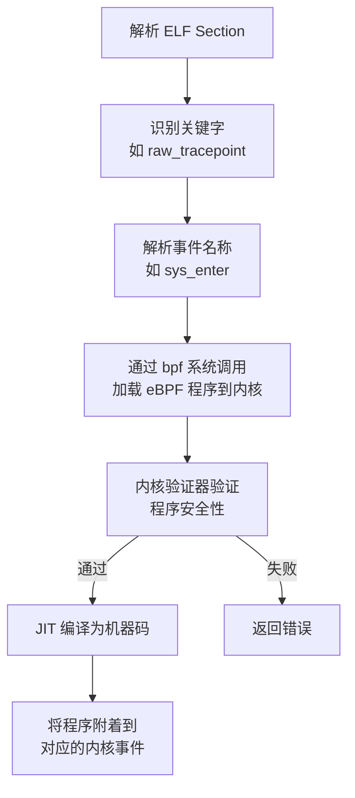

# eBPF 程序编写的艺术：入门指南

> 原文链接：[The art of writing eBPF programs: a primer](https://www.sysdig.com/blog/the-art-of-writing-ebpf-programs-a-primer)
> 作者：Gianluca Borello
> 原文发布时间：2019 年 2 月 27 日
> 翻译与总结时间：2026 年 3 月 26 日

---

## 一、文章摘要

这是 Sysdig eBPF 系列文章的第二篇，以实战驱动的方式深入讲解了 eBPF 程序的编写过程。文章以解码 `openat` 系统调用的参数（特别是路径名）为目标，逐步展示了 eBPF 验证器、内存访问、Helper 函数、eBPF Maps 等核心机制，并揭示了编写 eBPF 程序时需要应对的各种"陷阱"。

---

## 二、核心内容翻译与总结

### 2.1 实验目标：解码 openat 系统调用

文章选择解码 `openat` 系统调用作为实验目标：

```c
int openat(int dirfd, const char *pathname, int flags, mode_t mode);
```

目标是提取系统调用的输入参数，特别是 **pathname**（路径名）字符串。

### 2.2 第一个 eBPF 程序与 ELF Section

最简单的 eBPF 程序：

```c
__attribute__((section("raw_tracepoint/sys_enter"), used))
void bpf_openat_parser()
{
}
```

- 使用编译器属性 `__attribute__((section(...)))` 告诉 LLVM 将代码放入特定的 ELF section
- Section 名称 `raw_tracepoint/sys_enter` 是开发者与 eBPF 加载器之间的隐式协议
- 编译后通过 `llvm-readelf` 和 `llvm-objdump` 可以查看生成的 eBPF 字节码

编译后的字节码只有一条 `exit` 指令。

### 2.3 eBPF 加载器的工作流程

eBPF 加载器（在 Sysdig 中嵌入在 scap 库中）负责：



### 2.4 eBPF 验证器（Verifier）

**第一次遭遇验证器**：空函数被拒绝加载

```
R0 !read_ok
```

原因：每个 eBPF 程序必须在 R0 寄存器中返回一个整数值。验证器通过**模拟每一个可能的执行分支**，跟踪寄存器的值和类型，确保它们在被读取前已被正确初始化。

修复：将函数原型改为返回 `int` 并 `return 0`。

### 2.5 上下文（Context）与内存访问

每个 eBPF 程序启动时，R1 寄存器中包含指向**上下文结构体**的指针。对于 raw tracepoint：

```c
struct bpf_raw_tracepoint_args {
    __u64 args[0];
};
```

`sys_enter` 追踪点的参数：
- `args[0]`：`struct pt_regs *regs`（CPU 寄存器保存副本）
- `args[1]`：`long id`（系统调用 ID）

根据 System V ABI，系统调用参数通过 CPU 寄存器传递：
- 第 1 个参数：`rdi`
- 第 2 个参数：`rsi`（pathname 在这里）
- 第 3 个参数：`rdx`
- ...

**关键发现**：直接解引用 `pt_regs` 结构会被验证器拒绝！

```
3: (79) r1 = *(u64 *)(r1 +104)
R1 invalid mem access 'inv'
```

原因：验证器无法确定 `pt_regs` 指针是否有效。如果指针为 NULL 或指向非法地址，JIT 编译后的代码执行内存访问时可能导致内核崩溃。

**重要规则**：验证器**信任上下文结构体成员的解引用**（知道它始终是有效的），但**不信任从上下文中获取的间接指针的解引用**。

### 2.6 eBPF Helper 函数

解决方案：使用 `bpf_probe_read` Helper 函数进行安全的内存读取。

```c
bpf_probe_read(&pathname, sizeof(pathname), &regs->si);
```

`bpf_probe_read` 相当于安全版的 `memcpy`：
- 传入任意内存指针，它会尝试安全读取
- 如果内存不安全，只会返回错误，**不会崩溃**
- 实现原理与 Linux 页错误处理器相关

eBPF 调用约定：参数通过 R1-R5 寄存器顺序传递。

### 2.7 字符串处理

使用 `bpf_probe_read_str`（Sysdig 贡献给内核的 Helper）读取路径字符串：

```c
char buf[64];
int res;
res = bpf_probe_read_str(buf, sizeof(buf), pathname);
```

**栈大小限制**：eBPF 虚拟环境的栈只有 **512 字节**。如果尝试分配 `PATH_MAX`（4096 字节）的栈变量：

```
error: Looks like the BPF stack limit of 512 bytes is exceeded.
Please move large on stack variables into BPF per-cpu array map.
```

### 2.8 eBPF Maps 解决栈空间不足

使用 per-CPU 数组 Map 替代栈变量：

```c
__attribute__((section("maps"), used))
struct bpf_map_def tmp_storage_map = {
    .type = BPF_MAP_TYPE_PERCPU_ARRAY,
    .key_size = sizeof(u32),
    .value_size = PATH_MAX,
    .max_entries = 1,
};
```

关键设计：
- **per-CPU** 确保每个 CPU 核心有自己独立的存储槽
- eBPF 程序执行期间**永远不会被抢占**，因此 per-CPU map 是安全的，不会出现竞态条件
- 通过 `bpf_map_lookup_elem` 获取运行时的 Map 存储区
- 可以直接将 Map 区域地址作为 BPF Helper 函数的参数（Sysdig 贡献的内核改进）

### 2.9 变长内存访问的验证器挑战

尝试手动 NULL 终止字符串时：

```c
res = bpf_probe_read_str(map_value, PATH_MAX, pathname);
if (res > 0)
    map_value[res - 1] = 0;
```

验证器拒绝！原因：验证器不知道 `res` 的上界，即使我们知道它不会超过 `PATH_MAX`。

**解决方案**：利用位运算帮助验证器理解边界：

```c
if (res > 0)
    map_value[(res - 1) & (PATH_MAX - 1)] = 0;
```

`& (PATH_MAX - 1)` 确保偏移量永远在 0 到 4095 之间，验证器能够追踪到 `umax_value=4095`。

这也是 Sysdig 贡献给内核的改进之一。

### 2.10 最终成果

将路径名打印到内核追踪日志：

```c
char fmt[] = "path_name:%s\n";
bpf_trace_printk(fmt, sizeof(fmt), map_value);
```

输出结果：
```
htop-1960  [001] .... 20839.191270: 0: path_name:/proc/124286/task
htop-1960  [001] .... 20839.191283: 0: path_name:/proc/124286/statm
htop-1960  [001] .... 20839.191292: 0: path_name:/proc/124286/stat
```

---

## 三、关键技术要点总结

### 3.1 eBPF 验证器的核心原则

| 原则 | 说明 |
|------|------|
| 返回值必须初始化 | R0 必须在所有执行路径上被写入 |
| 上下文访问是安全的 | 验证器信任对上下文成员的直接解引用 |
| 间接指针必须安全读取 | 从上下文获取的指针解引用必须使用 `bpf_probe_read` |
| 变量偏移必须有界 | 用作内存偏移的变量必须有已知的上界 |
| 栈空间受限 | 最大 512 字节，大数据需使用 eBPF Maps |

### 3.2 Sysdig 对 Linux 内核的贡献

| 贡献 | 用途 |
|------|------|
| `bpf_probe_read_str` | 字符串感知的安全内存读取 |
| Map 区域作为 Helper 参数 | 直接将 Map 存储地址传递给 Helper 函数 |
| 位运算边界检查优化 | 帮助验证器理解编译时未知大小的数据边界 |

### 3.3 eBPF 程序编写的"艺术性"

文章标题用了"Art"（艺术）而非"Science"（科学），这不是偶然的：

- 编译器可能以验证器无法理解的方式重排分支代码
- 同一逻辑的不同 C 表达方式可能导致一种被验证器接受、另一种被拒绝
- 需要开发者理解验证器的工作机制，主动"帮助"验证器完成验证
- 每个新内核版本都在让验证器更智能，但向后兼容性仍是挑战

---

## 四、个人思考

1. **验证器是 eBPF 安全性的核心保障，也是开发的最大挑战**。它采用静态分析的方式模拟所有可能的执行路径，这种保守策略虽然有时会拒绝实际安全的代码，但确保了内核的绝对安全
2. **`bpf_probe_read` 的设计思想**值得学习——通过在 Helper 层面封装安全的内存访问，将安全边界从开发者转移到了框架层
3. **512 字节栈限制 + per-CPU Map** 的组合方案，在资源受限环境下是一种优雅的设计模式
4. 文章展示的**从编译器到验证器到 JIT 的完整链路**，对理解 eBPF 底层机制非常有价值
