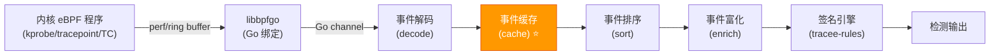
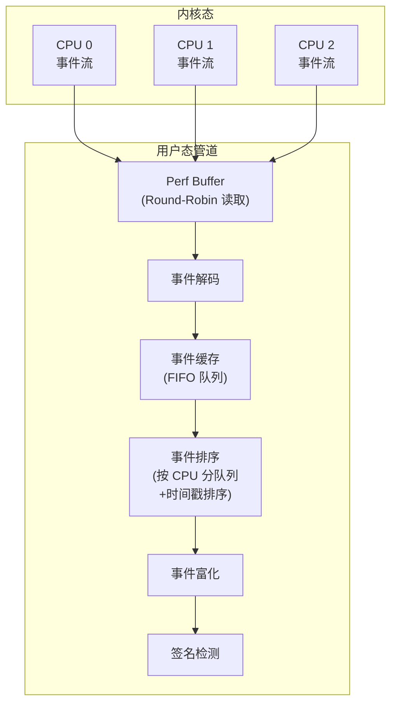
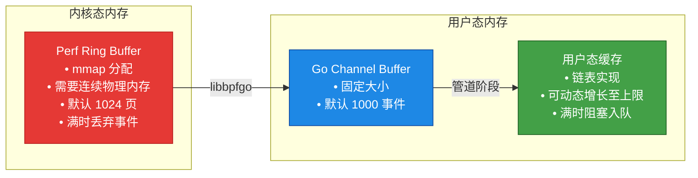
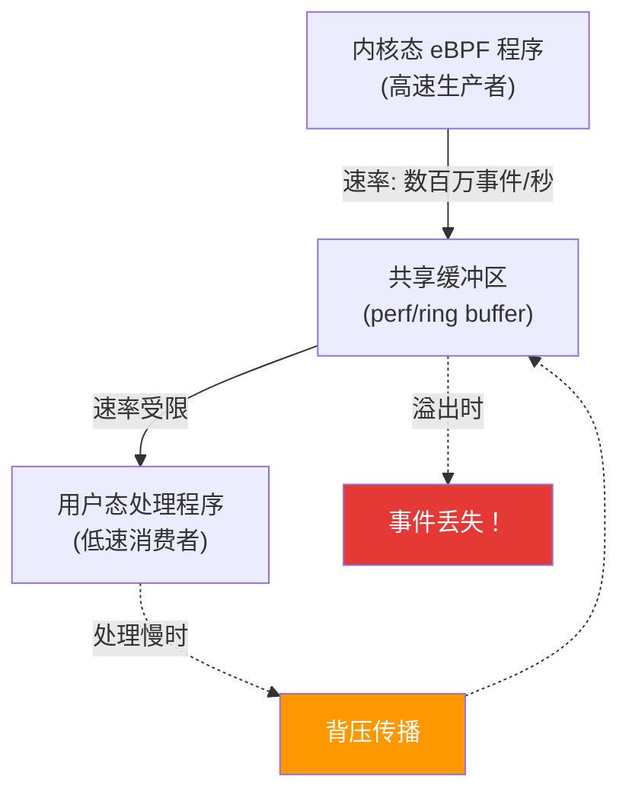

# Tracee 事件缓存机制（Caching Events）深度翻译与分析

> 原文链接：[Caching Events - Tracee v0.18](https://aquasecurity.github.io/tracee/v0.18/docs/deep-dive/caching-events/)
> 项目：[aquasecurity/tracee](https://github.com/aquasecurity/tracee)
> 翻译与分析时间：2026 年 6 月 11 日

---

## 一、文章摘要

本文是 Tracee v0.18 官方文档 "Deep Dive" 系列中关于**事件缓存（Caching Events）**的深度技术说明。Tracee 作为 Aqua Security 开源的基于 eBPF 的运行时安全和可观测性工具，其事件处理管道（pipeline）面临一个核心挑战：**内核态产生事件的速度可能远超用户态消费事件的速度**。本文介绍了 Tracee 如何通过用户态内存缓存机制来缓解这一生产者-消费者速率不匹配问题。

---

## 二、核心内容翻译

### 2.1 前置知识

在深入缓存机制之前，需要理解 Tracee 的两个基础概念：

1. **Tracee 管道架构（Pipeline Concept）**：事件从内核 eBPF 程序产生，经过 perf/ring buffer 传递到用户态，再依次经过解析（parse）、富化（enrich）、缓存（cache）、排序（sort）等阶段，最终送入签名引擎（tracee-rules）进行安全检测
2. **性能瓶颈点（Performance Pain Points）**：管道中任何一个阶段的延迟都会造成背压（backpressure），最终可能导致内核侧事件丢失

### 2.2 Tracee 缓存机制概述

> **原文翻译**：
>
> 缓存发生在用户态，是一种内存缓存（in-memory caching），它帮助应对**工作负载突发峰值（workload bursts）**：如果内核产生的事件数量超过了用户态处理事件的能力，这些事件将被保留在一个可配置大小的缓存中（由用户定义），从而避免丢失（前提是缓存未满）。

其效果如下：

| # | 效果 | 说明 |
|---|------|------|
| 1 | **检测可能延迟，但不会丢失** | 工作负载突发时，事件在缓存中排队等待处理，安全检测的时效性会降低，但只要缓存未满就不会丢失事件 |
| 2 | **内核 perf/ring buffer 的事件丢失仅在缓存满时发生** | 缓存为内核缓冲区提供了额外的"蓄水池"，只有当缓存也溢出时，内核侧才会真正丢失事件 |
| 3 | **暂时缓解生产:消费速率差异** | 缓存本质上是一个时间窗口内的削峰填谷机制，可以平滑短暂的流量尖峰 |

### 2.3 使用缓存

使用 1GB 缓存、启用容器富化、启用参数解析的完整示例：

```bash
sudo ./dist/tracee \
    --cache cache-type=mem \
    --cache mem-cache-size=1024 \
    --containers -o format:json \
    -o option:parse-arguments \
    -trace container \
    --crs docker:/var/run/docker.sock
```

参数说明：

| 参数 | 含义 |
|------|------|
| `--cache cache-type=mem` | 使用内存类型的缓存 |
| `--cache mem-cache-size=1024` | 缓存大小为 1024 MB（即 1GB） |
| `--containers` | 启用容器富化（enrichment），为事件补充容器元数据 |
| `-o format:json` | 输出 JSON 格式 |
| `-o option:parse-arguments` | 解析系统调用参数为人类可读格式 |
| `-trace container` | 仅追踪容器内事件 |
| `--crs docker:/var/run/docker.sock` | 指定容器运行时 socket 路径 |

### 2.4 管道延迟注意事项

> **原文翻译**：
>
> 如果你将 Tracee 的输出通过管道传递给其他工具（如 `jq`），可能会在 Tracee 管道中引发延迟。因为 `jq` 的 JSON 处理速度可能跟不上 Tracee 写入事件的速度。

这是一个容易被忽视但非常重要的警告——外部消费者的处理速度同样会对 Tracee 管道产生背压影响。

---

## 三、深度技术分析

### 3.1 为什么需要用户态缓存？——三种方案的权衡

Tracee 源码（`pkg/ebpf/events_pipeline.go`）中详细记录了这一设计决策的思考过程。面对内核态生产速率超过用户态消费速率的问题，有三种可能的方案：

| 方案 | 做法 | 问题 |
|------|------|------|
| **方案 1：增大 perf buffer** | 增加 perf buffer 的内存页数 | perf buffer 通过 `mmap` 分配，需要**物理连续内存**。在节点运行一段时间后，内存碎片化严重，几乎不可能获得大块连续内存 |
| **方案 2：增大 Go channel 缓冲区** | 增大事件 channel 的 buffer size | Go channel 处理大量缓冲事件时，其调度和内存管理开销本身就会导致事件丢失，无法真正缓解背压 |
| **方案 3：用户态内存缓存** ✅ | 在管道中增加一个基于链表的 FIFO 缓存阶段 | 最终选择的方案——基于节点内存大小创建可配置的内部缓冲区 |

### 3.2 缓存在管道中的位置



缓存阶段位于**事件解码之后、事件排序之前**，这个位置的选择是精心设计的：

- **在解码之后**：确保缓存中的事件已经是结构化的 Go 对象，便于管理
- **在排序之前**：缓存不需要关心事件顺序，排序由后续阶段处理
- **尽早从 perf buffer 读取**：缓存的核心目的是尽快将事件从内核 perf buffer 取出，避免内核侧丢失

### 3.3 缓存实现细节（源码分析）

#### 3.3.1 数据结构

缓存使用 Go 标准库的 `container/list`（双向链表）实现 FIFO 队列：

```go
type eventQueueMem struct {
    mutex                *sync.Mutex
    cond                 *sync.Cond
    cache                *list.List      // 双向链表实现 FIFO
    maxAmountOfEvents    int             // 最大缓存事件数
    eventsCacheMemSizeMB int             // 用户指定的缓存大小（MB）
    verbose              string
}
```

#### 3.3.2 容量计算

每个事件的内存占用按 **1024 字节（1KB）** 估算（通过实验确定），基于此计算最大缓存事件数：

```
最大事件数 = 缓存大小(MB) × 1024 × 1024 / 1024
           = 缓存大小(MB) × 1024
```

例如：1GB（1024MB）缓存 → 最大约 **1,048,576 个事件**（约一百万个）。

当用户未指定缓存大小时，系统会根据主机内存自动选择默认值：

| 主机内存 | 默认缓存大小 | 最大事件数 |
|----------|-------------|-----------|
| ≤ 1 GB | 256 MB | ~262,144 |
| ≤ 4 GB | 512 MB | ~524,288 |
| ≤ 8 GB | 1 GB | ~1,048,576 |
| ≤ 16 GB | 2 GB | ~2,097,152 |
| > 16 GB | 4 GB | ~4,194,304 |

#### 3.3.3 管道集成（queueEvents）

```go
func (t *Tracee) queueEvents(ctx context.Context, in <-chan *trace.Event) (chan *trace.Event, chan error) {
    out := make(chan *trace.Event, t.config.PipelineChannelSize)
    errc := make(chan error, 1)
    done := make(chan struct{}, 1)

    // goroutine 1：从上游 channel 读取事件，入队缓存（释放管道背压）
    go func() {
        for {
            select {
            case <-ctx.Done():
                done <- struct{}{}
                return
            case event := <-in:
                if event != nil {
                    t.config.Cache.Enqueue(event) // 缓存满时阻塞
                }
            }
        }
    }()

    // goroutine 2：从缓存出队事件，发送到下游 channel（释放缓存空间）
    go func() {
        defer close(out)
        defer close(errc)
        for {
            select {
            case <-done:
                return
            default:
                event := t.config.Cache.Dequeue() // 缓存空时阻塞
                if event != nil {
                    out <- event
                }
            }
        }
    }()

    return out, errc
}
```

**关键设计要点**：

1. **双 goroutine 模型**：一个负责入队（生产者侧），一个负责出队（消费者侧），实现解耦
2. **阻塞语义**：`Enqueue` 在缓存满时阻塞，`Dequeue` 在缓存空时阻塞（通过 `sync.Cond` 实现）
3. **优雅关闭**：通过 `ctx.Done()` 和 `done` channel 协调两个 goroutine 的生命周期

### 3.4 与事件排序机制的协作

缓存机制与 Tracee 的事件排序（Ordering Events）机制紧密配合：



事件排序面临三个已知问题源：

1. **Perf buffer 的 Round-Robin 读取**：按 CPU 轮询读取，而非按时间顺序
2. **系统调用与内部事件的时序倒置**：系统调用事件在其内部事件之后才触发
3. **虚拟 CPU 休眠延迟**：宿主机调度器可能使 vCPU 进入休眠，导致事件延迟到达

缓存机制通过提供足够的缓冲时间窗口，让排序算法有更多事件可用于比较和重排，间接提升了排序的准确性。

### 3.5 perf buffer 与用户态缓存的关系



三层缓冲形成了一个**多级削峰体系**：

| 层级 | 位置 | 大小 | 满时行为 | 特点 |
|------|------|------|---------|------|
| **L1: Perf Buffer** | 内核态 | 默认 1024 页（~4MB） | **丢弃事件** | 需要连续物理内存，不易扩大 |
| **L2: Go Channel** | 用户态 | 默认 1000 事件 | 阻塞发送方 | 开销低，但容量有限 |
| **L3: 用户态缓存** | 用户态 | 用户配置（最大 4GB） | 阻塞入队 | 链表实现，不需连续内存，可大幅扩展 |

### 3.6 缓存机制的后续演变

值得注意的是，**Tracee 在后续版本中移除了这一缓存机制**（[PR #4884](https://github.com/aquasecurity/tracee/pull/4884)）。移除原因：

1. **与现有 channel 缓冲重叠**：缓存阶段的功能与 pipeline channel buffer 存在功能重叠
2. **值拷贝破坏对象池化**：缓存的入队/出队操作涉及事件对象的值拷贝，破坏了对象池（object pool）优化
3. **无法有效缓解持续背压**：缓存只能应对短暂突发，对于持续性的生产>消费情况无能为力
4. **关闭时可能阻塞**：缓存满时的阻塞行为在优雅关闭场景下可能导致进程挂起
5. **增加了不必要的复杂性**：引入了额外的同步原语（mutex、cond）和 goroutine 管理

取而代之的优化方向：
- 增大 `--buffers pipeline=` 的 channel size
- 优化事件处理管道各阶段的性能
- 使用更高效的内存管理（对象池）

---

## 四、设计思考与经验总结

### 4.1 生产者-消费者模式在 eBPF 系统中的通用挑战



这是所有 eBPF 安全/可观测工具面临的共性问题：

| 工具 | 缓解策略 |
|------|---------|
| **Tracee** (早期) | 用户态内存缓存 + 可配置 perf buffer 大小 |
| **Tracee** (当前) | 优化 pipeline channel size + 对象池 |
| **Falco** | 内核侧预过滤 + 可调 ring buffer 大小 |
| **Tetragon** | ring buffer + 用户态事件聚合 |
| **Cilium** | per-CPU ring buffer + 批量读取 |

### 4.2 关键设计教训

1. **缓存不等于解决方案**：缓存只能应对**短暂突发**，如果生产速率**持续**超过消费速率，缓存终将耗尽，只是延迟了丢失的时间点

2. **内核态预过滤是更优解**：与其在用户态缓存大量事件，不如在 eBPF 程序中尽早过滤不需要的事件，从源头减少事件量

3. **多层缓冲要注意交互效应**：perf buffer + channel buffer + 用户态缓存的三层结构增加了系统复杂性和延迟不确定性

4. **对象生命周期管理**：缓存的入队/出队操作如果涉及值拷贝，会破坏上下文关联和对象池优化，这在高吞吐场景下是不可接受的开销

5. **外部管道消费者的影响**：文档特别警告了 `jq` 等外部工具可能造成的延迟——这提醒我们在设计事件管道时，必须考虑**端到端**的吞吐能力，而非只关注内部组件

### 4.3 对 HIDS/FIM 系统设计的启示

如果你正在设计一个基于 eBPF 的 HIDS 或 FIM 系统，从 Tracee 的缓存演变中可以获得以下启示：

| 设计要点 | 建议 |
|---------|------|
| **事件缓冲策略** | 优先使用 ring buffer + 适当大小的 channel，避免引入额外的用户态缓存层 |
| **背压处理** | 在内核 eBPF 程序中实现过滤逻辑，减少传递到用户态的事件量 |
| **容量规划** | 根据目标监控事件类型和预期吞吐量，合理配置 perf/ring buffer 大小 |
| **事件丢失监控** | 必须实现丢失事件计数器（lost events counter），并通过 metrics 暴露 |
| **优雅降级** | 当检测到持续背压时，应能动态调整监控粒度或进行事件采样 |
| **性能隔离** | 事件的序列化/输出不应阻塞核心处理管道 |

---

## 五、关键术语对照

| 英文术语 | 中文翻译 | 说明 |
|---------|---------|------|
| Caching Events | 事件缓存 | 用户态内存中临时存储事件 |
| Workload Bursts | 工作负载突发/尖峰 | 短时间内事件量急剧增加 |
| Perf Buffer / Ring Buffer | 性能缓冲区 / 环形缓冲区 | 内核与用户态之间的共享内存通信机制 |
| Backpressure | 背压 | 下游消费慢导致上游压力传播 |
| Pipeline | 事件管道/处理管道 | 事件从产生到消费的完整处理链路 |
| Enrichment | 富化/增强 | 为事件添加额外元数据（容器信息等） |
| Production:Consumption Ratio | 生产:消费速率比 | 事件产生速率与处理速率的比值 |
| Object Pooling | 对象池化 | 复用预分配对象以减少 GC 压力 |
| Graceful Shutdown | 优雅关闭 | 安全地停止服务而不丢失数据 |

---

## 六、总结

Tracee 的事件缓存机制是 eBPF 安全工具在面对**生产者-消费者速率不匹配**这一经典问题时的一次务实工程尝试。虽然该机制在后续版本中因复杂性和性能问题被移除，但它揭示了以下核心洞察：

1. **在 eBPF 系统中，内核态到用户态的事件传递是整个链路的关键瓶颈**
2. **用户态缓存只是权宜之计**——真正的解决方案应从源头减少事件量（内核预过滤）和优化处理速度（减少拷贝、使用对象池）
3. **系统设计需要端到端思考**——从 eBPF hook 到最终消费者（包括外部工具），每一个环节都可能成为瓶颈

这篇文档虽然篇幅不长，但它触及的是 eBPF 运行时安全工具设计中最核心的工程问题之一，对于任何从事相关系统开发的工程师都具有重要参考价值。
