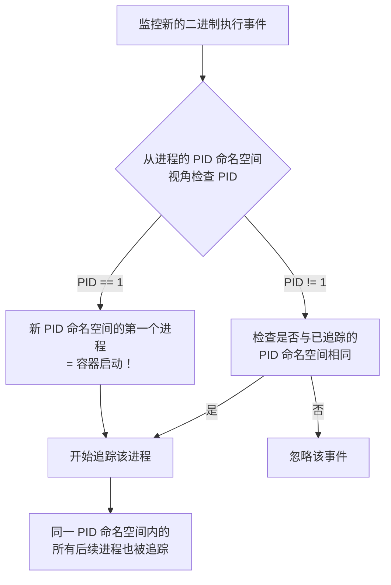

# Tracee：使用 eBPF 追踪容器事件

> 原文链接：[Tracee: Tracing Containers with eBPF](https://www.aquasec.com/blog/ebpf-tracing-containers/)
> 作者：Liz Rice（Aqua Security 开源工程 VP）
> 原文发布时间：2019 年 11 月 6 日
> 翻译与分析时间：2026 年 3 月 26 日

---

## 一、文章摘要

这篇文章是 Aqua Security 开源项目 **Tracee** 的首次公开发布博文。Liz Rice 在 2019 年柏林 Velocity 大会上发表"eBPF 入门指南"演讲时，同步开源了 Tracee。Tracee 使用 eBPF 追踪容器内的事件（如系统调用），其核心创新点是**只显示容器内产生的事件，过滤掉宿主机上其他进程的噪声**。文章简洁地解释了 Tracee 如何通过 PID 命名空间检测来实现这一能力。

---

## 二、核心内容翻译

### 2.1 背景

eBPF 是一种内核技术，允许在内核中运行自定义程序，通常用于构建强大的可观测性工具（如 bpftrace）。

使用 eBPF 追踪系统调用等事件并不新鲜。**Tracee 的独特之处在于：只看到容器内产生的事件，不被宿主机上其他进程的事件所干扰。**

### 2.2 核心问题：如何区分容器事件和宿主机事件？

从宿主机的视角来看，**容器其实就是一组 Linux 进程**。既然容器化进程和普通进程之间没有本质区别，Tracee 如何判断一个事件来自容器还是宿主机？

### 2.3 解决方案：PID 命名空间检测

容器通常以**独立的 PID 命名空间**启动。在该命名空间内部，第一个进程的 PID 看起来是 1。

Tracee 的检测逻辑：



**关键细节**：

| 要点 | 说明 |
|------|------|
| **检测机制** | 监控新二进制执行，检查进程在其 PID 命名空间中的 PID 是否为 1 |
| **子进程覆盖** | 容器内的子进程会被自动追踪（共享同一 PID 命名空间） |
| **同 Pod 覆盖** | 同一 Kubernetes Pod 中共享 PID 命名空间的其他容器也会被追踪 |
| **已有容器** | ⚠️ 必须先启动 Tracee，再启动容器——已存在的容器不会被追踪 |

### 2.4 追踪能力

Tracee 支持追踪：
- **常见系统调用** — 文件操作、网络操作、进程操作等
- **`cap_capable` 事件** — 内核检查进程是否拥有所需 Capability 的事件

---

## 三、技术分析

### 3.1 PID 命名空间检测的技术原理

在 Linux 内核中，每个进程有两个 PID：
- **全局 PID**：宿主机命名空间中的 PID
- **命名空间内 PID**：进程在其 PID 命名空间中的 PID

Tracee 在 eBPF 程序中通过读取 `task_struct` 的命名空间相关字段来获取进程在其 PID 命名空间中的 PID：

```c
// 伪代码：从 task_struct 获取命名空间内的 PID
struct task_struct *task = (struct task_struct *)bpf_get_current_task();
// 通过 task->nsproxy->pid_ns_for_children 等路径
// 获取进程在其 PID 命名空间中的 PID
// 如果该 PID 为 1，则判定为新容器的 init 进程
```

### 3.2 这种方法的优缺点

**优点**：
- 轻量、高效——只需在进程执行时做一次 PID 检查
- 无需依赖容器运行时 API（Docker/containerd/CRI-O 无关）
- 自动覆盖同一 PID 命名空间内的所有进程

**局限**：
- **已存在的容器不会被追踪**——必须先启动 Tracee
- **不共享 PID 命名空间的 sidecar 容器**可能被遗漏
- **非 PID 命名空间隔离的容器**（如 `--pid=host`）不会被识别为容器

### 3.3 Tracee 的后续演进

这篇 2019 年的文章是 Tracee 的起点。后续 Tracee 发展成为了功能完善的运行时安全工具：

| 时间 | 演进 |
|------|------|
| 2019 | 初始发布，容器事件追踪 |
| 2020-2021 | 增加安全检测规则、更多事件类型 |
| 2022-2023 | 加入 `bpf_attach` 事件监控，检测 eBPF 恶意软件（如 Pamspy） |
| 2024-2025 | 成为 Aqua 开源安全生态的核心组件 |

---

## 四、与本系列的关联

### 4.1 Tracee 在本系列中的定位

Tracee 在本系列多篇文章中被反复提及：

| 文章 | Tracee 的角色 |
|------|-------------|
| [eBPF 后门检测框架](https://windshock.github.io/en/post/2025-04-29-ebpf-backdoor-detection-framework/) | **安全摄像头**——记录 eBPF 恶意加载事件，检测到 Pamspy |
| [tested 项目分析](https://github.com/tested/tested) | tested 明确声明借鉴了 Tracee 的设计 |
| [eHIDS-agent](https://github.com/gojue/ehids-agent) | 作者（CFC4N）正在分析 Tracee 源码 |

### 4.2 容器感知是 HIDS 的关键能力

Tracee 的 PID 命名空间检测方法是最底层的容器感知实现：

| 方案 | 容器感知机制 |
|------|------------|
| **Tracee** | PID 命名空间检测（纯 eBPF，无需容器运行时） |
| **Falco** | 通过 libsinsp 获取容器元数据（需要容器运行时 socket） |
| **Tetragon** | Kubernetes CRD + cgroup 感知 |
| **Datadog** | Agent 集成容器运行时 API |
| **tested** | Collector 插件周期采集容器信息 |

Tracee 的方法最为轻量——不依赖任何容器运行时 API，完全在内核中通过 PID 命名空间判断。这也是为什么它被称为"eBPF 原生"的容器追踪方案。

---

## 五、总结

这篇短文虽然只有几百字，但其核心洞察极为重要：

1. **容器 = 进程 + 命名空间**——从内核视角，容器只是带有命名空间隔离的一组进程
2. **PID 命名空间是容器的"指纹"**——通过检测 PID 命名空间中的 PID 1 进程，可以零依赖地识别容器启动
3. **eBPF 天然适合容器感知**——因为 eBPF 运行在内核中，可以直接访问 `task_struct` 和命名空间信息，无需借助用户空间 API

Tracee 从这个简单的想法出发，最终发展成为了云原生运行时安全的重要开源工具，其 `bpf_attach` 事件监控能力使其成为检测 eBPF 后门（如 Pamspy、BPFDoor）的关键工具。
