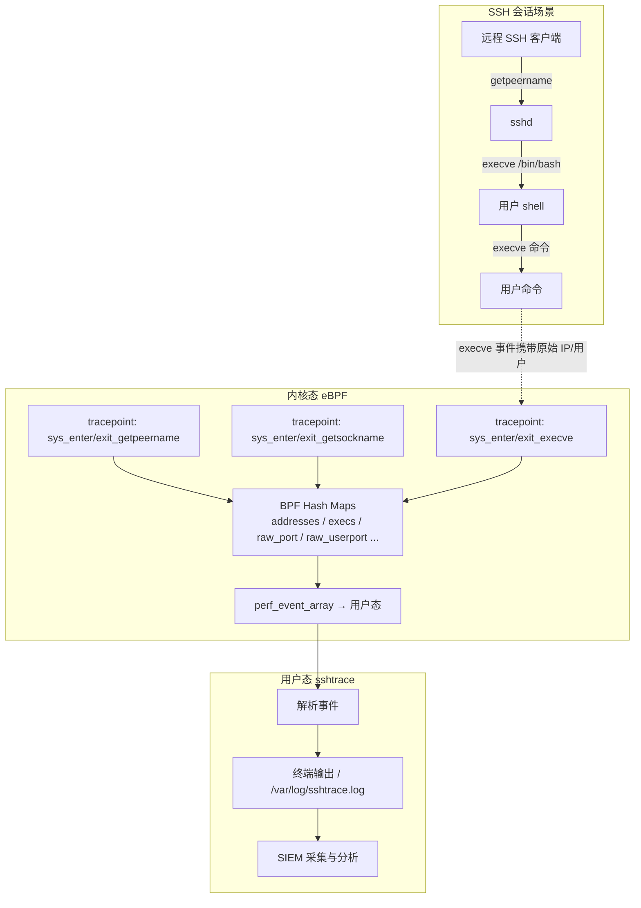
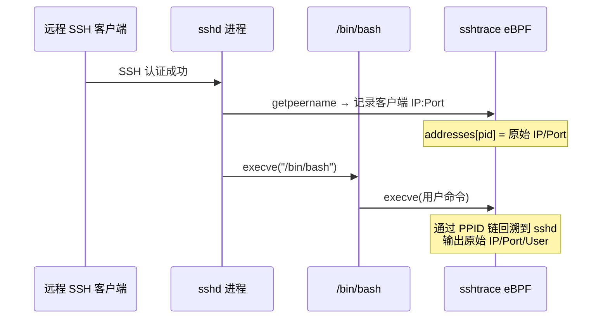
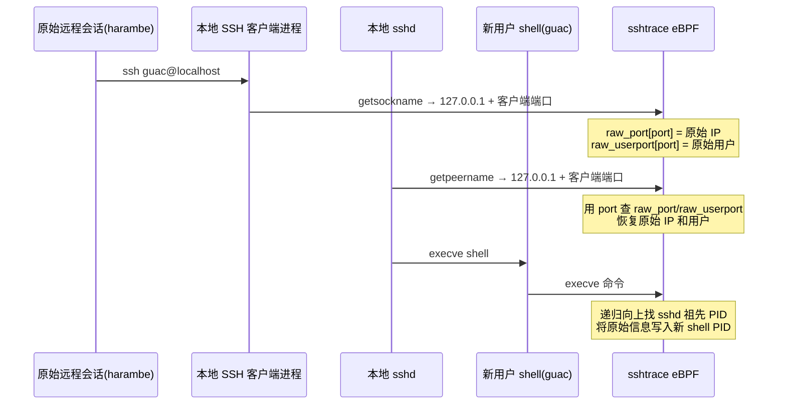

# 使用 eBPF 追踪 SSH 用户活动 — 翻译与总结

> 原文链接：[Tracing SSH User Activities Using eBPF](https://medium.com/etracing/tracing-ssh-user-activities-using-ebpf-c83f8f5a4a8e)  
> 作者：Daniel Beomjin An（eTracing）  
> 开源项目：[qjawls2003/eBPF-Remote-Client-Tracing](https://github.com/qjawls2003/eBPF-Remote-Client-Tracing)  
> 翻译与总结时间：2026 年 6 月 11 日

---

## 一、文章摘要

本文介绍了一个基于 eBPF 的 **sshtrace** 代理，用于在 Linux 主机上**实时**将用户执行的命令（`execve`）关联回**最初的 SSH 远程连接**——包括原始客户端 IP、端口和登录用户。

核心痛点：当管理员通过 SSH 登录后，再执行 `sudo su`、`ssh user@localhost`、或启动新 shell 等操作时，传统事后取证手段往往只能看到 `127.0.0.1` 和当前用户，难以快速追溯到真正的远程来源。sshtrace 通过在事件发生时直接完成关联，减少 SIEM 侧的手工关联计算。

---

## 二、背景与问题定义

### 2.1 场景

多台服务器上，多名系统管理员通过 SSH 远程登录。部分管理员会：

- `sudo su` 提权
- 启动新的 shell
- `ssh user@localhost` 切换到本地其他用户

恶意用户也可能用这些手段**混淆其原始远程连接**。

### 2.2 传统手工关联流程

事后分析一条可疑活动，通常需要：

1. 找到活动的 PID 和 UID（如 `ps -elf`）
2. 沿进程树向上查找父进程，直到找到 shell（bash）
3. 将该 shell 的父进程与活跃 SSH 会话关联
4. 通过 `ss -auntp` 等工具找到远程客户端 IP 和端口

### 2.3 传统方法的局限

| 问题 | 说明 |
|------|------|
| **本地 SSH 混淆** | `ssh user@localhost` 后，日志显示来源为 `127.0.0.1`，原始远程 IP 被隐藏 |
| **进程树断裂** | SSH 客户端与 SSH 服务端不在同一进程树，无法用 PID 简单关联 |
| **信息 ephemeral** | 进程和会话结束后，`ps`/`ss` 信息消失，除非持续采集 |

**本文目标**：在事件**发生时**就穿透多层「本地 SSH」、提权和新 shell，保留最初 SSH 会话的 IP、端口和用户信息。

---

## 三、技术方案

### 3.1 关键发现（strace 分析 sshd）

作者通过 `strace` 观察 `sshd` 进程，发现 SSH 会话建立时会调用：

- **`getpeername`**：获取对端（客户端）IP 和端口
- **`getsockname`**：获取本端（服务端）IP 和端口

这两个系统调用携带 socket 文件描述符、IPv4/IPv6 地址和端口信息，是追踪 SSH 会话的天然锚点。

### 3.2 整体架构



### 3.3 BPF Maps 设计

| Map 名称 | 类型 | Key | Value | 用途 |
|----------|------|-----|-------|------|
| `output` | PERF_EVENT_ARRAY | u32 | u32 | 向用户态发送事件 |
| `values` | HASH | pid_t | sockaddr_in6* | 临时存储 socket 地址 |
| `addresses` | HASH (pinned) | pid_t | ipData | PID → 原始 IP/端口 |
| `execs` | HASH (pinned) | pid_t | event | PID → execve 事件 |
| `raw_sockaddr` | HASH (pinned) | pid_t | sockaddr_in6* | 原始 socket 数据 |
| `raw_port` | HASH (pinned) | uint16_t | ipData | 本地端口 → 原始 IP 数据 |
| `raw_user` | HASH (pinned) | pid_t | uid_t | PID → 原始用户 |
| `raw_userport` | HASH (pinned) | uint16_t | uid_t | 本地端口 → 原始用户 |

部分 map 使用 `LIBBPF_PIN_BY_NAME` 持久化到 `/sys/fs/bpf/`，便于跨程序或辅助逻辑通过 `bpf_obj_get` 访问。

### 3.4 挂载的 Tracepoint

```c
// getpeername / getsockname — 捕获 SSH 连接 socket 信息
SEC("tp/syscalls/sys_enter_getpeername")
SEC("tp/syscalls/sys_exit_getpeername")
SEC("tp/syscalls/sys_enter_getsockname")
SEC("tp/syscalls/sys_exit_getsockname")

// execve — 捕获用户执行的命令
SEC("tracepoint/syscalls/sys_enter_execve")
SEC("tracepoint/syscalls/sys_exit_execve")
```

---

## 四、两种 SSH 连接场景的处理逻辑

### 4.1 场景 A：远程 SSH 客户端（直接连接）



流程要点：

1. 远程客户端认证成功后，`sshd` 调用 `getpeername` 获取客户端 IP 和端口  
   例：`getpeername(4, {sa_family=AF_INET, sin_port=htons(40146), sin_addr=inet_addr("192.168.86.120")})`
2. `sshd` 最终 clone 出的子进程通过 `execve` 启动 shell（`/etc/passwd` 中配置）
3. 该 shell 下执行的命令，其 PPID 链可回溯到步骤 2 的 `sshd` 子进程

### 4.2 场景 B：本地 SSH（ssh user@localhost）

这是本文的**核心难点**：客户端和服务端都在本机，进程树不连续。



**客户端侧（getsockname）**：

- 确认地址为 `127.0.0.1` 或 `::1`
- 将当前端口与**原始 IP 数据**和**原始用户**写入 `raw_port`、`raw_userport`

**服务端侧（getpeername）**：

- 确认对端为 localhost
- 用客户端端口查 `raw_port` / `raw_userport`，恢复原始 IP 和用户
- 更新当前 PID 的 `addresses` 和 `raw_user` map

**进程树回溯**：

```c
while (ppid > 1 && strncmp(comm, "(sshd)", 6) != 0) {
    pid_t ancestorPID = getPPID(ppid);
    char *comm = getCommand(ancestorPID);
    if (strncmp(comm, "(sshd)", 6) == 0) {
        // 找到 sshd，取其直接子进程 ppid 的原始 IP/用户
        bpf_map_lookup_elem(userMap, &sshdPID, &org_user);
        bpf_map_lookup_elem(addrMap, &sshdPID, &sockData);
        break;
    }
    ppid = ancestorPID;
}
```

回溯到 `sshd` 进程后，将原始 IP/端口/用户写入新 shell 的 PID。此后该 shell 及其子进程（无论多少层）都保留原始连接信息。

---

## 五、监控输出字段

| 字段 | 说明 |
|------|------|
| Timestamp | 本地时间（终端）/ Epoch 时间（日志文件） |
| PID | 调用 `execve` 的进程 ID |
| PPID | 父进程 ID |
| Current User | 当前 shell 使用的用户 |
| Origin User | 最初通过 SSH 登录的用户 |
| Command | `execve` 调用的二进制 |
| IP Address | 原始远程客户端 IP |
| Port | 远程客户端端口 |
| BinPath | 二进制文件路径 |

日志写入 `/var/log/sshtrace.log`，可供 SIEM 采集解析。

### 5.1 验证场景（文章示例）

| 场景 | 行为 | 结果 |
|------|------|------|
| sudo su | 用户提权到 root | 仍保留原始 IP、端口和用户 |
| ssh guac@localhost | harambe 切换到 guac | IP/Port/Origin User 仍为 harambe 的原始会话 |
| 多用户并发 | 两个远程用户同时连接 | 按远程 IP + 首登用户区分；同 IP 不同用户可用端口区分 |

---

## 六、技术评价

### 6.1 优点

- **实时关联**：在事件发生时完成归因，减轻 SIEM 事后关联负担
- **穿透混淆**：有效应对 `127.0.0.1` 本地 SSH、`sudo su` 等多层会话
- **低开销**：eBPF tracepoint 在内核态高效采集，不易被用户态篡改
- **IPv4/IPv6 双栈**：`sockaddr_in6` 统一处理两种地址族
- **多会话隔离**：BPF hash map 按 PID/端口隔离，避免会话信息交叉污染

### 6.2 局限与注意点

| 方面 | 说明 |
|------|------|
| 仅覆盖 SSH 入口 | 非 SSH 来源的本地登录（控制台、cron 等）不在设计范围内 |
| 依赖 sshd 行为 | 假设 sshd 在认证后调用 `getpeername`/`getsockname`；sshd 实现变更可能影响可靠性 |
| execve 粒度 | 只追踪 `execve`，不记录 shell 内建命令（如 `cd`、`export`） |
| Map 容量 | `max_entries=10240`，极高并发场景需评估 |
| 内核版本 | 需要支持 eBPF tracepoint 和 map pinning 的 Linux 发行版 |

### 6.3 与相关工作的关系

同一作者团队还有配套工作：

- [Detecting SSH Tunnel Using eBPF](https://medium.com/etracing/detecting-ssh-tunnel-using-ebpf-29e73b21133e) — 检测 SSH 隧道（复用 socket 的 `connect` 行为）
- 项目代码：[eBPF-Remote-Client-Tracing](https://github.com/qjawls2003/eBPF-Remote-Client-Tracing)

---

## 七、使用方法（来自 GitHub README）

```bash
git clone https://github.com/qjawls2003/eBPF-Remote-Client-Tracing
cd eBPF-Remote-Client-Tracing
sudo ./sshtrace          # 追踪所有 ssh 派生的 execve
sudo ./sshtrace -a       # 追踪所有 execve
sudo ./sshtrace -p       # 打印所有日志
sudo ./sshtrace -v       # 详细事件
sudo ./sshtrace -w       # 详细警告
```

---

## 八、结论

eBPF 为安全工程师提供了在内核态自定义监控逻辑的能力。sshtrace 展示了如何利用 SSH 协议栈中 `getpeername`/`getsockname` 的系统调用特征，结合 BPF map 做**跨进程树、跨会话层**的实时归因——将 `execve` 事件直接映射回原始远程 SSH 客户端，显著减少安全运营中的手工关联工作。

对 HIDS / 主机审计场景而言，这一思路值得借鉴：**在数据采集层完成会话归因**，而不是把所有关联逻辑推迟到 SIEM 事后分析阶段。

---

## 参考链接

- 原文：[Tracing SSH User Activities Using eBPF](https://medium.com/etracing/tracing-ssh-user-activities-using-ebpf-c83f8f5a4a8e)
- 源码：[qjawls2003/eBPF-Remote-Client-Tracing](https://github.com/qjawls2003/eBPF-Remote-Client-Tracing)
- 姊妹篇：[Detecting SSH Tunnel Using eBPF](https://medium.com/etracing/detecting-ssh-tunnel-using-ebpf-29e73b21133e)
