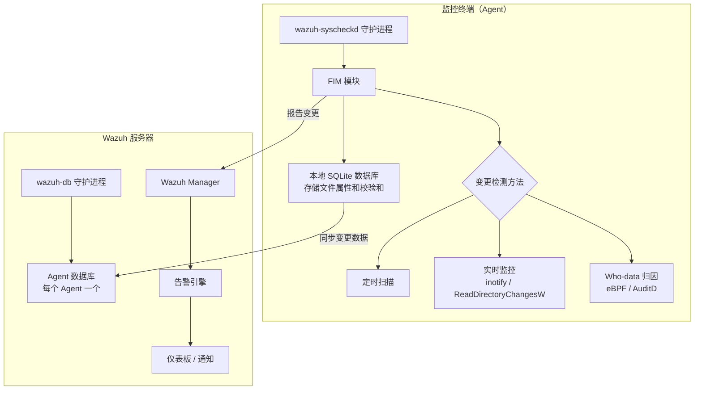
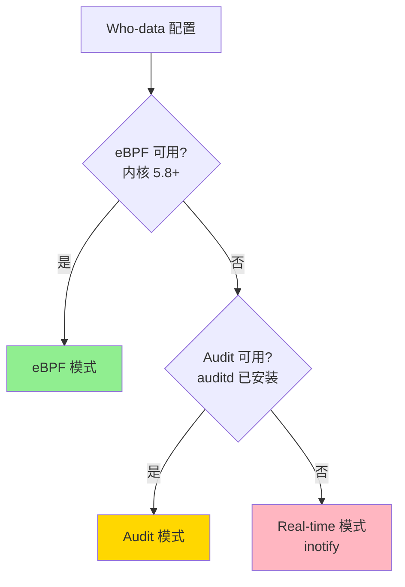
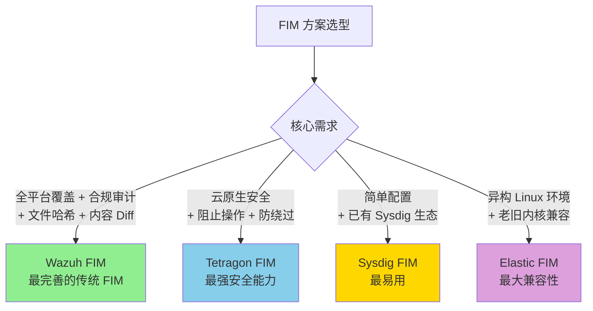

# 使用 Wazuh 实现健壮的文件完整性监控（FIM）—— 翻译与分析

> 原文链接：[Implementing Robust File Integrity Monitoring (FIM) with Wazuh](https://medium.com/@wilklins/implementing-robust-file-integrity-monitoring-fim-with-wazuh-19dcf89829c9)
> 作者：Wilklins Nyatteng
> 补充参考：[Wazuh FIM 官方文档](https://documentation.wazuh.com/current/user-manual/capabilities/file-integrity/how-it-works.html)
> 翻译与分析时间：2026 年 3 月 26 日

---

## 一、文章摘要

本文介绍了如何使用 Wazuh——一款开源的安全信息和事件管理（SIEM）及终端检测与响应（XDR）平台——实现健壮的文件完整性监控。文章涵盖了 Wazuh FIM 的核心架构、三种变更检测方法（定时扫描、实时监控、Who-data 归因）、配置方法、高级功能以及合规标准支持。Wazuh FIM 是当前开源生态中功能最完善的 FIM 方案之一。

---

## 二、Wazuh FIM 核心架构

### 2.1 架构概览

Wazuh FIM 通过 `wazuh-syscheckd` 守护进程运行，采用**双数据库架构**：



### 2.2 数据库位置

| 平台 | 本地数据库路径 |
|------|---------------|
| Windows | `C:\Program Files (x86)\ossec-agent\queue\fim\db` |
| Linux | `/var/ossec/queue/fim/db` |
| macOS | `/Library/Ossec/queue/fim/db` |
| 服务器端 | `/var/ossec/queue/db`（按 Agent ID 区分） |

### 2.3 监控的文件属性

FIM 通过建立文件属性**基线**并持续比对来检测变更：

| 属性 | 说明 |
|------|------|
| MD5 校验和 | 文件内容哈希 |
| SHA-1 校验和 | 文件内容哈希 |
| SHA-256 校验和 | 文件内容哈希 |
| 文件权限 | 读/写/执行权限 |
| 文件所有者 | 用户和组信息 |
| 文件大小 | 字节数 |
| 修改时间 | mtime |
| Inode 号 | 文件系统索引节点 |

---

## 三、三种变更检测方法

### 3.1 定时扫描（Scheduled Scan）

- **默认间隔**：43200 秒（12 小时）
- **工作原理**：在启动时或按计划间隔扫描所有监控路径，将当前文件状态与数据库中存储的基线进行比对
- **适用场景**：低频变更的配置文件、系统文件

```xml
<syscheck>
  <frequency>43200</frequency>
  <directories>/etc,/usr/bin,/usr/sbin</directories>
</syscheck>
```

### 3.2 实时监控（Real-time Monitoring）

- **Linux**：使用 `inotify` 内核子系统
- **Windows**：使用 `ReadDirectoryChangesW` API
- **工作原理**：内核在文件发生变更时立即通知 Agent

```xml
<syscheck>
  <directories realtime="yes">/etc/ssh</directories>
</syscheck>
```

**局限性**（与前面分析的 Tetragon/Elastic 文章一致）：
- inotify **不提供进程/用户归因信息**
- 存在目录监控的竞态条件
- 不支持递归监控新创建的子目录（需要重新添加 watch）

### 3.3 Who-data 归因监控

这是 Wazuh FIM 最强大的功能，能够追踪**谁**（哪个用户/进程）对文件做了修改。

#### Linux 上的两种 Who-data 模式

| 模式 | 底层技术 | 内核要求 | 特点 |
|------|----------|----------|------|
| **Audit 模式** | Linux Audit 子系统（auditd） | 广泛支持 | 默认模式，需要 auditd 守护进程 |
| **eBPF 模式** | eBPF 程序 | **5.8+** | 4.12.0 版本新增，更高效，无需 auditd |

**降级机制**：eBPF → Audit → Real-time



#### eBPF 模式监控的内核函数

| 钩子函数 | 监控的操作 |
|----------|-----------|
| `vfs_open` | 文件创建 |
| `security_inode_setattr` | 文件属性修改 |
| `vfs_unlink` | 文件删除 |

#### Who-data 配置示例

```xml
<syscheck>
  <directories whodata="yes">/home/user/documents</directories>

  <whodata>
    <provider>ebpf</provider>     <!-- 可选: ebpf 或 audit，默认 audit -->
    <queue_size>50000</queue_size> <!-- eBPF 事件队列大小 -->
  </whodata>
</syscheck>
```

---

## 四、高级功能

### 4.1 文件内容变更报告（Content Diff）

启用 `report_changes` 后，Wazuh FIM 可以报告文件修改前后的**内容差异**：

```xml
<syscheck>
  <directories report_changes="yes">/etc</directories>
</syscheck>
```

这使安全团队能够看到文件的**具体变更内容**，而不仅仅是"文件变了"。

### 4.2 VirusTotal 集成

Wazuh FIM 记录的文件校验和可以与 VirusTotal 等恶意软件检测服务集成，自动验证变更后的文件是否包含已知恶意代码。

### 4.3 通配符和递归监控

```xml
<syscheck>
  <directories>/home/*/documents</directories>   <!-- 通配符 -->
  <directories recursion_level="3">/var/log</directories>  <!-- 递归深度 -->
</syscheck>
```

### 4.4 忽略和排除

```xml
<syscheck>
  <ignore>/var/log/lastlog</ignore>
  <ignore type="sregex">.log$</ignore>
</syscheck>
```

### 4.5 Windows 注册表监控

Wazuh FIM 还支持 Windows 注册表键值的监控：

```xml
<syscheck>
  <windows_registry>HKEY_LOCAL_MACHINE\Software</windows_registry>
</syscheck>
```

### 4.6 安全增强（4.13.0+）

从 Wazuh 4.13.0 开始，Windows 上的 FIM **不再监控 UNC 网络路径和映射驱动器**（如 `\\server\share\folder` 或 `Z:\folder`）。这一变更防止了通过 NTLMSSP 协商暴露 NetNTLMv2 哈希的风险。

---

## 五、合规标准支持

Wazuh FIM 帮助满足多项合规标准的文件完整性监控要求：

| 合规标准 | 相关要求 |
|----------|----------|
| **PCI DSS** | 要求 11.5：部署变更检测机制 |
| **HIPAA** | 164.312(c)(2)：实施电子保护健康信息完整性的机制 |
| **NIST 800-53** | SI-7：软件、固件和信息完整性 |
| **GDPR** | 第 32 条：处理安全性 |
| **SOX** | 第 404 条：内部控制评估 |

---

## 六、与其他 FIM 方案的对比

### 6.1 全系列方案对比表

| 维度 | Wazuh FIM | Sysdig FIM | Tetragon FIM | Elastic FIM |
|------|-----------|------------|-------------|-------------|
| **类型** | 开源 SIEM/XDR | 商业 CNAPP | 开源 + 企业版 | 开源 ELK |
| **底层技术** | inotify + AuditD + eBPF | eBPF 系统调用追踪 | kprobe LSM 钩子 | eBPF + KProbes + inotify |
| **定时扫描** | ✅ | ❌ | ❌ | ❌ |
| **实时监控** | ✅ inotify | ✅ eBPF | ✅ eBPF | ✅ 多种 |
| **文件创建检测** | ✅ | ❌ | ✅ | ✅ |
| **文件修改检测** | ✅ | ✅ | ✅ | ✅ |
| **文件删除检测** | ✅ | ✅ | ✅ | ✅ |
| **文件读取检测** | ❌ | ❌ | ✅ | 取决于实现 |
| **用户/进程归因** | ✅（Who-data） | ✅ | ✅ | ✅（eBPF/tk-btf） |
| **文件内容 Diff** | ✅ report_changes | ❌ | ❌ | ❌ |
| **文件哈希比对** | ✅ MD5/SHA1/SHA256 | ❌ | ❌ | ✅ |
| **内联执行（阻止操作）** | ❌ | ❌ | ✅ | ❌ |
| **Inode-based 防绕过** | ❌ | ❌ | ✅（企业版） | ❌ |
| **TOCTOU 防护** | ❌ | 未提及 | ✅ | 未提及 |
| **Windows 支持** | ✅（含注册表） | ❌ | ❌ | ✅ |
| **macOS 支持** | ✅ | ❌ | ❌ | ❌ |
| **K8s/容器感知** | 有限 | ✅ | ✅ | 有限 |
| **老旧内核支持** | ✅（inotify + audit） | ❌（需 4.14+） | ❌（需现代内核） | ✅（tk-btf 低至 3.3） |
| **VirusTotal 集成** | ✅ | ❌ | ❌ | ❌ |
| **合规报告** | ✅ 丰富 | ✅ | ✅ | ✅ |

### 6.2 定位差异



---

## 七、核心技术要点总结

### 7.1 Wazuh FIM 的独特优势

1. **最全面的传统 FIM 功能**：文件哈希比对（MD5/SHA-1/SHA-256）、内容 Diff、属性监控、定时扫描与实时监控并存
2. **三层降级机制**：eBPF → AuditD → inotify，自动适配运行环境
3. **跨平台支持**：Windows（含注册表）、Linux、macOS 全覆盖
4. **Who-data 归因**：追踪文件变更的用户和进程，提供可操作的安全洞察
5. **开源免费**：完全开源，社区活跃

### 7.2 Wazuh FIM 的局限性

1. **不支持文件读取检测**——只监控创建/修改/删除，无法检测敏感文件被读取
2. **不支持内联执行**——无法在内核中阻止文件操作，仅事后告警
3. **不支持 Inode-based 监控**——存在硬链接/绑定挂载绕过风险
4. **无 TOCTOU 防护**——inotify 和 AuditD 均存在此类问题
5. **容器/K8s 感知有限**——不如 Sysdig 和 Tetragon 在云原生场景下的能力
6. **eBPF 模式要求高**——需要内核 5.8+，比 Sysdig（4.14+）要求更高

---

## 八、个人思考

### 8.1 Wazuh FIM 的定位

Wazuh FIM 是**传统 FIM 的集大成者**。它在文件哈希比对、内容 Diff、跨平台支持、合规报告等方面提供了最完整的功能集。如果你的需求是符合 PCI DSS、HIPAA 等合规标准的文件完整性监控，Wazuh 是开源生态中的首选。

### 8.2 与云原生 FIM 的定位互补

Wazuh FIM 和 Tetragon/Sysdig FIM 不是竞争关系，而是**互补关系**：

- **传统主机环境**：Wazuh FIM 是最佳选择（跨平台、哈希比对、内容 Diff、合规报告）
- **云原生/容器环境**：Tetragon 或 Sysdig FIM 更合适（容器感知、内联执行、低开销）
- **混合环境**：可以同时部署 Wazuh（主机层）+ Tetragon/Falco（容器层）

### 8.3 eBPF 在 Wazuh 中的角色

值得注意的是 Wazuh 在 4.12.0 版本才引入 eBPF 支持，且仅用于 Who-data 归因（替代 AuditD），而非完全重构 FIM 底层。这说明在成熟的安全产品中，eBPF 更多是作为**增强技术**而非颠覆技术被采纳——inotify + AuditD 的组合在大多数场景下仍然有效。

### 8.4 综合选型建议

基于本系列所有已分析的文章，最终的 FIM 选型矩阵：

| 场景 | 推荐方案 | 理由 |
|------|----------|------|
| 合规审计（PCI DSS/HIPAA） | **Wazuh FIM** | 哈希比对 + 内容 Diff + 合规报告 |
| 云原生运行时安全 | **Tetragon** | 内联执行 + Inode-based + K8s 感知 |
| 已有 Sysdig 生态 | **Sysdig FIM** | 与现有平台无缝集成 |
| 异构老旧 Linux 环境 | **Elastic FIM (tk-btf)** | 支持内核 3.3+ |
| 敏感文件读取检测 | **Tetragon + Falco** | 支持读取检测 + 内联阻止 |
| 混合环境（主机+容器）| **Wazuh + Tetragon** | 互补覆盖 |
| Windows + Linux 统一 | **Wazuh FIM** | 唯一全平台方案 |
