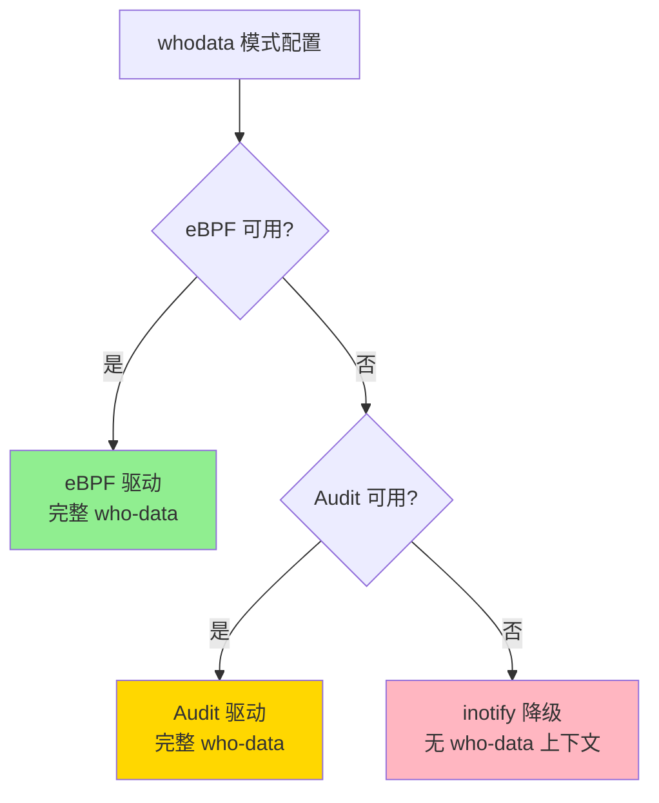
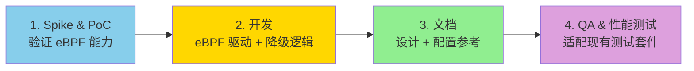

# Wazuh FIM whodata eBPF 功能增强需求分析

> 原文链接：[FIM whodata eBPF · Issue #27598 · wazuh/wazuh](https://github.com/wazuh/wazuh/issues/27598)
> 提出者：vikman90
> 创建时间：2025 年 1 月 14 日
> 状态：已关闭（Done）
> 翻译与分析时间：2026 年 3 月 26 日

---

## 一、需求概述

Wazuh 团队提出为 **FIM（文件完整性监控）** 模块增加基于 **eBPF** 的 who-data 监控支持。eBPF 将作为优先级最高的检测文件和目录变更的方式，当 eBPF 不可用时自动降级到 **Audit**，当 Audit 也不可用时再降级到 **inotify**。

目标是在 Linux 系统上提供**实时文件监控 + 用户/进程上下文（who-data）**，同时确保与多种内核版本和环境的兼容性。

---

## 二、功能需求

### 2.1 降级策略（三级优雅降级）



降级优先级：**eBPF > Audit > inotify**

| 驱动 | 实时检测 | who-data（用户/进程信息） |
|------|---------|------------------------|
| eBPF | ✅ | ✅ |
| Audit | ✅ | ✅ |
| inotify | ✅ | ❌ 缺少上下文 |

### 2.2 检测能力要求

eBPF 驱动必须提供与现有 auditd 驱动**完全一致**的功能：

| 事件类型 | 支持 |
|---------|------|
| 新文件创建 | ✅ |
| 文件修改 | ✅ |
| 文件删除 | ✅ |
| 目录重命名 | ✅ |
| 目录删除 | ✅ |
| 新目录创建 | ❌ 排除 |

每个事件必须包含：
- **文件路径**
- **变更类型**（创建、修改、删除）
- **行为者信息**：
  - 用户：UID + 用户名
  - 进程：PID + 进程名

### 2.3 配置方式

在 `<whodata>` 元素中新增 `<provider>` 选项：

```xml
<syscheck>
   <directories whodata="yes">/home/bob</directories>
   <directories whodata="yes">/home/alice</directories>
   <whodata>
      <provider>ebpf</provider>  <!-- 可选值：ebpf 或 audit（默认） -->
   </whodata>
</syscheck>
```

**术语设计**：FIM 已有**模式（mode）**概念（`scheduled`、`realtime`、`whodata`），eBPF 和 Audit 被定义为**提供者（provider）**——它们是驱动特定模式的模块化系统。

### 2.4 兼容性约束

- FIM 状态和告警的字段数量/类型不得有任何变化
- 使用 eBPF 时，发送到服务器的 EPS（每秒事件数）最多不超过现有实现
- 新实现不得比当前实现消耗更多宿主机资源

---

## 三、非功能需求

### 3.1 支持的发行版

| 发行版 | 版本 | 支持 |
|--------|------|------|
| RedHat | 9 | ✅ |
| CentOS Stream | 9、10 | ✅ |
| Debian | 11、12 | ✅ |
| Ubuntu | 20.04、22.04、24.04 | ✅ |
| Oracle Linux | 9 | ✅ |
| Amazon Linux | 2023 | ✅ |
| openSUSE | 15 | ✅ |
| SUSE | 15 | ✅ |

**排除项**（内核版本低于 5.8）：
- ~~RedHat 7/8~~
- ~~CentOS 7/8~~
- ~~Debian 10~~
- ~~Amazon Linux 2~~

> **关键信息**：最低内核要求为 **5.8**，这与 `BPF_MAP_TYPE_RINGBUF` 的引入版本一致。

### 3.2 实现约束

- 模块化设计，使用 **C++** 实现
- 必须在 Wazuh 4.x 实现，且可移植到 Wazuh 5.x

---

## 四、实施计划



### 阶段 1：Spike 与概念验证

开发小型 eBPF 程序，验证其能力：
- 检测文件/目录变更
- 捕获 who-data（用户/进程信息）

### 阶段 2：开发

**eBPF 驱动实现**：
- 使用 C++ 设计实现 eBPF 驱动
- 确保模块化，便于维护和扩展
- 支持所有指定的事件类型
- 开发单元测试

**降级逻辑与集成**：
- 修改 FIM 模块，在 whodata 模式启用时优先使用 eBPF
- 实现降级行为（eBPF → Audit → inotify）
- 提供 whodata 模式偏好配置项

**测试**：
- 创建端到端集成测试，验证完整功能和降级行为

### 阶段 3：文档

Markdown 格式的设计和参考文档：
- eBPF 驱动和降级机制概述
- 支持的配置和示例
- 每种降级驱动的已知限制和行为

### 阶段 4：QA 与性能测试

- 适配现有 QA 测试以包含新的 eBPF 驱动
- 修改预发布性能测试，对比 eBPF FIM 的系统性能
- 确保测试套件能区分 eBPF FIM 和其他监控方式的性能影响

---

## 五、关键分析

### 5.1 与之前 Wazuh FIM 分析的对比

在之前翻译的 [Wazuh FIM 实现文章](https://medium.com/@wilklins/implementing-robust-file-integrity-monitoring-fim-with-wazuh-19dcf89829c9) 中，Wazuh 的 Who-data 模式已经支持 eBPF 作为可选 provider。**这个 Issue 就是该功能的正式需求文档和实施计划**。

| 维度 | 之前的文章（已发布功能） | 此 Issue（需求规范） |
|------|----------------------|---------------------|
| eBPF 角色 | 可选 provider | 优先 provider（eBPF > Audit） |
| 降级策略 | 提及但未详述 | 明确三级降级：eBPF → Audit → inotify |
| 最低内核 | 未明确 | **5.8** |
| 实现语言 | 未提及 | **C++** |
| 排除的事件 | 未提及 | 明确排除"新目录创建" |

### 5.2 与其他 eBPF FIM 方案的定位对比

| 维度 | Wazuh eBPF | Datadog eBPF FIM | Tetragon | Sysdig |
|------|-----------|-----------------|----------|--------|
| **定位** | 传统 FIM 的 eBPF 增强 | 云原生 FIM | 云原生安全策略引擎 | 容器运行时安全 |
| **eBPF 角色** | who-data provider（可降级） | 核心架构 | 核心架构 | 核心架构 |
| **降级能力** | ✅ eBPF → Audit → inotify | ❌ 纯 eBPF | ❌ 纯 eBPF | ❌ eBPF / 内核模块 |
| **文件哈希** | ✅ MD5/SHA1/SHA256 | 未提及 | ❌ | ❌ |
| **内容 Diff** | ✅ | 未提及 | ❌ | ❌ |
| **内联阻断** | ❌ | ❌ | ✅ | ❌ |
| **内核态过滤** | 未提及 | ✅ Approver/Discarder（94%） | ✅ Selector | 未详述 |

**Wazuh 的独特价值**：在所有方案中，Wazuh 是唯一提供**三级优雅降级**的方案。这对于需要覆盖从现代云环境到老旧物理机的混合基础设施至关重要。同时，Wazuh 保留了传统 FIM 的核心能力（文件哈希、内容 diff），这些是纯 eBPF 方案（Datadog、Tetragon）所不具备的。

### 5.3 技术决策分析

**为什么最低要求内核 5.8？**

- `BPF_MAP_TYPE_RINGBUF` 在 5.8 引入——比 perf buffer 更高效、全局有序
- 5.8 之前的 eBPF 能力较受限，实现完整的 who-data 采集难度大
- 排除的发行版（RHEL 7/8、CentOS 7/8、Debian 10）正好是内核 < 5.8 的版本

**为什么排除"新目录创建"事件？**

- 目录创建本身不涉及文件完整性问题
- 减少事件噪声
- 与现有 Audit 驱动的行为保持一致

---

## 六、总结

这个 Issue 是 **Wazuh FIM 从传统架构向 eBPF 增强架构演进的里程碑需求文档**。它的价值在于：

1. **工程规范性**——清晰的功能/非功能需求、降级策略、配置方式、支持矩阵
2. **务实的架构选择**——eBPF 作为 provider 而非替代品，保留 Audit/inotify 降级能力
3. **兼容性优先**——明确了内核 5.8 的底线，排除了不支持的旧发行版
4. **向后兼容**——"FIM 状态和告警的字段数量/类型不得有任何变化"，确保平滑升级

该 Issue 状态为**已关闭（Done）**，说明 Wazuh 4.x 已经完成了 eBPF FIM whodata 的实现。这与之前翻译的 Wazuh FIM 文章中提到的 eBPF provider 配置一致。
