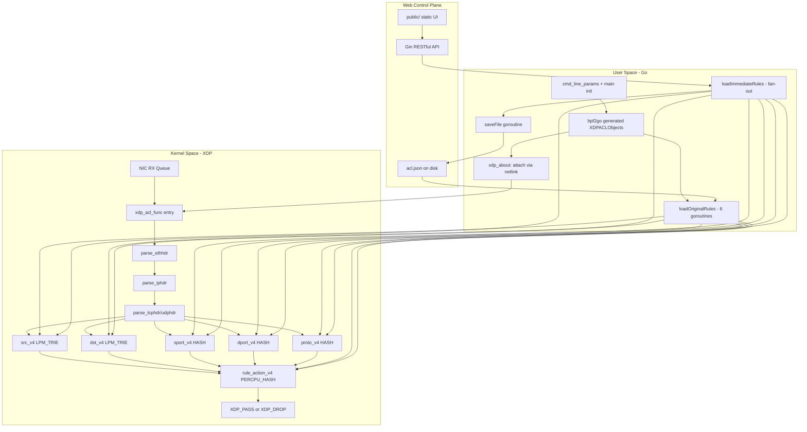
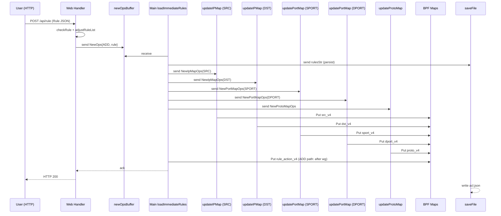

# xdp_acl 源码级深度分析：Cursor 提示词模板

> 创建时间：2026 年 5 月 26 日
> 适用场景：使用 Cursor / Claude Code 对 `hi-glenn/xdp_acl` 项目（基于 XDP + bitmap 匹配算法的高性能 ACL）进行源码级深度分析，最终交付一篇万字级中文专业 Markdown 文档
> 项目仓库：<https://github.com/hi-glenn/xdp_acl>
> 锁定版本建议：`tag 0.0.10`（commit 视 main 分支最新 SHA 而定，在「0x00 前言」中显式锁定）
> 参考版式：`0x00` / `0x01` 十六进制章节风格 + 强制源码引用 + Mermaid + draw.io 节点清单

---

## 一、使用说明

1. **先 clone 代码到本地**（Cursor 必须能直接读取源码才能做行级分析）：

   ```bash
   git clone https://github.com/hi-glenn/xdp_acl.git
   cd xdp_acl
   git log -1 --format='%H'   # 记下当前 commit SHA，写入「0x00 前言」做版本锁定
   ```

2. **建议同时下载启发该项目的论文**（README 中明确提到「Inspired by this paper」，常见对应：
   - Gilberto Bertin 等：「*A Fast and Flexible Bitmap-based ACL Engine*」(netdev / DPDK 相关文献)
   - 或 Cilium / XDP 社区中的 bitmap-matching 方案）
   在「0x00 前言」中给出你锁定的参考论文标题与下载链接，便于读者交叉验证算法源头。

3. 在 Cursor 中打开项目根目录，将 **第二节「主提示词」** 整段作为用户提示发送。

4. 如需深挖某个子系统，将 **第三节「可选附加模块」** 中对应段落追加到提示词末尾。

5. 如需控制篇幅、增加英文摘要或 draw.io 图，将 **第四节「可选参数」** 中对应段落拼接到末尾。

6. 使用 `@` 引用本地文件可加速 Cursor 定位，例如 `@xdp_acl.c` 或 `@rules_immediate.go`。

7. **关键交叉验证命令**（防止模型遗漏）：

   ```bash
   # 列出所有 SEC() 段
   grep -nE 'SEC\("[^"]+"\)' xdp_acl.c
   # 列出所有 BPF Map 定义
   grep -nE 'struct bpf_map_def SEC\("maps"\)' xdp_acl.c
   # 列出 cilium/ebpf 生成的对象访问
   grep -rn 'objs\.' --include="*.go"
   # 列出 Web 路由
   grep -nE 'gin\.|router\.|engine\.(GET|POST|DELETE|PUT)' web.go
   # 列出关键常量
   grep -nE '^#define (RULE_NUM_|PORT_|PROTO_|BITMAP_)' xdp_acl.c
   ```

---

## 二、主提示词（可复制）

````markdown
# 角色与目标

你是一名资深网络与内核工程师，同时精通以下领域：
- **eBPF / XDP（express data path）/ libbpf / cilium/ebpf**
- **Linux 网络协议栈（L2/L3/L4 报文结构、字节序、checksum）**
- **高性能网络匹配算法（bitmap、LPM Trie、HyperCuts、HiCuts）**
- **Go 语言后端开发（goroutine 调度、channel 流水线、Gin / net/http）**
- **netlink / RTNETLINK / 网络驱动（XDP_DRV / XDP_SKB / XDP_OFFLOAD 模式）**

请基于本地 clone 的 `hi-glenn/xdp_acl` 源码以及 GitHub 公开仓库，撰写一篇 **专业中文技术深度分析文档**。
读者为具备 Linux 网络协议栈、eBPF 基础、Go 并发编程背景的工程师。

# 分析范围（必须在前言中显式复述）

请在 `0x00 前言` 中列出以下文件/目录及你锁定的分析版本（tag 或 commit SHA），贯穿全文引用时均使用该版本的永久链接：

| 文件 / 目录 | 作用 |
|------------|------|
| `xdp_acl.c` | eBPF C 程序：报文解析 + 5 字段 bitmap 查询 + AND 归并 + ffs 取最高优先级 + action 表查询 |
| `include/` | bpf helpers / 公共宏 / 缺失内核头文件兜底定义 |
| `main.go` | 程序入口：参数解析、rlimit 设置、加载 BPF 对象、attach XDP、启动 web、信号处理 |
| `cmd_line_params.go` | 命令行参数（`-D` 网卡、`-S` 是否启用 web、`-M` XDP 模式等） |
| `config.go` | 全局常量（MAP_TYPE_*、PROTO_*、CIDR_* 枚举等）、全局变量（objs、ruleList、专用缓存） |
| `helpers.go` | 工具：CIDR 比较、bitmap 位操作（set/reset/ffs）、`htons/ntohs`、`getLpmKey` 等 |
| `log.go` | 基于 zap 的日志封装 |
| `rules_about.go` | 规则相关类型定义：`Rule`、`RuleArr`、`Addr`、`SpecialCidr`、`RuleAction*`，以及 `RuleArr.Load(file)` |
| `rules_original.go` | 启动时全量规则加载：6 个并发 goroutine 分别填充 5 个字段 map + 1 个 rule_action map |
| `rules_immediate.go` | 运行时规则增删流水线：channel-based fan-out 到各字段 worker |
| `web.go` | Gin Web 服务：RESTful API（rule 增删改查）+ 静态资源（`public/`）+ 内嵌前端控制台 |
| `xdp_about.go` | XDP 程序 attach / detach（基于 netlink，含模式判定与回退） |
| `acl.json` / `acl_big.json` | 配置文件（持久化的 ACL 规则） |
| `docs/` | 官方文档（RESTful API、benchmark 方法、环境搭建） |
| `public/` | 前端 web 控制台资源（HTML/JS/CSS） |
| `Makefile` | 编译流程：`bpf2go` 触发 → clang 编译 BPF → Go 编译 |
| `.vscode/` | 调试配置（用于核对作者推荐的开发与调试方法） |

**判定规则**：若仓库存在历史已删除文件或新增子模块，请显式说明判定依据；未读到的代码必须标注 **「未在本次分析范围内验证」**，禁止猜测。

# 写作结构与版式（必须遵守）

- 主标题：**「xdp_acl 源码深度分析：XDP 五元组 Bitmap ACL 引擎的高性能实现」**
- `## 0x00 前言`：分析范围（版本锁定）、阅读门槛、用 **3～8 条「先读结论」**（必须是可验收的事实，不是空话）
- 正文使用 `## 0x01 …`、`## 0x02 …` 十六进制风格小节
- 适当使用 **Markdown 表格**（Hook 类型、Map 类型、字段维度、规则字段、API 路由等）
- **核心流程至少 5 张 Mermaid 图**：
  1. 整体架构图（内核 XDP / 用户态 / Web 控制台 / 配置文件 四层）
  2. 报文处理流图（parse → field lookup → bitmap AND → ffs → action）
  3. 规则下发流水线图（newOpsBuffer → 5 个 worker → BPF Map）
  4. CIDR 关系判定流程图（CIDR_EQUAL / CONTAIN / INCLUDED / NO_CROSS）
  5. 启动时序图（main → bpf2go objs → attach XDP → 加载 original → 启动 immediate → 启动 web）
- 文末 `## 0xFF 参考与链接`：所有引用永久链接清单 + draw.io 架构图节点/连线清单 + 启发论文链接

# 技术深度要求（硬性）

## 引用规则（必须同时满足两条）

1. **本地路径引用**：`xdp_acl.c:L260-L328`（`get_bitmap_array_for_tcp_v4`）
2. **GitHub 永久链接**：`https://github.com/hi-glenn/xdp_acl/blob/<commit-sha>/xdp_acl.c#L260-L328`

- 核心 `struct` / 核心函数 / 核心 BPF 程序段：**原型 + 字段语义 + 生命周期 + 行级注释**
- 禁止「猜测式」分析。未读到的代码须显式标注：**「未在本次分析范围内验证」**

## Mermaid 图规范

- 节点 ID 使用 camelCase，**禁止空格**
- 子图使用 `subgraph id [Label]` 格式
- 图中标注关键函数 / 文件 / Map 名（不必贴完整 URL）
- 避免使用 `end` 作为节点 ID

# 正文强制章节清单

请严格按以下章节顺序和内容要求撰写。每个章节的子问题是 **必答项**，不可跳过。

---

## 0x00 前言

- 分析版本锁定（commit SHA、tag、kernel 最低要求、clang/llvm 版本要求）
- 本文 **包含** 什么（C 端 BPF 程序 + Go 用户态 + Web API + 算法原理）
- 本文 **不包含** 什么（如 IPv6 支持是否完成、前端 JS 实现细节等）
- 读者前置知识（XDP 基础、cilium/ebpf 库、Go channel 流水线）
- **3～8 条「先读结论」**，举例：
  - 「xdp_acl 用 6 个 BPF Map 实现 ACL：5 个字段维度 map（src/dst IP、src/dst port、proto）+ 1 个 action map；每个字段 map 的 value 是 `__u64[160]` 位图，最多支持 10240 条规则」
  - 「优先级即位编号：`Priority` 决定该规则在 bitmap 中的 bit 位置；越小的 priority 在 bitmap 中越靠低位，通过 `hit & -hit`（ffs）一次取出最高优先级匹配规则」
  - 「源/目 IP 用 `BPF_MAP_TYPE_LPM_TRIE` + `BPF_F_NO_PREALLOC` 支持 CIDR；端口/协议用普通 HASH；action 表用 `PERCPU_HASH` 避免锁竞争与 cache 抖动」
  - 「关键参数：`BITMAP_ARRAY_SIZE = 160`，`RULE_NUM_MAX_ENTRIES_V4 = 64 × 160 = 10240`，`PORT_MAX_ENTRIES_V4 = 65536`，`PROTO_MAX_ENTRIES_V4 = 4`」

---

## 0x01 项目目的与核心能力亮点

回答以下问题（每条结论带源码引用）：

1. xdp_acl 的核心定位是什么？与传统 iptables / nftables / Cilium XDP 程序的本质差异在哪？
2. 项目支持哪些核心功能？
   - 五元组（src IP / dst IP / src port / dst port / proto）匹配
   - CIDR 网段支持（含子网继承）
   - 规则优先级（`Priority` 字段）
   - 动作（XDP_PASS / XDP_DROP，对应 `Strategy`）
   - 在线规则增删（无需重启）
   - Web 控制台 + RESTful API
   - 规则持久化（acl.json）
3. 亮点逐条展开（并解释为什么这样设计）：
   - **Bitmap 多维归并算法**：把"多字段 ACL 匹配"转化为"多个 bitmap 按位 AND + ffs"
   - **LPM_TRIE 处理 CIDR**：避免 hash 无法处理子网的痛点
   - **PERCPU_HASH 存 action**：避免单条规则成为热点
   - **`#pragma unroll` 全展开循环**：绕过 BPF verifier 对非常量循环的限制（kernel < 5.3）
   - **cacheline 对齐 + likely/unlikely**：DDoS 场景下纳秒级延迟控制
   - **双层端口结构**：`commonPortRule`（不指定端口的规则）+ `specifiedPortRule`（指定端口的规则）合并下发
   - **CIDR 继承**：子网自动继承父网命中的规则集合（避免逐 IP 展开导致 map 爆炸）

---

## 0x02 代码实现篇 — eBPF / XDP 程序深读

### 0x02.1 BPF 程序与 Map 全景表

以表格形式列出 **所有** BPF Map 与 BPF 程序：

| Map 名称 | 类型 | Key 大小 / 类型 | Value 大小 / 类型 | max_entries | 用途 | flags |
|---------|------|---------------|-----------------|-------------|------|-------|
| `src_v4` | LPM_TRIE | `struct lpm_key_ipv4` | `__u64[BITMAP_ARRAY_SIZE]` | `IP_MAX_ENTRIES_V4` | 源 IP/CIDR → 位图 | `BPF_F_NO_PREALLOC` |
| `dst_v4` | LPM_TRIE | `struct lpm_key_ipv4` | `__u64[BITMAP_ARRAY_SIZE]` | `IP_MAX_ENTRIES_V4` | 目的 IP/CIDR → 位图 | `BPF_F_NO_PREALLOC` |
| `sport_v4` | HASH | `__u16`（网络序） | `__u64[BITMAP_ARRAY_SIZE]` | `PORT_MAX_ENTRIES_V4` | 源端口 → 位图 | — |
| `dport_v4` | HASH | `__u16`（网络序） | `__u64[BITMAP_ARRAY_SIZE]` | `PORT_MAX_ENTRIES_V4` | 目的端口 → 位图 | — |
| `proto_v4` | HASH | `__u32`（主机序） | `__u64[BITMAP_ARRAY_SIZE]` | `PROTO_MAX_ENTRIES_V4` | 协议号 → 位图 | — |
| `rule_action_v4` | PERCPU_HASH | `struct rule_action_key` | `struct rule_action` | `RULE_ACTION_MAX_ENTRIES_V4` | (bitmap_array_index, ffs) → (action, count) | — |

| BPF 程序段 SEC() | 函数名 | 程序类型 | 入口报文长度假设 |
|------------------|--------|---------|------------------|
| `SEC("xdp_acl_func_imm")` 或等价 SEC | （主入口函数名） | XDP | 至少 14 字节（ethhdr） |

用 `grep -nE 'SEC\("[^"]+"\)' xdp_acl.c` 交叉验证 SEC 段不遗漏，并标注每个 SEC 的 Go 侧引用位置（`objs.<ProgramName>`）。

### 0x02.2 报文解析子函数链

逐函数行级分析 `xdp_acl.c` 中的解析层：

1. `parse_ethhdr` — 边界检查、返回 `h_proto`（网络序），如何处理 VLAN（如果有）？
2. `parse_iphdr` — 变长 IPv4 头处理（`ihl << 2`）、边界检查、返回 `protocol`
3. `parse_tcphdr` / `parse_udphdr` — 变长 TCP 头（`doff << 2`）、UDP 长度合法性检查
4. `get_lpm_prefix_data_v4` — IP 地址按字节填入 `lpm_key_ipv4.data[4]`，前缀长度 `prefixlen` 的赋值
5. 字节序处理：哪些字段用网络序、哪些用主机序？为什么 sport/dport 用网络序作为 Map Key 可以省一次 `bpf_ntohs` ？

### 0x02.3 Bitmap 多字段匹配核心算法

这是本文 **算法层最核心** 的一节，必须详细回答：

1. **位图编码原理**
   - `BITMAP_ARRAY_SIZE = 160`，`__u64[160]` 共 `160 × 64 = 10240` 位
   - 每条规则对应 **一个 bit**：`array_index = priority / 64`，`bit_index = priority % 64`
   - 优先级 0 对应 `bitmap[0]` 的 bit 0，优先级 10239 对应 `bitmap[159]` 的 bit 63
   - 给出 `setBitmapBit` / `resetBitmapBit`（在 `helpers.go`）的实现引用

2. **字段位图填充**
   - 「IP `1.2.3.0/24` 命中规则 5、10、200」 → 该 CIDR 对应的 `bitmap[]` 中 bit 5、10、200 置 1
   - 「端口 80 命中规则 3、10」 → 该 port key 对应的 `bitmap[]` 中 bit 3、10 置 1
   - **特殊情况**：「不限端口」的规则被填入 `commonPortRule`，所有未指定端口的 Map Key 都共享该位图

3. **多字段 AND 归并**（核心）
   - `get_bitmap_array_for_tcp_v4` / `..._udp_v4` / `..._icmp_v4`：把 5 / 5 / 3 个字段查到的 bitmap 收集到栈上的 `rule_array[5]`
   - `get_hit_rules_optimize`：对 `rule_array_index` 处的 5 个（或 3 个）`__u64` 按位 AND，得到 `hit_rules`
   - **手动循环展开**（核心优化）：
     - 内层 `get_hit_rules_optimize` 手动展开 8 次
     - 外层 `for(... outer += 8) { #pragma unroll }` 全展开
     - 为什么不能用普通 `for(i=0; i<160; i++)`？解释 BPF verifier 在 kernel ≤ 5.2 上对非常量循环的限制
   - 找到第一个非零 `hit_rules` 即可终止

4. **最高优先级取位（ffs）**
   - `hit & -hit` 提取最低位（即最小优先级 bit）
   - `key.bitmap_ffs = hit & -hit; key.bitmap_array_index = rule_array_index;` 组成 `rule_action_v4` 的 key
   - 解释为什么 ffs 操作等价于「优先级越小越高」
   - 为什么不需要遍历所有命中规则？解释优先级唯一与冲突处理（不允许重复 priority）

5. **action 表查询**
   - `rule_action_v4` PERCPU_HASH 查询：value 的 `action` 字段为 `XDP_PASS` 或 `XDP_DROP`
   - `value->count++` 命中计数（PERCPU 无需原子操作）
   - 三种特殊路径：
     - `*rule_array_len == 1/2/4`（不符合 3 或 5）→ 直接 `XDP_PASS`
     - 所有 bitmap AND 后全 0 → `XDP_PASS`
     - action 查不到 → 异常路径
   - 在 `xdp_acl.c` 中找到 `get_rule_action_v4` 的完整代码并行级注释

6. **完整 Mermaid 流图**：报文进入 → parse_eth → parse_ip → (tcp/udp/icmp) → 字段 lookup → AND → ffs → action lookup → return XDP_PASS/DROP

### 0x02.4 性能优化技巧清单

必须逐条列出代码中能找到的优化点（带行号引用）：

| 优化点 | 实现位置 | 收益估算 / 设计动机 |
|-------|---------|-------------------|
| `__always_inline` 强制内联所有 helper | 各 `static __always_inline` 函数 | 避免函数调用开销 + 满足 BPF verifier 内联要求 |
| `likely` / `unlikely` 分支预测宏 | `unlikely(3 != *rule_array_len_ptr && 5 != ...)` | 优化分支预测 |
| `____cacheline_aligned` 栈变量对齐 | `rule_array_index` / `hit_rules` | 避免 false sharing |
| `#pragma unroll` 全展开循环 | `get_rule_action_v4` 外层循环 | 绕过 verifier 非常量循环限制 |
| 手动展开内层 8 次 | `get_hit_rules_optimize` | 减少分支 + 利于流水线 |
| `BPF_MAP_TYPE_PERCPU_HASH` 存 action | `rule_action_v4` | 避免热点规则的锁竞争 |
| 端口用网络序作 Map Key | `sport_v4` / `dport_v4` 的 Key 定义 | 节省每次 `bpf_ntohs` 调用 |
| LPM_TRIE + `BPF_F_NO_PREALLOC` | `src_v4` / `dst_v4` 定义 | 稀疏 CIDR 表内存占用控制 |

---

## 0x03 用户态 Go 代码深读

### 0x03.1 数据结构总览

逐一给出（带源码引用 + 字段语义）：

| 结构体 | 文件 | 字段 | 与内核态对应 |
|-------|------|------|------------|
| `Rule` | `rules_about.go` | `Priority`、`Strategy`、`Protos`、`AddrSrcArr`、`PortSrcArr`、`AddrDstArr`、`PortDstArr`、`CreateTime`、`CanNotDel` | — |
| `Addr` | `rules_about.go` | `CidrUser`、`CidrStandard`、`CidrSpecial` | 用于 LPM_TRIE Key |
| `SpecialCidr` | `helpers.go` | 标准化的 CIDR 表示（IP + mask） | LPM_TRIE Key 的中间形态 |
| `RuleBitmapArrV4` | `config.go` | `[BITMAP_ARRAY_SIZE]uint64` | 对应 BPF 中 `__u64 bitmap[]` |
| `RuleActionKey` / `RuleAction` | `config.go` 或 `rules_about.go` | `BitmapFfs` / `BitmapArrayIndex` / `Action` / `Count` | 对应 `struct rule_action_key` / `struct rule_action` |
| `NewOps` / `NewIpMapOps` / `NewPortMapOps` / `NewProtoMapOps` | `rules_immediate.go` | 通用增删消息 + 分类后的字段级消息 | — |

### 0x03.2 启动时序与全量规则加载

回答以下问题（带行号引用）：

1. **`main.main` 顺序拆解**：从 `cmdLineInputParamsInit` → `xdpACLIinit` → `checkNetDevAndGenLink` → `setResourceLimit`（`RLIMIT_MEMLOCK`）→ `fillXdpObjs` → `loadOriginalRules` → `loadXdpOnLink` → 启动 `loadImmediateRules` goroutine → 启动 `webInit` goroutine → `holdApp`（信号阻塞）

2. **`bpf2go` 集成**
   - `main.go` 中 `//go:generate go run github.com/cilium/ebpf/cmd/bpf2go -cc=clang XDPACL xdp_acl.c -- ...` 的每个 flag 解释
   - 生成物：`xdpacl_bpfel.go` / `xdpacl_bpfel.o`（或 bpfeb 大端）的内容与作用
   - `fillXdpObjs` 中 `loadXDPACLObjects` 的具体行为（spec → map create → program load）

3. **规则文件加载** `preOriginalRules`
   - `ruleList.Load(opt.conf)` 的 JSON 解码逻辑
   - 按 `CreateTime` 逆序排序的目的
   - `lastRuleFixed` / `lastRuleAccept` 强制注入「兜底规则」（`Priority = RULE_PRIORITY_MAX`，匹配 0.0.0.0/0）的语义

4. **6 路并发下发** `loadOriginalRules`
   - 启动 6 个 goroutine：`genPortConstraints…(SPORT)`、`genPortConstraints…(DPORT)`、`genIpConstraints…(SRC)`、`genIpConstraints…(DST)`、`genProtoConstraints…`、`genRuleActionArrAndLoadIntoMap`
   - 每条规则的优先级如何映射到 bitmap 的 bit 位置
   - 端口的「common + specified」双层下发策略：先生成 `commonPortRule`，再为每个具体端口合并 `commonPortRule | specifiedPortRule[port]`
   - CIDR 的"父网继承到子网"算法（在 `genIpConstraints…` 中通过 `compareCIDR` 实现）

5. **CIDR 关系算法**（`helpers.go` 中的 `compareCIDR`）
   - 四种返回值：`CIDR_EQUAL` / `CIDR_CONTAIN`（A 包含 B）/ `CIDR_INCLUDED`（A 被 B 包含）/ `CIDR_NO_CROSS`
   - 实现逻辑（基于 IP 与 mask 的比对）
   - 为什么 `CIDR_INCLUDED` 时需要把父网的规则集"继承"过来？画出一个具体例子（如 `10.0.0.0/8` 与 `10.1.0.0/16`）

### 0x03.3 在线规则增删流水线

`rules_immediate.go` 的 channel-based pipeline：

1. **入口**：`newOpsBuffer chan NewOps`（容量 `NEW_OPS_BUFFER_SIZE`），由 Web handler 投递
2. **fan-out**：主 goroutine `loadImmediateRules` 从 `newOpsBuffer` 读取，分发到 5 个 worker channel：
   - `newOpsBufferForIPSrc` → `updateIPMap(SRC)` worker
   - `newOpsBufferForIPDst` → `updateIPMap(DST)` worker
   - `newOpsBufferForPortSrc` → `updatePortMap(SPORT)` worker
   - `newOpsBufferForPortDst` → `updatePortMap(DPORT)` worker
   - `newOpsBufferForProto` → `updateProtoMap` worker
3. **action 表更新**：主流程中按 `ADD` / `DEL` 分别在派发前/后调用 `updateRuleActionMap`
4. **同步等待**：`immediateRuleWg.Wait()` 等所有 worker 完成后才返回成功
5. **持久化**：`adjustRuleList` 调整内存 `ruleList`，再通过 `bufferForJsonFile <- rulesStr` 触发 `saveFile` goroutine 写回 `acl.json`

**必须画出 Mermaid 流图**：HTTP 请求 → Web handler → newOpsBuffer → fan-out → 5 worker → BPF Map → wg.Done → 持久化 → HTTP 响应

### 0x03.4 Web 控制台与 RESTful API

`web.go` 的逐路由拆解：

| HTTP 方法 | 路径 | Handler | 请求体 | 行为 |
|----------|------|---------|--------|------|
| `GET` | `/api/rules` | — | — | 返回内存 `ruleList` |
| `POST` | `/api/rule` | — | `Rule` JSON | 校验 → 投递 `newOpsBuffer{Action: ADD}` → 等待 → 返回结果 |
| `DELETE` | `/api/rule/:priority` | — | — | 投递 `newOpsBuffer{Action: DEL}` |
| `GET` | `/` | — | — | 静态首页（`public/`） |
| ... | ... | ... | ... | ... |

（实际表格须由对模型对 `web.go` 完整读取后给出准确路由清单）

补充问题：

1. 是否使用 Gin / net/http / fasthttp？给出依据
2. 是否有鉴权？是否限制监听地址？默认 `0.0.0.0:9090` 在生产是否安全？给出加固建议
3. 静态资源 `public/` 是嵌入二进制（`go:embed`）还是运行时读盘？给出依据

### 0x03.5 XDP attach / detach 细节

`xdp_about.go`：

1. 使用的 attach 库（`cilium/ebpf/link` 的 `link.AttachXDP` 还是手写 netlink）？
2. XDP 模式判定与回退：`XDPDriverMode` / `XDPGenericMode` / `XDPOffloadMode` 的尝试顺序
3. 多网卡支持（命令行 `-D` 参数能否传多个）
4. 程序卸载：进程退出时 `defer unLoadAllXdpFromLink()` 的清理逻辑
5. `checkNetDevAndGenLink` 如何用 `netlink` / `golang.org/x/sys/unix` 验证网卡存在与状态

---

## 0x04 原理分析篇 — 算法与数据结构

### 0x04.1 Bitmap 多字段匹配数学模型

请用形式化方式描述：

- 设有 \( N \) 条规则 \( R = \{r_0, r_1, \dots, r_{N-1}\} \)，每条规则定义在 5 个字段 \( F = \{f_{src\_ip}, f_{dst\_ip}, f_{sport}, f_{dport}, f_{proto}\} \) 上
- 对字段 \( f \) 和该字段的具体取值 \( v \)，定义命中位图 \( B_f(v) \in \{0, 1\}^N \)：若规则 \( r_i \) 在字段 \( f \) 上接受 \( v \)，则 \( B_f(v)[i] = 1 \)
- 对一个报文 \( p \)，命中规则集合 \( M(p) = \bigwedge_{f \in F} B_f(p_f) \)
- 最高优先级规则 \( r^* = \arg\min_{i: M(p)[i]=1} i \)（即 ffs 的位置）
- **为什么 bitmap AND 可以并行加速？**因为一个 `__u64` 一次 AND 同时处理 64 条规则的命中判定，相对 ipset / hash 的线性比对有 64× 的字长加速

### 0x04.2 LPM_TRIE 与 CIDR 继承

回答：

1. `BPF_MAP_TYPE_LPM_TRIE` 的内核实现简述（trie 节点结构、查找复杂度 \( O(\text{prefix\_len}) \)）
2. 为什么 LPM_TRIE 必须配合 `BPF_F_NO_PREALLOC`？
3. **CIDR 继承的必要性**：若规则 `r1: src=10.0.0.0/8` 命中规则 5，规则 `r2: src=10.1.0.0/16` 命中规则 10。当报文 `src=10.1.2.3` 到来，LPM_TRIE 最长前缀匹配会返回 `10.1.0.0/16` 的 bitmap，因此 `10.1.0.0/16` 的 bitmap 必须 **同时包含 bit 5 和 bit 10**，否则会漏掉父网规则
4. 这正是 `genIpConstraintsRuleArrAndLoadIntoMap` 中 `compareCIDR` 算法的目的
5. 时间/空间复杂度估算：N 条规则、平均 K 个不同 CIDR，则该算法是 \( O(N \cdot K) \)

### 0x04.3 端口的 "common + specified" 双层

回答：

1. 「不指定 src port」与「指定 src port=80」两种规则如何共存？
2. 为什么需要把 `commonPortRule` 与 `specifiedPortRule[port]` 在下发前合并而不是查询时合并？（答：BPF 程序为了极致性能，一次 lookup 即拿到完整 bitmap，不再做合并）
3. 全端口表 0~65535 的内存占用估算：`65536 × 160 × 8 B ≈ 80 MiB`，是否可接受？是否有优化空间？

### 0x04.4 协议位编码

`Protos` 用 1 字节按位组合（`bit0=tcp, bit1=udp, bit2=icmp`，全开为 `0b0111`），讨论：

1. 这种编码相对枚举的优势（一条规则可同时命中多协议）
2. `genProtoConstraintsRuleArrAndLoadIntoMap` 只往 3 个固定 Key（`PROTO_TCP=6` / `PROTO_UDP=17` / `PROTO_ICMP=1`）写 bitmap，为什么 max_entries 设为 4？是否预留了扩展位（例如 OSPF/SCTP）？

### 0x04.5 与传统方案对比

横向对比 4 类方案（须有公开文档或源码引用支撑）：

| 维度 | xdp_acl | iptables (netfilter) | nftables | Cilium 网络策略（envoy/ebpf） |
|------|---------|---------------------|----------|------------------------------|
| 匹配位置 | XDP（驱动层，最早） | netfilter PRE_ROUTING | netfilter | tc / XDP / cilium-agent |
| 规则数据结构 | 按字段 bitmap + LPM_TRIE | 链表（O(N)） | set + verdict map | LPM Trie + identity hash |
| 复杂度 | O(K) K=字段数；不依赖 N | O(N) | O(log N) ~ O(1) | O(1)（identity 查表） |
| 在线更新 | channel pipeline + per-field map | 全表重写 | 增量 set update | CRD reconcile |
| 性能（drop 64B syn） | 见 README benchmark | 通常远低 | 略低 | 取决于场景 |
| 适用场景 | 高性能 L3/L4 ACL / Anti-DDoS | 通用防火墙 | 通用防火墙 | K8s 网络策略 |

---

## 0x05 数据流与可靠性

按照「**源 — 中介 — 汇**」三段式拆解 xdp_acl 的两条数据流：

### 数据流 A：报文匹配（内核侧，纯读）

- **源**：网卡 RX 队列 → XDP hook
- **中介**：BPF Map（5 个 lookup + 1 个 action lookup）
- **汇**：XDP 返回码（`XDP_PASS` / `XDP_DROP`），命中计数写入 `rule_action_v4.value->count`
- **可靠性**：纯只读匹配（仅写命中计数），无队列、无丢失风险

### 数据流 B：规则下发（用户态写）

- **源**：HTTP API / 启动时 acl.json
- **中介**：`newOpsBuffer` channel + 5 个字段级 worker channel + 持久化 channel
- **汇**：6 个 BPF Map 的 `Put` / `Delete` + acl.json 写盘
- **可靠性问题（必答）**：
  1. 多字段 Map 的更新不是原子的，规则下发过程中是否存在「半生效」窗口？数据包在此窗口内的判定结果会怎样？
  2. 故障恢复：如果某个字段 worker 写 BPF Map 失败但其他成功，如何回滚？目前实现是否有补偿？
  3. acl.json 落盘失败：内存与持久化是否会出现 split-brain？
  4. 进程重启：重启后从 acl.json 重新加载，运行期间被丢弃的请求是否需要补偿？
  5. PERCPU_HASH 的命中计数在 user-space 读取时需要遍历所有 CPU 求和，给出读取代码引用（如果存在）

---

## 0x06 安全与对抗

1. **Web API 的攻击面**
   - 默认监听 `0.0.0.0:9090`、无鉴权（请核对代码确认）
   - 攻击者拥有该接口可任意添加 `0.0.0.0/0 → PASS` 旁路所有 ACL
   - 给出加固建议：监听 127.0.0.1、加 token、TLS、cgroup 限制
2. **规则注入风险**
   - JSON 反序列化是否校验 priority 边界、CIDR 合法性、端口范围？给出 `checkRule` 的引用
   - `Priority = RULE_PRIORITY_MAX` 与 `lastRuleFixed` 的冲突处理是否安全？
3. **XDP 程序自身安全**
   - 程序加载需要 `CAP_BPF` / `CAP_NET_ADMIN`（4.x 内核为 `CAP_SYS_ADMIN`），是否最小化？
   - 是否会被 `bpftool prog unload` 卸载？是否做了 `pin` 持久化？
4. **资源耗尽**
   - 10240 条规则上限是否能被恶意刷满？是否限速？
   - LPM_TRIE 的 `BPF_F_NO_PREALLOC` 内存动态增长是否有上限？

---

## 0x07 性能与可维护性

1. **性能基线**
   - 引用 README 中的 benchmark（drop 64B syn packet）
   - 对比 iptables / DPDK 的数据，给出量级判断
   - 在 10 Gbps / 25 Gbps 网卡上的理论极限（每包匹配开销估算）

2. **每包开销分解**
   - 解析 ethhdr/iphdr/tcphdr 各占多少指令
   - 5 次 Map lookup 的时间复杂度（HASH O(1)、LPM_TRIE O(prefix_len)）
   - 内层 AND 循环：最坏 160 / 8 = 20 次外层迭代
   - 内存访问：bitmap 每条 1280 字节（160 × 8），跨 cacheline，是否成为瓶颈？

3. **可维护性**
   - 新增字段（如 VLAN ID）需要修改哪些文件、加哪些 Map、改哪些 worker？
   - IPv6 支持的工程量评估（目前看 `_v4` 后缀，推测仅 IPv4）
   - 与 `cilium/ebpf` 新版本的兼容性（`struct bpf_map_def` 是老式语法，新版推荐 `__uint(type, ...)` 宏）

4. **可观测性**
   - 命中计数（`rule_action_v4.value->count`）是否暴露 metrics？
   - 是否有 `bpftool map dump` 友好的设计？
   - 调试开关 `#define XDPACL_DEBUG` + `bpf_trace_printk` 的开启方式

---

## 0xFF 参考与链接

- 所有正文中引用的 GitHub 永久链接清单（按章节整理）
- README 中提到的「Inspired by this paper」论文链接（须给出你认定的具体论文及理由）
- cilium/ebpf 官方文档关键链接
- LPM_TRIE / PERCPU_HASH 的内核文档链接
- draw.io 架构图节点/连线清单（纯文本，可粘贴到 draw.io）

---

# 输出格式要求

- 使用 **GitHub Flavored Markdown**
- 代码块注明语言（`c`、`go`、`bash`、`json`）；**长代码只保留关键片段**，用注释标出省略
- 全文 **中文** 为主；标识符、API 名、函数名保持英文原文
- 正文长度目标：约 **10000～15000 汉字**（不含代码块和 mermaid 图）

请开始撰写正文。
````

---

## 三、可选附加模块（按需追加到主提示词末尾）

将下面需要的段落追加到第二节提示词的「请开始撰写正文。」之前；若放在之后，请改为「除上述要求外，还须满足以下附加分析：」

### 附加 A — BPF 程序行级拆解（深度模式）

```text
附加分析：xdp_acl.c 行级走读

请对 `xdp_acl.c` 进行 **逐行** 分析（不能跳过任何函数）：

1. 文件头部：`#include` 清单、`#define` 常量、`#ifndef IPPROTO_OSPF` 兜底定义、`likely/unlikely` 宏
2. Map 定义区：每个 `struct bpf_map_def` 的字段语义（含为什么 LPM_TRIE 必须 `BPF_F_NO_PREALLOC`）
3. 解析层：`parse_ethhdr` / `parse_iphdr` / `parse_tcphdr` / `parse_udphdr` / `get_lpm_prefix_data_v4`
4. 字段查询：`get_bitmap_array_for_tcp_v4` / `..._udp_v4` / `..._icmp_v4` 的差异
5. 核心匹配：`get_hit_rules_optimize`（手动展开 8 次的原因）+ `get_rule_action_v4`（外层 `#pragma unroll` 的展开倍数）
6. 入口函数（XDP main）：报文类型分发、ARP/IPv6 的兜底处理
7. 调试开关：所有 `#ifdef XDPACL_DEBUG` 块、`bpf_trace_printk` 用法
8. 给出每一个 helper 调用的语义（`bpf_map_lookup_elem`、`bpf_ntohl`、`bpf_ntohs`）

每个函数末尾必须给出：
- 该函数的栈使用估算（满足 BPF 512 字节栈限制？）
- 该函数的指令数估算（针对 1M 指令上限）
- 是否会触发 verifier 报错的高风险点（如指针解引用前的边界检查）
```

### 附加 B — Go 用户态行级拆解

```text
附加分析：rules_original.go / rules_immediate.go / helpers.go 行级走读

1. `rules_original.go`
   - `genPortConstraintsRuleArrAndLoadIntoMap` 的 portMapKey/portMapValue 计算
   - `genIpConstraintsRuleArrAndLoadIntoMap` 的 CIDR 比较算法（4 种情况的处理）
   - `genProtoConstraintsRuleArrAndLoadIntoMap` 的 3 个固定 Key（TCP/UDP/ICMP）下发
   - `genRuleActionArrAndLoadIntoMap` 中 PERCPU 数组 `make([]RuleAction, NumCPU)` 的语义

2. `rules_immediate.go`
   - 5 个 worker channel 的容量为何都设为 1？是否有背压设计？
   - `immediateRuleWg.Add(N)` 的 N 取值条件（ICMP-only 时为何不 Add 端口的 2）
   - `ruleActionMapMutex` 只在 DEL 路径加锁，ADD 不加，为什么？是否安全？
   - `adjustRuleList` 中 ADD 走头插、DEL 走线性查找+删除的设计权衡
   - `saveFile` 协程的 channel 容量与背压

3. `helpers.go`
   - `compareCIDR` 的实现（4 种返回值的判定逻辑）
   - `setBitmapBit` / `resetBitmapBit` / `bitmapFFS` 的位运算
   - `getLpmKey` 的字节序处理（与 BPF 端的 `get_lpm_prefix_data_v4` 对齐验证）
   - `htons` / `ntohs` 的 Go 实现（如非系统库）
```

### 附加 C — Web 控制台 + RESTful API 深读

```text
附加分析：web.go 全面走读

1. Web 框架判定（Gin / Echo / net/http），给出 `go.mod` / import 证据
2. 路由表完整清单（HTTP 方法、路径、Handler、请求/响应结构）
3. 中间件：CORS、日志、recover、限流等
4. 静态资源 `public/`：HTML/JS/CSS 的服务方式（go:embed？runtime read？）
5. 前端控制台功能盘点（截图描述 README 提到的「Web console」）
6. 跨进程信令：`webSignal chan int` 的作用与生命周期
7. 安全审计：
   - 默认监听地址、端口
   - 是否支持 TLS（自签 / Let's Encrypt）
   - 鉴权机制（API Token / Basic Auth / 无）
   - CSRF / XSS 防护
   - 输入校验（IP/CIDR/port/priority 边界）
8. 给出生产部署加固清单（最小权限、反向代理、监控告警）
```

### 附加 D — XDP attach 与多模式回退

```text
附加分析：xdp_about.go 与 netlink

1. attach 实现方式（cilium/ebpf/link vs vishvananda/netlink vs 手写 netlink）
2. XDP 模式：Native (XDP_DRV) / Generic (XDP_SKB) / Offload (XDP_HW) 的探测顺序与回退条件
3. 多网卡支持：`-D` 命令行参数是否支持 CSV 或多次指定
4. attach 失败的常见原因（驱动不支持 native XDP、网卡不支持 multi-buffer）
5. detach 时机（信号处理、defer 链）
6. BPF FS pin：是否做了程序持久化？重启后是否会复用？
7. veth / bond / vlan 等虚拟设备上的 XDP 行为差异（如果项目讨论过）
```

### 附加 E — Benchmark 复现与性能调优

```text
附加分析：性能基线复现与调优

1. 复现 README 中的 "drop 64 byte syn packet" benchmark：
   - 测试拓扑（packet generator + xdp_acl 主机）
   - 推荐工具（pktgen-dpdk / TRex / MoonGen / hping3）
   - 期望 PPS 数据

2. 调优清单：
   - 网卡 RSS / RPS / XPS 配置
   - 中断绑核（irqbalance off + smp_affinity）
   - NUMA 亲和
   - 关闭 GRO / LRO / TSO（XDP 与 GRO 的兼容性）
   - 增大 `BITMAP_ARRAY_SIZE`（10240 → 20480 → ...）对 BPF verifier 与性能的影响

3. 内存占用估算：
   - LPM_TRIE 节点数 × 节点大小
   - 端口 65536 × 160 × 8 B 全量预热
   - rule_action PERCPU_HASH 占用

4. 与论文中报告的数据对比（如果你能定位到原论文）
```

### 附加 F — 与其他 XDP ACL 项目横向对比

```text
附加分析：与同类项目对比

请以表格形式对比以下项目（每项须有公开文档或源码引用支撑，禁止无依据断言）：

| 对比维度 | hi-glenn/xdp_acl | cilium/cilium (host firewall) | facebook/katran | cloudflare/l4drop | xdp-project/xdp-tutorial |
|---------|-----------------|-------------------------------|-----------------|-------------------|--------------------------|
| 匹配算法 | bitmap × 字段 + ffs | identity + policy map | maglev hash + LPM | LPM + counters | 教学示例 |
| 规则规模 | 10240 | 数十万 | — | — | — |
| 在线下发 | channel + 5 worker | CRD reconcile | thrift | redis | — |
| Web 控制台 | 内置 Gin | Hubble UI | — | — | — |
| 学习曲线 | 中 | 高 | 高 | 中 | 低 |
| 生产成熟度 | 个人项目 | CNCF 毕业 | Meta 生产 | Cloudflare 生产 | 教程 |

总结：xdp_acl 在哪个场景下最值得借鉴？什么场景下不推荐？
```

### 附加 G — 内核版本兼容矩阵

```text
附加分析：内核版本兼容性

1. README 声明的最低内核版本（v4.15）依据是什么？请逐项验证：
   - XDP 自身（kernel 4.8+）
   - LPM_TRIE（4.11+）
   - PERCPU_HASH（4.6+）
   - `#pragma unroll` 限制（kernel 5.3 前不支持 bounded loop）
   - `BPF_F_NO_PREALLOC`（4.6+）

2. 在 kernel 6.x 上运行该项目可能遇到的问题：
   - `struct bpf_map_def` 老式语法是否仍支持？是否被 `__uint()` 宏取代？
   - bpf2go 新版生成代码的差异
   - libbpf v1.0 API 变更

3. 如果用 kernel 5.3+，能否用 bounded loop 替代手动展开？给出改写方案与性能预估
```

---

## 四、可选参数（按需追加）

### 4.1 目标篇幅

```text
- 正文长度目标：约 12000 汉字（不含代码块和图表）；前言结论与图表数量需与篇幅匹配，避免空洞扩写。
```

### 4.2 英文摘要

```text
- 在标题下方增加 **Abstract（英文）** 一段（约 150～250 词），概括 xdp_acl 的算法核心（bitmap × field）、性能优势、用户态下发流水线与适用场景。关键词 5 个（英文）：XDP, eBPF, ACL, Bitmap Matching, LPM Trie。
```

### 4.3 架构图（draw.io）

```text
- 除 Mermaid 外，在「0xFF 参考与链接」中增加 **draw.io 架构图说明**：
  - 用文字列出 draw.io 建议的 3 个图层：模块边界层（kernel/user/web）、数据流层（rule 下发 vs packet 匹配）、性能热点层（PERCPU、cacheline、unroll 标注）
  - 说明该图与正文哪张 Mermaid 图对应
  - 输出 **可被粘贴到 draw.io 的节点/边清单**（JSON 或纯文本格式，包含：模块名称列表、模块间连接关系、连接上的标注文字）
```

### 4.4 算法可视化

```text
- 增加一节「算法可视化」，用 ASCII art 或表格展示：
  1. 4 条规则在 5 个字段 bitmap 中的二进制布局
  2. 一个具体报文经过 5 次 lookup 后 5 个 bitmap 的 AND 过程
  3. ffs(`hit & -hit`) 取最低位的具体二进制演示
  4. rule_action_v4 查到的 action 流向 XDP_DROP/PASS 的最终走向
```

### 4.5 工程改进建议

```text
- 增加 `## 0x10 工程改进建议` 章节，包含但不限于：
  - 升级到 cilium/ebpf 现代化 Map 语法（`SEC(".maps") __uint(...)` ）
  - 引入 CO-RE / BTF 提升内核版本兼容性
  - Web API 增加 RBAC + Token 鉴权 + TLS
  - 增加 IPv6 支持的具体实施路径
  - 增加 Prometheus metrics 暴露命中统计
  - 引入 `bpf_ringbuf` 上报命中日志到 user-space（用于审计）
  - 改造为 daemon + sidecar 模式以适配 K8s
```

---

## 五、Mermaid 示例骨架

以下骨架供模型参考仿写，嵌入对应正文小节：

### 整体架构图骨架



### 报文匹配核心算法时序骨架

```mermaid
sequenceDiagram
  participant P as Packet (5-tuple)
  participant X as XDP Entry
  participant SRC as src_v4 map
  participant DST as dst_v4 map
  participant SP as sport_v4 map
  participant DP as dport_v4 map
  participant PR as proto_v4 map
  participant A as rule_action_v4
  P->>X: ingress
  X->>X: parse_eth + parse_ip + parse_l4
  X->>SRC: lookup(saddr) -> bitmap_src
  X->>DST: lookup(daddr) -> bitmap_dst
  X->>SP: lookup(sport_net) -> bitmap_sp
  X->>DP: lookup(dport_net) -> bitmap_dp
  X->>PR: lookup(proto) -> bitmap_pr
  X->>X: rule_array[5] = {bitmap_src, dst, sp, dp, pr}
  loop unroll 160/8 step 8
    X->>X: get_hit_rules_optimize(AND of 5 bitmaps)
    alt hit_rules != 0
      X->>X: break
    end
  end
  X->>X: key.ffs = hit & -hit; key.idx = array_index
  X->>A: lookup(key) -> {action, count}
  A-->>X: action (PASS or DROP)
  X-->>P: return verdict
```

### 规则下发流水线骨架



---

## 六、自检清单（产出文档发布前）

- [ ] 每个「先读结论」均可在源码或 README 中核验
- [ ] 6 个 BPF Map 的类型、key/value、max_entries、flags 已全部表格化并附行号
- [ ] 核心 struct / 函数均有 **本地路径 + GitHub 永久链接** 双重引用
- [ ] 至少 5 张 Mermaid 图（整体架构、报文匹配、规则下发、CIDR 比较、启动时序）与正文一致
- [ ] Bitmap 算法的数学模型、ffs 取位、unroll 展开倍数都已显式说明
- [ ] CIDR 继承算法（4 种 compareCIDR 情况）已用具体例子展开
- [ ] 端口的 common + specified 双层合并逻辑已解释下发时机
- [ ] 用户态 channel pipeline 的并发安全性（mutex 使用、wg 计数）已审计
- [ ] Web API 的鉴权/绑定地址/输入校验已给出安全评估与加固建议
- [ ] XDP attach 模式（DRV/SKB/OFFLOAD）的探测与回退已说明
- [ ] 内核版本兼容性矩阵（4.15 → 6.x）已给出依据
- [ ] draw.io 节点/连线清单已输出（若启用 4.3 参数）

---

## 七、提示词使用技巧

1. **先 clone 再分析** — Cursor 需要本地有完整代码才能做文件级分析
2. **用 `@` 引用文件** — 如 `@xdp_acl.c`、`@rules_immediate.go` 让 Cursor 聚焦
3. **交叉验证 BPF Map** — `grep -n 'struct bpf_map_def SEC' xdp_acl.c` 确认 Map 不遗漏
4. **交叉验证关键常量** — `grep -nE '^#define (RULE_NUM|PORT|PROTO|BITMAP)' xdp_acl.c`
5. **交叉验证 Go side 对象** — `grep -rn 'objs\.' --include="*.go"` 确认 BPF 对象的所有引用
6. **交叉验证 Web 路由** — `grep -nE '\.(GET|POST|DELETE|PUT|PATCH)\(' web.go`
7. **验证规则文件 schema** — 直接 `cat acl.json` 对照 `Rule` 结构体字段
8. **理解 bpf2go 产物** — `ls -l xdpacl_bpfel*.go xdpacl_bpfel*.o` 确认生成物
9. **理解 .vscode/launch.json** — 作者可能预置了 debugger 配置，可加速理解运行参数
10. **保存输出** — 产出文件名格式：`xdp-acl-深度技术分析-YYYYMMDD.md`，保存到 `ebpf/` 目录

---

## 八、可能遇到的疑点与建议提问

如果模型在分析过程中遇到以下不确定点，建议先停下来向用户确认（避免胡编）：

1. README 中提到的「Inspired by this paper」具体是哪篇？（建议候选：Gilberto Bertin 2017 netdev《XDP in practice》、或 Cisco 2002《Fast Filter Processor》等）
2. `BITMAP_ARRAY_SIZE = 160` 这个值在不同 kernel/clang 版本上是否仍能通过 verifier？是否需要降级？
3. `rule_action_v4` 用 PERCPU_HASH 后，命中计数读取时需要遍历所有 CPU 求和，项目是否实现了 metrics 接口？（如果没有，是改进点）
4. Web API 默认监听 `0.0.0.0:9090` 是否在生产部署中已加固？项目 docs/ 中是否说明？
5. IPv6 支持是否有路线图？当前 `_v4` 后缀是否暗示 v6 尚未实现？
6. 项目维护状态（最后一次提交时间、issue 响应频率）是否影响推荐度？
