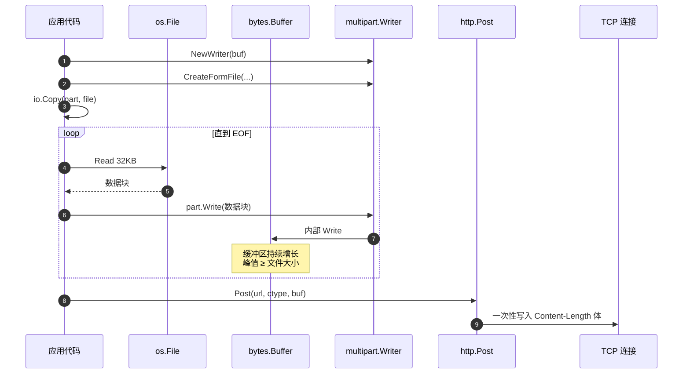
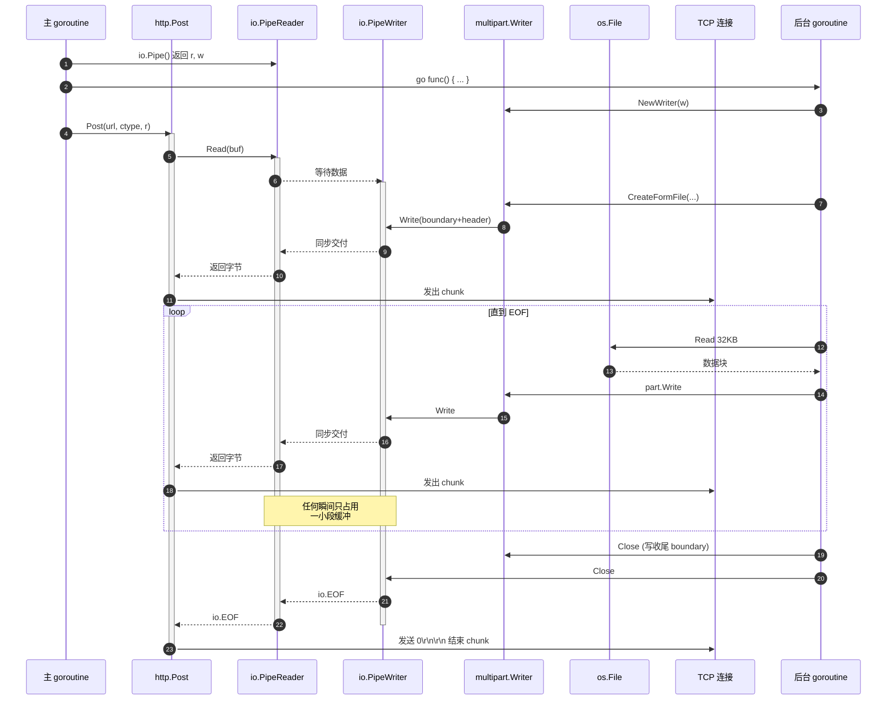
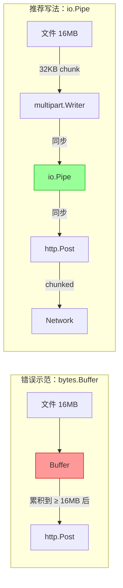

# 用 Go 以极小内存上传大文件 — 翻译与总结

> 原文链接：[Sending big file with minimal memory in Golang](https://medium.com/@owlwalks/sending-big-file-with-minimal-memory-in-golang-8f3fc280d2c)
> 作者：Khoa Pham（[owlwalks](https://medium.com/@owlwalks)）
> 原文发布日期：2018-11-12
> 翻译与总结时间：2026 年 6 月 15 日
> 文档归类：Go 网络编程 / `net/http` & `mime/multipart` & `io.Pipe`

---

## 一、文章摘要

本文是 Khoa Pham 一篇短小但极具实用价值的 Go 编程笔记，核心议题只有一个：

> **当客户端要通过 `multipart/form-data` 上传一个很大的文件时，怎样才能把整个进程的内存占用控制在常数级（与文件大小无关），而不是随文件线性膨胀？**

作者用一段最常见的「教科书写法」作反例，先让读者亲眼看到 `bytes.Buffer` 把整份文件吃进内存的灾难性后果；接着引入 `io.Pipe` + HTTP/1.1 `Transfer-Encoding: chunked` 的组合，把发送侧从「先编码到内存，再交给 http.Post」改造成「边编码边发送」的真正的流式管道。

最终在 16 MB 文件的基准测试中，内存分配从 **33,471,060 B/op（≈ 33 MB）** 降到 **84,767 B/op（≈ 84 KB）**，整整缩小了 **约 395 倍**。

文章核心知识点：

1. `multipart.Writer` + `bytes.Buffer` 的「先攒后发」会导致内存与文件等量
2. HTTP/1.1 的 chunked 分块传输允许不预先声明 `Content-Length`，是流式上传的协议基础
3. `io.Pipe` 是 Go 标准库里把 `io.Writer` 与 `io.Reader` 同步对接的零拷贝管道——它正是把 `multipart.Writer` 接到 `http.Post` 的关键胶水
4. Go 的 `net/http` 客户端会在请求体没有给出 `Content-Length` 时自动启用 `Transfer-Encoding: chunked`，无需手工设置

---

## 二、问题背景：教科书写法的内存陷阱

### 2.1 一个典型的 multipart 请求长什么样

HTTP `multipart/form-data` 把若干「部分」（字段、文件）拼接成一个请求体，每一部分由一个 boundary 分隔符分开。Mozilla 文档给出的示例如下（已格式化）：

```http
POST /foo HTTP/1.1
Content-Length: 68137
Content-Type: multipart/form-data; boundary=---------------------------974767299852498929531610575

-----------------------------974767299852498929531610575
Content-Disposition: form-data; name="description"

some text
-----------------------------974767299852498929531610575
Content-Disposition: form-data; name="myFile"; filename="foo.txt"
Content-Type: text/plain

(content of the uploaded file foo.txt)
-----------------------------974767299852498929531610575--
```

Go 标准库 `mime/multipart` 帮我们把 boundary 拼接、Header 写入这些脏活全包了。

### 2.2 第一版实现（错误示范）

最直观的写法——先用 `bytes.Buffer` 当中转站：

```go
func uploadBuffered(url, name string) error {
    buf := new(bytes.Buffer)

    writer := multipart.NewWriter(buf)
    defer writer.Close()

    part, err := writer.CreateFormFile("myFile", "foo.txt")
    if err != nil {
        return err
    }

    file, err := os.Open(name)
    if err != nil {
        return err
    }
    defer file.Close()

    if _, err = io.Copy(part, file); err != nil {
        return err
    }

    _, err = http.Post(url, writer.FormDataContentType(), buf)
    return err
}
```

逻辑上没有任何问题，跑起来也是对的。问题出在「为了发请求，要先把整个 multipart 报文构造完」这件事本身。

### 2.3 为什么内存会跟着文件膨胀？

关键之处在 `io.Copy(part, file)`：

| 步骤 | 行为 | 影响 |
|------|------|------|
| `io.Copy` 内部循环 | 每轮从 `file` 读约 32 KB（默认缓冲），写入 `part` | **读侧** 占用恒定 32 KB |
| `part.Write` → `multipart.Writer` → `buf.Write` | 数据穿透到底层 `bytes.Buffer` | **写侧** 不断 `append`，容量按 2× 增长 |
| 直到 `file` 读到 EOF 才返回 | 整个 `buf` 持有「文件全量 + 各部分 boundary + Header」 | **峰值内存 ≥ 文件大小** |
| 之后 `http.Post(..., buf)` 才真正开始发请求 | 一次性把缓冲区交给底层连接 | 高峰已经发生过了 |

作者形象地用一句话总结：

> *`buf` sequentially reads a modest 32kB from the file but won't stop until it reaches EOF, so to hold the file content `buf` needs to be at least at the file size, plus some additional boundary markup.*

也就是说 `bytes.Buffer` 的本质是「先吃完，再吐出」，根本没有「边吃边吐」的能力。**问题不在 `multipart.Writer`，问题在 `bytes.Buffer` 这个目的地**。

---

## 三、解决方案：`io.Pipe` + 分块传输编码

### 3.1 关键协议特性：HTTP/1.1 Chunked Transfer-Encoding

HTTP/1.1 允许请求/响应体使用 `Transfer-Encoding: chunked` 取代 `Content-Length`，按「长度 + 数据」的小块（chunk）连续发送，整个请求体没有事先确定的总大小。这正是「流式上传」的协议基础——只要 body 是一个可以持续读出字节的 `io.Reader`，HTTP 客户端就能边读边发，永远不需要把全部数据缓在内存里。

### 3.2 Go 的「管道型」原语：`io.Pipe`

`io.Pipe()` 返回一对同步管道端点：`*io.PipeReader` 和 `*io.PipeWriter`。它们的语义：

- 写入 `PipeWriter` 的数据 **会同步阻塞**，直到有人从 `PipeReader` 读走相同字节
- 没有任何内部缓冲——是真正的「点对点同步管道」
- 关闭 writer 后，reader 端会收到 `io.EOF`
- 既然写、读会在两个 goroutine 之间交替阻塞，那它天然就是「生产者-消费者」的同步信号量

⚠️ 一定要在独立 goroutine 里写，不然单线程同步 + 互相等待就死锁了。

### 3.3 第二版实现（推荐写法）

把 `bytes.Buffer` 替换成 `io.Pipe`，并把 `multipart.Writer` 那一侧搬到新 goroutine 里：

```go
func uploadStreaming(url, name string) error {
    r, w := io.Pipe()

    m := multipart.NewWriter(w)

    go func() {
        defer w.Close()
        defer m.Close()

        part, err := m.CreateFormFile("myFile", "foo.txt")
        if err != nil {
            return
        }

        file, err := os.Open(name)
        if err != nil {
            return
        }
        defer file.Close()

        if _, err = io.Copy(part, file); err != nil {
            return
        }
    }()

    _, err := http.Post(url, m.FormDataContentType(), r)
    return err
}
```

主 goroutine 调用 `http.Post(...)`，传入的 body 是 `r`——`net/http` 内部会循环 `r.Read(buf)`；
后台 goroutine 顺序写 boundary、Header、文件分片到 `w`；
两边像「水管两端」一样同步前进，文件被 32 KB 一段一段「流过」管道，**任何瞬间内存里只存在一小段缓冲**。

### 3.4 自动启用分块编码

打印请求头会看到 `net/http` 已经自动切换了协议形态：

```http
POST / HTTP/1.1
...
Transfer-Encoding: chunked
Accept-Encoding: gzip
Content-Type: multipart/form-data; boundary=....
User-Agent: Go-http-client/1.1
```

注意：

- **没有 `Content-Length`**
- 多了 `Transfer-Encoding: chunked`

这是因为 `io.Pipe` 返回的 `*PipeReader` 没有实现 `io.Seeker`，也无从知道总大小。`net/http` 客户端的逻辑大致是：「如果 body 类型不是已知的有长度的（如 `*bytes.Buffer` / `*bytes.Reader` / `*strings.Reader`），且没人显式设置 `Content-Length`，就用 chunked」。这也解释了为什么第一版会自动带上 `Content-Length: 68137`——`*bytes.Buffer` 在那一刻已经知道整体长度了。

### 3.5 基准测试对比

原文给出了 16 MB 文件的对比：

| 方案 | 内存分配 / 操作 |
|------|----------------|
| `bytes.Buffer` 版（错误示范） | **33,471,060 B/op ≈ 31.9 MiB** |
| `io.Pipe` 版（推荐写法） | **84,767 B/op ≈ 82.8 KiB** |

差距约 **395 倍**。文件越大，差距越拉越大，但 `io.Pipe` 版几乎保持常数。

---

## 四、整体架构图

### 4.1 错误示范：先攒后发



### 4.2 推荐写法：边读边发



### 4.3 内存占用对比



---

## 五、深入剖析：`io.Pipe` 到底做了什么

`io.Pipe` 不到 200 行 Go 代码，但思想精巧。理解它能帮助我们在更多场景里使用同样的范式（如「把任意 `Write` 接口接到任意 `Read` 接口」）。

### 5.1 源码骨架（简化）

```go
type pipe struct {
    wrMu sync.Mutex
    wrCh chan []byte
    rdCh chan int

    once sync.Once
    done chan struct{}
    rerr onceError
    werr onceError
}

func (p *pipe) read(b []byte) (n int, err error) {
    select {
    case <-p.done:
        return 0, p.readCloseError()
    default:
    }
    select {
    case bw := <-p.wrCh:
        nr := copy(b, bw)
        p.rdCh <- nr
        return nr, nil
    case <-p.done:
        return 0, p.readCloseError()
    }
}

func (p *pipe) write(b []byte) (n int, err error) {
    select {
    case <-p.done:
        return 0, p.writeCloseError()
    default:
        p.wrMu.Lock()
        defer p.wrMu.Unlock()
    }
    for once := true; once || len(b) > 0; once = false {
        select {
        case p.wrCh <- b:
            nw := <-p.rdCh
            b = b[nw:]
            n += nw
        case <-p.done:
            return n, p.writeCloseError()
        }
    }
    return n, nil
}
```

要点：

1. `wrCh chan []byte` 不带缓冲——写端发一段 slice 后 **必须等读端消费**
2. `rdCh chan int` 用于读端告诉写端「我这次拷走了多少字节」
3. 没有任何中间缓冲区，所有字节都是「写端 slice → 读端 buffer」一次拷贝
4. 这意味着 `io.Pipe` 内存占用真的是 O(1)，所有「在途字节」都在调用者自己的栈/堆上

### 5.2 适用范式：把「生成型 API」适配为 `io.Reader`

很多场景都是「我有一个能写的 API（如 `multipart.Writer`、`gzip.Writer`、`tar.Writer`、`csv.Writer`、`json.Encoder`），我想把它输出当作 `io.Reader` 喂给下游（如 `http.Post`、`s3.PutObject`、`io.Copy`）」。

万能模板：

```go
r, w := io.Pipe()

go func() {
    defer w.Close()

    enc := someEncoder.NewWriter(w)
    defer enc.Close()

    if err := produce(enc); err != nil {
        w.CloseWithError(err)
        return
    }
}()

return downstream.Consume(r)
```

### 5.3 ⚠️ 常见坑

1. **必须在新 goroutine 里写**——否则单线程同步死锁
2. **必须显式 `Close` 写端**——否则读端永远收不到 `io.EOF`，下游一直阻塞
3. **错误传递**：写端遇到错误必须用 `CloseWithError(err)`，否则读端只能拿到 `io.EOF`，上游误以为成功
4. **`http.Request.Body` 会自动 `Close`**：当 `http.Post`/`http.Client.Do` 返回（无论成败）时会关闭 body，反向通知后台 goroutine 通过 `Write` 的 error 退出。但仍要在 goroutine 内自行 `defer w.Close()`，因为读端 `Close` 不会触发写端立刻醒来——只有下次 `Write` 才会拿到错误
5. **重定向 / 重试**：因为请求体是「不可重放」的流，3xx 重定向或网络重试会失败。可借助 `http.Request.GetBody` 提供「重新生成 body 的工厂」（详见第八节）

---

## 六、可直接运行的完整示例

原文给的是片段，下面是一份可编译可跑的最小完整客户端，并附带 `httptest` 自检：

```go
package main

import (
    "fmt"
    "io"
    "log"
    "mime/multipart"
    "net/http"
    "net/http/httptest"
    "os"
    "path/filepath"
    "runtime"
)

// uploadStreaming 以流式方式上传文件，内存占用 O(1)
func uploadStreaming(url, fieldName, filePath string, extraFields map[string]string) (*http.Response, error) {
    file, err := os.Open(filePath)
    if err != nil {
        return nil, fmt.Errorf("open %s: %w", filePath, err)
    }

    r, w := io.Pipe()
    mw := multipart.NewWriter(w)

    go func() {
        defer file.Close()

        defer func() {
            if cerr := mw.Close(); cerr != nil {
                _ = w.CloseWithError(cerr)
                return
            }
            _ = w.Close()
        }()

        for k, v := range extraFields {
            if err := mw.WriteField(k, v); err != nil {
                _ = w.CloseWithError(fmt.Errorf("write field %s: %w", k, err))
                return
            }
        }

        part, err := mw.CreateFormFile(fieldName, filepath.Base(filePath))
        if err != nil {
            _ = w.CloseWithError(fmt.Errorf("create form file: %w", err))
            return
        }

        if _, err := io.Copy(part, file); err != nil {
            _ = w.CloseWithError(fmt.Errorf("copy file body: %w", err))
            return
        }
    }()

    req, err := http.NewRequest(http.MethodPost, url, r)
    if err != nil {
        return nil, err
    }
    req.Header.Set("Content-Type", mw.FormDataContentType())

    return http.DefaultClient.Do(req)
}

func main() {
    srv := httptest.NewServer(http.HandlerFunc(func(rw http.ResponseWriter, req *http.Request) {
        log.Printf("Server got %s, TE=%v, CL=%d",
            req.Header.Get("Content-Type"),
            req.TransferEncoding,
            req.ContentLength,
        )
        if err := req.ParseMultipartForm(10 << 20); err != nil {
            http.Error(rw, err.Error(), http.StatusBadRequest)
            return
        }
        f, hdr, err := req.FormFile("myFile")
        if err != nil {
            http.Error(rw, err.Error(), http.StatusBadRequest)
            return
        }
        defer f.Close()
        n, _ := io.Copy(io.Discard, f)
        fmt.Fprintf(rw, "received %s, size=%d, desc=%s\n", hdr.Filename, n, req.FormValue("description"))
    }))
    defer srv.Close()

    var m1, m2 runtime.MemStats
    runtime.ReadMemStats(&m1)

    resp, err := uploadStreaming(
        srv.URL,
        "myFile",
        "/path/to/some/16MB.bin",
        map[string]string{"description": "demo"},
    )
    if err != nil {
        log.Fatal(err)
    }
    defer resp.Body.Close()

    body, _ := io.ReadAll(resp.Body)
    log.Printf("Server replied: %s", body)

    runtime.ReadMemStats(&m2)
    log.Printf("HeapAlloc delta = %d B", m2.HeapAlloc-m1.HeapAlloc)
}
```

要点：

- 用 `CloseWithError` 把生产端错误透传给消费端，避免悄悄丢失
- `WriteField` 在 `CreateFormFile` 之前写，把元数据字段排在文件前，符合大多数后端解析器的偏好
- 服务端用 `ParseMultipartForm(10 << 20)`：超过 10 MB 的部分会自动落盘到临时文件，本身就是流式处理

### 基准测试参考

可以在同一进程里做横向对比：

```go
func BenchmarkUploadBuffered(b *testing.B) {
    srv := startSinkServer(b)
    defer srv.Close()
    for i := 0; i < b.N; i++ {
        if _, err := uploadBuffered(srv.URL, "16MB.bin"); err != nil {
            b.Fatal(err)
        }
    }
}

func BenchmarkUploadStreaming(b *testing.B) {
    srv := startSinkServer(b)
    defer srv.Close()
    for i := 0; i < b.N; i++ {
        if _, err := uploadStreaming(srv.URL, "myFile", "16MB.bin", nil); err != nil {
            b.Fatal(err)
        }
    }
}
```

运行 `go test -bench=. -benchmem` 即可复现作者结论。

---

## 七、扩展应用：同一范式的其他用法

流式管道的思想能解决一大类「生产者-消费者跨 io 接口」问题。下面几个常见场景与本文同源：

| 场景 | 生产端 | 消费端 | 收益 |
|------|--------|--------|------|
| 上传 multipart 大文件 | `multipart.Writer` | `http.Client.Do` | 内存 O(1)（本文主题） |
| 流式 gzip / deflate 上传 | `gzip.NewWriter(w)` | `http.Client.Do` | 边压缩边发 |
| 流式 tar.gz 备份到 S3 | `tar.NewWriter(gz)` | `s3manager.Uploader` | 无需先在磁盘组装包 |
| 流式 CSV 下载 | `csv.NewWriter(w)` | `http.ResponseWriter` | 服务端不必预生成全表 |
| 流式 JSON 大数组导出 | `json.NewEncoder(w)` | `io.Copy(dst, r)` | 内存恒定，可被中断 |
| 反过来：HTTP 响应体边收边解 | `http.Response.Body` | `json.NewDecoder` / `tar.NewReader` | 不需要先 `ReadAll` |

可以把这种范式记成一句口诀：**「`io.Pipe` 把 `Writer` API 一秒变 `Reader` API」**。

---

## 八、需要注意的边界与陷阱

### 8.1 重试与重定向

流式 body 是「不可重放」的——一旦消费完就没了。如果遇到 3xx 重定向、307/308 透传请求体、或想加自动重试，需要为 `http.Request` 提供 `GetBody`：

```go
req.GetBody = func() (io.ReadCloser, error) {
    r, w := io.Pipe()
    go produce(w, filePath) // 每次重新打开文件 + 重新生成 body
    return r, nil
}
```

如果 body 必然小（如配置文件、API JSON），其实更省事的是直接读到内存。**「流式」是个仅当数据真的大时才划算的工程权衡。**

### 8.2 服务端是否一定支持 chunked？

- 任何标准 HTTP/1.1 服务器（nginx、Go `net/http`、Java Servlet 容器…）都要求实现 chunked，所以一般没问题
- 部分老的 ELB/CDN 中间层、`http.Request.TransferEncoding` 处理不当的反向代理可能拒绝 chunked，遇到时报 `400 Bad Request: Content-Length required` 之类错误。这种环境下需要先把文件 size 拿到，然后**手动设 `req.ContentLength`** 并把 body 包成 `io.NopCloser(r)`，但要保证生产端总字节数和声明严丝合缝（包括所有 boundary）
- HTTP/2 没有 chunked 概念，本身就是流式帧，Go 客户端会自动转换

### 8.3 错误处理一定要走 `CloseWithError`

下面这种写法在生产端出错时，消费端只能看到 `io.EOF`，根本无从知道究竟是「正常结束」还是「读到一半失败」：

```go
go func() {
    defer w.Close()
    if _, err := io.Copy(part, file); err != nil {
        return // BUG: error 被吞了
    }
}()
```

正确写法：

```go
go func() {
    if _, err := io.Copy(part, file); err != nil {
        _ = w.CloseWithError(err)
        return
    }
    if err := mw.Close(); err != nil {
        _ = w.CloseWithError(err)
        return
    }
    _ = w.Close()
}()
```

### 8.4 并发顺序：先 `mw.Close()`，再 `w.Close()`

`multipart.Writer.Close()` 会写入收尾 boundary `--xxx--\r\n`。如果先关 `w`，那段收尾 boundary 就丢了，服务端会报「unexpected EOF」。正确顺序：

1. 写完所有 part
2. `mw.Close()`（写收尾 boundary 进管道）
3. `w.Close()`（让读端拿到 EOF）

### 8.5 不要在 producer 里 panic

panic 会让 producer goroutine 直接死，`w.Close` 永远不被调用，消费端永久阻塞。对不可控的代码段套 `defer recover()` + `CloseWithError(fmt.Errorf("panic: %v", r))` 是稳妥之选。

### 8.6 监控建议

可以在 producer 里包一层带计数的 `io.Reader`，把累计字节数推到 Prometheus / 日志，做「实时上传进度」用：

```go
type counter struct {
    r io.Reader
    n int64
    on func(int64)
}
func (c *counter) Read(p []byte) (int, error) {
    n, err := c.r.Read(p)
    c.n += int64(n)
    if c.on != nil { c.on(c.n) }
    return n, err
}
```

---

## 九、个人评价

| 维度 | 评分 / 评价 |
|------|-------------|
| **实用度** | ★★★★★ —— 几乎每个 Go 服务在做对象存储 / 文件中转 / S2S 上传时都会踩这个坑 |
| **代码质量** | ★★★☆☆ —— 原文片段省略了错误传递（没用 `CloseWithError`），生产环境需补全 |
| **可读性** | ★★★★★ —— 短小直白，对照前后两段代码即可学会 |
| **深度** | ★★★☆☆ —— 没有深入讨论 `io.Pipe` 实现、`GetBody`、HTTP/2 适配等边界，但作为入门切入点足够 |
| **2026 时效性** | ★★★★★ —— Go 1.22 之后 `io.Pipe` / `mime/multipart` / `net/http` 的语义完全没变，结论依旧成立 |

> 一句话推荐语：**Go 工程师面试上传大文件题，如果还在用 `bytes.Buffer`，那这篇文章值得现在就读。**

---

## 十、参考资料

- 原文：[Sending big file with minimal memory in Golang](https://medium.com/@owlwalks/sending-big-file-with-minimal-memory-in-golang-8f3fc280d2c)
- 配套服务端文章（原作者后续）：[Don't parse everything from client multipart POST (Golang)](https://medium.com/@owlwalks/dont-parse-everything-from-client-multipart-post-golang-9280d23cd4ad)
- Go 标准库：
  - [`io.Pipe`](https://pkg.go.dev/io#Pipe)
  - [`mime/multipart`](https://pkg.go.dev/mime/multipart)
  - [`net/http`](https://pkg.go.dev/net/http)
- HTTP 规范：[RFC 7230 §4.1 Chunked Transfer Coding](https://datatracker.ietf.org/doc/html/rfc7230#section-4.1)
- MDN：[`Content-Type: multipart/form-data`](https://developer.mozilla.org/en-US/docs/Web/HTTP/Headers/Content-Type)

