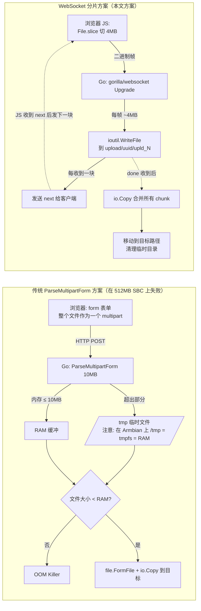
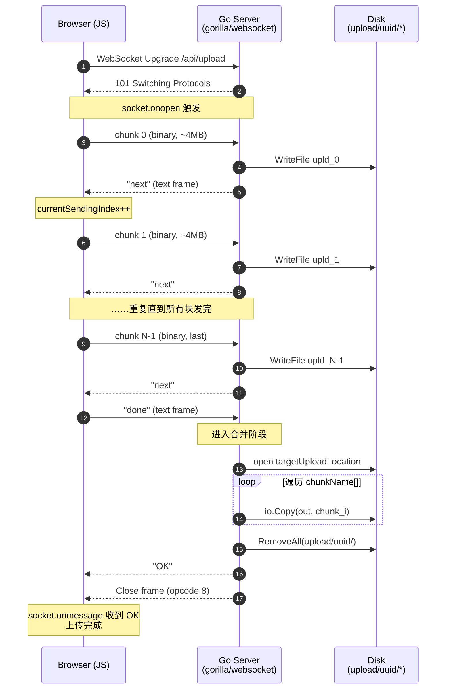
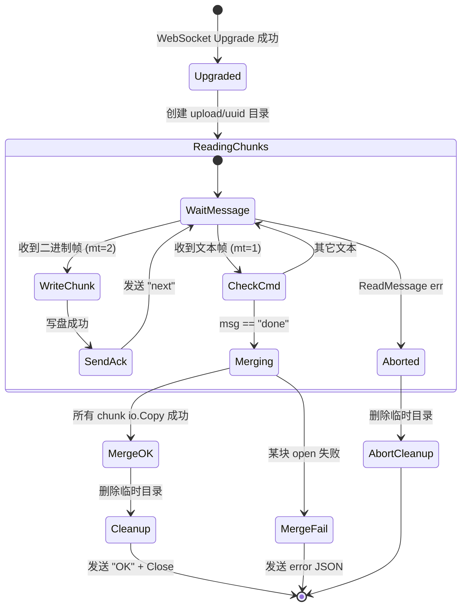
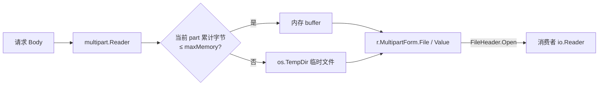

# 在 Go 中上传大于内存大小的文件 — 翻译与总结

> 原文链接：[Upload a file larger than RAM size in Go](https://dev.to/tobychui/upload-a-file-larger-than-ram-size-in-go-4m2i)
> 作者：Toby Chui（ArozOS Web 桌面项目作者）
> 发布平台：DEV Community
> 原文发布日期：2021-01-15
> 翻译与总结时间：2026 年 6 月 15 日
> 相关项目：[ArozOS File Manager](https://github.com/tobychui/arozos) / [gorilla/websocket](https://github.com/gorilla/websocket)

---

## 一、文章摘要

本文是一篇**面向单板计算机（SBC，如 OrangePi、ZeroPi）NAS 改造**的实战短文，作者只有 **512MB 内存**的 SBC 上想要支撑 **1~2GB 大文件上传**，但传统的 Go HTTP `r.ParseMultipartForm` + `r.FormFile` 用法会被 OOM Killer 杀掉进程。作者的解决思路是：**绕开 `multipart/form-data`，改用 WebSocket 把文件切成 4MB 块发送，服务端逐块落盘后再合并**。

核心收获：

1. **诊断**：清楚解释 `ParseMultipartForm(maxMemory)` 的「内存 + `/tmp` 双缓冲」机制，以及为什么在内存与 `/tmp` 都很小时（如 tmpfs 占用整片 RAM）会双双爆掉
2. **替代方案**：用 WebSocket 二进制帧 + 应用层 `"next"` ACK 协议做流式分片上传，把内存占用稳定控制在 ~4MB/块
3. **服务端范式**：基于 `gorilla/websocket`，先把每个 chunk 写入临时目录的独立文件，最后 `io.Copy` 串接合并

⚠️ **重要提示**：作者明言此为**最小可用实现**，文中代码省略了若干生产必备的鲁棒性处理（鉴权、超时、断点续传、SHA 校验、磁盘配额、并发安全、路径穿越防御）。本文档会在「五、生产化改造建议」一节系统补充。

⚠️ **更现代的替代方案**：作者写于 2021 年，目前（2026）Go 生态已有更优解——**使用 `r.MultipartReader()` 流式读取 `multipart/form-data`，零拷贝、零依赖、不需要 WebSocket 协议改造**。本文档会在「四、Go 原生流式上传的正确姿势」一节给出对比与可运行代码。

---

## 二、原文要点翻译

### 2.1 背景：能用 SBC 做 NAS 吗？

近年涌现了大量价格在 10 美元左右、却配备千兆网卡和多核 CPU 的单板计算机（SBC），算力堪比十多年前的 PC。作者使用过两块带千兆网口的板子：**ZeroPi** 与 **OrangePi Zero Plus**。

作为文件服务器，它们的硬件指标基本够用：

| 项目 | 规格 | 评价 |
|------|------|------|
| CPU | Allwinner H3 / H5 @ 1.3GHz | 文件服务器够用 |
| 网卡 | 1000Mbps Ethernet | 千兆速率 |
| 存储 IO | USB 2.0 + SD 卡（需要良好的缓存算法） | 勉强可用 |
| 体积 | 40 × 42 mm（原文笔误写成 cm） | 极小 |
| 功耗 | 5V / 0.2~0.3A | 极省电 |

作者自 2018 年起就用这类板子搭 NAS，但有个绕不开的痛点：**只有 512MB 内存**。这甚至比群晖最入门款都小。问题随之而来：**能不能让这种小内存机器支持上传比内存还大的文件？**

### 2.2 「正常情况」下的 Go 上传写法

网上随处可见的 Go 文件上传模板大致长这样：

```go
r.ParseMultipartForm(10 << 20) // 10MB 内存阈值

file, handler, err := r.FormFile("myFile")
if err != nil {
    fmt.Println("Error Retrieving the File")
    fmt.Println(err)
    return
}
defer file.Close()

// 然后把 file 复制到目标位置
```

正常机器上这样写完全没问题：multipart 表单数据被缓冲在内存中，`file.Close()` 后 GC 会回收。

**但在内存极小的机器上**，进程会被 OOM 杀掉。`ParseMultipartForm` 的工作流程是：

1. 浏览器构造 HTTP FORM，把文件内容塞进去
2. 浏览器发送 FORM，根据大小可能拆成多个 request
3. 因为文件太大，浏览器把请求拆成多个 chunk，这就是 "multipart form"
4. Go 的 `net/http` 库收齐这些请求，**先缓冲到 RAM**（在 Debian 上溢出后会落到 `/tmp`）
5. 文件比 RAM 还大时，`/tmp` 也满了，OS 开始报 "no space left on device"
6. Go 继续写，最终被 OS 杀进程

⚠️ **作者这里的描述有一处不严谨**：标准库 `mime/multipart.Reader.ReadForm(maxMemory)` 的设计是 **内存 ≤ maxMemory，超出部分溢写到 `os.TempDir()`（默认 `/tmp`）的临时文件**。所以严格来说不会无限制吞内存，而是把内存上限设为 `maxMemory`，剩余的 spill 到磁盘。作者机器爆掉的真实原因更可能是 **`/tmp` 被挂载为 tmpfs（即占用 RAM）**——这是 Armbian/Debian 默认行为，所以 spill 到 `/tmp` 反而把内存吃光。这一点对理解后续方案非常重要。

解决方案有两条路：

1. 重写一个请求处理库（太麻烦）
2. **不要用 `ParseMultipartForm`**（作者选择此路）

### 2.3 用 WebSocket 救场

WebSocket 不仅能传文本（聊天室、在线游戏），也能传二进制。**作者的核心想法是**：把文件切块，用 WebSocket 一块一块地发到服务端。借鉴 Hadoop DFS 的 chunk size，作者取 **4MB/块**。

**前端 JavaScript 实现**：

```javascript
let socket = new WebSocket("/api/upload");
let currentSendingIndex = 0;
let chunks = Math.ceil(file.size / uploadFileChunkSize);

// 按 id 发送某一块
function sendChunk(id) {
    var offsetStart = id * uploadFileChunkSize;
    var offsetEnd = offsetStart + uploadFileChunkSize;
    var thisblob = file.slice(offsetStart, offsetEnd);
    socket.send(thisblob);

    var progress = id / (chunks - 1) * 100.0;
    if (progress > 100) progress = 100;
    console.log("Progress (%): ", progress);
}
```

### 2.4 `socket.send()` 是异步的吗？

**是的**。因此不能用 `for` 循环把所有块一次性塞进去（会瞬间在浏览器侧把整个文件读入并交给底层缓冲，仍可能 OOM）。必须靠服务端 ACK 节流：

发送状态机：

1. 等待 socket 打开
2. 发送 0 号块（程序员从 0 开始数 :) ）
3. 等待服务端回 `"next"`
4. 收到 `"next"` → 发送下一块
5. 重复直到所有块发完
6. 发送 `"done"`，请求服务端合并
7. 等待服务端回 `"OK"`
8. 关闭 socket

前端事件回调：

```javascript
socket.onopen = function(e) {
    sendChunk(0);
    currentSendingIndex++;
};

socket.onmessage = function(event) {
    var incomingValue = event.data;
    if (incomingValue == "next") {
        if (currentSendingIndex == chunks + 1) {
            socket.send("done");
        } else {
            sendChunk(currentSendingIndex);
            currentSendingIndex++;
        }
    } else if (incomingValue == "OK") {
        console.log("Upload Completed!");
    }
};
```

### 2.5 Go 服务端实现（基于 gorilla/websocket）

作者只展示了核心逻辑（鉴权、UUID 生成等略）：

```go
// 定义本次上传任务的参数
uploadFolder := "./upload/" + taskUUID
chunkName := []string{}

// 升级为 WebSocket
var upgrader = websocket.Upgrader{}
c, err := upgrader.Upgrade(w, r, nil)
defer c.Close()

// 循环接收
for {
    mt, message, err := c.ReadMessage()
    if err != nil {
        // 客户端断开，清理临时目录
        log.Println("Upload terminated by client. Cleaning tmp folder.")
        time.Sleep(1 * time.Second)
        os.RemoveAll(uploadFolder)
        return
    }
    // mt == 2 为二进制（文件块），mt == 1 为文本（控制指令）
    if mt == 1 {
        msg := strings.TrimSpace(string(message))
        if msg == "done" {
            log.Println(userinfo.Username + " uploaded a file: " + targetUploadLocation)
            break
        }
    } else if mt == 2 {
        // 一块文件，写到临时目录
        chunkPath := filepath.Join(uploadFolder, "upld_"+strconv.Itoa(blockCounter))
        chunkName = append(chunkName, chunkPath)
        ioutil.WriteFile(chunkPath, message, 0700)
        blockCounter++
        lastChunkArrivalTime = time.Now().Unix()
        // 通知客户端发下一块
        c.WriteMessage(1, []byte("next"))
    }
}

// 合并（生产代码必须处理 error）
out, _ := os.OpenFile(targetUploadLocation, os.O_CREATE|os.O_WRONLY, 0755)
defer out.Close()
for _, filesrc := range chunkName {
    srcChunkReader, err := os.Open(filesrc)
    if err != nil {
        log.Println("Failed to open Source Chunk", filesrc, err.Error())
        c.WriteMessage(1, []byte(`{"error":"Failed to open Source Chunk"}`))
        return
    }
    io.Copy(out, srcChunkReader)
    srcChunkReader.Close()
}

c.WriteMessage(1, []byte("OK"))
os.RemoveAll(uploadFolder)
c.WriteControl(8, []byte{}, time.Now().Add(time.Second))
c.Close()
```

最终结果：作者把这段代码集成到自家 [ArozOS](https://github.com/tobychui/arozos) 文件管理器里，**512MB 内存的板子上成功上传了 1~2GB 文件**。当然，由于没有内存缓冲，最大上传速度被 SD 卡写入速度卡住。

---

## 三、整体处理流程（mermaid）

### 3.1 传统 `ParseMultipartForm` 路径 vs WebSocket 分片路径



### 3.2 WebSocket 分片上传的时序图



### 3.3 服务端状态机



---

## 四、Go 原生流式上传的正确姿势（2026 年视角）

作者写于 2021 年初，那时 Go 社区还不太强调 `multipart.Reader` 的流式用法。但实际上 **`net/http` 早就提供了零拷贝、零依赖的流式 multipart 解析能力**——无需改造客户端、无需 WebSocket，标准浏览器的 `<input type="file">` 表单就能直接走。这是「⚠️ 重要提示」里指出的更现代解法。

### 4.1 关键 API：`r.MultipartReader()`

`*http.Request` 提供两个 multipart 解析入口：

| 方法 | 行为 | 内存模型 |
|------|------|----------|
| `r.ParseMultipartForm(maxMemory)` | **一次性解析整个表单**，超出 `maxMemory` 部分溢写到 `os.TempDir()` 临时文件 | 内存上限 = `maxMemory`；磁盘消耗 ≈ 总上传量；要求 `/tmp` 足够大 |
| `r.MultipartReader()` | **返回 `*multipart.Reader`，按需迭代每个 part**；调用方负责消费每个 part 的 `io.Reader` | 内存恒定 ≈ 32KB（`bufio.Reader` 默认缓冲）；零临时文件 |

第二种就是大文件上传的「正确姿势」。

### 4.2 标准库流式上传服务端（推荐实现）

```go
package main

import (
    "crypto/sha256"
    "encoding/hex"
    "errors"
    "fmt"
    "io"
    "log"
    "net/http"
    "os"
    "path/filepath"
)

const (
    uploadDir      = "./upload"
    maxUploadBytes = 5 << 30 // 5GB 单次上传上限
)

func uploadHandler(w http.ResponseWriter, r *http.Request) {
    if r.Method != http.MethodPost {
        http.Error(w, "method not allowed", http.StatusMethodNotAllowed)
        return
    }

    // 1. 整体大小限制（连 header 一起计入）
    r.Body = http.MaxBytesReader(w, r.Body, maxUploadBytes)

    // 2. 获取 multipart Reader（不调用 ParseMultipartForm！）
    mr, err := r.MultipartReader()
    if err != nil {
        http.Error(w, "not a multipart request: "+err.Error(), http.StatusBadRequest)
        return
    }

    if err := os.MkdirAll(uploadDir, 0o755); err != nil {
        http.Error(w, err.Error(), http.StatusInternalServerError)
        return
    }

    type result struct {
        Field, Filename, SHA256 string
        Size                    int64
    }
    var results []result

    // 3. 逐个 part 处理
    for {
        part, err := mr.NextPart()
        if errors.Is(err, io.EOF) {
            break
        }
        if err != nil {
            http.Error(w, "next part: "+err.Error(), http.StatusBadRequest)
            return
        }

        // 跳过非文件 part（普通表单字段）
        if part.FileName() == "" {
            _, _ = io.Copy(io.Discard, part) // 文本字段按需读取
            continue
        }

        // 防御路径穿越，只保留 basename
        safeName := filepath.Base(part.FileName())
        dstPath := filepath.Join(uploadDir, safeName)

        // 用临时文件 + Rename 保证原子性
        tmp, err := os.CreateTemp(uploadDir, "uploading-*.part")
        if err != nil {
            http.Error(w, err.Error(), http.StatusInternalServerError)
            return
        }
        cleanup := func() { _ = os.Remove(tmp.Name()) }

        h := sha256.New()
        // 边写盘边算 hash；io.Copy 内部使用 32KB 缓冲，内存恒定
        n, err := io.Copy(io.MultiWriter(tmp, h), part)
        if err != nil {
            tmp.Close()
            cleanup()
            http.Error(w, "copy: "+err.Error(), http.StatusInternalServerError)
            return
        }
        if err := tmp.Close(); err != nil {
            cleanup()
            http.Error(w, err.Error(), http.StatusInternalServerError)
            return
        }
        if err := os.Rename(tmp.Name(), dstPath); err != nil {
            cleanup()
            http.Error(w, err.Error(), http.StatusInternalServerError)
            return
        }

        results = append(results, result{
            Field:    part.FormName(),
            Filename: safeName,
            Size:     n,
            SHA256:   hex.EncodeToString(h.Sum(nil)),
        })
        log.Printf("uploaded %s (%d bytes, sha256=%s)", safeName, n, hex.EncodeToString(h.Sum(nil)))
    }

    fmt.Fprintf(w, "OK, %d file(s) uploaded\n", len(results))
    for _, r := range results {
        fmt.Fprintf(w, "  %s -> %s  size=%d  sha256=%s\n", r.Field, r.Filename, r.Size, r.SHA256)
    }
}

func main() {
    http.HandleFunc("/upload", uploadHandler)
    log.Println("listening on :8080")
    log.Fatal(http.ListenAndServe(":8080", nil))
}
```

**内存恒定证明**：`io.Copy` 默认使用 32KB 缓冲；`multipart.Reader` 内部用 `bufio.Reader`（4KB）；`sha256` 是流式哈希；`MaxBytesReader` 只做计数。整个上传链路常驻内存 < 64KB，**和文件大小完全无关**。

### 4.3 客户端只需一个普通表单

```html
<form action="/upload" method="POST" enctype="multipart/form-data">
    <input type="file" name="myFile">
    <button type="submit">Upload</button>
</form>
```

或用 `fetch`：

```javascript
const fd = new FormData();
fd.append("myFile", document.querySelector("input[type=file]").files[0]);
fetch("/upload", { method: "POST", body: fd });
```

### 4.4 两种方案的对比

| 维度 | 原文 WebSocket 分片 | 标准库 `MultipartReader` 流式 |
|------|---------------------|--------------------------------|
| 客户端复杂度 | 高（自实现状态机、协议、进度） | 极低（原生 `<form>` 或 `fetch`） |
| 服务端依赖 | gorilla/websocket | 仅 net/http |
| 内存占用 | ~4MB/连接（一个 chunk） | ~64KB/连接 |
| 临时磁盘 | 需要 chunk 临时目录，最后合并 IO 翻倍 | 直接落盘到临时文件，一次 rename |
| 防爆库参数 | 应用层 ACK 自然节流 | `http.MaxBytesReader` |
| HTTP 中间件兼容 | 不走 HTTP，绕过 nginx 限制、auth 中间件等 | 完全兼容标准 HTTP 链路 |
| 进度回报 | 天然有 ACK，进度精确 | 需要 `XMLHttpRequest.upload.onprogress` 或 fetch 的 `ReadableStream` |
| 断点续传 | 易扩展（增加 chunk 序号协商） | 标准 HTTP 不直接支持，需要 Range / tus 协议 |
| 浏览器兼容 | 现代浏览器全部支持 WebSocket Binary | 100%（form-data） |
| 反代/防火墙 | WebSocket Upgrade 可能被某些代理拦 | HTTP POST，几乎不会有问题 |

**结论**：

- 如果你只是想「**在小内存机器上稳定接收大文件**」→ 用 `MultipartReader`，简单可靠
- 如果你需要**精确进度 + 断点续传 + 并行多线程上传** → 选择成熟协议（见第六章）
- WebSocket 自研协议在 2026 年已无明显优势

---

## 五、生产化改造建议（针对原文方案）

如果出于某些原因仍要沿用作者的 WebSocket 分片方案（例如已有 ArozOS 生态），下面是必须补全的鲁棒性点：

### 5.1 漏洞与缺陷清单

| # | 问题 | 风险 | 推荐改造 |
|---|------|------|----------|
| 1 | `taskUUID` 来源不明，若来自客户端可路径穿越到任意目录 | 高危：写任意文件 | 服务端用 `uuid.New()` 生成 |
| 2 | `targetUploadLocation` 未做 basename / 白名单校验 | 高危：写覆盖系统文件 | `filepath.Clean` + 检查是否在受允许的根目录下 |
| 3 | 单次循环无超时，客户端只发一个 chunk 后挂起会无限占用临时目录 | 中：资源耗尽 | `SetReadDeadline(time.Now().Add(60s))` 每次收到 chunk 后刷新 |
| 4 | 没有总大小限制，恶意用户可耗尽磁盘 | 高：DoS | 收 chunk 时累加 `total += len(message)`，超阈值断开 |
| 5 | 没有并发安全：同一 UUID 任务并发上传会互踩 | 低：实现 bug | UUID 唯一即可，避免人为复用 |
| 6 | `ioutil.WriteFile` 已弃用（Go 1.16+） | 低：编译告警 | 换成 `os.WriteFile` |
| 7 | 合并时 `io.Copy` 错误未被回传 | 中：客户端以为成功 | 必须在错误时 `c.WriteMessage` 明确 fail，并返回 |
| 8 | 临时目录残留：客户端断开恰好在「ReadMessage 返回 EOF」之外的路径 | 低：磁盘垃圾 | 用 `defer` 统一兜底清理 |
| 9 | 没有鉴权 | 高：任意人可写 | WebSocket Upgrade 前 cookie/JWT 校验，或在 `CheckOrigin` 内做 |
| 10 | 没有 SHA 校验 | 中：传输损坏不可知 | 客户端发完 done 时附带完整 SHA，服务端合并完比对 |
| 11 | 没有断点续传 | 中：体验差 | 上传任务前先 GET `/api/upload/state/{uuid}` 返回已收到的 chunk index |
| 12 | 合并阶段顺序读 N 个文件 → 写 1 个文件 = **N+1 倍的磁盘 IO** | 中：性能差 | 直接以「以追加模式打开目标文件」一次完成（见 5.3） |

### 5.2 改造后的服务端骨架

```go
package main

import (
    "encoding/json"
    "errors"
    "io"
    "log"
    "net/http"
    "os"
    "path/filepath"
    "time"

    "github.com/google/uuid"
    "github.com/gorilla/websocket"
)

const (
    chunkSize        = 4 << 20      // 4MB
    maxTotalBytes    = 4 << 30      // 4GB 单次任务上限
    readDeadline     = 60 * time.Second
    uploadRoot       = "/var/lib/myapp/uploads"
    finalizedRoot    = "/var/lib/myapp/files"
)

var upgrader = websocket.Upgrader{
    CheckOrigin: func(r *http.Request) bool {
        // 生产环境必须校验 Origin 与登录态
        return checkAuth(r)
    },
}

func uploadWS(w http.ResponseWriter, r *http.Request) {
    user, ok := authUser(r)
    if !ok {
        http.Error(w, "unauthorized", http.StatusUnauthorized)
        return
    }
    target := filepath.Clean(r.URL.Query().Get("name"))
    if target == "" || target == "." || target == ".." {
        http.Error(w, "invalid name", http.StatusBadRequest)
        return
    }
    // 强制 basename，避免穿越
    target = filepath.Base(target)
    finalPath := filepath.Join(finalizedRoot, user.ID, target)
    if !strings.HasPrefix(filepath.Clean(finalPath), filepath.Clean(finalizedRoot)+string(os.PathSeparator)) {
        http.Error(w, "path traversal", http.StatusBadRequest)
        return
    }

    taskID := uuid.NewString()
    tmpDir := filepath.Join(uploadRoot, user.ID, taskID)
    if err := os.MkdirAll(tmpDir, 0o700); err != nil {
        http.Error(w, err.Error(), http.StatusInternalServerError)
        return
    }
    // 兜底清理
    defer os.RemoveAll(tmpDir)

    c, err := upgrader.Upgrade(w, r, nil)
    if err != nil {
        return
    }
    defer c.Close()

    var (
        chunkPaths []string
        total      int64
        sha        = sha256.New()
    )

    for {
        if err := c.SetReadDeadline(time.Now().Add(readDeadline)); err != nil {
            return
        }
        mt, data, err := c.ReadMessage()
        if err != nil {
            return // defer 会清理
        }
        switch mt {
        case websocket.TextMessage:
            if strings.TrimSpace(string(data)) == "done" {
                if err := finalize(chunkPaths, finalPath); err != nil {
                    writeJSON(c, map[string]string{"error": err.Error()})
                    return
                }
                writeJSON(c, map[string]any{"status": "ok",
                    "sha256": hex.EncodeToString(sha.Sum(nil)),
                    "size":   total})
                return
            }
        case websocket.BinaryMessage:
            if int64(len(data))+total > maxTotalBytes {
                writeJSON(c, map[string]string{"error": "quota exceeded"})
                return
            }
            if len(data) > chunkSize*2 {
                writeJSON(c, map[string]string{"error": "chunk too large"})
                return
            }
            chunkPath := filepath.Join(tmpDir, fmt.Sprintf("c-%06d", len(chunkPaths)))
            if err := os.WriteFile(chunkPath, data, 0o600); err != nil {
                writeJSON(c, map[string]string{"error": err.Error()})
                return
            }
            sha.Write(data)
            total += int64(len(data))
            chunkPaths = append(chunkPaths, chunkPath)
            if err := c.WriteMessage(websocket.TextMessage, []byte("next")); err != nil {
                return
            }
        }
    }
}

// finalize 把所有 chunk 合并到目标路径（一次性追加，IO 仅 2x：读 chunk + 写 final）
func finalize(chunks []string, finalPath string) error {
    if err := os.MkdirAll(filepath.Dir(finalPath), 0o755); err != nil {
        return err
    }
    tmp := finalPath + ".uploading"
    out, err := os.OpenFile(tmp, os.O_CREATE|os.O_WRONLY|os.O_TRUNC, 0o644)
    if err != nil {
        return err
    }
    for _, p := range chunks {
        in, err := os.Open(p)
        if err != nil {
            out.Close()
            os.Remove(tmp)
            return err
        }
        if _, err := io.Copy(out, in); err != nil {
            in.Close()
            out.Close()
            os.Remove(tmp)
            return err
        }
        in.Close()
    }
    if err := out.Close(); err != nil {
        os.Remove(tmp)
        return err
    }
    return os.Rename(tmp, finalPath) // 原子提交
}
```

### 5.3 进一步优化：免合并写法

事实上「先 chunk 落盘再合并」是不必要的，可以**直接 append 到一个最终文件**：

```go
out, _ := os.OpenFile(tmp, os.O_CREATE|os.O_WRONLY|os.O_APPEND, 0o644)
for {
    mt, data, err := c.ReadMessage()
    if mt == websocket.BinaryMessage {
        out.Write(data)
        c.WriteMessage(websocket.TextMessage, []byte("next"))
    }
    // ...
}
out.Close()
os.Rename(tmp, finalPath)
```

这样 IO 减半（不再有读 chunk 的步骤），临时目录也不需要了。**唯一代价**：不再支持「乱序到达」「断点续传」。但本协议是严格顺序 ACK 的，本就不存在乱序问题，所以这个优化几乎是免费午餐。

⚠️ 如果未来要加断点续传，则必须回到「N 个 chunk 文件」模式，因为需要让服务端报告「已成功收到 [0,1,2,5,6]」给客户端，客户端补传 3、4。

---

## 六、推荐的开源替代方案（生产首选）

如果你的目标是**真正生产级的大文件上传**，与其自研 WebSocket 协议，不如直接使用社区成熟方案：

### 6.1 [tus.io](https://tus.io/) — 可恢复上传协议（强烈推荐）

- **协议层标准**：IETF 草案 `draft-tus-httpbis-resumable-uploads-protocol`
- **核心思想**：HTTP PATCH + `Upload-Offset` / `Upload-Length` 头，天然支持断点续传
- **服务端**：[tus/tusd](https://github.com/tus/tusd)（Go 实现，CNCF 生态广泛使用）
- **客户端**：[tus-js-client](https://github.com/tus/tus-js-client)、Android/iOS/Java SDK 都有
- **优点**：协议清晰、有规范、可恢复、可并行（多个 PATCH 不同 offset）、纯 HTTP（不走 WebSocket）

```go
// 服务端嵌入 tusd（约 20 行代码）
import "github.com/tus/tusd/pkg/filestore"
import tusd "github.com/tus/tusd/pkg/handler"

store := filestore.New("./uploads")
composer := tusd.NewStoreComposer()
store.UseIn(composer)
handler, _ := tusd.NewHandler(tusd.Config{
    BasePath:      "/files/",
    StoreComposer: composer,
})
http.Handle("/files/", http.StripPrefix("/files/", handler))
```

### 6.2 [Resumable.js](http://www.resumablejs.com/) / [flow.js](https://github.com/flowjs/flow.js)

- 客户端库，**模拟 chunk + 重传 + 并行**
- 服务端只需实现 `GET /upload?chunkNumber=N`（探活，是否已收到）与 `POST /upload`（接收）两个 endpoint
- 优点：纯 HTTP，无需 WebSocket；与各种 Web 框架兼容
- 缺点：不是协议规范，库间生态不互通

### 6.3 S3 Multipart Upload

如果对象存储是终态，直接走 **S3 Multipart Upload 协议**：
- 客户端拿预签名 URL，分片上传
- 服务端零成本，由对象存储兜底
- 适合云原生架构

### 6.4 选型推荐表

| 场景 | 首选 | 理由 |
|------|------|------|
| 普通 Web 应用，文件 < 100MB | **`MultipartReader`** | 标准库就够，零依赖 |
| Web 应用，文件 100MB ~ 10GB | **tusd / tus.io** | 协议成熟、可恢复、纯 HTTP |
| 移动端 / 弱网，需要断点续传 | **tus.io** | 客户端 SDK 全 |
| 已有 ArozOS / 自研 NAS 项目 | 沿用 WebSocket 分片 + 5.2 改造 | 改造成本最低 |
| 终态是对象存储 | **S3 Multipart** | 让对象存储承担分片合并 |
| 不允许 WebSocket（代理限制） | tus.io 或 Resumable.js | 纯 HTTP |

---

## 七、技术评价

### 7.1 原文的优点

1. **问题定位精准**：清晰指出 `ParseMultipartForm` 在小内存机器上的失败模式
2. **方案简单可落地**：WebSocket + ACK 是工程师能 1 小时内实现的最小方案
3. **真实场景验证**：作者在自己的 ArozOS 项目上跑通了 1~2GB 文件上传，可信度高
4. **故事完整**：从硬件背景、问题、原理、代码到效果一气呵成，适合作为入门教程

### 7.2 原文的局限性

| 局限 | 影响 |
|------|------|
| 把「`ParseMultipartForm` 会无限吃内存」的说法过于绝对 | 实际上标准库有 `maxMemory` 阈值；真正问题是 tmpfs |
| 没有提到 `r.MultipartReader()` 这个标准库方案 | 导致读者以为只能 WebSocket |
| 协议没有规范化（chunk 序号、SHA、resume） | 无法和其它项目互通 |
| 安全/鲁棒性几乎完全缺失 | 不能直接用于生产 |
| 没有讨论后续断点续传与并行 | 后续扩展成本高 |

### 7.3 文章定位

- **适合**：自学 Go + WebSocket + 嵌入式 NAS 项目的入门读者；个人项目快速 POC
- **不适合**：直接复制到生产环境；对协议完备性、安全性有要求的场景

---

## 八、关键知识点速查

### 8.1 `ParseMultipartForm` 内存模型



- `maxMemory` 默认 32MB（如果你传 `0`）
- spill 到磁盘后，关闭请求会自动清理临时文件（依赖 `Request.MultipartForm.RemoveAll`）

### 8.2 `MultipartReader` 流式模型


- 内存恒定 ≈ 32KB
- 调用方必须自己消费每个 part；忽略也要 `io.Copy(io.Discard, part)`，否则后续 NextPart 不正确
- 一旦你调用了 `r.FormValue` / `r.ParseMultipartForm`，就再也不能用 `MultipartReader`（因为 Body 已被消费）

### 8.3 WebSocket 二进制 vs HTTP 大文件

| 维度 | WebSocket Binary Frame | HTTP Multipart |
|------|------------------------|----------------|
| 报头开销 | 2~14 字节/帧 | 每个 part ~200 字节 + boundary |
| 流量节省 | 高 | 中 |
| 中间件穿透 | 差（代理需 Upgrade 支持） | 强 |
| 进度回报 | 应用层自实现，精确 | 浏览器 `XHR.upload.onprogress` |
| 断点续传 | 需要自研协议 | tus / Range |

---

## 九、参考资料

- 原文：[Upload a file larger than RAM size in Go](https://dev.to/tobychui/upload-a-file-larger-than-ram-size-in-go-4m2i)
- [gorilla/websocket](https://github.com/gorilla/websocket) — Go WebSocket 实现
- [tus.io](https://tus.io/) — 可恢复上传协议（推荐生产方案）
- [tus/tusd](https://github.com/tus/tusd) — tus 协议 Go 服务端
- [`net/http`: Request.MultipartReader](https://pkg.go.dev/net/http#Request.MultipartReader)
- [`mime/multipart`: Reader](https://pkg.go.dev/mime/multipart#Reader)
- [Go MaxBytesReader](https://pkg.go.dev/net/http#MaxBytesReader)
- [ArozOS](https://github.com/tobychui/arozos) — 作者的开源 Web 桌面项目
- [Hadoop DFS block size 历史与权衡](https://hadoop.apache.org/docs/r3.3.0/hadoop-project-dist/hadoop-hdfs/HdfsDesign.html)

---

> **总结一句话**：本文给出了一个「在内存极小的设备上接收超大文件」的工程化思路（WebSocket 分片），但对 2026 年的 Go 开发者，标准库 `r.MultipartReader()` 才是「**零依赖、零成本、内存恒定**」的更优解；如果需要断点续传，请直接用 [tus.io](https://tus.io/)。
