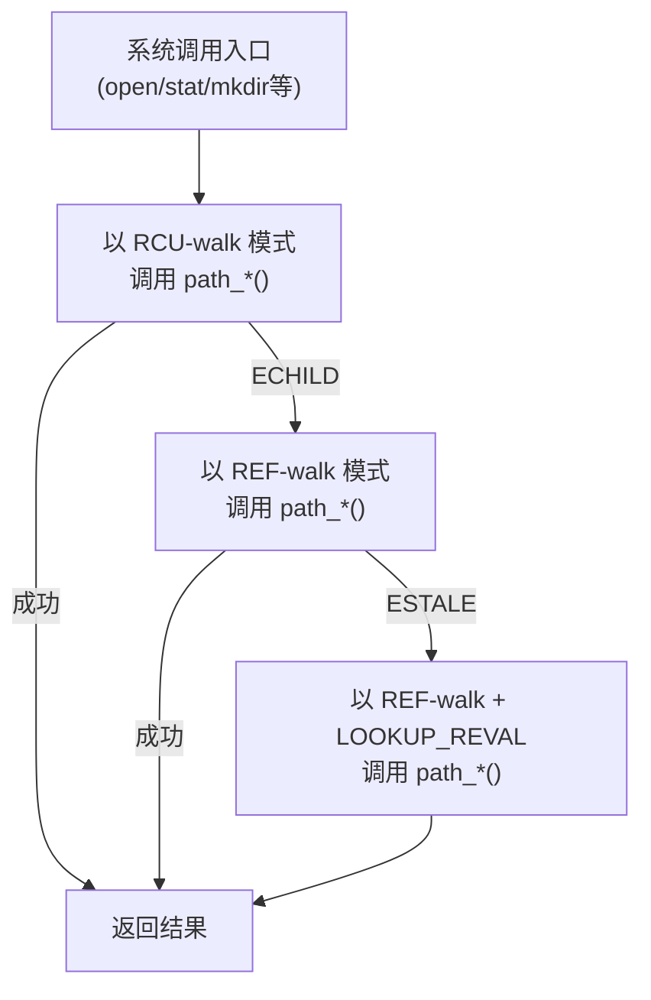
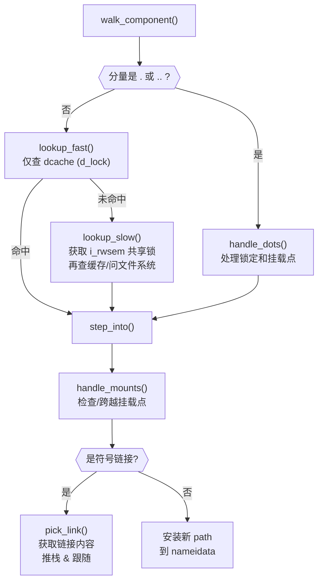
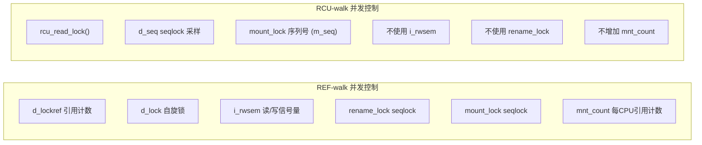
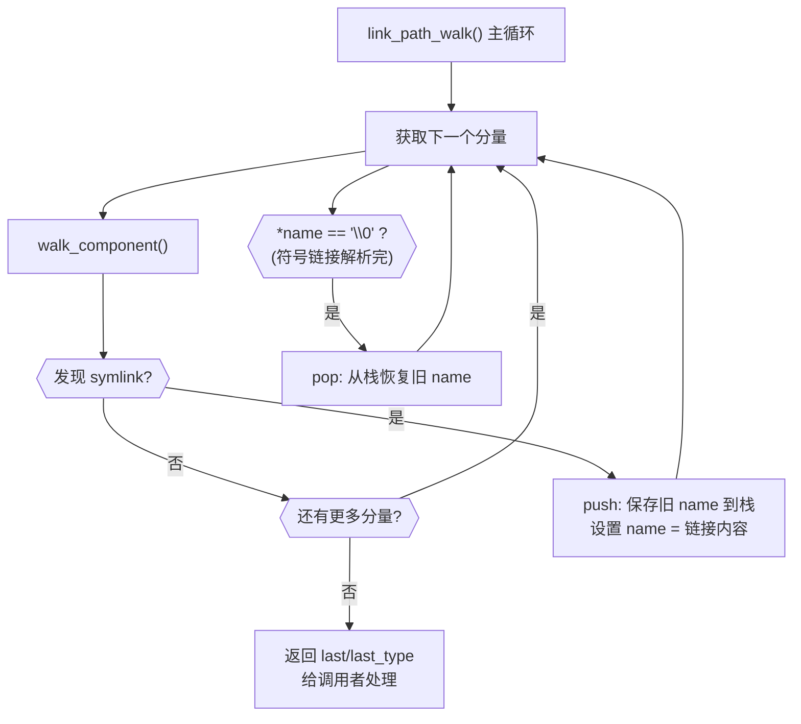

# Linux 内核路径名查找（Pathname Lookup）

> 原文：[Pathname lookup — The Linux Kernel documentation](https://www.kernel.org/doc/html/latest/filesystems/path-lookup.html)
>
> 翻译日期：2026-06-15
>
> 本文基于发表在 lwn.net 上的三篇文章：
> - [Pathname lookup in Linux](https://lwn.net/Articles/649115/)
> - [RCU-walk: faster pathname lookup in Linux](https://lwn.net/Articles/649729/)
> - [A walk among the symlinks](https://lwn.net/Articles/650786/)
>
> 由 Neil Brown 撰写，得到 Al Viro 和 Jon Corbet 的协助。后续经过更新以反映内核的变化，包括：
> - 每目录并行名称查找
> - `openat2()` 解析限制标志

---

## 一、路径名查找概述

路径名查找最显而易见的特征——只需稍加探索即可发现——就是它非常**复杂**。众多规则、特殊情况和实现方案结合在一起，常常让不经意的读者感到困惑。计算机科学早已熟悉这种复杂性，并拥有管理它的工具。我们将大量使用的一个工具是"**分而治之**"。在分析的早期部分，我们将把符号链接（symlinks）分离出来——留到最后再处理。在涉及符号链接之前，我们还有一个基于 VFS 锁机制方式的重要划分，这将使我们能够分别讨论"REF-walk"和"RCU-walk"。但现在我们先超前了。有些重要的底层区别需要先澄清。

### 1.1 两种类型

路径名（有时称为"文件名"），用于标识文件系统中的对象，对大多数读者来说应该很熟悉。它们包含两种元素："**斜杠**"（由一个或多个 `/` 字符组成的序列）和"**分量**"（由一个或多个非 `/` 字符组成的序列）。由此形成两种路径：以斜杠开头的是"**绝对路径**"，从文件系统根目录开始。其余的是"**相对路径**"，从当前目录开始，或从由 `*at()` 系统调用（如 `openat()`）所指定的文件描述符所在位置开始。

将第二种描述为以分量开头是很诱人的，但这并不总是准确的：路径名可以既没有斜杠也没有分量，换句话说，它可以是空的。这在 POSIX 中通常是被禁止的，但 Linux 中的某些 `*at()` 系统调用在给出 `AT_EMPTY_PATH` 标志时允许这样做。例如，如果你持有一个可执行文件的打开文件描述符，可以通过调用 `execveat()` 并传入该文件描述符、空路径和 `AT_EMPTY_PATH` 标志来执行它。

这些路径可以分为两个部分：**最终分量**和**其余所有部分**。"其余所有部分"是简单的部分。在所有情况下，它必须标识一个已经存在的目录，否则将报告诸如 `ENOENT` 或 `ENOTDIR` 之类的错误。

最终分量则没那么简单。不仅不同的系统调用对它的解释截然不同（例如，有些会创建它，有些不会），而且它甚至可能不存在：空路径名和仅由斜杠组成的路径名都没有最终分量。如果它确实存在，它可能是 `.` 或 `..`，它们的处理方式与其他分量完全不同。

如果路径名以斜杠结尾，如 `/tmp/foo/`，可能很想把它看作具有一个空的最终分量。在很多情况下这会得出正确结果，但并非总是如此。特别是，`mkdir()` 和 `rmdir()` 分别创建或删除由最终分量命名的目录，它们必须能够处理以 `/` 结尾的路径名。根据 POSIX 的说法：

> 包含至少一个非斜杠字符且以一个或多个尾随斜杠字符结尾的路径名，只有在尾随斜杠字符之前的最后一个路径名分量命名了一个已存在的目录，或者命名了一个在路径名解析后将立即创建的目录条目时，才能被成功解析。

Linux 路径名遍历代码（主要在 `fs/namei.c` 中）处理所有这些问题：将路径分解为分量，将"其余所有部分"与最终分量完全分开处理，以及检查尾部斜杠不被用在不允许的地方。它还解决了**并发访问**这一重要问题。

当一个进程正在查找路径名时，另一个进程可能正在进行影响该查找的更改。一个相当极端的情况是：如果在另一个进程正在查找 `a/b/..` 时将 `a/b` 重命名为 `a/c/b`，该进程可能会成功地解析到 `a/c`。大多数竞态条件要微妙得多，路径名查找的很大一部分任务就是防止它们产生有害影响。许多可能的竞态条件在"dcache"的上下文中最容易看清楚，对 dcache 的理解是理解路径名查找的核心。

### 1.2 不仅仅是缓存

"**dcache**"（目录项缓存）缓存文件系统中每个名称的信息，使其能够被快速查找。每个条目（称为"**dentry**"，目录项）包含三个重要字段：
- 一个**分量名称**（component name）
- 一个指向**父 dentry** 的指针
- 一个指向"**inode**"的指针，inode 包含了该父目录中具有给定名称的对象的更多信息

inode 指针可以为 `NULL`，表示该名称在父目录中不存在。虽然目录的 dentry 可以链接到其子 dentry，但该链接在路径名查找中不使用，因此这里不予考虑。

dcache 除了加速查找外还有许多用途。一个特别相关的用途是，它与记录哪个文件系统挂载在哪里的**挂载表**（mount table）紧密集成。挂载表实际存储的是哪个 dentry 被挂载在哪个另一个 dentry 之上。

在考虑 dcache 时，我们遇到了另一种"两种类型"的区分：有**两种类型的文件系统**。

一些文件系统确保 dcache 中的信息**始终完全准确**（尽管不一定完整）。这允许 VFS 在不咨询文件系统的情况下确定某个特定文件是否存在，并意味着 VFS 可以保护文件系统免受某些竞态条件和其他问题的影响。这些通常是"本地"文件系统，如 ext3、XFS 和 Btrfs。

其他文件系统不提供这种保证，因为它们做不到。这些通常是跨网络共享的文件系统，无论是远程文件系统（如 NFS 和 9P），还是集群文件系统（如 ocfs2 或 cephfs）。这些文件系统允许 VFS 重新验证缓存的信息，并且必须提供自己的竞态条件保护。VFS 可以通过 dentry 中设置的 `DCACHE_OP_REVALIDATE` 标志来检测这些文件系统。

### 1.3 REF-walk：使用引用计数和自旋锁的简单并发管理

在所有这些划分都被仔细分类之后，我们现在可以开始看实际的路径遍历过程。特别是，我们将从处理路径名的"其余所有部分"开始，并专注于并发管理的"REF-walk"方法。这些代码位于 `link_path_walk()` 函数中（忽略所有仅在设置了 `LOOKUP_RCU`（表示使用 RCU-walk）时才运行的部分）。

REF-walk 在锁和引用计数方面相当重量级。虽然不像过去"大内核锁"（Big Kernel Lock）时代那样重，但当需要锁时当然不会犹豫去获取。它使用多种不同的并发控制机制。这里假定读者对各种原语有基本了解，或者可以从其他地方获取，例如 *Meet the Lockers*。

REF-walk 使用的锁机制包括：

#### 1.3.1 `dentry->d_lockref`

这使用 **lockref** 原语来同时提供自旋锁和引用计数。这个原语的特殊之处在于，概念上的序列"**lock; inc_ref; unlock;**"通常可以用单个原子内存操作来完成。

持有对 dentry 的引用确保该 dentry 不会突然被释放并用于其他目的，因此各种字段中的值将按预期行为。它还在一定程度上保护了 `->d_inode` 对 inode 的引用。

dentry 与其 inode 之间的关联是相当**持久**的。例如，当文件被重命名时，dentry 和 inode 一起移动到新位置。当文件被创建时，dentry 最初将是"负的"（negative，即 `d_inode` 为 `NULL`），并将在创建行为的一部分中被分配给新的 inode。

当文件被删除时，这可以通过两种方式反映在缓存中：将 `d_inode` 设置为 `NULL`，或者将其从用于在父目录中查找名称的**哈希表**（稍后描述）中移除。如果 dentry 仍在使用中，则使用第二种方式，因为在文件被删除后继续使用一个打开的文件是完全合法的，保留 dentry 有助于此。只有当 dentry 未被其他使用时（即 `d_lockref` 中的引用计数为 1），`d_inode` 才会被设置为 `NULL`。这样做对于一个非常常见的情况更加高效。

所以只要持有对 dentry 的计数引用，非 `NULL` 的 `->d_inode` 值就永远不会被更改。

#### 1.3.2 `dentry->d_lock`

`d_lock` 是上述 `d_lockref` 中自旋锁部分的同义词。对于我们的目的，持有此锁可以防止 dentry 被**重命名或取消链接**。特别是，它的父目录（`d_parent`）和名称（`d_name`）不能被更改，并且它不能从 dentry 哈希表中被移除。

当在目录中查找名称时，REF-walk 对它在哈希表中找到的每个候选 dentry 获取 `d_lock`，然后检查父目录和名称是否正确。所以它在搜索缓存时不会锁定父目录；它只锁定子目录。

当为给定名称查找父目录（处理 `..`）时，REF-walk 可以获取 `d_lock` 来获得对 `d_parent` 的稳定引用，但它首先尝试一种更轻量级的方法。如 `dget_parent()` 中所见，如果可以获取对父目录的引用，并且随后可以看到 `d_parent` 没有发生变化，那么实际上不需要获取子目录上的锁。

#### 1.3.3 `rename_lock`

在给定目录中查找给定名称涉及从两个值（名称和目录的 dentry）计算哈希，访问哈希表中的那个槽位，并搜索在那里找到的链表。

当 dentry 被重命名时，名称和父 dentry 都可以改变，所以哈希几乎肯定也会改变。这会将 dentry 移动到哈希表中的不同链上。如果文件名搜索恰好正在查看以这种方式被移动的 dentry，它可能最终沿着错误的链继续搜索，从而错过正确链的一部分。

名称查找过程（`d_lookup()`）**不**试图阻止这种情况发生，而只是**检测**它何时发生。`rename_lock` 是一个 **seqlock**（顺序锁），每当任何 dentry 被重命名时都会更新。如果 `d_lookup` 发现在它未成功地扫描哈希表中的一条链时发生了重命名，它只是简单地重试。

`rename_lock` 还用于检测和防御在解析 `..` 时针对 `LOOKUP_BENEATH` 和 `LOOKUP_IN_ROOT` 的潜在攻击（父目录被移到根目录之外，绕过 `path_equal()` 检查）。如果在查找期间 `rename_lock` 被更新且路径遇到了 `..`，则可能发生了攻击，`handle_dots()` 将以 `-EAGAIN` 退出。

#### 1.3.4 `inode->i_rwsem`

`i_rwsem` 是一个**读/写信号量**，用于序列化对特定目录的所有更改。这确保了例如 `unlink()` 和 `rename()` 不能同时发生。它还在文件系统被要求查找当前不在 dcache 中的名称时保持目录稳定，或者（可选地）当使用 `readdir()` 检索目录中的条目列表时。

它与 `d_lock` 的角色互补：目录上的 `i_rwsem` 保护该目录中的**所有名称**，而名称上的 `d_lock` 仅保护目录中的**一个名称**。对 dcache 的大多数更改都持有相关目录 inode 上的 `i_rwsem`，并在更改发生时短暂获取一个或多个 dentry 上的 `d_lock`。一个例外是当空闲 dentry 由于内存压力而从 dcache 中被移除时——这使用 `d_lock`，但 `i_rwsem` 不参与。

该信号量通过两种不同方式影响路径名查找：

**首先**，它防止在目录中查找名称期间发生更改。`walk_component()` 首先使用 `lookup_fast()`——它只查看 dcache，仅使用 `d_lock` 锁定。如果名称没有找到，则 `walk_component()` 退回到 `lookup_slow()`——它获取 `i_rwsem` 上的**共享锁**，再次检查缓存中是否有该名称，然后调用文件系统来获取确定性答案。无论结果如何，新的 dentry 都将被添加到缓存中。

**其次**，当路径名查找到达最终分量时，它有时需要在执行最后一次查找之前获取 `i_rwsem` 上的**独占锁**，以实现所需的互斥。路径查找如何选择获取或不获取 `i_rwsem` 是在后续部分中讨论的问题之一。

如果两个线程同时尝试查找相同的名称——该名称尚未在 dcache 中——`i_rwsem` 上的共享锁不会阻止它们都添加具有相同名称的新 dentry。由于这会导致混乱，需要基于**次级哈希表**（`in_lookup_hashtable`）和每 dentry 标志位（`DCACHE_PAR_LOOKUP`）的额外互锁级别。

要在仅持有 `i_rwsem` 共享锁的情况下向缓存添加新的 dentry，线程必须调用 `d_alloc_parallel()`。它分配一个 dentry，在其中存储所需的名称和父目录，检查主哈希表或次级哈希表中是否已存在匹配的 dentry，如果没有，则将新分配的 dentry 存储在次级哈希表中，并设置 `DCACHE_PAR_LOOKUP`。

如果在主哈希表中找到匹配的 dentry，则返回该 dentry，调用者可以知道它在竞争中输了。如果在两个缓存中都没有找到匹配的 dentry，则返回新分配的 dentry，调用者可以通过 `DCACHE_PAR_LOOKUP` 的存在来检测到这一点。在这种情况下，它知道自己赢得了竞争，现在负责请求文件系统执行查找并找到匹配的 inode。当查找完成时，它必须调用 `d_lookup_done()`，该函数清除标志并执行一些其他内部管理工作，包括从次级哈希表中移除 dentry——它通常已经被添加到主哈希表中了。注意，一个 `struct waitqueue_head` 被传递给 `d_alloc_parallel()`，并且 `d_lookup_done()` 必须在该 `waitqueue_head` 仍然在作用域内时被调用。

如果在次级哈希表中找到匹配的 dentry，`d_alloc_parallel()` 还有更多工作要做。它首先使用传递给赢得竞争的 `d_alloc_parallel()` 实例的 `wait_queue`（将被 `d_lookup_done()` 的调用唤醒）等待 `DCACHE_PAR_LOOKUP` 被清除。然后它检查 dentry 是否现在已被添加到主哈希表中。如果是，则返回 dentry，调用者只是看到自己输了竞争。如果没有被添加到主哈希表中，最可能的解释是使用 `d_splice_alias()` 添加了某个其他 dentry。在任何情况下，`d_alloc_parallel()` 从头开始重复所有查找，通常会从主哈希表中返回某些东西。

#### 1.3.5 `mnt->mnt_count`

`mnt_count` 是 `mount` 结构上的**每 CPU 引用计数器**。每 CPU 意味着增加计数是廉价的，因为它只使用 CPU 本地内存，但检查计数是否为零是昂贵的，因为它需要检查每个 CPU。获取 `mnt_count` 引用防止 mount 结构作为常规卸载操作的结果而消失，但不能防止"延迟"卸载（lazy unmount）。所以持有 `mnt_count` 并不确保挂载保持在命名空间中，特别是不稳定对被挂载目录（mounted-on dentry）的链接。但是，它确保 `mount` 数据结构保持一致，并提供对已挂载文件系统根 dentry 的引用。因此，通过 `->mnt_count` 的引用提供了对已挂载 dentry 的稳定引用，但不是对被挂载目录（mounted-on dentry）的稳定引用。

#### 1.3.6 `mount_lock`

`mount_lock` 是一个全局 seqlock，有点像 `rename_lock`。它可以用来检查是否对任何挂载点进行了更改。

在**向下遍历树**（远离根目录方向）时，此锁在跨越挂载点时用于检查跨越是否安全。即，先读取 seqlock 中的值，然后代码找到挂载在当前目录上的挂载（如果有的话），并增加 `mnt_count`。最后将 `mount_lock` 中的值与旧值进行核对。如果没有变化，则跨越是安全的。如果有变化，则减少 `mnt_count` 并重试整个过程。

在**向上遍历树**（朝向根目录方向）通过跟随 `..` 链接时，需要更加小心。在这种情况下，seqlock（包含计数器和自旋锁）被完全锁定，以防止在向上步进时对任何挂载点的更改。这种锁定是稳定对被挂载目录链接所必需的，因为挂载本身的引用计数不能确保这一点。

`mount_lock` 还用于检测和防御在解析 `..` 时针对 `LOOKUP_BENEATH` 和 `LOOKUP_IN_ROOT` 的潜在攻击（父目录被移到根目录之外，绕过 `path_equal()` 检查）。如果在查找期间 `mount_lock` 被更新且路径遇到了 `..`，则可能发生了攻击，`handle_dots()` 将以 `-EAGAIN` 退出。

#### 1.3.7 RCU

最后，全局的（但极其轻量级的）**RCU 读锁**不时被持有，以确保某些数据结构不会被意外释放。

特别是，它在扫描 dcache 哈希表和挂载点哈希表中的链时被持有。

### 1.4 用 `struct nameidata` 将一切联系在一起

在遍历路径的整个过程中，当前状态存储在一个 `struct nameidata` 中。"namei"是传统名称——一直追溯到 First Edition Unix——用于将"名称"转换为"inode"的函数。`struct nameidata` 包含（除其他字段外）：

#### `struct path path`

`path` 包含一个 `struct vfsmount`（嵌入在 `struct mount` 中）和一个 `struct dentry`。它们一起记录了遍历的当前状态。它们开始时引用起始点（当前工作目录、根目录或由文件描述符标识的其他目录），并在每一步中更新。始终通过 `d_lockref` 和 `mnt_count` 持有引用。

#### `struct qstr last`

这是一个字符串连同长度（即*不是* nul 终止的），它是路径名中的"下一个"分量。

#### `int last_type`

它是 `LAST_NORM`、`LAST_ROOT`、`LAST_DOT` 或 `LAST_DOTDOT` 之一。`last` 字段仅在类型为 `LAST_NORM` 时有效。

#### `struct path root`

用于持有对文件系统有效根目录的引用。通常该引用不会被需要，所以此字段仅在第一次使用时或请求非标准根目录时才被赋值。在 `nameidata` 中保留引用确保整个路径遍历期间只有一个根目录生效，即使它与 `chroot()` 系统调用竞争也是如此。

应当注意，在 `LOOKUP_IN_ROOT` 或 `LOOKUP_BENEATH` 的情况下，有效根目录变为传递给 `openat2()` 的目录文件描述符（它暴露了这些 `LOOKUP_` 标志）。

根目录在以下两个条件之一成立时需要：(1) 路径名或符号链接以 `/` 开头，或 (2) 正在处理 `..` 分量，因为根目录的 `..` 必须始终保持在根目录。使用的值通常是调用进程的当前根目录。当 `sysctl()` 调用 `file_open_root()`，以及当 NFSv4 或 Btrfs 调用 `mount_subtree()` 时，可以提供替代根目录。在每种情况下，路径名正在文件系统的非常特定的部分中被查找，并且查找不允许逃离该子树。它的工作方式有点像本地 `chroot()`。

忽略符号链接的处理，我们现在可以描述 `link_path_walk()` 函数，它处理除最终分量之外的所有内容的查找：

> 给定一个路径（`name`）和一个 nameidata 结构（`nd`），检查当前目录是否具有执行权限，然后将 `name` 推进一个分量同时更新 `last_type` 和 `last`。如果那是最终分量，则返回，否则调用 `walk_component()` 并从头重复。

`walk_component()` 甚至更简单。如果分量是 `LAST_DOTS`，它调用 `handle_dots()`，后者执行前面描述的必要锁定。如果找到 `LAST_NORM` 分量，它首先调用 `lookup_fast()`——仅在 dcache 中查找，但如果是那种类型的文件系统，会要求文件系统重新验证结果。如果没有得到好的结果，它调用 `lookup_slow()`——获取 `i_rwsem`，重新检查缓存，然后请求文件系统找到确定性答案。

作为 `walk_component()` 的最后一步，`step_into()` 将被调用——直接从 `walk_component()` 或从 `handle_dots()` 调用。它调用 `handle_mounts()` 来检查和处理挂载点，其中创建了一个新的 `struct path`，包含对新 dentry 的计数引用以及对新 `vfsmount` 的引用（仅在与前一个 `vfsmount` 不同时才计数）。然后如果有符号链接，`step_into()` 调用 `pick_link()` 来处理它，否则它将新的 `struct path` 安装到 `struct nameidata` 中，并丢弃不需要的引用。

这种"手递手"（hand-over-hand）的排序——在丢弃对前一个 dentry 的引用之前获取对新 dentry 的引用——可能看起来很明显，但值得指出，这样我们才会在"RCU-walk"版本中识别出它的类比物。

### 1.5 处理最终分量

`link_path_walk()` 只遍历到设置 `nd->last` 和 `nd->last_type` 引用路径的最终分量。它不会最后一次调用 `walk_component()`。处理最终分量仍然由调用者来处理。这些调用者是 `path_lookupat()`、`path_parentat()` 和 `path_openat()`，每个都处理不同系统调用的不同需求。

**`path_parentat()`** 显然是最简单的——它只是在 `link_path_walk()` 周围包装了一点内部管理工作，并将父目录和最终分量返回给调用者。调用者将要么旨在创建一个名称（通过 `filename_create()`），要么删除或重命名一个名称（在这种情况下使用 `user_path_parent()`）。它们将使用 `i_rwsem` 来排斥其他更改，同时验证然后执行操作。

**`path_lookupat()`** 几乎一样简单——它在需要现有对象时使用，如 `stat()` 或 `chmod()`。它本质上只是通过调用 `lookup_last()` 对最终分量调用 `walk_component()`。`path_lookupat()` 仅返回最终 dentry。值得注意的是，当设置了 `LOOKUP_MOUNTPOINT` 标志时，`path_lookupat()` 将在 nameidata 中取消设置 `LOOKUP_JUMPED`，以便在后续路径遍历中不会调用 `d_weak_revalidate()`。这在卸载不可访问的文件系统时很重要，例如由死掉的 NFS 服务器提供的文件系统。

最后，**`path_openat()`** 用于 `open()` 系统调用；它在以 `open_last_lookups()` 开始的支持函数中包含了处理 `O_CREAT`（有或没有 `O_EXCL`）、最终 `/` 字符和尾随符号链接的不同微妙之处所需的所有复杂性。我们将在本系列的最后一部分（专注于那些符号链接）中重新讨论这个问题。`open_last_lookups()` 有时（但不总是）获取 `i_rwsem`，取决于它找到什么。

这些函数中的每一个，或调用它们的函数，都需要警惕最终分量不是 `LAST_NORM` 的可能性。如果查找的目标是创建某些东西，那么 `last_type` 的任何非 `LAST_NORM` 值都将导致错误。例如，如果 `path_parentat()` 报告 `LAST_DOTDOT`，则调用者不会尝试创建该名称。它们还通过测试 `last.name[last.len]` 来检查尾随斜杠。如果最终分量之后有任何字符，它必须是尾随斜杠。

### 1.6 重新验证和自动挂载

除了符号链接之外，"REF-walk"过程中只有两个部分尚未涉及。一个是**处理陈旧缓存条目**，另一个是**自动挂载**。

在需要它的文件系统上，查找例程将调用 `->d_revalidate()` dentry 方法来确保缓存的信息是当前的。这通常会确认有效性或从服务器更新一些细节。在某些情况下，它可能发现路径上方发生了更改，之前认为有效的东西实际上不是。当这种情况发生时，整个路径的查找被中止并以设置了 `LOOKUP_REVAL` 标志的方式重试。这迫使重新验证更加彻底。我们将在下一篇文章中看到更多关于这个重试过程的细节。

**自动挂载点**（Automount points）是文件系统中的位置，在那里尝试查找名称可以触发对该查找应该如何处理的更改，特别是通过在那里挂载文件系统。这些在 Linux 文档树中的 *autofs - how it works* 中有更详细的描述，但这里有一些与路径查找特别相关的注意事项。

Linux VFS 有一个"**受管理的**"（managed）dentry 的概念。这些 dentry 有三个潜在有趣的事情，对应于 `dentry->d_flags` 中可能设置的三个不同标志：

##### `DCACHE_MANAGE_TRANSIT`

如果设置了此标志，则文件系统已请求在处理任何可能的挂载点之前调用 `d_manage()` dentry 操作。这可以执行两个特定的服务：

1. 它可以**阻塞以避免竞态**。如果自动挂载点正在被卸载，`d_manage()` 函数通常会等待该过程完成，然后让新的查找继续并可能触发新的自动挂载。

2. 它可以**选择性地只允许某些进程通过挂载点**。当服务器进程管理自动挂载时，它可能需要访问目录而不触发正常的自动挂载处理。该服务器进程可以向 `autofs` 文件系统标识自己，后者将通过从 `d_manage()` 返回 `-EISDIR` 给它一个特殊通行证。

##### `DCACHE_MOUNTED`

此标志设置在每个被挂载的 dentry 上。由于 Linux 支持多个文件系统命名空间，dentry 可能没有在*这个*命名空间中被挂载，只是在其他某个命名空间中。所以这个标志被视为提示而非承诺。

如果设置了此标志，且 `d_manage()` 没有返回 `-EISDIR`，则调用 `lookup_mnt()` 来检查挂载哈希表（遵守前面描述的 `mount_lock`）并可能返回一个新的 `vfsmount` 和一个新的 `dentry`（都带有计数引用）。

##### `DCACHE_NEED_AUTOMOUNT`

如果 `d_manage()` 允许我们走到这一步，且 `lookup_mnt()` 没有找到挂载点，则此标志导致调用 `d_automount()` dentry 操作。

`d_automount()` 操作可以是任意复杂的，可能与服务器进程等通信，但它最终应该报告出错了、没有什么要挂载的，或者应该提供一个更新的 `struct path`（带有新的 `dentry` 和 `vfsmount`）。

在后一种情况下，将调用 `finish_automount()` 来安全地将新挂载点安装到挂载表中。

这里没有重要的新锁定，并且重要的是，由于存在延长延迟的非常现实的可能性，在此处理过程中不持有锁（只有计数引用）。这在我们下次检查 RCU-walk 时将变得更加重要，RCU-walk 对延迟特别敏感。

---

## 二、RCU-walk：Linux 中更快的路径名查找

RCU-walk 是 Linux 中执行路径名查找的另一种算法。它在很多方面类似于 REF-walk，两者共享相当多的代码。RCU-walk 的显著不同之处在于它如何允许并发访问的可能性。

我们注意到 REF-walk 之所以复杂是因为有众多细节和特殊情况。RCU-walk 通过简单地**拒绝处理**许多情况来减少这种复杂性——它转而回退到 REF-walk。RCU-walk 的困难来自不同方向：**不熟悉性**。依赖 RCU 时的锁定规则与传统锁定大不相同，所以当我们讨论到那些时将花费一些额外时间。

### 2.1 角色的清晰划分

管理并发的最简单方式是强制阻止任何其他线程更改给定线程正在查看的数据结构。在没有其他线程会想到更改数据而许多不同线程想同时读取的情况下，这可能非常昂贵。即使使用允许多个并发读者的锁，仅仅更新当前读者数量的计数这个简单行为就可能施加不必要的成本。所以当读取一个没有其他进程正在更改的共享数据结构时，目标是**完全避免向内存写入任何东西**。不获取锁，不增加计数，不留下脚印。

前面描述的 REF-walk 机制当然不遵循这个原则，但它确实是设计用于可能有其他线程在修改数据时工作的。相比之下，RCU-walk 是为常见情况设计的——有许多频繁的读者和只有偶尔的写者。这在文件系统树的所有部分可能不常见，但在许多部分会是如此。对于其他部分，重要的是 RCU-walk 可以快速回退到使用 REF-walk。

路径名查找**总是以 RCU-walk 模式开始**，但只有在它查找的内容在缓存中且稳定时才保持该模式。它轻盈地沿着缓存的文件系统映像跳舞，不留脚印并仔细观察它在哪里，以确保它不会绊倒。如果它注意到某些东西已经改变或正在改变，或者如果某些东西不在缓存中，则它试图**优雅地停止**并切换到 REF-walk。

这种停止需要获取当前 `vfsmount` 和 `dentry` 上的计数引用，并确保这些仍然有效——即使用 REF-walk 的路径遍历也会找到相同的条目。这是 RCU-walk 必须保证的一个**不变量**。它只能做出 REF-walk 也能做出的决定，就好像 REF-walk 同时在遍历树一样。如果优雅停止成功，路径的其余部分用可靠的（虽然略微迟缓的）REF-walk 处理。如果 RCU-walk 发现它不能优雅地停止，它简单地放弃并从头开始用 REF-walk 重新来过。

这种"**先尝试 RCU-walk，如果失败则尝试 REF-walk**"的模式可以在 `filename_lookup()`、`filename_parentat()`、`do_filp_open()` 和 `do_file_open_root()` 等函数中清楚地看到。这四个大致对应于我们之前遇到的三个 `path_*()` 函数，每个都调用 `link_path_walk()`。`path_*()` 函数使用不同的模式标志被调用，直到找到一个有效的模式。它们首先以设置了 `LOOKUP_RCU` 来请求"RCU-walk"被调用。如果失败并返回错误 `ECHILD`，则在没有特殊标志的情况下再次调用以请求"REF-walk"。如果其中任何一个报告错误 `ESTALE`，则以设置了 `LOOKUP_REVAL`（且没有 `LOOKUP_RCU`）进行最后尝试，以确保在缓存中找到的条目被强制重新验证——通常只有在文件系统确定条目太旧而不可信任时才重新验证。

`LOOKUP_RCU` 尝试可能在内部丢弃该标志并切换到 REF-walk，但永远不会尝试切换回 RCU-walk。使 RCU-walk 绊倒的地方更可能靠近叶节点，因此切换回来很不可能有什么好处。

### 2.2 RCU 和 seqlock：快速而轻量

毫不意外，RCU 对 RCU-walk 模式至关重要。`rcu_read_lock()` 在 RCU-walk 遍历路径的整个时间内都被持有。它提供的特定保证是——关键数据结构——dentry、inode、super_block 和 mount——在持有该锁期间不会被释放。它们可能会以某种方式被取消链接或失效，但内存不会被重新利用，所以各种字段中的值仍然是有意义的。这是 RCU 提供的**唯一保证**；其他一切都使用 seqlock 来完成。

如前所述，REF-walk 持有对当前 dentry 和当前 vfsmount 的计数引用，并且在获取对"下一个"dentry 或 vfsmount 的引用之前不释放这些引用。它有时还获取 `d_lock` 自旋锁。这些引用和锁是为了防止某些更改发生。RCU-walk 不能获取这些引用或锁，因此不能防止此类更改。相反，它**检查**是否已进行了更改，如果是则中止或重试。

为了保持上述不变量（RCU-walk 只能做出 REF-walk 也能做出的决定），它必须在 REF-walk 持有引用的相同或相近位置进行检查。所以，当 REF-walk 增加引用计数或获取自旋锁时，RCU-walk 使用 `read_seqcount_begin()` 或类似函数对 seqlock 的状态进行**采样**。当 REF-walk 减少计数或释放锁时，RCU-walk 使用 `read_seqcount_retry()` 或类似函数检查采样的状态是否仍然有效。

然而，seqlock 不仅仅如此。如果 RCU-walk 访问 seqlock 保护结构中的两个不同字段，或者两次访问同一字段，则不存在这些访问之间一致性的先验保证。当需要一致性时——通常是需要的——RCU-walk 必须进行**复制**，然后使用 `read_seqcount_retry()` 来验证该复制。

`read_seqcount_retry()` 不仅检查序列号，还施加一个**内存屏障**，使得调用*之前*的任何内存读指令不能被 CPU 或编译器延迟到调用*之后*。一个简单的例子可以在 `slow_dentry_cmp()` 中看到，对于不使用简单逐字节名称相等性的文件系统，它调用文件系统来比较名称与 dentry。长度和名称指针被复制到局部变量中，然后调用 `read_seqcount_retry()` 来确认两者一致，只有在那之后才调用 `->d_compare()`。当使用标准文件名比较时，改为调用 `dentry_cmp()`。值得注意的是，它*不*使用 `read_seqcount_retry()`，而是有一个大的注释解释为什么一致性保证在此不必要。后续的 `read_seqcount_retry()` 将足以捕获此时可能发生的任何问题。

在这个关于 seqlock 的小复习之后，我们可以看看 RCU-walk 如何使用 seqlock 的大局观。

#### 2.2.1 `mount_lock` 和 `nd->m_seq`

我们已经在 REF-walk 使用它来确保跨越挂载点安全时遇到了 `mount_lock` seqlock。RCU-walk 也将其用于此目的，但还有更多用途。

RCU-walk 不是在向下遍历树时对每个 `vfsmount` 获取计数引用，而是在遍历开始时对 `mount_lock` 的状态进行采样，并将此初始序列号存储在 `struct nameidata` 的 `m_seq` 字段中。这**一个锁和一个序列号**用于验证对所有 `vfsmount` 的所有访问以及所有挂载点跨越。由于挂载表的更改相对罕见，在任何"挂载"或"卸载"发生时回退到 REF-walk 是合理的。

`m_seq` 在 RCU-walk 序列结束时检查（使用 `read_seqretry()`），无论是切换到 REF-walk 处理路径的其余部分，还是到达路径末尾。在向下跨越挂载点时（在 `__follow_mount_rcu()` 中）或向上跨越时（在 `follow_dotdot_rcu()` 中）也会检查它。如果发现它发生了变化，则整个 RCU-walk 序列被中止，路径由 REF-walk 重新处理。

如果 RCU-walk 发现 `mount_lock` 没有变化，那么它可以确信，如果 REF-walk 对每个 vfsmount 获取了计数引用，结果将是相同的。这确保了不变量的成立，至少对于 vfsmount 结构而言。

#### 2.2.2 `dentry->d_seq` 和 `nd->seq`

RCU-walk 不是获取 `d_reflock` 上的计数或锁，而是对每 dentry 的 `d_seq` seqlock 进行采样，并将序列号存储在 nameidata 结构的 `seq` 字段中，所以 `nd->seq` 应始终是 `nd->dentry` 的当前序列号。这个数字需要在复制之后、使用 dentry 的名称、父目录或 inode 之前进行重新验证。

名称的处理我们已经看过了，父目录只在 `follow_dotdot_rcu()` 中被访问，它相当简单地遵循了所需的模式，尽管它对三种不同情况这样做。

不在挂载点时，跟随 `d_parent` 并收集其 `d_seq`。当我们在挂载点时，改为跟随 `mnt->mnt_mountpoint` 链接来获取新的 dentry 并收集其 `d_seq`。然后，在最终找到要跟随的 `d_parent` 之后，我们必须检查是否落在了挂载点上，如果是，必须找到该挂载点并跟随 `mnt->mnt_root` 链接。这暗示了一种有点不寻常但肯定可能的情况：路径查找的起始点位于文件系统中被挂载覆盖因此从根目录不可见的部分。

inode 指针，存储在 `->d_inode` 中，更有趣一些。inode 总是需要至少被访问两次，一次确定它是否为 NULL，一次验证访问权限。符号链接处理也需要经过验证的 inode 指针。RCU-walk 不是在每次访问时重新验证，而是在第一次访问时进行复制并将其存储在 `nameidata` 的 `inode` 字段中，从那里可以安全地访问而无需进一步验证。

`lookup_fast()` 是在 RCU 模式下使用的唯一查找例程，`lookup_slow()` 太慢且需要锁。正是在 `lookup_fast()` 中，我们发现了重要的"手递手"跟踪当前 dentry 的方式。

当前 `dentry` 和当前 `seq` 编号被传递给 `__d_lookup_rcu()`，成功时它返回一个新的 `dentry` 和一个新的 `seq` 编号。`lookup_fast()` 然后复制 inode 指针并重新验证新的 `seq` 编号。然后它最后一次用旧的 `seq` 编号验证旧的 `dentry`，只有在那之后才继续。这个获取新 dentry 的 `seq` 编号然后检查旧 dentry 的 `seq` 编号的过程，精确地映射了我们在 REF-walk 中看到的在丢弃旧 dentry 的计数引用之前获取新 dentry 的计数引用的过程。

#### 2.2.3 没有 `inode->i_rwsem` 甚至没有 `rename_lock`

信号量是一种相当重量级的锁，只有在允许睡眠时才能获取。由于 `rcu_read_lock()` 禁止睡眠，`inode->i_rwsem` 在 RCU-walk 中不起作用。如果某个其他线程确实获取了 `i_rwsem` 并以 RCU-walk 需要注意的方式修改了目录，结果将是 RCU-walk 找不到它正在寻找的 dentry，或者它找到了一个 `read_seqretry()` 不会验证的 dentry。在任一情况下，它都将下降到 REF-walk 模式，后者可以获取任何需要的锁。

虽然 `rename_lock` 可以被 RCU-walk 使用（因为它不需要睡眠），但 RCU-walk 不使用它。REF-walk 使用 `rename_lock` 来防止 dcache 中的哈希链在被搜索时改变。这可能导致未找到实际存在的东西。当 RCU-walk 未能在 dentry 缓存中找到某些东西时，无论它是否真的在那里，它已经下降到 REF-walk 并使用适当的锁重试。这整齐地处理了所有情况，所以添加额外的 `rename_lock` 检查不会带来显著价值。

### 2.3 `unlazy_walk()` 和 `complete_walk()`

"下降到 REF-walk" 通常涉及调用 `unlazy_walk()`，之所以这样命名是因为"RCU-walk"有时也被称为"lazy walk"（懒惰遍历）。`unlazy_walk()` 在沿路径向下到当前 vfsmount/dentry 对似乎已成功进行时被调用，但下一步有问题。这可能发生在：
- 下一个名称在 dcache 中找不到
- 在持有 `rcu_read_lock()`（禁止睡眠）时无法完成权限检查或名称重新验证
- 找到自动挂载点
- 涉及符号链接的几种情况

它也从 `complete_walk()` 调用，当查找到达最终分量或路径的最末端时，取决于使用的是哪种特定的查找风格。

不触发调用 `unlazy_walk()` 的退出 RCU-walk 的其他原因是当发现某些不能立即处理的不一致时，例如 `mount_lock` 或某个 `d_seq` seqlock 报告了更改。在这些情况下，相关函数将返回 `-ECHILD`，它将向上渗透直到触发从顶部开始使用 REF-walk 的新尝试。

对于 `unlazy_walk()` 是一个选项的情况，它本质上对它持有的每个指针（vfsmount、dentry，可能还有一些符号链接）获取引用，然后验证相关的 seqlock 没有被更改。如果已发生更改，它也以 `-ECHILD` 中止，否则到 REF-walk 的转换已成功，查找过程继续。

获取这些指针的引用并不像简单地增加计数器那样简单。如果你已经有了一个引用（通常通过另一个对象间接持有），那样做是有效的，但如果你实际上根本没有计数引用，那是不够的。对于 `dentry->d_lockref`，增加引用计数以获取引用是安全的，除非它已被显式标记为"死的"——这涉及将计数器设置为 `-128`。`lockref_get_not_dead()` 实现了这一点。

对于 `mnt->mnt_count`，只要随后使用 `mount_lock` 来验证引用，获取引用就是安全的。如果该验证失败，以标准方式调用 `mnt_put()` 来丢弃该引用可能*不*安全——卸载可能已经进行得太远了。所以 `legitimize_mnt()` 中的代码，当它发现获得的引用可能不安全时，检查 `MNT_SYNC_UMOUNT` 标志来确定简单的 `mnt_put()` 是否正确，或者它是否应该只是减少计数并假装什么都没发生。

### 2.4 文件系统中需要小心的地方

RCU-walk 几乎完全依赖于缓存的信息，通常根本不会调用到文件系统中。然而除了已经提到的分量名称比较之外，有**两个地方**文件系统可能被包含在 RCU-walk 中，它必须知道要小心。

**权限检查**：如果文件系统有非标准的权限检查要求——例如可能需要与服务器检查的网络文件系统——`i_op->permission` 接口可能在 RCU-walk 期间被调用。在这种情况下，会传递一个额外的 `MAY_NOT_BLOCK` 标志，使其知道不要睡眠，而是在不能及时完成时返回 `-ECHILD`。`i_op->permission` 接收的是 inode 指针，不是 dentry，所以它不需要担心进一步的一致性检查。但如果它访问任何其他文件系统数据结构，它必须确保它们在仅持有 `rcu_read_lock()` 的情况下可以安全访问。这通常意味着它们必须使用 `kfree_rcu()` 或类似方法来释放。

**dentry 重新验证**：如果文件系统可能需要重新验证 dcache 条目，则 `d_op->d_revalidate` 也可能在 RCU-walk 中被调用。这个接口*确实*接收 dentry，但不能访问 `nameidata` 中的 `inode` 或 `seq` 编号，所以它在访问 dentry 中的字段时需要格外小心。这种"格外小心"通常涉及使用 `READ_ONCE()` 来访问字段，并在使用前验证结果不是 NULL。这种模式可以在 `nfs_lookup_revalidate()` 中看到。

### 2.5 一对模式

在 REF-walk 和 RCU-walk 的各种细节以及大局观中，有**两个相关的模式**值得注意。

**第一种**是"**快速尝试并检查，如果失败则慢速尝试**"。我们可以在高层方法中看到这一点——首先尝试 RCU-walk 然后尝试 REF-walk，以及使用 `unlazy_walk()` 切换到 REF-walk 处理路径其余部分的地方。我们之前在 `dget_parent()` 中跟随 `..` 链接时也看到了这一点——它先尝试快速方式获取引用，如果需要则退回到获取锁。

**第二种**是"**快速尝试并检查，如果失败则再次尝试——反复**"。这可以在 REF-walk 中使用 `rename_lock` 和 `mount_lock` 时看到。RCU-walk 不使用这种模式——如果出了任何问题，简单地中止并尝试更稳健的方法要安全得多。

这里的强调是"快速尝试并检查"。它可能应该是"快速*且小心地*尝试，然后检查"。需要检查这一事实提醒我们系统是动态的，只有有限数量的事情在任何时候都是安全的。这整个过程中最可能的错误原因是假设某些东西是安全的，而实际上不是。有时需要仔细考虑究竟什么保证了每次访问的安全性。

---

## 三、漫步于符号链接之间

有几个基本问题我们将探讨以理解符号链接的处理：**符号链接栈**与**缓存生命周期**将帮助我们理解符号链接的整体递归处理，并引出最终分量所需的特殊处理。然后对**访问时间更新**的考虑以及控制查找的**各种标志**的总结将完成整个故事。

### 3.1 符号链接栈

在路径的最终分量之前，只有两种文件系统对象可以有用地出现：**目录**和**符号链接**。处理目录非常直接：新目录简单地成为解释路径上下一个分量的起始点。处理符号链接需要更多工作。

从概念上讲，符号链接可以通过编辑路径来处理。如果分量名称引用了符号链接，则该分量被链接的内容替换，如果该内容以 `/` 开头，则丢弃路径的所有前面部分。这就是 `readlink -f` 命令所做的，尽管它还会编辑掉 `.` 和 `..` 分量。

在查找路径时，直接编辑路径字符串并不是真正必要的，丢弃早期分量也毫无意义，因为它们反正不会被查看。跟踪所有剩余分量很重要，但它们当然可以分开保存；不需要将它们连接起来。由于一个符号链接可能很容易引用另一个，后者又可以引用第三个，我们可能需要保存多个路径的剩余分量，每个在前面的完成时处理。这些路径残余保存在一个大小有限的**栈**上。

对单次路径查找中可以出现多少个符号链接施加限制有两个原因。最明显的是**避免循环**。如果符号链接直接或通过中介引用自身，则跟随符号链接永远无法成功完成——必须返回错误 `ELOOP`。循环可以在不施加限制的情况下检测到，但限制是最简单的解决方案，鉴于限制的第二个原因，也完全足够。

第二个原因由 Linus 最近概述：

> 因为这也是一个延迟和 DoS 问题。我们需要对真正的循环做出良好反应，但也需要对"非常深"的非循环做出良好反应。这不是关于内存使用，而是关于用户触发不合理的 CPU 资源。

Linux 对任何路径名的长度施加了限制：`PATH_MAX`，即 4096。这个限制有多个原因；不让内核在一个路径上花费太多时间是其中之一。通过符号链接，你可以有效地生成更长的路径，所以出于同样的原因需要某种限制。Linux 对任何一次路径查找中最多 **40 个**（`MAXSYMLINKS`）符号链接施加了限制。它以前还施加了最大递归深度为 8 的进一步限制，但当实现了单独的栈时，该限制被提升到 40，所以现在只有一个限制。

我们之前在早期文章中遇到的 `nameidata` 结构包含一个小栈，可用于存储最多两个符号链接的剩余部分。在许多情况下这就足够了。如果不够，则分配一个单独的栈，为 40 个符号链接留有空间。路径名查找永远不会超过该栈，因为一旦检测到第 40 个符号链接，就会返回错误。

看起来名称残余就是需要存储在这个栈上的所有内容，但我们还需要更多。要理解这一点，我们需要继续讨论缓存生命周期。

### 3.2 缓存的符号链接的存储和生命周期

像其他文件系统资源（如 inode 和目录条目）一样，符号链接被 Linux 缓存以避免重复的昂贵外部存储访问。对于 RCU-walk 能够找到并临时持有这些缓存条目尤其重要，这样它就不需要下降到 REF-walk。

虽然每个文件系统可以自由地做出自己的选择，但符号链接通常存储在两个地方之一：

1. **短符号链接通常直接存储在 inode 中**。当文件系统分配 `struct inode` 时，它通常会分配额外的空间来存储私有数据（内核中常见的面向对象设计模式）。这有时会包括符号链接的空间。

2. 另一个常见位置是**页缓存**（page cache），它通常存储文件的内容。符号链接中的路径名可以被视为该符号链接的内容，可以像文件内容一样容易地存储在页缓存中。

当这两者都不合适时，下一个最可能的场景是文件系统将分配一些临时内存，并在需要时将符号链接内容复制或构造到该内存中。

当符号链接存储在 inode 中时，它与 inode 具有相同的生命周期，而 inode 本身受 RCU 或 dentry 上的计数引用保护。这意味着路径名查找用于安全访问 dcache 和 icache（inode cache）的机制完全足以安全地访问某些缓存的符号链接。在这些情况下，inode 中的 `i_link` 指针被设置为指向符号链接存储的位置，并且可以在需要时直接访问。

当符号链接存储在页缓存或其他地方时，情况就不那么简单了。对 dentry 甚至 inode 的引用不意味着对该 inode 缓存页的任何引用，即使 `rcu_read_lock()` 也不足以确保页面不会消失。所以对于这些符号链接，路径名查找代码需要要求文件系统提供**稳定的引用**，并且重要的是，在使用完后需要释放该引用。

获取缓存页的引用在 RCU-walk 模式下通常是可能的。它确实需要修改内存，这最好避免，但这不一定是大的成本，而且比完全退出 RCU-walk 模式要好。即使分配空间来复制符号链接的文件系统也可以使用 `GFP_ATOMIC` 来经常成功地分配内存而不需要退出 RCU-walk。如果文件系统在 RCU-walk 模式下不能成功获取引用，它必须返回 `-ECHILD`，然后将调用 `unlazy_walk()` 返回到 REF-walk 模式，在该模式下文件系统被允许睡眠。

所有这些发生的地方是 `i_op->get_link()` inode 方法。它在 RCU-walk 和 REF-walk 中都被调用。在 RCU-walk 中，`dentry*` 参数为 NULL，`->get_link()` 可以返回 `-ECHILD` 以退出 RCU-walk。很像我们之前看过的 `i_op->permission()` 方法，`->get_link()` 需要注意它引用的所有数据结构在不持有计数引用、仅持有 RCU 锁的情况下可以安全访问。一个回调 `struct delayed_call` 将被传递给 `->get_link()`：文件系统可以通过 `set_delayed_call()` 设置自己的 put_link 函数和参数。稍后，当 VFS 想要释放链接时，它将调用 `do_delayed_call()` 来使用该参数调用该回调函数。

为了在遍历完成时（无论是在 RCU-walk 还是 REF-walk 中）释放对每个符号链接的引用，符号链接栈需要包含，连同路径残余：

- `struct path`：提供对前一个路径的引用
- `const char *`：提供对前一个名称的引用
- `seq`：允许路径从 RCU-walk 安全地切换到 REF-walk
- `struct delayed_call`：用于稍后的调用

这意味着符号链接栈中的每个条目需要保存**五个指针和一个整数**而不是仅仅一个指针（路径残余）。在 64 位系统上，这大约是每个条目 40 字节；40 个条目加起来总共 1600 字节，不到半个页面。所以它可能看起来很多，但绝不是过度的。

注意，在给定的栈帧中，路径残余（`name`）不是其他字段引用的符号链接的一部分。它是在该符号链接完全解析后要跟随的残余。

### 3.3 跟随符号链接

`link_path_walk()` 中的主循环无缝地遍历路径中的所有分量和所有非最终符号链接。随着符号链接被处理，`name` 指针被调整为指向新的符号链接，或从栈中恢复，使得循环的大部分不需要注意到。将这个 `name` 变量放入和取出栈非常直接；推入和弹出引用则更复杂。

当找到符号链接时，`walk_component()` 通过 `step_into()` 调用 `pick_link()`，后者从文件系统返回链接。假设该操作成功，旧的路径 `name` 被放在栈上，新值被用作 `name` 一段时间。当找到路径末尾时（即 `*name` 为 `'\0'`），旧的 `name` 从栈中恢复，路径遍历继续。

推入和弹出引用指针（inode、cookie 等）更复杂，部分原因是希望处理**尾递归**。当符号链接的最后一个分量本身指向符号链接时，我们想在推入刚发现的符号链接之前弹出刚完成的符号链接，以避免留下空的路径残余。

在 `walk_component()` 中立即在找到符号链接时将新的符号链接引用推入栈上最方便；`walk_component()` 也是最后一段需要查看旧符号链接的代码（因为它遍历了最后一个分量）。所以 `walk_component()` 在推入新符号链接的引用信息之前释放旧符号链接并弹出引用是很方便的。它受三个标志指导：
- **`WALK_NOFOLLOW`**：如果找到符号链接则禁止跟随
- **`WALK_MORE`**：表明释放当前符号链接还为时过早
- **`WALK_TRAILING`**：表明它在查找的最终分量上，所以我们将检查用户空间标志 `LOOKUP_FOLLOW` 来决定是否跟随它（当它是符号链接时），并调用 `may_follow_link()` 来检查我们是否有权跟随它

#### 3.3.1 没有最终分量的符号链接

一对特殊情况的符号链接值得进一步解释。两者都导致在 `nameidata` 中设置一个新的 `struct path`（带有 mount 和 dentry），并导致 `pick_link()` 返回 `NULL`。

更明显的情况是指向 `/` 的符号链接。所有以 `/` 开头的符号链接都在 `pick_link()` 中被检测，它将 `nameidata` 重置为指向有效文件系统根目录。如果符号链接只包含 `/`，则没有更多要做的，根本没有分量，所以返回 `NULL` 以表明符号链接可以被释放且栈帧可以被丢弃。

另一种情况涉及 `/proc` 中看起来像符号链接但实际上不是的东西（因此通常被称为"**magic-links**"，魔术链接）：

```
$ ls -l /proc/self/fd/1
lrwx------ 1 neilb neilb 64 Jun 13 10:19 /proc/self/fd/1 -> /dev/pts/4
```

任何进程中每个打开的文件描述符都在 `/proc` 中由看起来像符号链接的东西表示。它实际上是对目标文件的引用，而不仅仅是它的名称。当你 `readlink` 这些对象时，你得到一个*可能*引用同一文件的名称——除非它已被取消链接或被挂载覆盖。当 `walk_component()` 跟随其中一个时，"procfs"中的 `->get_link()` 方法不返回字符串名称，而是调用 `nd_jump_link()` 来就地更新 `nameidata` 以指向该目标。`->get_link()` 然后返回 `NULL`。同样没有最终分量，`pick_link()` 返回 `NULL`。

### 3.4 在最终分量中跟随符号链接

所有这些导致 `link_path_walk()` 遍历每个分量并跟随它找到的所有符号链接，直到到达最终分量。这只是在 `nameidata` 的 `last` 字段中返回。对于某些调用者，这就是他们需要的一切；他们想在那个 `last` 名称不存在时创建它，或者如果存在则给出错误。其他调用者将想在找到符号链接时跟随它，并可能对该符号链接的最后一个分量应用特殊处理，而不仅仅是原始文件名的最后一个分量。这些调用者可能需要在连续的符号链接上一次又一次地调用 `link_path_walk()`，直到找到一个不指向另一个符号链接的。

这种情况由 `link_path_walk()` 的相关调用者处理，如 `path_lookupat()`、`path_openat()` 使用一个循环调用 `link_path_walk()`，然后通过调用 `open_last_lookups()` 或 `lookup_last()` 来处理最终分量。如果是需要跟随的符号链接，`open_last_lookups()` 或 `lookup_last()` 将正确设置并返回路径以便循环重复，再次调用 `link_path_walk()`。如果每个符号链接的最后一个分量是另一个符号链接，这可以循环多达 40 次。

在检查最终分量的各种函数中，`open_last_lookups()` 最有趣，因为它与 `do_open()` 协同工作以打开文件。`open_last_lookups()` 的一部分在持有 `i_rwsem` 的情况下运行，这部分位于一个单独的函数中：`lookup_open()`。

完整解释 `open_last_lookups()` 和 `do_open()` 超出了本文的范围，但一些要点应该有助于那些有兴趣探索代码的人：

1. `do_open()` 不仅仅是查找目标文件，而是在 `open_last_lookup()` 之后用于**打开**它。如果文件在 dcache 中找到，则使用 `vfs_open()`。如果没有，则 `lookup_open()` 将调用 `atomic_open()`（如果文件系统提供）来将最终查找与打开组合，或者直接执行单独的 `i_op->lookup()` 和 `i_op->create()` 步骤。在后一种情况下，新找到或创建的文件的实际"打开"将由 `vfs_open()` 执行，就像名称在 dcache 中找到一样。

2. 如果缓存的信息不够当前，`vfs_open()` 可能以 `-EOPENSTALE` 失败。如果在 RCU-walk 中将返回 `-ECHILD`，否则返回 `-ESTALE`。当返回 `-ESTALE` 时，调用者可能以设置了 `LOOKUP_REVAL` 标志的方式重试。

3. 带有 `O_CREAT` 的 open **确实**跟随最终分量中的符号链接，不像其他创建系统调用（如 `mkdir`）。所以序列：

   ```
   ln -s bar /tmp/foo
   echo hello > /tmp/foo
   ```
   
   将创建一个名为 `/tmp/bar` 的文件。如果设置了 `O_EXCL` 则不允许这样做，但否则对于 `O_CREAT` open 的处理方式很像非创建 open：`lookup_last()` 或 `open_last_lookup()` 返回非 `NULL` 值，`link_path_walk()` 被调用，打开过程继续处理找到的符号链接。

### 3.5 更新访问时间

我们之前说过 RCU-walk "不获取锁，不增加计数，不留脚印"。我们后来看到，处理符号链接时可能需要一些"脚印"，因为可能需要计数引用（甚至内存分配）。但这些脚印最好保持最少。

另一个遍历符号链接可能涉及留下脚印（以不影响目录的方式）的地方是**更新访问时间**。在 Unix（和 Linux）中，每个文件系统对象都有一个"最后访问时间"或 `atime`。通过目录访问其中的文件不被视为对 `atime` 目的的访问；只有列出目录内容才能更新其 `atime`。符号链接似乎不同。读取符号链接（使用 `readlink()`）和在去往其他目的地的途中查找符号链接都可以更新该符号链接上的 `atime`。

不清楚为什么会这样；POSIX 对此几乎没有什么可说的。最清楚的声明是，如果特定实现在 POSIX 未指定的地方更新时间戳，这必须被记录"除了由路径名解析引起的任何更改不需要被记录"。这似乎暗示 POSIX 不太关心路径名查找期间的访问时间更新。

对历史的考察表明，在 Linux 1.3.87 之前，至少 ext2 文件系统在跟随链接时不更新 atime。不幸的是我们没有记录为什么该行为被更改了。

无论如何，访问时间现在必须被更新，该操作可能相当复杂。在做这件事时试图保持在 RCU-walk 中最好避免。幸运的是，通常允许跳过 `atime` 更新。因为 `atime` 更新在各个领域引起性能问题，Linux 支持 `relatime` 挂载选项，它通常将 `atime` 的更新限制在每天一次（对于不被修改的文件，而符号链接一旦创建就永远不会改变）。即使没有 `relatime`，许多文件系统以一秒粒度记录 `atime`，所以每秒只需要一次更新。

在 RCU-walk 模式下很容易测试是否需要 `atime` 更新，如果不需要，可以跳过更新并继续 RCU-walk 模式。只有在确实需要 `atime` 更新时，路径遍历才下降到 REF-walk。所有这些在 `get_link()` 函数中处理。

### 3.6 一些标志

总结路径名遍历之旅的合适方式是列出可以存储在 `nameidata` 中以指导查找过程的各种标志。许多这些标志仅在最终分量上有意义，其他反映路径名查找的当前状态，还有一些对路径查找中遇到的所有路径分量施加限制。

还有 `LOOKUP_EMPTY`，它在概念上与其他标志不太一样。如果没有设置此标志，空路径名在很早就会导致错误。如果设置了它，空路径名不被视为错误。

#### 3.6.1 全局状态标志

我们已经遇到了两个全局状态标志：`LOOKUP_RCU` 和 `LOOKUP_REVAL`。它们在三种查找总体方法之间进行选择：RCU-walk、REF-walk 和带有强制重新验证的 REF-walk。

- **`LOOKUP_PARENT`**：表明最终分量尚未到达。这主要用于告诉审计子系统正在审计的特定访问的完整上下文。

- **`ND_ROOT_PRESET`**：表明 `nameidata` 中的 `root` 字段由调用者提供，所以当不再需要时不应释放它。

- **`ND_JUMPED`**：表明当前 dentry 不是因为它有正确的名称而被选择，而是出于其他原因。这发生在跟随 `..`、跟随到 `/` 的符号链接、跨越挂载点或访问 `/proc/$PID/fd/$FD` 符号链接（也称为"magic link"）时。在这种情况下，文件系统没有被要求重新验证名称（使用 `d_revalidate()`）。在这些情况下，inode 可能仍然需要被重新验证，所以如果 `ND_JUMPED` 在查找完成时被设置——可能在最终分量处，或者在创建、取消链接或重命名时在倒数第二个分量处——就调用 `d_op->d_weak_revalidate()`。

#### 3.6.2 解析限制标志

为了允许用户空间保护自己免受涉及更改路径分量的某些竞态条件和攻击场景，一系列标志可用于对路径查找期间遇到的所有路径分量施加限制。这些标志通过 `openat2()` 的 `resolve` 字段暴露。

- **`LOOKUP_NO_SYMLINKS`**：阻止所有符号链接遍历（包括 magic-links）。这与 `LOOKUP_FOLLOW` 明显不同，因为后者仅涉及限制跟随尾随符号链接。

- **`LOOKUP_NO_MAGICLINKS`**：阻止所有 magic-link 遍历。文件系统必须确保它们从 `nd_jump_link()` 返回错误，因为这就是 `LOOKUP_NO_MAGICLINKS` 和其他 magic-link 限制的实现方式。

- **`LOOKUP_NO_XDEV`**：阻止所有 `vfsmount` 遍历（这包括绑定挂载和普通挂载）。注意，包含查找的 `vfsmount` 由路径查找到达的第一个挂载点确定——绝对路径从 `/` 的 `vfsmount` 开始，相对路径从 `dfd` 的 `vfsmount` 开始。只有在路径的 `vfsmount` 未更改时才允许 magic-links。

- **`LOOKUP_BENEATH`**：阻止任何解析到解析起始点之外的路径分量。这通过阻止 `nd_jump_root()` 以及阻止 `..`（如果它会跳出起始点）来完成。`rename_lock` 和 `mount_lock` 用于检测针对 `..` 解析的攻击。Magic-links 也被阻止。

- **`LOOKUP_IN_ROOT`**：将所有路径分量解析为好像起始点是文件系统根目录一样。`nd_jump_root()` 将解析带回起始点，起始点处的 `..` 将作为 no-op。与 `LOOKUP_BENEATH` 一样，`rename_lock` 和 `mount_lock` 用于检测针对 `..` 解析的攻击。Magic-links 也被阻止。

#### 3.6.3 最终分量标志

其中一些标志仅在考虑最终分量时设置。其他仅在考虑最终分量时检查。

- **`LOOKUP_AUTOMOUNT`**：确保如果最终分量是自动挂载点，则触发挂载。某些操作无论如何都会触发它，但像 `stat()` 这样的操作故意不会。`statfs()` 需要触发挂载但在其他方面行为很像 `stat()`，所以它设置 `LOOKUP_AUTOMOUNT`，`quotactl()` 和 `mount --bind` 的处理也是如此。

- **`LOOKUP_FOLLOW`**：与 `LOOKUP_AUTOMOUNT` 类似但用于符号链接。一些系统调用隐式设置或清除它，而其他则有 API 标志如 `AT_SYMLINK_FOLLOW` 和 `UMOUNT_NOFOLLOW` 来控制它。它的效果类似于我们已经遇到的 `WALK_TRAILING`，但使用方式不同。

- **`LOOKUP_DIRECTORY`**：要求最终分量是目录。各种调用者设置此标志，当最终分量后面跟有斜杠时也会设置。

- **`LOOKUP_OPEN`、`LOOKUP_CREATE`、`LOOKUP_EXCL` 和 `LOOKUP_RENAME_TARGET`**：不由 VFS 直接使用，但提供给文件系统，特别是 `->d_revalidate()` 方法。文件系统可以选择如果知道很快会被要求打开或创建文件就不必太费力地重新验证。这些标志以前对 `->lookup()` 也有用，但随着 `->atomic_open()` 的引入，它们在那里的相关性降低了。

### 3.7 结语

尽管路径名查找代码很复杂，但它看起来状态良好——各个部分现在当然比几个版本前更容易理解。但这并不意味着它"完成了"。如前所述，RCU-walk 目前只跟随存储在 inode 中的符号链接，所以虽然它处理许多 ext4 符号链接，但对 NFS、XFS 或 Btrfs 没有帮助。这种支持不太可能延迟很久。

---

## 附录：核心流程 Mermaid 图

### A. 路径名查找总体流程



### B. `walk_component()` 内部逻辑



### C. RCU-walk 与 REF-walk 并发控制对比



### D. 符号链接栈处理


