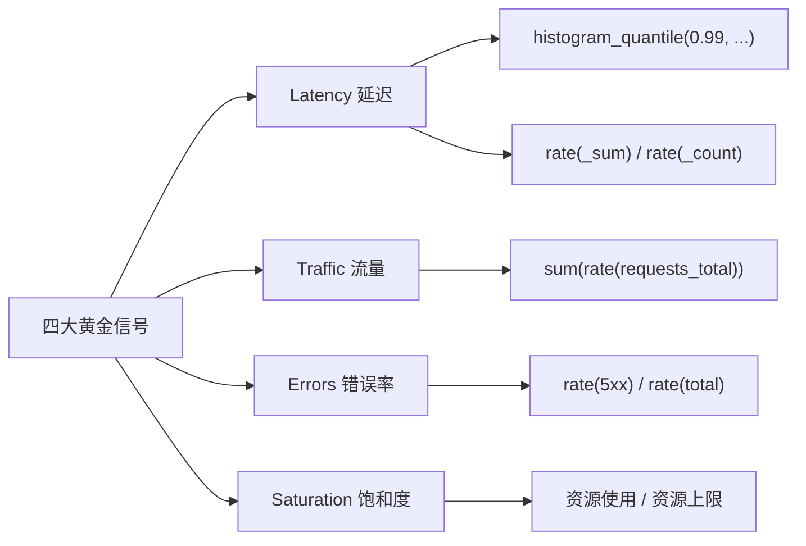

# PromQL 核心知识深度梳理：Counter / Gauge / Histogram

> 日期：2026-03-26
> 主题：PromQL 三大指标类型、核心函数、over_time 系列及实战组合详解

---

## 目录

1. [Prometheus 数据模型基础](#1-prometheus-数据模型基础)
2. [Counter 类型详解](#2-counter-类型详解)
3. [Gauge 类型详解](#3-gauge-类型详解)
4. [Histogram 类型详解](#4-histogram-类型详解)
5. [over_time 系列函数全集](#5-over_time-系列函数全集)
6. [聚合操作符与分组](#6-聚合操作符与分组)
7. [实战组合模式](#7-实战组合模式)
8. [高级技巧与踩坑指南](#8-高级技巧与踩坑指南)

---

## 1. Prometheus 数据模型基础

### 1.1 时间序列结构

每条时间序列由 **指标名称（metric name）** 和 **标签集（label set）** 唯一标识：

```
<metric_name>{<label_name>=<label_value>, ...}
```

示例：

```
http_requests_total{method="GET", handler="/api/users", status="200", instance="10.0.0.1:8080"}
```

### 1.2 四种指标类型概览

| 类型 | 特性 | 典型场景 | 值域 |
|------|------|---------|------|
| **Counter** | 单调递增，只增不减 | 请求数、错误数、处理字节数 | `[0, +∞)` |
| **Gauge** | 可增可减的瞬时值 | CPU 使用率、内存、温度、队列深度 | `(-∞, +∞)` |
| **Histogram** | 分桶统计分布 | 请求延迟、响应大小 | 自动生成 `_bucket`/`_sum`/`_count` |
| **Summary** | 客户端预计算分位数 | 类似 Histogram（不推荐新项目使用） | 自动生成 `{quantile="..."}`/`_sum`/`_count` |

### 1.3 即时向量 vs 范围向量

```
# 即时向量（Instant Vector）：每个时间序列返回最近一个样本点
http_requests_total{status="200"}

# 范围向量（Range Vector）：每个时间序列返回一段时间内的样本点集合
http_requests_total{status="200"}[5m]
```

**关键区别**：范围向量不能直接绘图，必须经过函数（如 `rate`、`increase`）转换为即时向量后才能展示。

---

## 2. Counter 类型详解

### 2.1 核心特征

- **单调递增**：值只会增加或在进程重启时归零
- **绝对值无意义**：关心的是「变化速率」而非当前值
- **重启安全**：`rate()` / `increase()` 能自动处理 counter 重置（reset）

### 2.2 指标命名规范

Counter 指标通常以 `_total` 结尾：

```
http_requests_total
http_request_errors_total
http_request_duration_seconds_count    # histogram 自动生成的 counter
node_network_receive_bytes_total
```

### 2.3 核心函数

#### 2.3.1 `rate(v range-vector)` — 每秒平均增长率

**最常用的 Counter 函数**，计算范围向量内 counter 的每秒平均增长速率。

```promql
# 过去 5 分钟内，每秒处理的 HTTP 请求数（QPS）
rate(http_requests_total[5m])

# 按 handler 和 method 分组的 QPS
rate(http_requests_total[5m]) 
```

**工作原理**：

```
rate = (last_value - first_value) / time_range_seconds
```

**关键特性**：
- 自动检测并处理 counter reset（进程重启导致归零）
- 返回的是**每秒**速率（per-second）
- 范围窗口应至少覆盖 **4 个采集周期**（如 scrape_interval=15s，则窗口 >= 1m）

**窗口选择经验法则**：

| scrape_interval | 推荐最小窗口 | 常用窗口 |
|----------------|-------------|---------|
| 15s | 1m | 5m |
| 30s | 2m | 5m |
| 1m | 4m | 5m~10m |

#### 2.3.2 `irate(v range-vector)` — 瞬时增长率

基于范围向量中**最后两个样本点**计算每秒增长率。

```promql
# 瞬时 QPS（变化更灵敏）
irate(http_requests_total[5m])
```

**工作原理**：

```
irate = (last_sample - second_last_sample) / time_between_samples
```

**`rate` vs `irate` 对比**：

| 特性 | `rate` | `irate` |
|------|--------|---------|
| 计算方式 | 整个窗口的平均速率 | 最后两个点的瞬时速率 |
| 平滑度 | 平滑，适合告警 | 尖锐，适合观察突发 |
| 抗抖动 | 好 | 差 |
| 告警场景 | ✅ 推荐 | ❌ 不推荐（易误报） |
| Dashboard 观察 | 趋势 | 细节 |

**最佳实践**：
- **告警规则用 `rate`**，避免瞬时抖动触发告警
- **Dashboard 用 `irate`**（配合适当窗口），观察实时变化细节
- `irate` 的窗口参数仅用于「向前查找样本」，并不参与计算

#### 2.3.3 `increase(v range-vector)` — 区间内增长量

计算范围向量内 counter 的总增长量。本质上是 `rate() * 窗口秒数`。

```promql
# 过去 1 小时内的总请求数
increase(http_requests_total[1h])

# 过去 24 小时的错误总数
increase(http_request_errors_total[24h])
```

**注意**：`increase` 的结果可能是非整数（因为它基于外推估算），这是正常的。

#### 2.3.4 `resets(v range-vector)` — Counter 重置次数

统计范围内 counter 发生重置（值下降）的次数，可用于监控进程重启。

```promql
# 过去 1 小时内某个服务重启了多少次
resets(http_requests_total{job="api-server"}[1h])
```

### 2.4 Counter 实战示例

#### 示例 1：API QPS 监控

```promql
# 总 QPS
sum(rate(http_requests_total[5m]))

# 按接口路径分组的 QPS
sum by (handler) (rate(http_requests_total[5m]))

# 按状态码分组的 QPS
sum by (status) (rate(http_requests_total[5m]))

# 某个具体接口的 QPS
sum(rate(http_requests_total{handler="/api/users"}[5m]))
```

#### 示例 2：错误率计算

```promql
# 总体错误率（5xx 占总请求的百分比）
sum(rate(http_requests_total{status=~"5.."}[5m]))
/
sum(rate(http_requests_total[5m]))
* 100

# 按接口分组的错误率
sum by (handler) (rate(http_requests_total{status=~"5.."}[5m]))
/
sum by (handler) (rate(http_requests_total[5m]))
* 100
```

#### 示例 3：流量监控（网络字节数）

```promql
# 网卡接收速率（MB/s）
rate(node_network_receive_bytes_total{device="eth0"}[5m]) / 1024 / 1024

# 过去 1 小时接收的总数据量（GB）
increase(node_network_receive_bytes_total{device="eth0"}[1h]) / 1024 / 1024 / 1024
```

### 2.5 Counter 常见错误

```promql
# ❌ 错误：直接对 counter 取值没有意义
http_requests_total

# ❌ 错误：对 counter 使用 avg_over_time（对累计值求平均毫无意义）
avg_over_time(http_requests_total[5m])

# ❌ 错误：窗口太小，可能因采样稀疏导致无数据
rate(http_requests_total[15s])

# ✅ 正确：始终对 counter 使用 rate/increase
rate(http_requests_total[5m])
increase(http_requests_total[1h])
```

---

## 3. Gauge 类型详解

### 3.1 核心特征

- **可增可减**：反映系统当前状态的瞬时值
- **绝对值有意义**：当前值本身就是我们关心的
- **无需 `rate` 转换**：可以直接使用、绘图、告警

### 3.2 指标命名规范

Gauge 无固定后缀，但通常含描述性词汇：

```
node_memory_MemAvailable_bytes
node_cpu_seconds_total              # 注意这个虽然叫 total 实际是 counter
go_goroutines
node_filesystem_avail_bytes
process_resident_memory_bytes
kube_deployment_spec_replicas
temperature_celsius
```

### 3.3 核心函数

#### 3.3.1 直接使用（最常见）

```promql
# 当前可用内存
node_memory_MemAvailable_bytes

# 当前 goroutine 数量
go_goroutines{job="api-server"}

# 磁盘可用空间百分比
node_filesystem_avail_bytes / node_filesystem_size_bytes * 100
```

#### 3.3.2 `delta(v range-vector)` — 区间变化量

计算范围向量中第一个和最后一个样本之间的差值。

```promql
# 过去 1 小时内存变化量
delta(node_memory_MemAvailable_bytes[1h])

# 过去 2 小时温度变化
delta(temperature_celsius[2h])
```

#### 3.3.3 `deriv(v range-vector)` — 变化斜率（线性回归）

基于简单线性回归，计算 gauge 的每秒变化率。

```promql
# 磁盘空间消耗速率（字节/秒）
deriv(node_filesystem_avail_bytes{mountpoint="/"}[1h])

# 结合 predict_linear 预测磁盘何时耗尽
```

#### 3.3.4 `predict_linear(v range-vector, t scalar)` — 线性预测

基于过去数据的线性回归，预测 t 秒后的值。

```promql
# 基于过去 4 小时趋势，预测 24 小时后的磁盘可用空间
predict_linear(node_filesystem_avail_bytes{mountpoint="/"}[4h], 24*3600)

# 磁盘是否会在 24 小时内耗尽（告警规则）
predict_linear(node_filesystem_avail_bytes{mountpoint="/"}[4h], 24*3600) < 0
```

#### 3.3.5 `changes(v range-vector)` — 值变化次数

统计范围内值发生变化的次数。

```promql
# 过去 1 小时内配置版本变更了多少次
changes(config_version{job="api-server"}[1h])
```

### 3.4 Gauge 的 over_time 系列函数

这是 Gauge 最强大的函数族，对范围向量内的样本进行聚合：

```promql
# 过去 5 分钟的平均 CPU 使用率
avg_over_time(node_cpu_usage_percent[5m])

# 过去 1 小时的最大内存使用
max_over_time(process_resident_memory_bytes[1h])

# 过去 1 小时的最小可用磁盘空间
min_over_time(node_filesystem_avail_bytes{mountpoint="/"}[1h])

# 过去 5 分钟内 goroutine 数的标准差（波动程度）
stddev_over_time(go_goroutines[5m])
```

详见 [第 5 节：over_time 系列函数全集](#5-over_time-系列函数全集)。

### 3.5 Gauge 实战示例

#### 示例 1：内存使用率监控

```promql
# 内存使用率百分比
(1 - node_memory_MemAvailable_bytes / node_memory_MemTotal_bytes) * 100

# 内存使用率超过 90% 告警
(1 - node_memory_MemAvailable_bytes / node_memory_MemTotal_bytes) * 100 > 90
```

#### 示例 2：CPU 使用率（基于 node_exporter）

```promql
# node_exporter 的 cpu 指标实际是 counter（累计秒数），需要 rate
# 非空闲 CPU 使用率
100 - avg by (instance) (rate(node_cpu_seconds_total{mode="idle"}[5m])) * 100
```

#### 示例 3：Kubernetes Pod 副本数监控

```promql
# 期望副本数 vs 就绪副本数
kube_deployment_spec_replicas{deployment="my-app"}
-
kube_deployment_status_ready_replicas{deployment="my-app"}

# 告警：就绪副本数不等于期望副本数（持续 5 分钟）
# 这通常写在 alert rule 的 for 子句中
kube_deployment_spec_replicas != kube_deployment_status_ready_replicas
```

#### 示例 4：磁盘空间预测告警

```promql
# 磁盘剩余空间不足 20% 且 4 小时后预计耗尽
node_filesystem_avail_bytes / node_filesystem_size_bytes < 0.2
and
predict_linear(node_filesystem_avail_bytes[4h], 4*3600) < 0
```

---

## 4. Histogram 类型详解

### 4.1 核心特征

- **分桶（bucket）记录**：将观测值分配到预定义的区间中
- **服务端可聚合**：不同实例的 histogram 可以在 Prometheus 端合并
- **自动生成三组指标**：
  - `<name>_bucket{le="..."}` — 各桶的累积计数（Counter 类型）
  - `<name>_sum` — 观测值的总和（Counter 类型）
  - `<name>_count` — 观测次数（Counter 类型）

### 4.2 Bucket 的累积特性

**关键理解**：bucket 是**累积**的，`le="0.5"` 的值包含了所有 `le<0.5` 的观测值。

```
# 假设有以下 HTTP 请求延迟 histogram
http_request_duration_seconds_bucket{le="0.005"} = 100    # ≤5ms 的请求有 100 个
http_request_duration_seconds_bucket{le="0.01"}  = 150    # ≤10ms 的请求有 150 个（包含前 100 个）
http_request_duration_seconds_bucket{le="0.025"} = 180    
http_request_duration_seconds_bucket{le="0.05"}  = 195    
http_request_duration_seconds_bucket{le="0.1"}   = 199    
http_request_duration_seconds_bucket{le="0.25"}  = 200    
http_request_duration_seconds_bucket{le="0.5"}   = 200    
http_request_duration_seconds_bucket{le="1"}     = 200    
http_request_duration_seconds_bucket{le="2.5"}   = 200    
http_request_duration_seconds_bucket{le="5"}     = 200    
http_request_duration_seconds_bucket{le="10"}    = 200    
http_request_duration_seconds_bucket{le="+Inf"}  = 200    # 总计 200 个请求

http_request_duration_seconds_sum   = 8.5    # 所有请求的总延迟 8.5 秒
http_request_duration_seconds_count = 200    # 总请求数 200
```

### 4.3 核心函数

#### 4.3.1 `histogram_quantile(φ, b instant-vector)` — 分位数计算

**Histogram 最核心的函数**。从 bucket 数据中估算分位数（0 ≤ φ ≤ 1）。

```promql
# P50（中位数）请求延迟
histogram_quantile(0.5,
  rate(http_request_duration_seconds_bucket[5m])
)

# P90 请求延迟
histogram_quantile(0.9,
  rate(http_request_duration_seconds_bucket[5m])
)

# P99 请求延迟
histogram_quantile(0.99,
  rate(http_request_duration_seconds_bucket[5m])
)
```

**极其重要的模式** — 按维度分组时保留 `le` 标签：

```promql
# 按 handler 分组计算各接口的 P99 延迟
histogram_quantile(0.99,
  sum by (handler, le) (rate(http_request_duration_seconds_bucket[5m]))
)

# 按 instance 分组计算各实例的 P95 延迟
histogram_quantile(0.95,
  sum by (instance, le) (rate(http_request_duration_seconds_bucket[5m]))
)
```

**⚠️ 黄金法则：`histogram_quantile` 的 `by` 子句必须包含 `le` 标签**，否则所有 bucket 被合并为一个值，结果无意义。

#### 4.3.2 平均值计算

利用 `_sum` 和 `_count` 计算平均值（无需 `histogram_quantile`）：

```promql
# 过去 5 分钟的平均请求延迟
rate(http_request_duration_seconds_sum[5m])
/
rate(http_request_duration_seconds_count[5m])

# 按接口分组的平均延迟
sum by (handler) (rate(http_request_duration_seconds_sum[5m]))
/
sum by (handler) (rate(http_request_duration_seconds_count[5m]))
```

#### 4.3.3 Apdex Score（应用性能指标）

基于 bucket 计算简易 Apdex：

```promql
# Apdex 阈值：满意 ≤ 0.3s，可容忍 ≤ 1.2s
(
  sum(rate(http_request_duration_seconds_bucket{le="0.3"}[5m]))
  +
  sum(rate(http_request_duration_seconds_bucket{le="1.2"}[5m]))
)
/ 2
/
sum(rate(http_request_duration_seconds_count[5m]))
```

### 4.4 Histogram 实战示例

#### 示例 1：RED 方法完整监控（Rate / Error / Duration）

```promql
# === Rate（速率/QPS）===
sum(rate(http_requests_total[5m]))

# === Error（错误率）===
sum(rate(http_requests_total{status=~"5.."}[5m]))
/
sum(rate(http_requests_total[5m]))

# === Duration（延迟分位数）===
# P50
histogram_quantile(0.5,
  sum by (le) (rate(http_request_duration_seconds_bucket[5m]))
)
# P99
histogram_quantile(0.99,
  sum by (le) (rate(http_request_duration_seconds_bucket[5m]))
)
# 平均
sum(rate(http_request_duration_seconds_sum[5m]))
/
sum(rate(http_request_duration_seconds_count[5m]))
```

#### 示例 2：SLO 监控 — 延迟 SLI

```promql
# SLO: 99% 的请求在 300ms 内完成
# SLI 计算：实际满足条件的请求百分比

sum(rate(http_request_duration_seconds_bucket{le="0.3"}[5m]))
/
sum(rate(http_request_duration_seconds_count[5m]))

# 告警：SLI 低于 SLO 目标（99%）
sum(rate(http_request_duration_seconds_bucket{le="0.3"}[5m]))
/
sum(rate(http_request_duration_seconds_count[5m]))
< 0.99
```

#### 示例 3：按接口路径的延迟分析 Dashboard

```promql
# 各接口 P50 / P90 / P99 对比
# P50
histogram_quantile(0.5,
  sum by (handler, le) (rate(http_request_duration_seconds_bucket[5m]))
)

# P90
histogram_quantile(0.9,
  sum by (handler, le) (rate(http_request_duration_seconds_bucket[5m]))
)

# P99
histogram_quantile(0.99,
  sum by (handler, le) (rate(http_request_duration_seconds_bucket[5m]))
)
```

#### 示例 4：gRPC 延迟监控

```promql
# gRPC P99 延迟，按服务和方法分组
histogram_quantile(0.99,
  sum by (grpc_service, grpc_method, le) (
    rate(grpc_server_handling_seconds_bucket[5m])
  )
)
```

### 4.5 Histogram 的 Bucket 设计建议

```go
// Go Prometheus 客户端中的 bucket 定义示例
prometheus.NewHistogram(prometheus.HistogramOpts{
    Name:    "http_request_duration_seconds",
    Help:    "HTTP request duration in seconds",
    // 默认 bucket
    Buckets: prometheus.DefBuckets,
    // DefBuckets = []float64{.005, .01, .025, .05, .1, .25, .5, 1, 2.5, 5, 10}
    
    // 或自定义 bucket（根据业务 SLO 设计）
    // Buckets: []float64{0.01, 0.05, 0.1, 0.3, 0.5, 1, 2, 5},
})
```

**Bucket 设计原则**：
- **覆盖 SLO 边界**：如果 SLO 是「99% 请求 <300ms」，必须有一个 `le="0.3"` 的 bucket
- **对数分布**：bucket 边界通常按对数级增长（0.01, 0.1, 1, 10）
- **不宜过多**：每个 bucket 都是一条独立时间序列，bucket 越多，存储和查询开销越大
- **不宜过少**：bucket 越少，`histogram_quantile` 估算误差越大

### 4.6 Histogram vs Summary

| 特性 | Histogram | Summary |
|------|-----------|---------|
| 分位数计算位置 | 服务端（PromQL） | 客户端（SDK） |
| 多实例可聚合 | ✅ 可以 | ❌ 不能（各实例分位数不能再聚合） |
| 精度 | 取决于 bucket 精度 | 高（客户端精确计算） |
| CPU 开销 | 客户端低 | 客户端高 |
| 灵活性 | 高（可事后调整分位数） | 低（分位数必须预定义） |
| **推荐** | ✅ 绝大多数场景 | 仅在需要精确分位数且不聚合时 |

---

## 5. over_time 系列函数全集

`*_over_time` 函数族将范围向量内的样本聚合为即时向量。

### 5.1 完整函数列表

| 函数 | 说明 | 适用类型 | 常见场景 |
|------|------|---------|---------|
| `avg_over_time(v[d])` | 区间内样本平均值 | Gauge | CPU 使用率平滑、降采样 |
| `min_over_time(v[d])` | 区间内样本最小值 | Gauge | 最小可用空间 |
| `max_over_time(v[d])` | 区间内样本最大值 | Gauge | 峰值内存 |
| `sum_over_time(v[d])` | 区间内样本值之和 | Gauge | 累积统计 |
| `count_over_time(v[d])` | 区间内样本点数量 | 任意 | 数据完整性检查 |
| `quantile_over_time(φ, v[d])` | 区间内样本的分位数 | Gauge | P99 瞬时值分析 |
| `stddev_over_time(v[d])` | 区间内样本标准差 | Gauge | 波动性分析 |
| `stdvar_over_time(v[d])` | 区间内样本方差 | Gauge | 波动性分析 |
| `last_over_time(v[d])` | 区间内最后一个样本 | 任意 | 处理稀疏指标 |
| `present_over_time(v[d])` | 区间内存在即返回 1 | 任意 | 存活检测 |
| `absent_over_time(v[d])` | 区间内不存在则返回空向量 | 任意 | — |

### 5.2 详细示例

#### `avg_over_time` — 平滑 / 降采样

```promql
# 5 分钟平均 CPU 使用率（平滑瞬时抖动）
avg_over_time(node_cpu_usage_percent[5m])

# 用于子查询：过去 1 小时，每 5 分钟一个点的平均内存使用
avg_over_time(process_resident_memory_bytes[5m:5m])
```

#### `max_over_time` — 峰值检测

```promql
# 过去 1 小时的峰值 goroutine 数量
max_over_time(go_goroutines[1h])

# 告警：过去 5 分钟内 goroutine 峰值超过 10000
max_over_time(go_goroutines[5m]) > 10000
```

#### `min_over_time` — 最低值检测

```promql
# 过去 1 小时的最低可用内存
min_over_time(node_memory_MemAvailable_bytes[1h])
```

#### `count_over_time` — 数据完整性

```promql
# 5 分钟内采集到的样本数（scrape_interval=15s 时期望约 20 个）
count_over_time(up{job="api-server"}[5m])

# 检测采集丢失（样本数低于期望的 80%）
count_over_time(up{job="api-server"}[5m]) < 16
```

#### `quantile_over_time` — 时间维度分位数

```promql
# 过去 1 小时内 goroutine 数的 P95
quantile_over_time(0.95, go_goroutines[1h])

# 过去 24 小时的 P99 内存使用
quantile_over_time(0.99, process_resident_memory_bytes[24h])
```

#### `last_over_time` — 处理稀疏指标

```promql
# 某指标可能不是每次都有值，取最近 10 分钟内最后一个有效值
last_over_time(custom_metric[10m])
```

#### `present_over_time` — 存活检测

```promql
# 过去 5 分钟内有数据就返回 1，用于 join/过滤
present_over_time(up{job="api-server"}[5m])
```

### 5.3 over_time 与 Counter 的关系

**⚠️ 重要：不要直接对 Counter 使用 `avg_over_time` / `max_over_time` 等函数！**

```promql
# ❌ 错误：对 counter 取平均值（值单调递增，平均值无意义）
avg_over_time(http_requests_total[5m])

# ✅ 正确模式：先 rate 转成 gauge，再用 over_time 做二次聚合
# 「过去 1 小时内，5 分钟 QPS 的最大值」
max_over_time(rate(http_requests_total[5m])[1h:1m])
#                                          ^^^^^^ 这是子查询语法
```

### 5.4 子查询（Subquery）语法

子查询允许对即时向量函数的结果进行范围采样：

```
<instant_query>[<range>:<resolution>]
```

```promql
# 语法解读：
# rate(http_requests_total[5m])  — 即时查询，得到当前的 5 分钟 QPS
# [1h:1m]                        — 在过去 1h 内，每 1m 计算一次上面的即时查询
# max_over_time(...)              — 对这些采样结果取最大值

# 过去 1 小时内，5 分钟 QPS 的最大值
max_over_time(rate(http_requests_total[5m])[1h:1m])

# 过去 1 小时内，5 分钟错误率的 P99
quantile_over_time(0.99,
  (
    sum(rate(http_requests_total{status=~"5.."}[5m]))
    /
    sum(rate(http_requests_total[5m]))
  )[1h:1m]
)
```

---

## 6. 聚合操作符与分组

### 6.1 核心聚合操作符

| 操作符 | 说明 | 示例 |
|-------|------|------|
| `sum` | 求和 | `sum(rate(http_requests_total[5m]))` |
| `avg` | 平均 | `avg(rate(http_requests_total[5m]))` |
| `min` | 最小 | `min(node_memory_MemAvailable_bytes)` |
| `max` | 最大 | `max(go_goroutines)` |
| `count` | 计数 | `count(up == 1)` |
| `group` | 仅保留标签（值为 1） | `group by (job) (up)` |
| `stddev` | 标准差 | `stddev(rate(http_requests_total[5m]))` |
| `topk` | 前 K 大 | `topk(5, rate(http_requests_total[5m]))` |
| `bottomk` | 前 K 小 | `bottomk(3, node_filesystem_avail_bytes)` |
| `count_values` | 按值分组计数 | `count_values("version", go_info)` |
| `quantile` | 跨序列的分位数 | `quantile(0.9, rate(http_requests_total[5m]))` |

### 6.2 `by` 与 `without` 分组

```promql
# by：只保留指定标签进行分组
sum by (handler, method) (rate(http_requests_total[5m]))

# without：移除指定标签，按剩余标签分组（当标签很多时更方便）
sum without (instance, pod) (rate(http_requests_total[5m]))
```

**选择原则**：
- 标签少 → 用 `by` 明确指定
- 标签多，只想去掉几个 → 用 `without`

### 6.3 二元操作符的向量匹配

#### 一对一匹配（默认）

```promql
# 分子和分母的标签必须完全一致才能匹配
rate(http_requests_total{status=~"5.."}[5m])
/
rate(http_requests_total[5m])
```

#### `on` / `ignoring` 限定匹配标签

```promql
# 只按 handler 匹配（忽略其他标签差异）
sum by (handler) (rate(http_requests_total{status=~"5.."}[5m]))
/
sum by (handler) (rate(http_requests_total[5m]))
```

#### 多对一 / 一对多匹配

```promql
# group_left：左侧多条匹配右侧一条，保留左侧标签
# 例：为每条请求速率附加 deployment 信息
rate(http_requests_total[5m])
* on (instance) group_left(deployment)
kube_pod_info
```

---

## 7. 实战组合模式

### 7.1 经典模式速查表

| 场景 | 模式 | PromQL |
|------|------|--------|
| QPS | `sum(rate(counter[5m]))` | `sum(rate(http_requests_total[5m]))` |
| 错误率 | `sum(rate(error[5m])) / sum(rate(total[5m]))` | 见上文 |
| P99 延迟 | `histogram_quantile(0.99, sum by(le)(rate(bucket[5m])))` | 见上文 |
| 平均延迟 | `rate(sum[5m]) / rate(count[5m])` | 见上文 |
| 可用性 | `avg_over_time(up[30d])` | `avg_over_time(up{job="x"}[30d])` |
| 饱和度 | `gauge / limit` | `go_goroutines / go_threads_max` |
| 磁盘预测 | `predict_linear(gauge[4h], 24*3600) < 0` | 见上文 |

### 7.2 Google 四大黄金信号



#### Latency（延迟）

```promql
# P99 延迟
histogram_quantile(0.99,
  sum by (le) (rate(http_request_duration_seconds_bucket[5m]))
)

# 平均延迟
sum(rate(http_request_duration_seconds_sum[5m]))
/
sum(rate(http_request_duration_seconds_count[5m]))

# 慢请求占比：超过 1s 的请求百分比
1 - (
  sum(rate(http_request_duration_seconds_bucket{le="1"}[5m]))
  /
  sum(rate(http_request_duration_seconds_count[5m]))
)
```

#### Traffic（流量）

```promql
# HTTP QPS
sum(rate(http_requests_total[5m]))

# 按路径 Top 10
topk(10, sum by (handler) (rate(http_requests_total[5m])))

# gRPC QPS
sum(rate(grpc_server_handled_total[5m]))
```

#### Errors（错误率）

```promql
# HTTP 5xx 错误率
sum(rate(http_requests_total{status=~"5.."}[5m]))
/
sum(rate(http_requests_total[5m]))

# gRPC 错误率（非 OK 状态码）
sum(rate(grpc_server_handled_total{grpc_code!="OK"}[5m]))
/
sum(rate(grpc_server_handled_total[5m]))
```

#### Saturation（饱和度）

```promql
# goroutine 饱和度
go_goroutines / go_threads

# 连接池使用率
db_pool_active_connections / db_pool_max_connections

# 文件描述符使用率
process_open_fds / process_max_fds
```

### 7.3 USE 方法（用于基础设施监控）

针对每种资源（CPU / Memory / Disk / Network）监控三个维度：

| 维度 | 含义 | 示例 |
|------|------|------|
| **U**tilization | 使用率 | CPU 使用率、内存使用率 |
| **S**aturation | 饱和度 | CPU 运行队列长度、磁盘 IO 队列 |
| **E**rrors | 错误 | 网络错误包、磁盘错误 |

```promql
# CPU Utilization
100 - avg by (instance) (rate(node_cpu_seconds_total{mode="idle"}[5m])) * 100

# CPU Saturation（Load Average / CPU 核数）
node_load1 / count without (cpu) (node_cpu_seconds_total{mode="idle"})

# Network Errors
rate(node_network_receive_errs_total[5m]) + rate(node_network_transmit_errs_total[5m])
```

### 7.4 多维度分析模板

```promql
# === 接口级别完整分析（以 /api/users 为例）===

# 1. QPS
sum(rate(http_requests_total{handler="/api/users"}[5m]))

# 2. 按状态码分布
sum by (status) (rate(http_requests_total{handler="/api/users"}[5m]))

# 3. 按 HTTP 方法分布
sum by (method) (rate(http_requests_total{handler="/api/users"}[5m]))

# 4. P50 / P90 / P99 延迟
histogram_quantile(0.5,
  sum by (le) (rate(http_request_duration_seconds_bucket{handler="/api/users"}[5m]))
)

histogram_quantile(0.9,
  sum by (le) (rate(http_request_duration_seconds_bucket{handler="/api/users"}[5m]))
)

histogram_quantile(0.99,
  sum by (le) (rate(http_request_duration_seconds_bucket{handler="/api/users"}[5m]))
)

# 5. 错误率
sum(rate(http_requests_total{handler="/api/users", status=~"5.."}[5m]))
/
sum(rate(http_requests_total{handler="/api/users"}[5m]))

# 6. 平均延迟
sum(rate(http_request_duration_seconds_sum{handler="/api/users"}[5m]))
/
sum(rate(http_request_duration_seconds_count{handler="/api/users"}[5m]))
```

---

## 8. 高级技巧与踩坑指南

### 8.1 技巧

#### 技巧 1：`bool` 修饰符 — 将比较结果转为 0/1

```promql
# 正常比较：过滤，不满足条件的序列被丢弃
http_requests_total > 100

# bool 修饰符：不过滤，返回 0 或 1
http_requests_total > bool 100
```

用途：构建「是否满足条件」的指标用于 Grafana 状态面板。

#### 技巧 2：`label_replace` 与 `label_join` — 标签操作

```promql
# 从 instance 标签提取 IP（去掉端口）
label_replace(up, "ip", "$1", "instance", "(.*):.*")

# 拼接多个标签
label_join(up, "full_id", "-", "job", "instance")
```

#### 技巧 3：`absent` / `absent_over_time` — 数据缺失告警

```promql
# 如果某个 job 完全没有 up 指标（目标消失），返回 1
absent(up{job="api-server"})

# 如果过去 5 分钟内没有采集到数据
absent_over_time(up{job="api-server"}[5m])
```

#### 技巧 4：使用 `offset` 进行同比/环比

```promql
# 当前 QPS vs 1 小时前 QPS
rate(http_requests_total[5m])
/
rate(http_requests_total[5m] offset 1h)

# 当前 QPS vs 昨天同一时刻
rate(http_requests_total[5m])
-
rate(http_requests_total[5m] offset 1d)

# 当前错误率 vs 上周同期
(
  sum(rate(http_requests_total{status=~"5.."}[5m]))
  /
  sum(rate(http_requests_total[5m]))
)
-
(
  sum(rate(http_requests_total{status=~"5.."}[5m] offset 7d))
  /
  sum(rate(http_requests_total[5m] offset 7d))
)
```

#### 技巧 5：`clamp_min` / `clamp_max` / `clamp` — 值裁剪

```promql
# 错误率最小为 0（避免负数）
clamp_min(
  sum(rate(http_requests_total{status=~"5.."}[5m]))
  /
  sum(rate(http_requests_total[5m])),
  0
)

# 将值限制在 [0, 1] 范围内
clamp(my_ratio_metric, 0, 1)
```

#### 技巧 6：`sgn` — 获取符号

```promql
# 变化方向：正增长 = 1，不变 = 0，负增长 = -1
sgn(delta(node_memory_MemAvailable_bytes[1h]))
```

#### 技巧 7：`or` 运算符提供默认值

```promql
# 如果错误率没有数据（没有 5xx），默认为 0
sum(rate(http_requests_total{status=~"5.."}[5m]))
/
sum(rate(http_requests_total[5m]))
or
vector(0)
```

### 8.2 常见踩坑

#### 坑 1：`rate` 窗口过小

```promql
# ❌ scrape_interval=15s 时，30s 窗口可能只有 1-2 个点
rate(http_requests_total[30s])

# ✅ 至少 4 倍 scrape_interval
rate(http_requests_total[1m])
```

#### 坑 2：`histogram_quantile` 忘记 `le`

```promql
# ❌ 缺少 le，所有 bucket 被聚合为一个值
histogram_quantile(0.99, sum(rate(http_request_duration_seconds_bucket[5m])))

# ✅ by 子句必须包含 le
histogram_quantile(0.99, sum by (le) (rate(http_request_duration_seconds_bucket[5m])))
```

#### 坑 3：对 Counter 直接用 `max_over_time`

```promql
# ❌ counter 单调递增，max_over_time 恒等于最后一个值
max_over_time(http_requests_total[1h])

# ✅ 先 rate 转 gauge，再聚合
max_over_time(rate(http_requests_total[5m])[1h:1m])
```

#### 坑 4：聚合丢失标签

```promql
# ❌ sum() 默认丢弃所有标签
sum(rate(http_requests_total[5m]))

# ✅ 明确保留需要的标签
sum by (handler, status) (rate(http_requests_total[5m]))
```

#### 坑 5：`increase` 返回非整数

```promql
# increase 基于线性外推，可能返回 99.7 而非 100
# 如果需要整数，使用 round()
round(increase(http_requests_total[1h]))

# 或者接受非整数（推荐，更准确）
increase(http_requests_total[1h])
```

#### 坑 6：除法产生 `NaN` 或 `+Inf`

```promql
# 当分母为 0 时，除法返回 NaN 或 +Inf
rate(errors[5m]) / rate(total[5m])

# 解决方案 1：过滤分母为 0 的情况
rate(errors[5m]) / rate(total[5m]) > 0

# 解决方案 2：使用 clamp_min 确保分母不为 0
rate(errors[5m]) / clamp_min(rate(total[5m]), 1)

# 解决方案 3：过滤有流量的序列
rate(errors[5m]) / rate(total[5m]) and rate(total[5m]) > 0
```

#### 坑 7：`topk` 在 Grafana 中的时间序列闪烁

```promql
# ❌ topk 每个时间点的 top 序列可能不同，导致图表闪烁
topk(5, rate(http_requests_total[5m]))

# ✅ 先确定 top 序列，再查询
# 方案：在 Grafana 中使用 Legend 排序 + Limit，而非 PromQL topk
# 或使用子查询固定排名
```

### 8.3 性能优化建议

1. **标签选择器尽量精确**：`{job="api-server", handler="/api/users"}` 优于 `{handler="/api/users"}`
2. **避免高基数（High Cardinality）标签**：不要用 `user_id`、`trace_id` 等作为标签
3. **使用 Recording Rules 预计算**：频繁使用的复杂查询应做预计算
4. **合理设置范围窗口**：不要使用过大的窗口（如 `[30d]`），会加载大量数据
5. **使用 `without` 替代多标签 `by`**：当保留的标签多于移除的标签时

#### Recording Rules 示例

```yaml
groups:
  - name: api_metrics
    interval: 30s
    rules:
      # 预计算各接口 QPS
      - record: job:http_requests:rate5m
        expr: sum by (job, handler) (rate(http_requests_total[5m]))

      # 预计算各接口 P99 延迟
      - record: job:http_request_duration_seconds:p99_5m
        expr: |
          histogram_quantile(0.99,
            sum by (job, handler, le) (
              rate(http_request_duration_seconds_bucket[5m])
            )
          )

      # 预计算错误率
      - record: job:http_requests:error_rate5m
        expr: |
          sum by (job, handler) (rate(http_requests_total{status=~"5.."}[5m]))
          /
          sum by (job, handler) (rate(http_requests_total[5m]))
```

---

## 附录：速查卡片

### Counter 函数速查

| 函数 | 用途 | 示例 |
|------|------|------|
| `rate(v[d])` | 每秒平均速率 | `rate(http_requests_total[5m])` |
| `irate(v[d])` | 瞬时速率 | `irate(http_requests_total[5m])` |
| `increase(v[d])` | 区间增长量 | `increase(http_requests_total[1h])` |
| `resets(v[d])` | 重置次数 | `resets(http_requests_total[1h])` |

### Gauge 函数速查

| 函数 | 用途 | 示例 |
|------|------|------|
| 直接引用 | 当前值 | `go_goroutines` |
| `delta(v[d])` | 区间变化量 | `delta(temperature[1h])` |
| `deriv(v[d])` | 变化斜率 | `deriv(disk_avail[1h])` |
| `predict_linear(v[d], t)` | 线性预测 | `predict_linear(disk_avail[4h], 86400)` |
| `changes(v[d])` | 值变化次数 | `changes(config_version[1h])` |
| `*_over_time` 系列 | 时间窗口聚合 | 见第 5 节 |

### Histogram 函数速查

| 函数/模式 | 用途 | 示例 |
|----------|------|------|
| `histogram_quantile(φ, v)` | 分位数 | `histogram_quantile(0.99, sum by(le)(rate(bucket[5m])))` |
| `rate(_sum) / rate(_count)` | 平均值 | `rate(duration_sum[5m]) / rate(duration_count[5m])` |
| `rate(_bucket{le="T"}) / rate(_count)` | SLI 达标率 | `rate(bucket{le="0.3"}[5m]) / rate(count[5m])` |
| `rate(_count)` | 每秒请求数 | `rate(duration_count[5m])` |

---

> **总结**：PromQL 的核心在于理解指标类型决定函数选择。Counter 必须经过 `rate`/`increase` 转换；Gauge 可以直接使用或配合 `*_over_time` 进行时间窗口聚合；Histogram 的精髓在于 `histogram_quantile` 配合 `rate` 和 `sum by (le)` 的组合。掌握这三种类型的「标准打法」，就能覆盖 90% 以上的监控查询需求。
