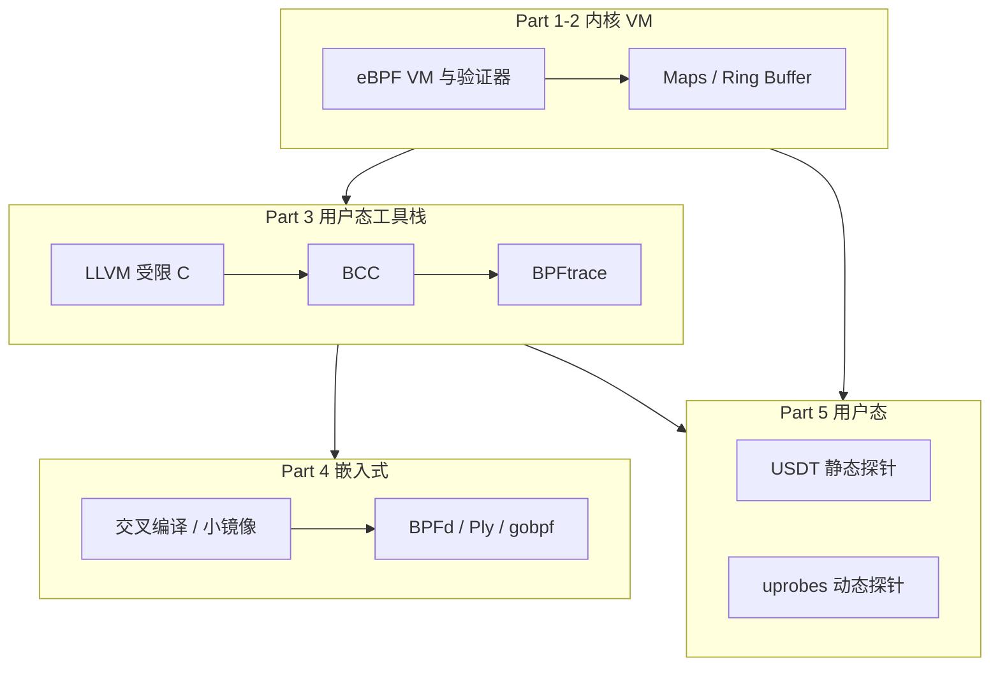

# 技术问答记录：Collabora「An eBPF overview」五篇连载翻译与总结

> 日期：2026-04-15  
> 原文作者：Adrian Ratiu（Collabora）  
> 原文时间：2019 年 4–5 月（文中部分实现细节与生态现状以当时为准；现代内核与工具链已有演进）

---

## 系列总览

| 篇 | 标题 | 日期 | 核心内容 |
|----|------|------|----------|
| 1 | [Introduction](https://www.collabora.com/news-and-blog/blog/2019/04/05/an-ebpf-overview-part-1-introduction/) | 2019-04-05 | eBPF 是什么、为何在内核里跑 VM、验证器、加载与 map 交互流程 |
| 2 | [Machine & bytecode](https://www.collabora.com/news-and-blog/blog/2019/04/15/an-ebpf-overview-part-2-machine-and-bytecode/) | 2019-04-15 | 寄存器、指令编码、`sock_example` 字节码逐条解读 |
| 3 | [Walking up the software stack](https://www.collabora.com/news-and-blog/blog/2019/04/26/an-ebpf-overview-part-3-walking-up-the-software-stack/) | 2019-04-26 | 后端/加载器/前端/数据结构；LLVM、BCC、BPFtrace、IOVisor |
| 4 | [Working with embedded systems](https://www.collabora.com/news-and-blog/blog/2019/05/06/an-ebpf-overview-part-4-working-with-embedded-systems/) | 2019-05-06 | 嵌入式场景、可移植性、BPFd、Ply、gobpf 与交叉编译 |
| 5 | [Tracing user processes](https://www.collabora.com/news-and-blog/blog/2019/05/14/an-ebpf-overview-part-5-tracing-user-processes/) | 2019-05-14 | 用户态追踪动机；USDT 与 uprobes；BCC 示例 |

---

## 第一篇：引言（Part 1）

### 中文摘要

- **定位**：eBPF 是基于自定义 64 位 RISC 指令集的**寄存器虚拟机**，可在 Linux 内核中 JIT 成本地码执行「BPF 程序」，通过受限 API 访问部分内核功能与内存。与 KVM（硬件虚拟化）不同；随主线内核发布，多数发行版默认开启。
- **为何用 VM**：直接写内核模块风险高（死锁、内存破坏、安全漏洞）；在内核里用安全 VM 跑接近原生效能的代码，适合监控沙箱、网络过滤、追踪、剖析等。
- **设计约束（2019 年叙述）**：刻意**非图灵完备**——当时强调无任意循环、有界内存与类型检查、指令数上限（如默认 4096）、单参数 context 等，便于验证器将程序解析为 DAG 并做正确性检查。（**注**：后续内核已支持有界循环等演进，阅读时需结合当前文档。）
- **历史**：原名 Berkeley Packet Filter，最初用于内核内网络包过滤；自 **3.18** 起通过 `bpf()` 系统调用与 `uapi/linux/bpf.h` 向用户态暴露，指令集形成公开 ABI，之后仍可扩展新指令。
- **许可证**：内核内 eBPF 实现为 GPLv2；用户态另有 Apache 许可的 **uBPF** 等实现，可用于希望避免 GPLv2 再分发约束或做用户态 VM 的场景。
- **工作方式**：事件驱动——由 kprobe/uprobe、tracepoint、socket 等触发；程序可写 map、ring buffer，或调用受限 helper。典型步骤：用户态提交字节码与程序类型 → 验证器检查 → JIT → 挂接 → 写共享结构 → 用户态读 map/ring buffer。加载进程退出后，挂钩代码通常会被移除（部分情形可延续）。
- **工具**：内核提供 **libbpf**（LGPL 2.1 / BSD 双许可），`samples/bpf/` 中有示例。
- **示例**：`sock_example.c` 用 libbpf 创建 ARRAY map、手写指令统计回环口 TCP/UDP/ICMP 包数，经 `SO_ATTACH_BPF` 挂到 raw socket，用户态轮询 map。

### 一句话总结

讲清 eBPF 作为内核内安全 VM 的定位、加载管线，以及用 `sock_example` 串起 map + 字节码 + socket filter 的最小闭环。

---

## 第二篇：虚拟机与字节码（Part 2）

### 中文摘要

- **虚拟机模型**：RISC 风格，**11 个 64 位通用寄存器** + 隐式 PC + **512 字节固定栈**；其中 **r0** 为返回值/退出码；**r1** 启动时为 context 指针；**r1–r5** 为调用参数；**r6–r9** 在 helper 调用间可保留；**r10** 为只读栈指针。即使在 32 位 ARM 上，VM 寄存器仍为 64 位，并支持在高位为零时的 32 位子寄存器寻址。
- **调用约定**：最多 5 个寄存器参数；**r1–r5** 只能放数值或**指向 eBPF 栈**的指针，不能直接持有任意内核/用户指针；复杂访问需先加载到 eBPF 栈再使用，以简化验证器内存模型。
- **Helper**：由内核核心以类似 syscall 的方式定义（`BPF_CALL_*`），`bpf.h` 列出可用 helper；验证器校验实参与寄存器类型。
- **指令**：定长 64 位编码，约百级指令，分多类；支持 1–8 字节 load/store、条件/无条件跳转、算术逻辑、函数调用。深入格式可参考 Cilium 指令集文档与 IOVisor 规范。
- **`struct bpf_insn`**：opcode、dst/src 寄存器、offset、immediate 等字段布局。
- **示例拆解**：对第一篇中的字节码逐步说明：保存 context、**BPF_LD_ABS** 读 IP 协议字节、入栈、**map_lookup_elem**、常见模式 **`BPF_JMP_IMM(BPF_JEQ, r0, 0, 2)`**（对应十六进制 **0x020015**，用于判断查找失败）、**原子加** 更新计数、退出。

### 一句话总结

从寄存器与指令格式落到第一篇示例的逐条字节码解读，说明为何手写汇编级 eBPF 难以维护。

---

## 第三篇：沿软件栈向上（Part 3）

### 中文摘要

- **组件划分**  
  - **后端（backend）**：加载到内核的字节码，写 map/ring buffer。  
  - **加载器（loader）**：负责 `bpf()` 加载；通常随加载进程退出而卸载。  
  - **前端（frontend）**：从共享结构读数据并展示。  
  - **数据结构**：内核管理的 map 等，由 fd 访问，可跨多进程、多后端共享。

- **第一层：LLVM eBPF 后端**  
  自 LLVM 3.7 起可将 IR 编译为 eBPF；常用受限 C + ELF 段（如 `SEC("maps")`），与 libbpf 配合，把**后端**与**用户态加载/展示**分离；内核 `samples/bpf/` 中 `*_kern.c` / `*_user.c` 即此模式。

- **第二层：BCC**  
  用 Python/Lua 脚本 + 内嵌或独立受限 C，**自动编译、加载**，降低与特定内核源码树绑定的成本；代价是依赖 LLVM、Python 等，**磁盘占用大**，不适合极小嵌入式镜像。

- **第三层：BPFtrace**  
  在 BCC 之上提供类 AWK/DTrace 的领域语言，适合应急排障的一行式追踪；文中提到当时**套接字过滤器类**场景仍更偏 BCC。

- **第四层：IOVisor / Hover**  
  Linux Foundation 项目，用语如「IO Visor Runtime」「IO modules」包装 eBPF；**Hover** 为守护进程，可类似镜像分发管理 eBPF 程序，带 CLI/REST/Web UI，依赖 Go，体积亦大。

### 一句话总结

用「后端–加载器–前端–数据结构」统一描述工具链，并说明从 LLVM 到 BCC、BPFtrace、云侧管理的路径与取舍。

---

## 第四篇：嵌入式环境（Part 4）

### 中文摘要

- **与桌面/服务器的差异**：嵌入式常交叉编译、内核裁剪/版本不一、镜像极小，难以装全 BCC/LLVM/Python；可移植性关键在**目标内核头文件**与是否依赖不稳定内核内部符号；**tracepoint 等稳定 ABI**更利于移植。
- **BTF / CO-RE（文中为早期展望）**：通过在 ELF 中嵌入 **BTF** 类型信息实现「一次编译、多处运行」；当时称仍在早期。（**注**：如今 CO-RE + libbpf 已是主流实践之一。）

- **BPFd**：面向 Android 的概念验证——设备上跑小型 daemon，主机用 Python+BCC 远程编译与操作 map；目标端仅需约百 KB 级二进制；文中认为后续更多被「设备上完整 BCC」等路径替代，项目可视为停滞但设计可参考。

- **Ply**：类 BPFtrace 的 DSL，强调**极小运行时依赖**（现代 libc + sh），自带 eBPF 编译器；与 BPFtrace 相比体积极小，但语言与文档当时仍不成熟。

- **gobpf（IOVisor）**：Go 绑定 BCC；**ELF 加载器可交叉编译**后单独部署在嵌入式上加载 eBPF；文档不足，文中以 tcptracer 为「文档」。示例：`open-example` 用 **kprobe** 钩 `do_sys_open`，经 trace pipe 看输出；Makefile 展示 **clang 目标三元组**与 **`GOOS/GOARCH` + `CGO_ENABLED`** 交叉编译 Go 加载器。

### 一句话总结

讨论小镜像与交叉编译场景下 eBPF 的可移植性问题，并对比 BPFd、Ply、gobpf 等减轻 BCC 全栈依赖的思路与当时局限。

---

## 第五篇：追踪用户进程（Part 5）

### 中文摘要

- **为何用 eBPF 做用户态追踪**  
  - **优点**：与内核追踪统一接口（k/u probe、tracepoint 等）；可编程，在内核路径执行自定义逻辑并跨事件聚合；可对共享库设 uprobes 覆盖多进程；相对传统调试器**更少停顿**，适合生产。  
  - **缺点**：生态以 **Linux** 为主；需要较新内核；对 **ELISP/JS 等高层语义**不如语言专用调试器； uprobes 每次会**陷入内核**，对极端性能敏感的用户态路径可能不如纯用户态追踪（如 LTTng）。

- **静态探针（USDT）**  
  编译期在二进制中埋点，ABI 相对稳定。示例：用 `tplist` 查看 Python 的 `--enable-dtrace` 探针；**BCC `uflow`** 展示 Python HTTP server 调用流；自写 BCC 脚本挂 `function__entry`，用 **`bpf_usdt_readarg`** 读参数。  
  **自定义探针**：用 **libstapsdt** 等在 `http.server` 中增加 `file_transfer` 探针；进阶示例用 **PERF EVENT** 向用户态传递结构化事件，handler 可直接声明 USDT 参数类型。

- **动态探针（uprobes）**  
  无需源码预埋，运行时按符号/偏移附加，**易随版本变化**；适合 C、语言运行时底层或库函数。文中以 **gethostlatency** 对 libc **`getaddrinfo`** 的 entry/return 为例，说明 **`attach_uprobe` / `attach_uretprobe`**。

### 一句话总结

区分 USDT 与 uprobes 的适用场景，并用 BCC 示例说明如何用 eBPF 把应用、库与内核追踪统一到同一套可编程接口上，同时承认其并非万能。

---

## 全系列串联（Mermaid）

---

## 用户提问（原始记录）

请求翻译并总结 Collabora 上述五篇 eBPF 概述连载博客。

## 结论

五篇文章从**虚拟机与字节码**（Part 1–2）讲到**工具链分层**（Part 3）、**嵌入式与轻量路径**（Part 4），最后扩展到**用户态追踪**（Part 5），形成由底向上的 eBPF 入门路径。阅读时建议结合 2026 年当前内核版本说明核对：有界循环、BTF、CO-RE、libbpf 生态等已与 2019 年文章成稿时有显著发展。
