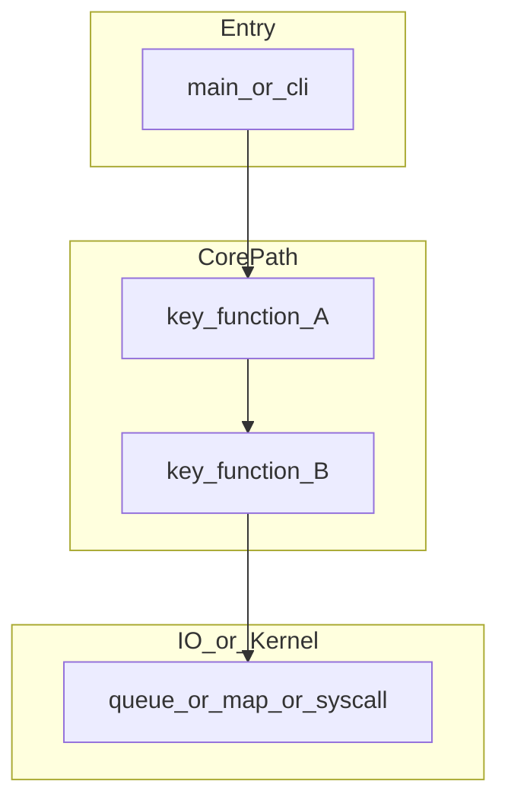

# DeepWiki 项目分析 → 专业博客：提示词模版

> 日期：2026-04-19  
> 会话主题：基于 DeepWiki 与《Linux 内核之旅（二十三）》版式，交付可复用的中文技术博客生成提示词模版  
> 参考版式：[A-LINUX-KERNEL-TRAVEL-23](https://pandaychen.github.io/2025/12/08/A-LINUX-KERNEL-TRAVEL-23/)  
> DeepWiki：<https://deepwiki.com/>

---

## 会话概要

本次将「项目深度分析 → 专业博客」写作要求固化为一段可复制提示词：对齐 `0x00`/`0x01` 章节风格、强制源码引用与注释、核心路径 mermaid、生产消费与 CAP/一致性分析（或等价 IO 模型），并支持 Go / C / eBPF 勾选。文末附带可选参数（篇幅、英文摘要、draw.io、竞品对比）供按需拼接。

---

## 一、使用说明

将 **第二节「可复制提示词模版」** 整段作为大模型的「系统提示」或「用户提示」；替换所有 `{占位符}`。若需要控制篇幅或增加英文摘要等，将 **第三节「可选参数附录」** 中对应段落追加到提示词末尾。

---

## 二、可复制提示词模版

```markdown
# 角色与目标

你是一名资深技术作者与系统工程师（擅长 {Go|C|eBPF|Go+C+eBPF}）。请基于 DeepWiki 对仓库「{owner/repo}」的索引与公开源码，撰写一篇**专业中文技术博客**，读者为具备 {内核/系统编程/云原生} 背景的工程师。

# 写作结构与版式（必须遵守）

严格参考博客版式：《Linux 内核之旅（二十三）：追踪 rename 系统调用》一类文章的结构习惯：
- 主标题：「{系列名或项目名}（{序号或篇名}）：{本篇主题}」
- 副标题（可选）：「{某模块} 全流程 / 架构与实现要点」
- `## 0x00 前言`：说明**分析范围**（分支/tag/commit：{例如 v1.2.3 或 main@sha}）、**不包含什么**；用无序列表给出 **3～8 条「先读结论」**（可验收的事实，不是空话）。
- 正文使用 `## 0x01 …`、`## 0x02 …` 十六进制风格小节（可按内容增减）。
- 适当使用 **Markdown 表格**（API、配置项、错误码、hook 类型、map 类型等）。
- **核心流程至少 1 张 mermaid 图**（见下文）；复杂时允许多张（flowchart / sequence 择一或组合）。

# 技术深度要求（硬性）

1. **引用与注释（必须）**
   - 对「核心数据结构」逐项说明：**字段语义、生命周期、在系统中的用途**；每条关键结论旁给出**可点击的源码引用**：优先 GitHub/GitLab **永久链接到具体文件与行号**（含 tag/commit）。
   - 对「重要方法/函数」：**签名或原型 + 调用上下文 + 分步注释**（类似参考文中对 `SYSCALL_DEFINE5(renameat2)` 的写法）。
   - 若信息来自 DeepWiki 对话摘要，必须标注：**DeepWiki 结论 + 对应仓库链接**，不得假装「读过本地仓库」而未给链接。

2. **核心流程的代码讲解（必须）**
   - 选 1～2 条**主路径**（例如：从 CLI/HTTP 入口 → 核心逻辑 → IO/内核交互 → 退出条件）。
   - 若项目存在 **生产者–消费者**（或等价：事件源 → 队列/buffer/map → 异步处理），必须单独一小节写清：
     - **生产者**：谁生产、何时触发、背压/阻塞点、关键 struct/func（带引用）。
     - **队列/缓冲**：队列或 ring buffer、channel、perf/ringbuf、map 等**定义位置与语义**（带引用）。
     - **消费者**：协程/goroutine、poll、epoll、kthread、BPF 程序等**如何取数据并确认处理完成**（带引用）。
     - **可靠性语义**：是否实现 **重试**、**降级**、超时；在 **CAP** 框架下说明更接近哪类权衡（例如：本地队列+单消费者多为 CP 倾向；跨节点需说明一致性级别）；**消费一致性**（at-most-once / at-least-once / exactly-once 是否可能、如何实现或为何不能）。
   - 若项目**没有**典型消息队列，请改写成该项目**真实存在的并发/IO 模型**（例如：BPF → userspace 事件流），同样按「源–中介–sink」拆解。

3. **Mermaid（必须）**
   - 至少一张图覆盖**主路径**；节点 ID 使用 camelCase，**避免空格**；子图用 `subgraph id [Label]`。
   - 图中标注与正文「引用」一致的关键函数/文件模块名（不必贴完整 URL 在图里）。

4. **语言与 eBPF/内核特化（按类型勾选）**
   - **Go**：package 边界、goroutine 泄漏风险点、context 取消、race 相关设计。
   - **C**：内存所有权、错误码路径、线程安全。
   - **eBPF**：程序类型（kprobe/tracepoint/tc/xdp/lsm…）、map 类型与容量语义、CO-RE/BTF、权限与 attach 点；userspace 与 kernel 的**数据面**单独说明。

# 输出格式

- 使用 **GitHub Flavored Markdown**。
- 代码块注明语言；**长代码只保留关键片段**，用注释标出省略。
- 全文**中文**为主；标识符、API 名保持英文原文。
- 文末可加「**0xFF 参考与链接**」：DeepWiki 仓库页、官方文档、关键 PR/issue（若有）。

# 输入信息（请模型在文中显式复述）

- 仓库：{owner/repo}
- 版本：{tag/commit}
- 本篇聚焦问题：{例如「事件如何从内核送到 userspace」}
- 读者已具备前提：{例如「熟悉 Go 与 epoll」}

请开始撰写正文。
```

---

## 三、可选参数附录（按需追加到提示词末尾）

将下面需要的段落原样拼接到第二节模版之后（在「请开始撰写正文。」之前或之后均可；若放在之后，请改为「除上述要求外，还须满足：」）。

### 3.1 目标篇幅

```text
- 正文长度目标：约 {5000|8000|10000} 汉字（或等价英文词数若你输出双语）；前言结论与图表数量需与篇幅匹配，避免空洞扩写。
```

### 3.2 英文摘要

```text
- 在标题下方或文首增加 **Abstract（英文）** 一段（约 150～250 词），概括问题、方法与结论；关键词 3～5 个（英文）。
```

### 3.3 架构图（draw.io）

```text
- 除 mermaid 外，在「0xFF 参考与链接」中增加 **架构图说明**：用文字列出 draw.io 建议图层（模块边界、数据流、信任边界）；说明该图与正文哪张 mermaid 对应；若无法生成 .drawio 文件，则输出 **可被粘贴到 draw.io 的节点/边清单**（模块名列表与连接关系）。
```

### 3.4 竞品或同类项目对比

```text
- 增加一节「与 {竞品A|同类项目B} 的对比」：对比维度限定为 **架构、扩展点、数据路径、运维成本**；须有公开文档或源码引用，避免无依据断言。
```

---

## 四、Mermaid 示例骨架

可直接让模型仿写或嵌入「0x01」小节：



---

## 五、自检清单（发布前）

- [ ] 每个「先读结论」均可在源码或官方文档中核验  
- [ ] 核心 struct/函数均有文件路径 + 行号级链接  
- [ ] 至少一张 mermaid 与正文主路径一致  
- [ ] 若存在异步/队列：已说明重试、降级、CAP 取舍、消费语义  
- [ ] DeepWiki -only 信息已标明来源且附仓库链接  
